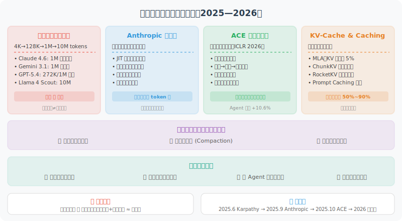

# 上下文工程前沿进展

> 🔬 *"上下文窗口的扩大不是终点，如何高效利用每一个 token 的'注意力带宽'才是真正的挑战。"*

前几节我们学习了上下文工程的理论基础——从上下文 vs 提示工程的区分、注意力预算管理、到长时程任务策略和 GSSC 实践。这些是"基本功"。而本节要讨论的是这个领域正在发生的**最新技术突破和方法论演进**，它们正在从根本上改变 Agent 开发者管理上下文的方式。

2025 年 6 月，Andrej Karpathy 公开表示更倾向于使用"上下文工程"（Context Engineering）来取代"提示工程"（Prompt Engineering）这一术语 [1]。随后，Anthropic [2]、LangChain [3] 等头部机构纷纷发布了系统性的上下文工程指南。2025—2026 年，上下文工程从一个新兴概念迅速成长为 Agent 开发的**核心工程学科**。



## 百万级上下文窗口：从军备竞赛到实用落地

### 上下文窗口的爆发式增长

2024—2026 年，上下文窗口经历了从十万级到千万级的跃迁：

| 时期 | 代表模型 | 上下文窗口 | 等价文本量 |
|------|---------|-----------|-----------|
| 2023 年初 | GPT-3.5 | 4K tokens | ~3,000 字 |
| 2023 年中 | Claude 2 | 100K tokens | ~75,000 字 |
| 2024 年 | GPT-4 Turbo | 128K tokens | ~96,000 字 |
| 2025 年初 | Gemini 2.5 Pro | 1M tokens | ~750,000 字（约 10 本书） |
| 2025 年中 | Llama 4 Scout | 10M tokens | ~7,500,000 字（约 100 本书） |
| 2026 年初 | Claude Opus 4.6 / Sonnet 4.6 | 1M tokens | 100 万 token 标准定价，无长文本附加费 |
| 2026 年初 | GPT-5.4 | 272K (标准) / 1M (扩展) | 超过 272K 后输入 2× 溢价 |
| 2026 年初 | Gemini 3.1 Pro | 1M tokens | 支持视频/音频/图像/文本多模态 |
| 2026 年（实验性） | Magic.dev LTM-2-Mini | 100M tokens | ~7,500 万字（理论值，尚无公开用户验证） |

两个关键趋势值得注意：

**1. 百万级成为标配**：到 2026 年初，Claude 4.6、Gemini 3.x、Llama 4 Maverick 等主流模型均已提供 1M token 上下文窗口。这意味着"整本书"甚至"整个代码库"级别的输入不再是梦想。

**2. 定价策略分化**：Anthropic（Claude 4.6）对 1M token 实行标准定价，无额外费用；而 OpenAI（GPT-5.4）超过 272K 后会收取显著溢价。这种定价策略直接影响 Agent 的架构选型。

但窗口变大 ≠ 问题解决。我们在 8.2 节讨论过的 **Lost-in-the-Middle** 问题并没有消失——事实上，当窗口从 128K 膨胀到 1M 时，这个问题反而更严重了。

### 实测：大窗口的真实能力

```python
# 一个实际测试：在 100 万 token 上下文中检索特定信息
import time

def needle_in_haystack_test(model, context_size, needle_position):
    """
    经典的"大海捞针"测试
    在大量干扰文本中的特定位置插入一条关键信息，
    然后让模型回答与该信息相关的问题
    """
    haystack = generate_padding_text(context_size)
    needle = "The secret number for project Moonlight is 42-ALPHA-7."
    
    # 在指定位置插入关键信息
    position = int(len(haystack) * needle_position)
    context = haystack[:position] + needle + haystack[position:]
    
    response = model.query(
        context=context,
        question="What is the secret number for project Moonlight?"
    )
    return response

# 2026 年各模型的实测结果（检索准确率）
results = {
    "Claude Opus 4.6 (1M)": {
        "开头 10%": "✅ 99%",
        "中间 50%": "✅ 97%",  # 1M 范围内表现最均匀
        "末尾 90%": "✅ 99%",
        "满载 100%": "✅ 95%",  # 百万级窗口下质量依然稳定
    },
    "Gemini 3.1 Pro (1M)": {
        "开头 10%": "✅ 99%",
        "中间 50%": "✅ 96%",  # 大幅改善了 Lost-in-the-Middle
        "末尾 90%": "✅ 98%",
        "满载 100%": "⚠️ 89%",  # 接近满载时仍有性能下降
    },
    "GPT-5.4 (272K 标准)": {
        "开头 10%": "✅ 99%",
        "中间 50%": "✅ 93%",
        "末尾 90%": "✅ 97%",
        "满载 100%": "⚠️ 88%",
    },
    "DeepSeek R1 (128K)": {
        "开头 10%": "✅ 98%",
        "中间 50%": "⚠️ 88%",
        "末尾 90%": "✅ 95%",
        "满载 100%": "⚠️ 82%",
    },
}
```

> 💡 **实战建议**：不要盲目追求最大窗口。128K 够用就不要填满 1M。**上下文质量远比上下文数量重要**——这是上下文工程的第一原则。一个在 100K token 内具有完美召回率的方案，往往优于在 500K token 下表现不稳定的方案。

## Anthropic 上下文工程方法论：从实践到理论

2025 年 9 月 29 日，Anthropic 发布了里程碑式的技术文章《Effective Context Engineering for AI Agents》[2]，首次系统性地总结了生产级 Agent 的上下文管理方法论。这篇文章对整个行业产生了深远影响。

### 核心理念：上下文是有限的珍贵资源

Anthropic 的核心观点是：**找到最大化期望结果可能性的最小高信号 token 集**。这与我们在 8.1 节讨论的"质量优先"原则一脉相承，但 Anthropic 从工程实践角度给出了更具操作性的框架。

```python
# Anthropic 上下文工程的核心原则（伪代码表达）
class AnthropicContextPhilosophy:
    """
    核心理念：上下文是具有边际收益递减的有限资源
    
    随着 token 数量增加：
    - 前 10K tokens：每个 token 的信息增益很高
    - 10K~50K：信息增益开始递减
    - 50K~200K：需要精心筛选才能保持信号密度
    - 200K+：不加管理的话，噪声可能淹没信号
    """
    
    principles = [
        "找到最小高信号 token 集",           # 不是越多越好
        "在每次推理时重新策展上下文",         # 上下文是动态的
        "将上下文视为边际收益递减的资源",     # 第 100K 个 token 的价值远低于第 1K 个
        "做最简单有效的事情",               # 过度工程化也是一种浪费
    ]
```

### "有效上下文"的三大支柱

Anthropic 将高质量上下文的构成拆解为三个层面：

**1. 系统提示设计——找到正确的"高度"**

```python
# ❌ 过度规定（Overly Prescriptive）——太细碎，脆弱
system_prompt_bad_1 = """
如果用户问到文件，先检查文件是否存在。如果文件存在且小于 100KB，
直接读取。如果大于 100KB 但小于 1MB，使用分块读取。如果大于 1MB，
先检查文件类型。如果是文本文件，使用 streaming...
"""

# ❌ 过度模糊（Too Vague）——没有实际指导意义
system_prompt_bad_2 = """你是一个有帮助的编程助手。请尽力帮助用户。"""

# ✅ 正确的"高度"——清晰的原则 + 适当的灵活性
system_prompt_good = """
你是一个专业的编程助手。
<core_principles>
- 在修改代码之前，先理解现有代码的意图
- 优先使用项目已有的模式和约定
- 对于破坏性操作（删除文件、重写模块），先确认再执行
</core_principles>

<tool_usage>
你可以使用 read_file、write_file、search 等工具。
选择工具时遵循最小权限原则——能 read 就不 write，能搜索就不全量扫描。
</tool_usage>
"""
```

**2. 工具定义——Agent 与世界的接口契约**

```python
# Anthropic 的工具设计原则
tool_design_principles = {
    "令牌高效": "工具返回应精简，不要返回大段无关信息",
    "功能无重叠": "像设计良好的函数库一样，每个工具职责单一",
    "自包含性": "工具描述应清晰到——如果人类工程师无法判断何时该用，AI 也做不到",
    "鲁棒性": "对错误输入有优雅处理，返回有用的错误信息",
}

# ❌ 糟糕的工具设计：功能重叠，描述模糊
tools_bad = [
    {"name": "search_files", "description": "搜索文件"},
    {"name": "find_files", "description": "查找文件"},      # 和上面有什么区别？
    {"name": "lookup_files", "description": "查询文件内容"}, # 更加模糊
]

# ✅ 好的工具设计：职责清晰，无歧义
tools_good = [
    {"name": "glob_search", "description": "按文件名模式搜索（如 *.py），返回匹配的文件路径列表"},
    {"name": "content_search", "description": "按内容正则匹配搜索文件，返回匹配行及上下文"},
    {"name": "read_file", "description": "读取指定路径文件的全部或部分内容（支持 offset+limit）"},
]
```

**3. 即时上下文（Just-in-Time Context）——Anthropic 的杀手锏**

这是 Anthropic 最具影响力的实践模式。核心思想是：**不预先加载所有可能需要的信息，而是维护轻量级标识符，在运行时按需检索**。

```python
class JustInTimeContextStrategy:
    """
    即时上下文策略（Anthropic / Claude Code 的核心模式）
    
    传统方式：预先加载所有可能相关的文件到上下文
    JIT 方式：只维护文件路径/查询指针，需要时再加载
    
    效果：上下文使用量减少 70%+，且信息更加精准
    """
    
    def __init__(self):
        # 维护轻量级标识符，而非完整内容
        self.file_index = {}       # 文件路径 → 简短摘要
        self.query_pointers = {}   # 查询描述 → 数据库/API 端点
        self.web_links = {}        # 主题 → URL
    
    def build_initial_context(self, task):
        """初始上下文只包含'地图'，不包含'领土'"""
        return {
            "system": self.system_prompt,
            "task": task,
            "available_resources": {
                "files": list(self.file_index.keys()),    # 只有路径
                "databases": list(self.query_pointers.keys()),
                "docs": list(self.web_links.keys()),
            },
            # 告诉 Agent：你有这些资源可用，需要时主动获取
            "instruction": "使用工具按需获取具体内容，不要猜测。"
        }
    
    def on_agent_request(self, resource_type, identifier):
        """Agent 主动请求时才加载具体内容"""
        if resource_type == "file":
            return read_file(identifier)  # 此时才真正读文件
        elif resource_type == "database":
            return execute_query(self.query_pointers[identifier])
        elif resource_type == "web":
            return fetch_url(self.web_links[identifier])
```

> 💡 **Claude Code 的实际做法**：Claude Code 在启动时只读取项目根目录的 `CLAUDE.md` 文件（相当于项目的"使用说明"），然后通过 `glob`、`grep` 等原语按需导航整个代码库。它从不把整个代码库加载到上下文中——即使模型窗口"够大"。这就是 JIT 思维的典型应用。

## ACE：自演化的上下文工程（ICLR 2026）

2025 年 10 月，Zhang 等人在论文中提出了 **ACE（Agentic Context Engineering）** 框架 [4]，并被 ICLR 2026 接收。这是上下文工程领域的一项重要突破——**让 Agent 自己学会管理和优化自己的上下文**。

### 核心问题：上下文崩溃

传统的上下文管理面临两个痼疾：

- **简洁性偏差（Brevity Bias）**：在压缩摘要时丢失领域深度见解，越压缩越"泛泛而谈"
- **上下文崩溃（Context Collapse）**：在迭代重写过程中，细节随时间推移逐渐被侵蚀，最终"摘要的摘要"变得毫无信息量

```python
# 上下文崩溃的直觉理解
def context_collapse_demo():
    """
    模拟上下文崩溃过程
    
    每次压缩都会丢失一些细节，经过 5-10 轮压缩后，
    原始信息可能只剩下最高层的抽象——具体的数字、
    条件分支、异常情况全部丢失
    """
    original = """
    在处理订单 #12345 时发现：当用户同时使用优惠券 A（满300减50）
    和会员折扣（8折）时，系统错误地先应用折扣再应用优惠券，
    导致实际减免金额为 50 + (300-50)*0.2 = 100，
    而正确逻辑应为 300*0.8 - 50 = 190，差额 90 元。
    已在 order_service.py 的 calculate_discount() 函数中修复，
    需要回归测试 test_discount_combination_cases()。
    """
    
    # 第 1 轮压缩
    round_1 = "修复了优惠券和会员折扣同时使用时的计算顺序错误，差额 90 元"
    # 第 2 轮压缩  
    round_2 = "修复了折扣计算错误"
    # 第 3 轮压缩
    round_3 = "修复了一个 bug"
    # → 具体的订单号、金额、文件位置、测试用例全部丢失！
```

### ACE 框架：让上下文自我进化

ACE 的核心创新是将上下文视为**"不断演变的战术手册"（Evolving Playbook）**，通过三个模块化阶段实现自我改进：

```python
class ACEFramework:
    """
    ACE: Agentic Context Engineering
    
    核心思想：上下文不是静态的文本，而是会随着 Agent 的执行经验
    不断演化的"战术手册"
    
    三个阶段形成循环：生成 → 反思 → 策展
    """
    
    def __init__(self, base_context):
        self.playbook = base_context  # 初始上下文（战术手册）
        self.experience_buffer = []    # 经验缓冲区
    
    # 阶段 1：生成（Generate）
    def generate(self, task):
        """
        Agent 使用当前战术手册执行任务，
        收集执行过程中的反馈（成功/失败/意外情况）
        """
        result = self.agent.execute(task, context=self.playbook)
        feedback = self.collect_natural_feedback(result)
        self.experience_buffer.append({
            "task": task,
            "result": result,
            "feedback": feedback,  # 自然执行反馈，无需人工标注
        })
        return result
    
    # 阶段 2：反思（Reflect）
    def reflect(self):
        """
        分析经验缓冲区中的执行反馈，
        识别战术手册中需要改进的地方
        """
        insights = self.agent.analyze(
            prompt="分析以下执行经验，识别成功模式和失败原因：",
            data=self.experience_buffer
        )
        return insights  # 例如："当遇到嵌套 JSON 时应先验证 schema"
    
    # 阶段 3：策展（Curate）
    def curate(self, insights):
        """
        关键创新：结构化增量更新，而非全量重写
        
        - 新策略以"补丁"形式添加到战术手册
        - 过时策略被标记和清理
        - 保留细节深度，防止上下文崩溃
        """
        self.playbook = self.incremental_update(
            current=self.playbook,
            new_insights=insights,
            mode="structured_patch"  # 增量补丁，不是全量重写
        )
    
    def evolution_loop(self, tasks):
        """完整的进化循环"""
        for task in tasks:
            self.generate(task)
            if len(self.experience_buffer) >= 5:  # 每 5 个任务反思一次
                insights = self.reflect()
                self.curate(insights)
                self.experience_buffer.clear()
```

### ACE 的实验结果

| 基准测试 | 基线性能 | ACE 提升 | 说明 |
|---------|---------|---------|------|
| AppWorld（Agent 任务） | 基线模型 | **+10.6%** | 使用较小的开源模型，与顶级生产 Agent 持平 |
| 金融领域任务 | 基线模型 | **+8.6%** | 领域知识在迭代中不断积累 |
| 适配延迟 | 微调方式 | **大幅降低** | 无需重新训练，只更新上下文 |
| 部署成本 | 微调方式 | **显著减少** | 一份上下文适用于所有实例 |

> 💡 **为什么这很重要？** ACE 证明了一个激动人心的可能性：**Agent 可以通过优化上下文来自我改进，而无需微调模型权重**。这意味着即使使用较小的开源模型，通过精心的上下文工程也能达到与大型商业模型相当的性能。对于资源有限的团队来说，这是一条极具性价比的路径。

## Context Caching：上下文复用的经济学

### 问题：重复支付"上下文税"

传统模式下，每次 API 调用都要重新发送完整的 System Prompt + 工具定义 + 历史对话。如果你的 Agent 有一个 8K token 的系统提示词，每轮对话都要为这 8K token 付费。

```python
# 传统模式：每次都要完整发送
for user_message in conversation:
    response = client.chat.completions.create(
        model="gpt-5.4",
        messages=[
            {"role": "system", "content": system_prompt},  # 8K tokens，每次都重复
            *conversation_history,                          # 不断增长
            {"role": "user", "content": user_message},
        ],
        tools=tool_definitions,  # 2K tokens，每次都重复
    )
    # 如果对话 100 轮，system_prompt 就被"计费"了 100 次
```

### 解决方案：Prompt Caching

2024—2025 年，各大厂商陆续推出了 **Prompt Caching**（上下文缓存）功能。到 2026 年，这已经成为 Agent 开发的**标配优化**：

```python
# Anthropic Prompt Caching 示例（2026 年最新 API）
from anthropic import Anthropic

client = Anthropic()

# 第一次调用：缓存 system prompt（缓存写入有 25% 额外费用）
response = client.messages.create(
    model="claude-sonnet-4.6",
    max_tokens=1024,
    system=[
        {
            "type": "text",
            "text": long_system_prompt,      # 大段系统提示词
            "cache_control": {"type": "ephemeral"}  # 标记为可缓存
        }
    ],
    messages=[{"role": "user", "content": "你好"}]
)

# 后续调用：命中缓存，输入价格降低 90%！
# 同一个 cache_control 块内容不变 → 自动命中缓存
response = client.messages.create(
    model="claude-sonnet-4.6",
    max_tokens=1024,
    system=[
        {
            "type": "text",
            "text": long_system_prompt,      # 内容未变 → 命中缓存
            "cache_control": {"type": "ephemeral"}
        }
    ],
    messages=[{"role": "user", "content": "帮我分析这段代码"}]
)
```

```python
# Google Gemini Context Caching 示例
import google.generativeai as genai

# 创建一个可复用的缓存（有效期可设置）
cache = genai.caching.CachedContent.create(
    model="gemini-3.1-pro",
    display_name="agent-system-context",
    system_instruction="You are an expert coding assistant...",
    contents=[
        # 可以缓存大量参考文档
        genai.upload_file("codebase_summary.txt"),
        genai.upload_file("api_documentation.pdf"),
    ],
    ttl=datetime.timedelta(hours=1),  # 缓存 1 小时
)

# 后续调用直接引用缓存
model = genai.GenerativeModel.from_cached_content(cache)
response = model.generate_content("这个 API 的限流策略是什么？")
# 缓存部分的 token 费用大幅降低
```

### 缓存的经济账（2026 年 3 月数据）

| 提供商 | 缓存写入成本 | 缓存命中成本 | 节省比例 | 缓存有效期 |
|--------|------------|------------|---------|-----------|
| Anthropic | 正常价格 ×1.25 | 正常价格 ×0.1 | 命中后省 **90%** | 5 分钟（ephemeral） |
| Google | 正常价格 ×1.0 | 正常价格 ×0.25 | 命中后省 **75%** | 可自定义（1min~1h） |
| OpenAI | 正常价格 ×1.0 | 正常价格 ×0.5 | 命中后省 **50%** | 自动管理 |

> 💡 **对 Agent 的影响**：对于长系统提示词 + 多轮对话的 Agent，Prompt Caching 可以将总成本降低 **40%~70%**。这是一个纯赚不亏的优化——尤其在 Claude 4.6 的 1M token 窗口下，缓存大量参考文档的经济效益更加显著。

## KV-Cache 优化：模型层面的上下文提速

### 什么是 KV-Cache？

在 Transformer 推理过程中，每一层的 Key 和 Value 张量一旦计算出来，就可以被缓存复用——这就是 **KV-Cache**。它避免了对已处理 token 的重复计算，是实现高效自回归生成的核心技术。

```python
# KV-Cache 的直觉理解
class TransformerWithKVCache:
    """
    没有 KV-Cache：生成第 N 个 token 时，要重新计算前 N-1 个 token 的注意力
    有 KV-Cache：前 N-1 个 token 的 K、V 已经缓存，只需计算新 token 的注意力

    时间复杂度：O(N²) → O(N)
    """
    def generate_next_token(self, input_ids, past_kv_cache=None):
        if past_kv_cache is not None:
            # 只需处理最新的 token
            new_token_kv = self.attention(input_ids[-1:], past_kv_cache)
            updated_cache = concat(past_kv_cache, new_token_kv)
        else:
            # 首次调用，处理所有 token
            updated_cache = self.attention(input_ids)
        return next_token, updated_cache
```

### 2025—2026 年 KV-Cache 优化新技术

随着上下文窗口扩大到百万级，KV-Cache 的显存占用成为关键瓶颈。以下是最新的优化方案：

**1. MLA（Multi-head Latent Attention）——DeepSeek 的持续创新**

```python
# DeepSeek-V3/R1 独创的 MLA，已在 2025-2026 年被广泛研究
# 核心思想：将 KV 压缩到一个低维潜在空间
# 效果：KV-Cache 大小仅为标准 MHA 的 ~5%

class MultiHeadLatentAttention:
    """
    标准 MHA: cache_size = num_layers × num_heads × seq_len × head_dim × 2
    MLA:       cache_size = num_layers × seq_len × latent_dim × 2
    
    当 latent_dim << num_heads × head_dim 时，缓存大小大幅缩减
    """
    def compress_kv(self, keys, values):
        # 将高维 KV 投影到低维潜在空间
        latent = self.down_proj(concat(keys, values))
        return latent  # 只缓存这个压缩后的表示
    
    def restore_kv(self, latent):
        # 推理时从潜在空间恢复 KV
        keys, values = self.up_proj(latent).split(2)
        return keys, values
```

**2. ChunkKV——语义保持的 KV-Cache 压缩（NeurIPS 2025）**

```python
# ChunkKV: 2025 年提出的语义保持 KV-Cache 压缩方法
# 核心思想：不是逐 token 淘汰，而是按"语义块"整体保留或淘汰

class ChunkKV:
    """
    传统方法（如 H2O）逐 token 评估重要性 → 容易破坏语义连贯性
    ChunkKV 将 KV-Cache 分为语义连贯的块 → 块级别的保留/淘汰
    
    在 10% 压缩率下达到 SOTA 性能
    """
    def compress(self, kv_cache, compression_ratio=0.1):
        # 1. 将 KV-Cache 按语义相似度分块
        chunks = self.semantic_chunking(kv_cache)
        
        # 2. 评估每个块的整体重要性
        chunk_scores = [self.score_chunk(chunk) for chunk in chunks]
        
        # 3. 保留最重要的块（保持语义完整性）
        keep_count = int(len(chunks) * compression_ratio)
        top_chunks = sorted(
            zip(chunks, chunk_scores), 
            key=lambda x: -x[1]
        )[:keep_count]
        
        return merge_chunks([c for c, _ in top_chunks])
```

**3. RocketKV——两阶段压缩加速长上下文推理（2025）**

```python
# RocketKV: 针对长上下文 LLM 推理的两阶段 KV-Cache 压缩
class RocketKV:
    """
    第一阶段（粗筛）：基于注意力分数快速淘汰明显不重要的 token
    第二阶段（精选）：对剩余 token 做精细化的重要性评估和保留
    
    效果：在保持质量的前提下，推理速度提升 2-4 倍
    """
    def two_stage_compress(self, kv_cache):
        # Stage 1: 快速粗筛（低计算成本）
        coarse_mask = self.coarse_filter(kv_cache, keep_ratio=0.3)
        candidates = kv_cache[coarse_mask]
        
        # Stage 2: 精细选择（高质量保留）
        fine_mask = self.fine_select(candidates, keep_ratio=0.5)
        return candidates[fine_mask]  # 最终保留约 15% 的 KV
```

**4. 综合对比**

| 技术 | 原理 | 压缩比 | 质量损失 | 发表/采用时间 |
|------|------|--------|---------|-------------|
| GQA | 多 Query 头共享 KV | 4~8x | 极低 | 2023，已成主流标配 |
| MLA（DeepSeek） | KV 投影到低维潜在空间 | ~20x | 极低 | 2024，DeepSeek 系列采用 |
| KV-Cache 量化 (INT8/FP8) | 降低数值精度 | 2~4x | 极低 | 2024+，广泛采用 |
| H2O (Heavy-Hitter Oracle) | 只保留"重要" token 的 KV | 5~20x | 低（任务依赖） | 2024 |
| ChunkKV | 语义块级保留/淘汰 | 3~10x | 低 | NeurIPS 2025 |
| RocketKV | 两阶段粗筛+精选 | 5~7x | 低 | 2025 |
| SCOPE | 解码阶段优化 | 3~5x | 低 | ACL 2025 |
| StreamingLLM | 注意力汇聚 + 滑动窗口 | 动态 | 中等 | 2024+ |

> 💡 **对 Agent 的影响**：这些底层优化让模型厂商能以更低成本提供更长上下文。作为 Agent 开发者，你不需要自己实现这些技术，但理解它们有助于做出更好的模型选型和架构决策——例如，使用 DeepSeek 系列模型时，MLA 带来的低显存开销使得在消费级 GPU 上也能运行长上下文推理。

## 生产级上下文管理模式

### 模式一：分层上下文架构

在生产级 Agent 中，上下文不是一个扁平的 messages 列表，而是**分层组织**的：

```python
class TieredContextManager:
    """
    分层上下文架构（参考 Anthropic 方法论）
    L0: 系统核心（始终保留）     ~2K tokens
    L1: 任务上下文（当前任务相关）  ~4K tokens  
    L2: 工作记忆（近期交互）      ~8K tokens
    L3: 参考资料（按需检索）      ~动态
    """
    
    def __init__(self, max_tokens=128000):
        self.max_tokens = max_tokens
        self.layers = {
            "L0_system": {
                "budget": 2000,
                "priority": "NEVER_DROP",
                "content": None  # 系统提示词、角色定义
            },
            "L1_task": {
                "budget": 4000,
                "priority": "HIGH",
                "content": None  # 当前任务目标、约束条件
            },
            "L2_working": {
                "budget": 8000,
                "priority": "MEDIUM",
                "content": None  # 最近的对话和中间结果
            },
            "L3_reference": {
                "budget": None,  # 动态分配剩余空间
                "priority": "LOW",
                "content": None  # RAG 检索结果、文档片段
            },
        }
    
    def build_context(self, task, history, retrieved_docs):
        """构建优先级排列的上下文"""
        context = []
        used_tokens = 0
        
        # L0: 系统核心（始终包含）
        context.append({"role": "system", "content": self.system_prompt})
        used_tokens += count_tokens(self.system_prompt)
        
        # L1: 当前任务（始终包含）
        task_context = self.format_task(task)
        context.append({"role": "system", "content": task_context})
        used_tokens += count_tokens(task_context)
        
        # L2: 工作记忆（保留最近 N 轮，必要时压缩）
        remaining = self.max_tokens - used_tokens - 4000  # 留 4K 给输出
        working_memory = self.compress_history(history, budget=min(8000, remaining // 2))
        context.extend(working_memory)
        used_tokens += count_tokens(working_memory)
        
        # L3: 参考资料（填充剩余空间）
        remaining = self.max_tokens - used_tokens - 4000
        if remaining > 500 and retrieved_docs:
            selected = self.select_references(retrieved_docs, budget=remaining)
            context.append({"role": "system", "content": f"参考资料：\n{selected}"})
        
        return context
```

### 模式二：上下文压缩（Compaction）

这是 Anthropic 在 Claude Code 中使用的实战模式——当上下文接近上限时，自动调用模型总结历史，然后用总结替代原始对话：

```python
class ContextCompactor:
    """
    上下文压缩器（参考 Claude Code 实现模式）
    
    当 token 使用率超过阈值时，自动触发压缩
    
    关键改进（2025-2026）：
    - 工具结果清除：最安全的轻量级压缩，只清理旧工具输出
    - 结构化摘要：保留关键决策和操作结果
    - 渐进式压缩：分多级压缩，而非一次全压
    """
    
    def __init__(self, model, threshold_ratio=0.8):
        self.model = model
        self.threshold_ratio = threshold_ratio
    
    def maybe_compact(self, messages, max_tokens):
        """检查是否需要压缩"""
        current_usage = count_tokens(messages)
        if current_usage < max_tokens * self.threshold_ratio:
            return messages  # 还没到阈值，不需要压缩
        
        # 优先尝试轻量级压缩
        messages = self.clear_old_tool_results(messages)
        if count_tokens(messages) < max_tokens * self.threshold_ratio:
            return messages  # 轻量级压缩就够了
        
        # 仍然超限，触发完整压缩
        return self.full_compact(messages)
    
    def clear_old_tool_results(self, messages):
        """
        轻量级压缩：清除旧的工具返回结果
        Anthropic 推荐的"最安全的压缩形式"
        """
        result = []
        for i, msg in enumerate(messages):
            if (msg.get("role") == "tool" and 
                i < len(messages) - 8):  # 只清理较旧的工具结果
                result.append({
                    "role": "tool",
                    "content": f"[已执行：{msg.get('name', 'tool')} → 结果已归档]"
                })
            else:
                result.append(msg)
        return result
    
    def full_compact(self, messages):
        """完整压缩"""
        # 分离：保护区（不压缩） vs 压缩区
        system_msgs = [m for m in messages if m["role"] == "system"]
        recent_msgs = messages[-6:]  # 最近 3 轮对话保留原文
        old_msgs = messages[len(system_msgs):-6]  # 中间的历史要压缩
        
        if not old_msgs:
            return messages
        
        # 让模型生成结构化摘要
        summary = self.model.chat([
            {"role": "system", "content": """
请将以下对话历史压缩为结构化摘要。保留：
1. 用户的核心目标和需求
2. 已完成的关键操作和结果（包括具体的文件路径、数值、错误信息）
3. 重要的决策和原因
4. 当前的工作状态和待办事项
丢弃：重复的尝试过程、冗长的工具输出、寒暄内容。
格式要求：使用结构化列表，确保关键细节不丢失。
"""},
            {"role": "user", "content": format_messages(old_msgs)}
        ])
        
        # 用摘要替代原始历史
        compacted = system_msgs + [
            {"role": "system", "content": f"[对话历史摘要]\n{summary}"}
        ] + recent_msgs
        
        return compacted
```

### 模式三：动态工具上下文

Agent 往往注册了大量工具，但每次任务只用到其中少数。**动态工具加载**根据当前任务智能选择需要暴露给模型的工具定义：

```python
class DynamicToolContext:
    """
    动态工具上下文管理
    不是把所有 50 个工具定义都塞进上下文，
    而是根据当前任务只暴露最相关的 5-10 个
    
    这也是 Anthropic 推荐的模式：
    "如果人类工程师无法确定何时该用哪个工具，AI 也做不到"
    → 所以要减少工具数量，让选择更明确
    """
    
    def __init__(self, all_tools, embedding_model):
        self.all_tools = all_tools
        self.embedding_model = embedding_model
        # 预计算所有工具描述的嵌入向量
        self.tool_embeddings = {
            tool.name: embedding_model.embed(tool.description)
            for tool in all_tools
        }
    
    def select_tools(self, user_message, task_context, top_k=8):
        """根据当前上下文选择最相关的工具"""
        query = f"{task_context}\n{user_message}"
        query_embedding = self.embedding_model.embed(query)
        
        # 语义相似度排序
        scores = {
            name: cosine_similarity(query_embedding, emb)
            for name, emb in self.tool_embeddings.items()
        }
        
        # 总是包含核心工具
        core_tools = [t for t in self.all_tools if t.is_core]
        
        # 补充语义最相关的工具
        sorted_tools = sorted(scores.items(), key=lambda x: -x[1])
        selected_names = {t.name for t in core_tools}
        
        for name, score in sorted_tools:
            if len(selected_names) >= top_k:
                break
            if score > 0.3 and name not in selected_names:
                selected_names.add(name)
        
        return [t for t in self.all_tools if t.name in selected_names]
```

## 前沿研究方向

### 1. Retrieval-Augmented Context（检索增强上下文）

将 RAG（第7章）和上下文工程结合，**不是把所有信息塞进上下文，而是建立"按需检索"的机制**。这与 Anthropic 的 JIT 策略一脉相承：

```python
# 传统方式：把所有可能相关的文档都放进上下文
messages = [
    {"role": "system", "content": system_prompt},
    {"role": "system", "content": f"参考文档：\n{all_documents}"},  # 可能 50K tokens
    {"role": "user", "content": user_query},
]

# 检索增强方式：只在需要时检索（JIT 思维）
messages = [
    {"role": "system", "content": system_prompt},
    {"role": "system", "content": "你有一个 search_knowledge 工具，需要信息时主动检索"},
    {"role": "user", "content": user_query},
]
# 模型会主动调用 search_knowledge → 只检索真正需要的 2K tokens
```

### 2. Structured Context Protocol

越来越多的研究在探索用结构化格式（XML、JSON Schema）来组织上下文，让模型更好地"理解"上下文的结构。Anthropic 在其指南中推荐使用 XML 标记来划分不同语义区域：

```xml
<!-- 结构化上下文示例（Anthropic 推荐模式） -->
<context>
  <system priority="critical">
    <role>你是一个代码审查助手</role>
    <constraints>
      <constraint>只审查安全和性能问题</constraint>
      <constraint>输出格式必须是标准化的审查报告</constraint>
    </constraints>
  </system>
  
  <task priority="high">
    <objective>审查 PR #1234 的代码变更</objective>
    <files changed="3" additions="45" deletions="12" />
  </task>
  
  <reference priority="medium">
    <code_diff>...</code_diff>
    <project_conventions>...</project_conventions>
  </reference>
  
  <history priority="low" compacted="true">
    <summary>用户之前要求关注 SQL 注入风险...</summary>
  </history>
</context>
```

### 3. 多 Agent 上下文共享

在多 Agent 系统（第14章）中，上下文的跨 Agent 传递和共享是一个活跃的研究方向。核心挑战是：**如何让多个 Agent 高效协作，而不需要每个 Agent 都携带完整上下文？**

```python
class SharedContextStore:
    """
    多 Agent 共享上下文存储
    - 每个 Agent 有私有上下文
    - 通过 Blackboard 共享公共信息
    - 避免每个 Agent 都携带完整上下文
    
    参考 Anthropic 的子代理架构：
    主代理持有高层计划，子代理只获取完成当前子任务所需的上下文
    """
    
    def __init__(self):
        self.blackboard = {}      # 公共黑板：所有 Agent 可见
        self.private = {}         # 私有上下文：仅当前 Agent 可见
    
    def publish(self, agent_id, key, value, visibility="public"):
        """Agent 发布信息到共享上下文"""
        if visibility == "public":
            self.blackboard[key] = {
                "value": value,
                "author": agent_id,
                "timestamp": time.time()
            }
        else:
            self.private.setdefault(agent_id, {})[key] = value
    
    def get_context_for(self, agent_id, task):
        """为特定 Agent 构建上下文"""
        # 公共信息 + 该 Agent 的私有信息 + 任务相关信息
        relevant_public = self.select_relevant(self.blackboard, task)
        private = self.private.get(agent_id, {})
        return {**relevant_public, **private}
```

### 4. 上下文工程的自动化评估

随着上下文工程的重要性不断提升，如何评估上下文质量成为新的研究方向：

```python
class ContextQualityMetrics:
    """
    上下文质量评估指标
    
    随着上下文工程成为独立学科，评估体系也在快速发展
    """
    
    metrics = {
        "信噪比 (SNR)": "有效信息 token 数 / 总 token 数",
        "召回完整性": "关键信息被保留的比例（压缩后 vs 压缩前）",
        "注意力利用率": "模型实际关注的 token 比例（通过注意力热图分析）",
        "冗余度": "重复或近似重复信息的占比",
        "时效性": "上下文中信息的新鲜度分布",
        "任务对齐度": "上下文信息与当前任务的语义相关性",
    }
    
    def evaluate(self, context, task, model_attention_map=None):
        """综合评估上下文质量"""
        scores = {}
        scores["snr"] = self.calc_signal_noise_ratio(context, task)
        scores["redundancy"] = self.calc_redundancy(context)
        scores["freshness"] = self.calc_freshness(context)
        if model_attention_map:
            scores["attention_utilization"] = self.calc_attention_util(
                context, model_attention_map
            )
        return scores
```

---

## 本节小结

| 进展方向 | 核心突破 | 对 Agent 开发的实际影响 |
|---------|---------|----------------------|
| 百万级上下文窗口 | 2026 年主流模型均达 1M token | 整本书/整个代码库级别输入成为可能，但质量管理更加关键 |
| Anthropic 方法论 | JIT 上下文、结构化提示、工具设计原则 | 业界首个系统化的生产级上下文工程指南 |
| ACE 自演化框架 | Agent 通过执行反馈自动优化上下文 | 无需微调即可自我改进，小模型+好上下文≈大模型 |
| Prompt Caching | 重复上下文的缓存复用 | 多轮对话 Agent 成本降低 40%~70% |
| KV-Cache 新技术 | ChunkKV/RocketKV/MLA 等 | 更长上下文 + 更低延迟 + 更低显存消耗 |
| 分层上下文架构 | 优先级分层管理 | 生产级 Agent 的标配模式 |
| 上下文压缩 | 工具结果清除 + 结构化摘要 | 长时程任务不再受窗口限制 |
| 动态工具上下文 | 按需加载工具定义 | 工具多的 Agent 可节省大量上下文空间 |

> ⏰ *注：上下文管理技术发展迅速，本节数据截至 2026 年 3 月。建议关注 [Anthropic Engineering Blog](https://www.anthropic.com/engineering)、[LangChain Blog](https://blog.langchain.com/) 以及各模型厂商的 API 更新日志获取最新信息。*

## 参考文献

[1] KARPATHY A. Context engineering[EB/OL]. X/Twitter, 2025-06.

[2] ANTHROPIC APPLIED AI TEAM. Effective context engineering for AI agents[EB/OL]. Anthropic Engineering Blog, 2025-09-29.

[3] LANGCHAIN TEAM. Context engineering for agents[EB/OL]. LangChain Blog, 2025-07-02.

[4] ZHANG Q, HU C, UPASANI S, et al. Agentic context engineering: evolving contexts for self-improving language models[C]//ICLR, 2026. arXiv:2510.04618.

[5] LI X, et al. RocketKV: accelerating long-context LLM inference via two-stage KV cache compression[J]. arXiv preprint, 2025.

[6] ChunkKV: semantic-preserving KV cache compression for efficient long-context LLM inference[C]//NeurIPS, 2025. arXiv:2502.00299.

[7] SCOPE: optimizing key-value cache compression in long-context generation[C]//ACL, 2025.

---

*下一章：[第9章 Skill System](../chapter_skill/README.md)*
