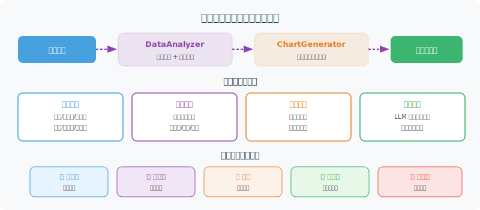

# 自动化分析与可视化

> **本节目标**：实现自动化的数据分析和图表生成能力。



---

## 自动化数据分析

```python
import statistics

class DataAnalyzer:
    """自动化数据分析器"""
    
    def describe(self, data: list[dict]) -> dict:
        """生成描述性统计"""
        if not data:
            return {"error": "没有数据"}
        
        result = {
            "total_rows": len(data),
            "columns": list(data[0].keys()),
            "numeric_stats": {},
        }
        
        for col in data[0].keys():
            values = [row[col] for row in data if row[col] is not None]
            
            # 尝试转为数值
            try:
                nums = [float(v) for v in values]
                result["numeric_stats"][col] = {
                    "count": len(nums),
                    "mean": round(statistics.mean(nums), 2),
                    "median": round(statistics.median(nums), 2),
                    "min": min(nums),
                    "max": max(nums),
                    "stdev": round(statistics.stdev(nums), 2) if len(nums) > 1 else 0,
                }
            except (ValueError, TypeError):
                # 非数值列：统计唯一值数量
                unique_count = len(set(str(v) for v in values))
                result[f"column_{col}"] = {
                    "type": "categorical",
                    "unique_values": unique_count,
                    "top_values": self._top_values(values, n=5)
                }
        
        return result
    
    def _top_values(self, values: list, n: int = 5) -> list:
        """统计出现最多的值"""
        from collections import Counter
        counter = Counter(str(v) for v in values)
        return [{"value": k, "count": v} for k, v in counter.most_common(n)]
    
    def find_trends(self, data: list[dict], time_col: str, value_col: str) -> dict:
        """检测趋势"""
        sorted_data = sorted(data, key=lambda x: x[time_col])
        values = [float(row[value_col]) for row in sorted_data]
        
        if len(values) < 2:
            return {"trend": "insufficient_data"}
        
        # 简单线性趋势
        n = len(values)
        x_mean = (n - 1) / 2
        y_mean = sum(values) / n
        
        numerator = sum((i - x_mean) * (v - y_mean) for i, v in enumerate(values))
        denominator = sum((i - x_mean) ** 2 for i in range(n))
        
        slope = numerator / denominator if denominator != 0 else 0
        
        # 增长率
        growth_rate = (values[-1] - values[0]) / values[0] * 100 if values[0] != 0 else 0
        
        return {
            "trend": "上升" if slope > 0 else "下降" if slope < 0 else "平稳",
            "slope": round(slope, 4),
            "growth_rate": f"{growth_rate:.1f}%",
            "start_value": values[0],
            "end_value": values[-1]
        }
```

---

## 自动可视化

```python
class ChartGenerator:
    """图表生成器（使用 matplotlib）"""
    
    def __init__(self, output_dir: str = "./charts"):
        import os
        self.output_dir = output_dir
        os.makedirs(output_dir, exist_ok=True)
    
    def auto_chart(
        self,
        data: list[dict],
        title: str,
        chart_type: str = "auto"
    ) -> str:
        """自动选择合适的图表类型"""
        import matplotlib
        matplotlib.use('Agg')  # 非交互模式
        import matplotlib.pyplot as plt
        
        plt.rcParams['font.sans-serif'] = ['SimHei', 'DejaVu Sans']
        plt.rcParams['axes.unicode_minus'] = False
        
        if not data:
            return ""
        
        cols = list(data[0].keys())
        
        if chart_type == "auto":
            chart_type = self._infer_chart_type(data, cols)
        
        fig, ax = plt.subplots(figsize=(10, 6))
        
        if chart_type == "bar":
            self._draw_bar(ax, data, cols, title)
        elif chart_type == "line":
            self._draw_line(ax, data, cols, title)
        elif chart_type == "pie":
            self._draw_pie(ax, data, cols, title)
        else:
            self._draw_bar(ax, data, cols, title)  # 默认柱状图
        
        plt.tight_layout()
        
        # 保存图表
        import hashlib
        filename = hashlib.md5(title.encode()).hexdigest()[:8] + ".png"
        filepath = f"{self.output_dir}/{filename}"
        plt.savefig(filepath, dpi=150, bbox_inches='tight')
        plt.close()
        
        return filepath
    
    def _infer_chart_type(self, data: list[dict], cols: list) -> str:
        """推断最合适的图表类型"""
        if len(data) <= 6:
            return "pie" if len(cols) == 2 else "bar"
        elif len(data) > 20:
            return "line"
        else:
            return "bar"
    
    def _draw_bar(self, ax, data, cols, title):
        """绘制柱状图"""
        labels = [str(row[cols[0]]) for row in data]
        values = [float(row[cols[1]]) for row in data]
        
        bars = ax.bar(labels, values, color='steelblue')
        ax.set_title(title, fontsize=14)
        ax.set_xlabel(cols[0])
        ax.set_ylabel(cols[1])
        
        # 在柱顶显示数值
        for bar, val in zip(bars, values):
            ax.text(
                bar.get_x() + bar.get_width()/2, bar.get_height(),
                f'{val:,.0f}', ha='center', va='bottom', fontsize=9
            )
        
        plt.xticks(rotation=45, ha='right')
    
    def _draw_line(self, ax, data, cols, title):
        """绘制折线图"""
        x = [str(row[cols[0]]) for row in data]
        y = [float(row[cols[1]]) for row in data]
        
        ax.plot(x, y, marker='o', color='steelblue', linewidth=2)
        ax.fill_between(range(len(x)), y, alpha=0.1, color='steelblue')
        ax.set_title(title, fontsize=14)
        ax.set_xlabel(cols[0])
        ax.set_ylabel(cols[1])
        plt.xticks(rotation=45, ha='right')
    
    def _draw_pie(self, ax, data, cols, title):
        """绘制饼图"""
        labels = [str(row[cols[0]]) for row in data]
        values = [float(row[cols[1]]) for row in data]
        
        ax.pie(values, labels=labels, autopct='%1.1f%%', startangle=90)
        ax.set_title(title, fontsize=14)
```

---

## 智能分析 Agent

让 LLM 来解读数据，生成洞察：

```python
class InsightGenerator:
    """数据洞察生成器"""
    
    def __init__(self, llm):
        self.llm = llm
    
    async def generate_insights(
        self,
        data: list[dict],
        stats: dict,
        question: str
    ) -> list[str]:
        """基于数据和统计结果生成洞察"""
        
        prompt = f"""作为数据分析师，基于以下数据和统计信息，生成关键洞察。

用户问题：{question}

数据摘要（前10条）：
{str(data[:10])}

统计信息：
{str(stats)}

请生成 3-5 条关键洞察，每条洞察：
1. 指出一个重要的数据特征或趋势
2. 用具体数字支撑
3. 给出可能的原因或行动建议

只返回洞察列表，每条一行，以 "•" 开头。
"""
        
        response = await self.llm.ainvoke(prompt)
        insights = [
            line.strip().lstrip("•").strip()
            for line in response.content.strip().split("\n")
            if line.strip().startswith("•")
        ]
        
        return insights
```

---

## 小结

| 组件 | 功能 |
|------|------|
| DataAnalyzer | 描述性统计、趋势分析 |
| ChartGenerator | 自动生成柱状图/折线图/饼图 |
| InsightGenerator | LLM 驱动的数据洞察 |

---

[下一节：20.4 报告生成与导出 →](./04_report_generation.md)
