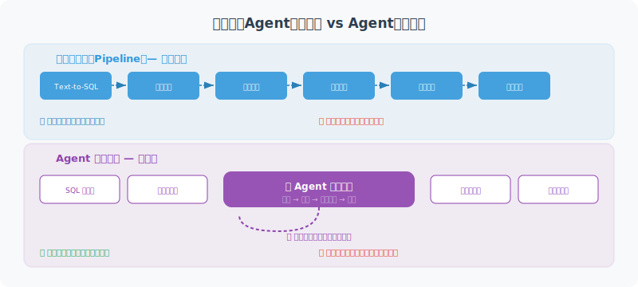

# 完整项目实现

> **本节目标**：整合所有组件，构建一个完整的智能数据分析 Agent，并深入分析架构决策与生产化考量。



---

## 架构设计理念

在将前面各节的组件整合为完整系统之前，我们先分析架构层面的关键设计决策。

### 管道式架构 vs Agent 循环架构

数据分析 Agent 可以采用两种截然不同的架构：

**管道式架构（Pipeline）**——本章的选择：

```
用户问题 → Text-to-SQL → 执行查询 → 统计分析 → 图表生成 → 洞察提取 → 报告生成
```

每个步骤固定顺序执行，前一步的输出是后一步的输入。优点是流程清晰、可调试性强、延迟可预测；缺点是缺乏灵活性，无法根据中间结果动态调整策略。

**Agent 循环架构（ReAct Loop）**：

```
用户问题 → 思考 → 选择工具 → 执行 → 观察结果 → 思考 → ... → 最终回答
```

LLM 自主决定调用哪个工具、调用几次，可以根据中间结果追问或调整方向。优点是灵活智能；缺点是延迟不可控、调试困难、成本更高。

本章选择管道式架构的原因：

| 考量因素 | 管道式 | Agent 循环 |
|---------|--------|-----------|
| 执行步骤 | 固定 6 步 | 不确定（3-15 步） |
| LLM 调用次数 | 3 次（Text-to-SQL + 洞察 + 报告） | 5-10+ 次 |
| 单次请求成本 | ~$0.05 | ~$0.15-0.50 |
| 可调试性 | 每步输出可检查 | 需要完整 trace |
| 适用场景 | 标准数据分析流程 | 开放式探索分析 |

> 💡 **实践建议**：如果你的场景需要 Agent 自主探索（如"帮我找出数据中的异常"），建议结合第 12 章 LangGraph 构建 Agent 循环版本。管道式架构更适合流程明确的场景。

### 组件交互时序

完整的请求处理流程如下：

```
用户                SmartDataAnalyst       TextToSQL       SafeDB        Analyzer/Chart/Insight/Report
 │                       │                    │              │                    │
 │──── "分析问题" ───────→│                    │              │                    │
 │                       │──── convert() ────→│              │                    │
 │                       │                    │── get_schemas()→│                 │
 │                       │                    │←── schemas ───│                   │
 │                       │                    │── LLM 生成SQL  │                  │
 │                       │←──── SQL ──────────│              │                    │
 │                       │──── execute_readonly(sql) ───────→│                    │
 │                       │←──── data[] ──────────────────────│                    │
 │                       │──────────── describe(data) ──────────────────────────→│
 │                       │──────────── auto_chart(data) ───────────────────────→│
 │                       │──────────── generate_insights(data, stats) ─────────→│
 │                       │──────────── generate_report(all) ──────────────────→│
 │←──── 完整报告 ─────────│                    │              │                    │
```

注意几个关键设计点：

1. **Schema 预加载**：`TextToSQL` 在初始化时就缓存了表结构，避免每次查询都读取数据库元数据
2. **分析与可视化并行**：`describe()` 和 `auto_chart()` 理论上可以并行执行（当前为顺序执行，可优化）
3. **洞察依赖统计结果**：`generate_insights()` 需要统计结果作为输入，帮助 LLM 基于数据而非猜测生成分析

---

## 完整实现

```python
"""
智能数据分析 Agent —— 完整实现
用自然语言完成数据分析的全流程
"""
import asyncio
from langchain_openai import ChatOpenAI

# 导入前面实现的组件
# 各组件的完整实现请参考对应章节：
# from db_connector import SafeDatabaseConnector   # → 20.2 节
# from text_to_sql import TextToSQL                # → 20.2 节
# from data_analyzer import DataAnalyzer           # → 20.3 节
# from chart_generator import ChartGenerator       # → 20.3 节
# from insight_generator import InsightGenerator   # → 20.3 节
# from report_generator import ReportGenerator     # → 20.4 节
# 提示：运行本节代码前，需先将 20.2-20.4 节的代码保存为独立模块


class SmartDataAnalyst:
    """智能数据分析 Agent"""
    
    def __init__(self, db_path: str):
        self.llm = ChatOpenAI(model="gpt-4o", temperature=0)
        self.db = SafeDatabaseConnector(db_path)
        self.text2sql = TextToSQL(self.llm, self.db)
        self.analyzer = DataAnalyzer()
        self.chart_gen = ChartGenerator()
        self.insight_gen = InsightGenerator(self.llm)
        self.report_gen = ReportGenerator(self.llm)
    
    async def ask(self, question: str) -> str:
        """用自然语言提问，获取完整分析"""
        
        print(f"🤔 理解问题: {question}")
        
        # 1. 自然语言 → SQL
        print("📝 生成查询...")
        sql = await self.text2sql.convert(question)
        print(f"   SQL: {sql}")
        
        # 2. 执行查询
        print("🔍 查询数据...")
        try:
            data = self.db.execute_readonly(sql)
        except Exception as e:
            return f"❌ 查询出错: {e}"
        
        if not data:
            return "📭 查询没有返回结果，请换个问法试试。"
        
        print(f"   获得 {len(data)} 条数据")
        
        # 3. 统计分析
        print("📊 分析数据...")
        stats = self.analyzer.describe(data)
        
        # 4. 生成图表
        print("🎨 生成图表...")
        chart_path = self.chart_gen.auto_chart(data, question)
        
        # 5. 生成洞察
        print("💡 提取洞察...")
        insights = await self.insight_gen.generate_insights(
            data, stats, question
        )
        
        # 6. 生成报告
        print("📄 生成报告...")
        report = await self.report_gen.generate_report(
            question=question,
            sql_query=sql,
            data=data,
            stats=stats,
            insights=insights,
            chart_path=chart_path
        )
        
        # 保存报告
        filepath = self.report_gen.save_report(report)
        print(f"✅ 报告已保存: {filepath}")
        
        return report


async def main():
    """交互式数据分析"""
    import sys
    
    db_path = sys.argv[1] if len(sys.argv) > 1 else "example.db"
    
    print("📊 智能数据分析助手")
    print("=" * 40)
    print("用自然语言描述你的分析需求")
    print("输入 'quit' 退出\n")
    
    analyst = SmartDataAnalyst(db_path)
    
    # 展示可用的表
    schemas = analyst.db.get_table_schemas()
    print(f"📁 数据库中有 {len(schemas)} 张表:")
    for table, info in schemas.items():
        cols = [c['name'] for c in info['columns']]
        print(f"   • {table}: {', '.join(cols)}")
    print()
    
    while True:
        question = input("你的问题: ").strip()
        
        if question.lower() in ('quit', 'exit', 'q'):
            print("👋 再见！")
            break
        
        if not question:
            continue
        
        result = await analyst.ask(question)
        print(f"\n{result}\n")


if __name__ == "__main__":
    asyncio.run(main())
```

---

## 使用效果

```
📊 智能数据分析助手
========================================
📁 数据库中有 3 张表:
   • orders: id, customer_id, product, amount, date, region
   • customers: id, name, email, city, register_date
   • products: id, name, category, price

你的问题: 哪个区域的订单金额最高？按区域排序
🤔 理解问题: 哪个区域的订单金额最高？按区域排序
📝 生成查询...
   SQL: SELECT region, SUM(amount) as total FROM orders GROUP BY region ORDER BY total DESC
🔍 查询数据...
   获得 4 条数据
📊 分析数据...
🎨 生成图表...
💡 提取洞察...
📄 生成报告...
✅ 报告已保存: report_20260312_140000.md
```

---

## 错误处理与降级策略

生产环境中，数据分析 Agent 的每个环节都可能失败。健壮的系统需要"优雅降级"——即使部分功能失败，仍能给出有价值的响应。

### 分层错误处理

```python
class ResilientDataAnalyst(SmartDataAnalyst):
    """带降级能力的数据分析 Agent"""
    
    async def ask(self, question: str) -> str:
        """每个步骤独立 try-except，失败时降级而非中止"""
        
        # 步骤 1：Text-to-SQL（失败则终止，无法继续）
        try:
            sql = await self.text2sql.convert(question)
        except Exception as e:
            return f"❌ 无法理解您的问题，请换个表述试试。\n技术细节：{e}"
        
        # 步骤 2：执行查询（失败则尝试自我修正）
        data = None
        for attempt in range(3):
            try:
                data = self.db.execute_readonly(sql)
                break
            except Exception as e:
                if attempt < 2:
                    # 让 LLM 根据错误修正 SQL
                    sql = await self._fix_sql(sql, str(e))
                else:
                    return f"❌ 查询多次失败：{e}\n生成的 SQL：{sql}"
        
        if not data:
            return "📭 查询没有返回结果，请换个问法试试。"
        
        # 步骤 3：统计分析（失败则跳过）
        stats = None
        try:
            stats = self.analyzer.describe(data)
        except Exception:
            stats = {"error": "统计分析跳过"}
        
        # 步骤 4：图表生成（失败则跳过，不影响报告）
        chart_path = None
        try:
            chart_path = self.chart_gen.auto_chart(data, question)
        except Exception:
            chart_path = None  # 报告中将不包含图表
        
        # 步骤 5：洞察生成（失败则使用默认洞察）
        try:
            insights = await self.insight_gen.generate_insights(
                data, stats, question
            )
        except Exception:
            insights = "（洞察生成暂时不可用，以下为原始数据摘要）"
        
        # 步骤 6：报告生成（失败则返回原始数据）
        try:
            report = await self.report_gen.generate_report(
                question=question, sql_query=sql, data=data,
                stats=stats, insights=insights, chart_path=chart_path
            )
        except Exception:
            # 最低限度的降级输出
            report = f"## 查询结果\n\nSQL: `{sql}`\n\n数据（前 5 条）:\n"
            for row in data[:5]:
                report += f"- {row}\n"
        
        return report
```

### 降级层级示意

| 失败环节 | 降级策略 | 用户体验 |
|---------|---------|---------|
| Text-to-SQL | 终止并提示 | 请用户换个问法 |
| SQL 执行 | 自我修正，最多 3 次 | 透明重试，无感知 |
| 统计分析 | 跳过 | 报告中无统计摘要 |
| 图表生成 | 跳过 | 报告中无图表 |
| 洞察生成 | 使用默认文案 | 报告中无 AI 洞察 |
| 报告生成 | 返回原始数据 | 可读性下降但有数据 |

---

## 性能优化技巧

当数据分析 Agent 服务多用户时，性能优化至关重要：

### 1. Schema 缓存与增量更新

```python
import time

class CachedSchemaManager:
    """带 TTL 缓存的 Schema 管理器"""
    
    def __init__(self, db: SafeDatabaseConnector, ttl_seconds: int = 300):
        self.db = db
        self.ttl = ttl_seconds
        self._cache = None
        self._cache_time = 0
    
    def get_schemas(self) -> dict:
        now = time.time()
        if self._cache is None or (now - self._cache_time) > self.ttl:
            self._cache = self.db.get_table_schemas()
            self._cache_time = now
        return self._cache
```

### 2. LLM 调用优化

```python
# 优化前：3 次串行 LLM 调用
sql = await text2sql.convert(question)       # ~2s
insights = await insight_gen.generate(...)    # ~3s
report = await report_gen.generate(...)       # ~3s
# 总计: ~8s

# 优化后：洞察和报告大纲并行生成
import asyncio
insights, report_outline = await asyncio.gather(
    insight_gen.generate(data, stats, question),
    report_gen.generate_outline(question, stats)  
)
# 节省 ~2-3s
```

### 3. 查询结果缓存

对于重复或相似的查询，可以缓存 SQL 和结果：

```python
from functools import lru_cache
import hashlib

class QueryCache:
    """简单的查询结果缓存"""
    
    def __init__(self, max_size: int = 100):
        self._cache: dict[str, tuple[float, list]] = {}
        self.max_size = max_size
        self.ttl = 600  # 10 分钟过期
    
    def get(self, sql: str) -> list[dict] | None:
        key = hashlib.md5(sql.encode()).hexdigest()
        if key in self._cache:
            cached_time, results = self._cache[key]
            if time.time() - cached_time < self.ttl:
                return results
            del self._cache[key]
        return None
    
    def set(self, sql: str, results: list[dict]):
        if len(self._cache) >= self.max_size:
            # 淘汰最旧的缓存
            oldest = min(self._cache, key=lambda k: self._cache[k][0])
            del self._cache[oldest]
        key = hashlib.md5(sql.encode()).hexdigest()
        self._cache[key] = (time.time(), results)
```

---

## 扩展方向

本章实现的是数据分析 Agent 的基础版本。以下是值得探索的进阶方向：

### 方向一：多轮对话式分析

当前系统每次问答独立，用户无法追问"按月份细分"或"只看华东地区"。可以引入对话上下文管理：

```python
class ConversationalAnalyst:
    """支持多轮对话的数据分析 Agent"""
    
    def __init__(self, base_analyst: SmartDataAnalyst):
        self.analyst = base_analyst
        self.history: list[dict] = []
    
    async def ask(self, question: str) -> str:
        # 将历史对话注入 Prompt，帮助 LLM 理解上下文
        context = "\n".join(
            f"用户: {h['question']}\nSQL: {h['sql']}" 
            for h in self.history[-3:]  # 保留最近 3 轮
        )
        
        enhanced_question = f"对话历史:\n{context}\n\n当前问题: {question}"
        result = await self.analyst.ask(enhanced_question)
        
        self.history.append({"question": question, "sql": "...", "result": result})
        return result
```

### 方向二：自动异常检测

让 Agent 不仅回答问题，还主动发现数据异常：

- 检测数值列中的离群值（Z-score > 3）
- 发现时间序列中的突变点
- 标记不符合业务规则的数据（如负数订单金额）

### 方向三：与可视化前端集成

将 Agent 后端与前端仪表板（如 Streamlit、Gradio）结合，提供交互式体验：

- 自然语言问答 + 实时图表渲染
- 拖拽式数据探索
- 一键导出 PDF 报告

### 方向四：多 Agent 协作分析

对于复杂分析任务（如"对比三个季度的销售趋势并给出营销建议"），可以将任务拆分给多个专业 Agent：

- **数据查询 Agent**：负责 Text-to-SQL 和数据获取
- **统计分析 Agent**：负责趋势检测、回归分析
- **报告撰写 Agent**：负责整合所有结果生成报告

这可以利用第 14 章介绍的 Multi-Agent 架构来实现。

---

## 小结

| 步骤 | 组件 | 说明 |
|------|------|------|
| 理解 | TextToSQL | 自然语言 → SQL |
| 查询 | SafeDB | 安全执行只读查询 |
| 分析 | DataAnalyzer | 统计分析 |
| 可视化 | ChartGenerator | 自动图表 |
| 洞察 | InsightGenerator | LLM 生成洞察 |
| 报告 | ReportGenerator | 完整分析报告 |

> 🎓 **本章总结**：我们构建了一个"用自然语言做数据分析"的完整 Agent。从 Text-to-SQL 到自动可视化，展示了 Agent 在数据分析领域的强大应用。

---

[下一章：第21章 项目实战：多模态 Agent →](../chapter_multimodal/README.md)
