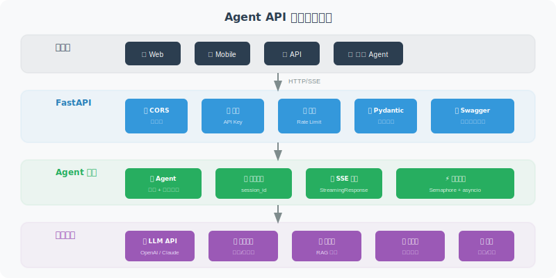

# API 服务化：FastAPI / Flask 封装

> **本节目标**：学会用 FastAPI 将 Agent 封装为可用的 API 服务。

---

## 为什么选 FastAPI？

| 特性 | FastAPI | Flask |
|------|---------|-------|
| 异步支持 | ✅ 原生 async | ⚠️ 需要扩展 |
| 类型验证 | ✅ Pydantic 自动验证 | ❌ 需手动 |
| API 文档 | ✅ 自动生成 Swagger | ❌ 需要扩展 |
| 性能 | ⚡ 高性能 | 🏃 中等 |
| 流式响应 | ✅ SSE 原生支持 | ⚠️ 较复杂 |

对于 Agent 服务，FastAPI 的异步支持和流式响应是关键优势。



---

## 基础 API 框架

```python
from fastapi import FastAPI, HTTPException, Header, Depends
from fastapi.middleware.cors import CORSMiddleware
from pydantic import BaseModel, Field
from typing import Optional
import os

app = FastAPI(
    title="Agent API",
    description="智能助手 API 服务",
    version="1.0.0"
)

# CORS 配置
app.add_middleware(
    CORSMiddleware,
    allow_origins=["*"],  # 生产环境应限制为具体域名
    allow_methods=["*"],
    allow_headers=["*"],
)

# ===== 请求/响应模型 =====

class ChatRequest(BaseModel):
    """对话请求"""
    message: str = Field(..., min_length=1, max_length=5000,
                         description="用户消息")
    session_id: Optional[str] = Field(None, description="会话ID")
    
class ChatResponse(BaseModel):
    """对话响应"""
    reply: str = Field(..., description="Agent 回复")
    session_id: str = Field(..., description="会话ID")
    tool_calls: list[dict] = Field(default_factory=list,
                                    description="工具调用记录")

class HealthResponse(BaseModel):
    """健康检查响应"""
    status: str
    version: str

# ===== 认证 =====

async def verify_api_key(
    x_api_key: str = Header(..., description="API Key")
):
    """验证 API Key"""
    valid_keys = os.getenv("VALID_API_KEYS", "").split(",")
    if x_api_key not in valid_keys:
        raise HTTPException(status_code=401, detail="无效的 API Key")
    return x_api_key

# ===== API 端点 =====

@app.get("/health", response_model=HealthResponse)
async def health_check():
    """健康检查端点"""
    return HealthResponse(status="healthy", version="1.0.0")

@app.post("/chat", response_model=ChatResponse)
async def chat(
    request: ChatRequest,
    api_key: str = Depends(verify_api_key)
):
    """对话端点"""
    import uuid
    
    session_id = request.session_id or str(uuid.uuid4())
    
    # 这里调用你的 Agent
    # result = await agent.run(request.message, session_id)
    
    # 示例返回
    return ChatResponse(
        reply="这是 Agent 的回复",
        session_id=session_id,
        tool_calls=[]
    )
```

---

## 流式响应（SSE）

让用户实时看到 Agent 的回复过程：

```python
from fastapi.responses import StreamingResponse
import json
import asyncio

@app.post("/chat/stream")
async def chat_stream(
    request: ChatRequest,
    api_key: str = Depends(verify_api_key)
):
    """流式对话端点（Server-Sent Events）"""
    
    async def event_generator():
        """生成 SSE 事件流"""
        
        # 发送开始事件
        yield f"data: {json.dumps({'type': 'start', 'session_id': 'xxx'})}\n\n"
        
        # 模拟流式生成（实际中替换为 LLM 的流式输出）
        full_response = "这是一个流式回复的示例，每个字会逐步发送给客户端。"
        
        for char in full_response:
            yield f"data: {json.dumps({'type': 'token', 'content': char})}\n\n"
            await asyncio.sleep(0.05)  # 模拟生成延迟
        
        # 发送结束事件
        yield f"data: {json.dumps({'type': 'end'})}\n\n"
    
    return StreamingResponse(
        event_generator(),
        media_type="text/event-stream",
        headers={
            "Cache-Control": "no-cache",
            "Connection": "keep-alive",
        }
    )
```

### 前端接收 SSE

```javascript
// ⚠️ 注意：原生 EventSource API 仅支持 GET 请求
// 对于 POST 请求的 SSE，需要使用 fetch API 手动处理

// ✅ 正确方式：使用 fetch API 接收 SSE 流式响应
async function streamChat(message) {
    const response = await fetch('/chat/stream', {
        method: 'POST',
        headers: {
            'Content-Type': 'application/json',
            'X-API-Key': 'your-key'
        },
        body: JSON.stringify({ message })
    });
    
    const reader = response.body.getReader();
    const decoder = new TextDecoder();
    
    while (true) {
        const { done, value } = await reader.read();
        if (done) break;
        
        const text = decoder.decode(value);
        // 解析 SSE 数据
        const lines = text.split('\n');
        for (const line of lines) {
            if (line.startsWith('data: ')) {
                const data = JSON.parse(line.slice(6));
                if (data.type === 'token') {
                    // 追加到页面上
                    document.getElementById('output').textContent += data.content;
                }
            }
        }
    }
}
```

---

## 错误处理与中间件

```python
from fastapi import Request
from fastapi.responses import JSONResponse
import time
import logging

logger = logging.getLogger("agent_api")

# 全局异常处理
@app.exception_handler(Exception)
async def global_exception_handler(request: Request, exc: Exception):
    """全局异常处理器"""
    logger.error(f"未处理的异常: {exc}", exc_info=True)
    return JSONResponse(
        status_code=500,
        content={
            "error": "内部服务器错误",
            "detail": "服务暂时不可用，请稍后重试"
            # 生产环境不要暴露具体错误信息
        }
    )

# 请求日志中间件
@app.middleware("http")
async def log_requests(request: Request, call_next):
    """记录每个请求的日志"""
    start = time.time()
    
    response = await call_next(request)
    
    elapsed = time.time() - start
    logger.info(
        f"{request.method} {request.url.path} "
        f"→ {response.status_code} ({elapsed:.3f}s)"
    )
    
    return response
```

---

## 启动服务

```python
if __name__ == "__main__":
    import uvicorn
    
    uvicorn.run(
        "app:app",
        host="0.0.0.0",
        port=8000,
        workers=4,        # 生产环境用多个 worker
        reload=False,      # 生产环境关闭热重载
        log_level="info"
    )
```

启动后访问 `http://localhost:8000/docs` 即可看到自动生成的 API 文档。

---

## 小结

| 概念 | 说明 |
|------|------|
| FastAPI | 高性能异步 Web 框架，适合 Agent 服务 |
| Pydantic 模型 | 自动验证请求参数 |
| SSE 流式响应 | 实时推送 Agent 的生成过程 |
| 中间件 | 全局日志、错误处理、认证 |

> **下一节预告**：有了 API 服务，下一步是用 Docker 打包，方便在任何环境部署。

---

[下一节：18.3 容器化与云部署 →](./03_containerization.md)
