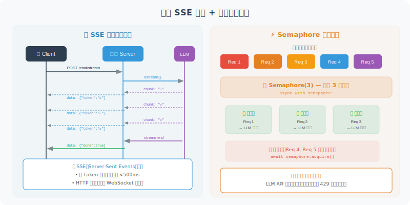

# 流式响应与并发处理

> **本节目标**：掌握 Agent 服务的流式输出和高并发处理技术。

---

## 为什么需要流式响应？

LLM 生成一段完整回复可能需要 5-15 秒。如果让用户干等，体验很差。流式响应就像打字机一样，生成一个字就发送一个字，用户能实时看到"AI 正在思考"。



---

## LLM 流式输出

```python
from langchain_openai import ChatOpenAI
import asyncio

async def stream_agent_response(question: str):
    """流式获取 Agent 回复"""
    
    llm = ChatOpenAI(model="gpt-4o", streaming=True)
    
    # 方式 1：使用 astream（推荐）
    full_response = ""
    async for chunk in llm.astream(question):
        token = chunk.content
        if token:
            full_response += token
            print(token, end="", flush=True)  # 实时输出
    
    return full_response
```

### 在 FastAPI 中实现流式 SSE

```python
from fastapi import FastAPI
from fastapi.responses import StreamingResponse
from langchain_openai import ChatOpenAI
import json

app = FastAPI()

@app.post("/chat/stream")
async def chat_stream(question: str):
    """流式 Agent 对话"""
    
    async def generate():
        llm = ChatOpenAI(model="gpt-4o", streaming=True)
        
        # 发送思考状态
        yield f"data: {json.dumps({'type': 'thinking'})}\n\n"
        
        # 流式生成回复
        async for chunk in llm.astream(question):
            if chunk.content:
                yield f"data: {json.dumps({'type': 'token', 'content': chunk.content})}\n\n"
        
        # 发送完成信号
        yield f"data: {json.dumps({'type': 'done'})}\n\n"
    
    return StreamingResponse(
        generate(),
        media_type="text/event-stream"
    )
```

---

## 并发处理

### 异步 Agent 执行

```python
import asyncio
from langchain_openai import ChatOpenAI

class AsyncAgentService:
    """异步 Agent 服务 —— 支持高并发"""
    
    def __init__(self, max_concurrent: int = 50):
        self.semaphore = asyncio.Semaphore(max_concurrent)
        self.llm = ChatOpenAI(model="gpt-4o")
    
    async def handle_request(self, question: str) -> str:
        """处理单个请求（带并发控制）"""
        
        async with self.semaphore:  # 限制同时处理的请求数
            try:
                response = await asyncio.wait_for(
                    self.llm.ainvoke(question),
                    timeout=30.0  # 30 秒超时
                )
                return response.content
            except asyncio.TimeoutError:
                return "抱歉，请求超时，请稍后重试。"
    
    async def batch_process(
        self,
        questions: list[str]
    ) -> list[str]:
        """批量处理多个请求"""
        
        tasks = [
            self.handle_request(q) for q in questions
        ]
        
        results = await asyncio.gather(*tasks, return_exceptions=True)
        
        return [
            r if isinstance(r, str) else f"错误: {r}"
            for r in results
        ]
```

### 请求队列（处理峰值流量）

```python
import asyncio
from collections import deque
from dataclasses import dataclass, field
from typing import Any

@dataclass
class QueuedRequest:
    """队列中的请求"""
    question: str
    future: asyncio.Future = field(default_factory=lambda: asyncio.get_event_loop().create_future())

class RequestQueue:
    """请求队列 —— 削峰填谷"""
    
    def __init__(self, max_queue_size: int = 1000, workers: int = 10):
        self.queue = asyncio.Queue(maxsize=max_queue_size)
        self.workers = workers
    
    async def start(self, agent_service: AsyncAgentService):
        """启动工作协程"""
        worker_tasks = [
            asyncio.create_task(self._worker(agent_service))
            for _ in range(self.workers)
        ]
        return worker_tasks
    
    async def _worker(self, agent_service: AsyncAgentService):
        """工作协程：从队列取请求并处理"""
        while True:
            request: QueuedRequest = await self.queue.get()
            try:
                result = await agent_service.handle_request(
                    request.question
                )
                request.future.set_result(result)
            except Exception as e:
                request.future.set_exception(e)
            finally:
                self.queue.task_done()
    
    async def submit(self, question: str) -> str:
        """提交请求并等待结果"""
        request = QueuedRequest(question=question)
        
        try:
            self.queue.put_nowait(request)
        except asyncio.QueueFull:
            raise Exception("服务繁忙，请稍后重试")
        
        return await request.future
```

---

## 连接池管理

避免每个请求都创建新的 HTTP 连接：

```python
import httpx

class LLMConnectionPool:
    """LLM API 连接池"""
    
    def __init__(self, max_connections: int = 100):
        self.client = httpx.AsyncClient(
            limits=httpx.Limits(
                max_connections=max_connections,
                max_keepalive_connections=50
            ),
            timeout=httpx.Timeout(30.0)
        )
    
    async def call_llm(self, messages: list[dict]) -> str:
        """使用连接池调用 LLM"""
        response = await self.client.post(
            "https://api.openai.com/v1/chat/completions",
            json={
                "model": "gpt-4o",
                "messages": messages
            },
            headers={
                "Authorization": f"Bearer {os.getenv('OPENAI_API_KEY')}"
            }
        )
        response.raise_for_status()
        return response.json()["choices"][0]["message"]["content"]
    
    async def close(self):
        """关闭连接池"""
        await self.client.aclose()
```

---

## 小结

| 技术 | 解决的问题 | 关键点 |
|------|-----------|--------|
| 流式响应 | 减少用户等待感 | SSE + LLM streaming |
| 异步处理 | 提升并发能力 | asyncio + ainvoke |
| 信号量 | 防止资源耗尽 | Semaphore 限制并发数 |
| 请求队列 | 应对流量峰值 | 削峰填谷 |
| 连接池 | 减少连接开销 | httpx 连接复用 |

> **下一节预告**：最后，我们将把所有内容整合，部署一个完整的生产级 Agent 服务。

---

[下一节：18.5 实战：部署一个生产级 Agent 服务 →](./05_practice_production_agent.md)
