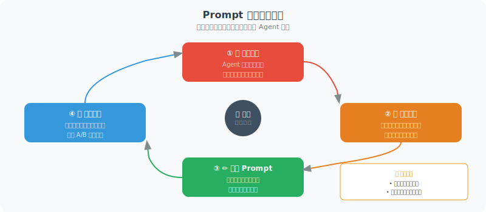

# Prompt 调优策略

> **本节目标**：掌握系统化的 Prompt 调优方法，学会通过迭代优化来提升 Agent 表现。

---

## Prompt 调优的核心思路

Prompt 调优就像调收音机——不是随便转旋钮，而是有方法地微调，直到信号清晰。核心流程是：

1. **明确问题**：Agent 在哪些任务上表现不好？
2. **分析原因**：是指令不清？上下文不够？还是格式有误？
3. **有针对性地修改**：调整 Prompt 的特定部分
4. **对比评估**：用基准测试验证是否有改善



---

## 策略一：系统提示词优化

系统提示词（System Prompt）是 Agent 的"行为准则"，对其表现影响巨大：

```python
# ❌ 不好的系统提示词
bad_system_prompt = "你是一个助手，请帮助用户。"

# ✅ 优化后的系统提示词
good_system_prompt = """你是一名专业的 Python 技术顾问，拥有 10 年开发经验。

## 你的职责
- 回答 Python 相关的技术问题
- 提供代码示例和最佳实践建议
- 帮助调试代码问题

## 回答要求
1. **准确性优先**：不确定的内容请明确说明，不要编造
2. **代码可运行**：所有代码示例必须是可以直接运行的完整代码
3. **解释清楚**：对关键概念和代码逻辑进行解释
4. **版本明确**：涉及库或工具时，标注适用的版本号

## 回答格式
- 先用 1-2 句话直接回答问题
- 然后提供代码示例（如果适用）
- 最后补充注意事项或最佳实践

## 限制
- 只回答 Python 相关问题，其他语言请建议用户咨询专业人士
- 不要提供可能存在安全风险的代码（如 eval 用户输入）
- 回答长度控制在 500 字以内，除非问题确实需要更长的解释
"""
```

### 系统提示词的关键要素

```python
SYSTEM_PROMPT_TEMPLATE = """
# 角色定义
你是{role_name}，{role_description}。

# 核心能力
{capabilities}

# 行为准则
{behavioral_rules}

# 输出格式
{output_format}

# 限制与边界
{constraints}

# 示例（可选）
{examples}
"""
```

每个要素的作用：

| 要素 | 作用 | 缺失时的影响 |
|------|------|-------------|
| 角色定义 | 设定 Agent 的身份和专业背景 | 回答缺乏专业性 |
| 核心能力 | 明确 Agent 能做什么 | 可能超范围回答 |
| 行为准则 | 规范回答的方式 | 输出质量不稳定 |
| 输出格式 | 统一回答的结构 | 格式混乱，不便解析 |
| 限制与边界 | 约束 Agent 不该做什么 | 可能产生不安全的输出 |

---

## 策略二：Few-shot 示例优化

好的示例能显著提升 Agent 的表现：

```python
def build_few_shot_prompt(
    task: str,
    examples: list[dict],
    user_input: str
) -> str:
    """构建 Few-shot 提示"""
    
    prompt = f"任务：{task}\n\n"
    prompt += "以下是一些示例：\n\n"
    
    for i, ex in enumerate(examples, 1):
        prompt += f"--- 示例 {i} ---\n"
        prompt += f"输入：{ex['input']}\n"
        prompt += f"输出：{ex['output']}\n"
        if "explanation" in ex:
            prompt += f"说明：{ex['explanation']}\n"
        prompt += "\n"
    
    prompt += "--- 你的任务 ---\n"
    prompt += f"输入：{user_input}\n"
    prompt += "输出："
    
    return prompt

# 示例选择的技巧
few_shot_tips = {
    "数量": "通常 3-5 个示例效果最佳，过多反而会增加噪音",
    "多样性": "示例要覆盖不同的情况（简单/复杂/边界情况）",
    "顺序": "把最相关的示例放在最后（靠近用户输入）",
    "格式一致": "所有示例的输入输出格式要统一",
    "动态选择": "根据用户输入，动态选择最相关的示例"
}
```

### 动态示例选择

根据用户输入自动选择最相关的示例：

```python
from langchain_openai import OpenAIEmbeddings
import numpy as np

class DynamicExampleSelector:
    """基于语义相似度动态选择示例"""
    
    def __init__(self, examples: list[dict], k: int = 3):
        self.examples = examples
        self.k = k
        self.embeddings = OpenAIEmbeddings()
        
        # 预计算所有示例的 embedding
        self.example_vectors = self.embeddings.embed_documents(
            [ex["input"] for ex in examples]
        )
    
    def select(self, query: str) -> list[dict]:
        """选择与查询最相关的 k 个示例"""
        query_vector = self.embeddings.embed_query(query)
        
        # 计算余弦相似度
        similarities = [
            np.dot(query_vector, ev) / (
                np.linalg.norm(query_vector) * np.linalg.norm(ev)
            )
            for ev in self.example_vectors
        ]
        
        # 选择 top-k
        top_indices = np.argsort(similarities)[-self.k:][::-1]
        return [self.examples[i] for i in top_indices]
```

---

## 策略三：A/B 测试框架

像互联网产品一样，对 Prompt 做 A/B 测试：

```python
import random

class PromptABTest:
    """Prompt A/B 测试框架"""
    
    def __init__(self, prompts: dict[str, str], test_cases: list[dict]):
        """
        Args:
            prompts: {"A": prompt_a, "B": prompt_b, ...}
            test_cases: [{"input": "...", "expected": "..."}, ...]
        """
        self.prompts = prompts
        self.test_cases = test_cases
        self.results = {name: [] for name in prompts}
    
    def run(self, llm, judge_llm=None) -> dict:
        """运行 A/B 测试"""
        
        for case in self.test_cases:
            for name, prompt in self.prompts.items():
                # 拼接完整提示
                full_prompt = f"{prompt}\n\n用户问题：{case['input']}"
                
                # 获取回答
                response = llm.invoke(full_prompt)
                
                # 评估（如果有评审 LLM）
                score = self._evaluate(
                    case, response.content, judge_llm
                )
                
                self.results[name].append({
                    "input": case["input"],
                    "output": response.content,
                    "score": score
                })
        
        # 汇总结果
        summary = {}
        for name, results in self.results.items():
            scores = [r["score"] for r in results if r["score"] is not None]
            summary[name] = {
                "avg_score": sum(scores) / len(scores) if scores else 0,
                "total_cases": len(results),
                "scored_cases": len(scores)
            }
        
        return summary
    
    def _evaluate(self, case, response, judge_llm) -> float:
        """评估单个回答"""
        if judge_llm is None:
            return None
        
        eval_prompt = f"""对比以下回答和预期答案，给出 1-10 的评分。

问题：{case['input']}
预期：{case['expected']}
实际回答：{response}

只回复一个数字（1-10）。"""
        
        result = judge_llm.invoke(eval_prompt)
        try:
            return float(result.content.strip()) / 10
        except ValueError:
            return None
```

---

## 策略四：常见 Prompt 问题排查清单

当 Agent 表现不佳时，按这个清单逐一排查：

```python
PROMPT_DEBUGGING_CHECKLIST = [
    {
        "问题": "Agent 回答太笼统、没有深度",
        "可能原因": "指令不够具体",
        "修复方法": "添加具体的角色背景和专业领域描述",
        "示例": "❌ '回答问题' → ✅ '作为有 10 年经验的后端工程师，提供带代码示例的详细解答'"
    },
    {
        "问题": "Agent 不使用工具，直接编造答案",
        "可能原因": "没有明确要求使用工具",
        "修复方法": "在系统提示中强调：'如果需要查询数据，必须使用对应的工具，不要猜测'",
        "示例": "添加规则：'任何需要实时数据的问题，都必须先使用搜索工具查询'"
    },
    {
        "问题": "Agent 输出格式不一致",
        "可能原因": "缺少明确的格式要求",
        "修复方法": "提供详细的输出格式模板和示例",
        "示例": "指定 JSON Schema 或 Markdown 模板"
    },
    {
        "问题": "Agent 重复调用同一个工具",
        "可能原因": "缺少终止条件或步骤限制",
        "修复方法": "添加最大步骤限制和终止条件说明",
        "示例": "'最多执行 5 步，如果仍未解决问题，请总结当前进展并请求用户帮助'"
    },
    {
        "问题": "Agent 回答中有明显的事实错误",
        "可能原因": "模型幻觉，或使用了过时知识",
        "修复方法": "要求 Agent 标注信息来源，并添加 '不确定时明确说明' 的规则",
        "示例": "'回答时请标注信息来源。如果你不确定某个事实，请说 \"我不确定，建议您查证\"'"
    }
]
```

---

## 实操案例：迭代优化一个客服 Agent

```python
# 第 1 版 —— 基础版（问题：回答太简短，缺乏同理心）
v1_prompt = "你是客服，请回答用户问题。"

# 第 2 版 —— 添加角色细节（改善：更专业，但还是不够温暖）
v2_prompt = """你是"小慧"，一名专业的客户服务代表。
你需要准确回答用户关于产品和订单的问题。"""

# 第 3 版 —— 添加行为准则（改善：更有同理心，但格式不统一）
v3_prompt = """你是"小慧"，一名有 3 年经验的客户服务代表。

## 行为准则
1. 始终以友好、耐心的态度回应
2. 先表达对客户处境的理解，再提供解决方案
3. 如果问题超出你的能力范围，指引客户联系人工客服
4. 不确定的信息不要编造，承诺稍后确认"""

# 第 4 版 —— 添加格式规范和示例（当前最优版本）
v4_prompt = """你是"小慧"，一名有 3 年经验的客户服务代表。

## 行为准则
1. 始终以友好、耐心的态度回应
2. 先表达理解（1句），再提供方案（要点清晰）
3. 超范围问题 → 指引人工客服
4. 不确定 → 承诺稍后确认

## 回答格式
[理解客户] → [具体方案] → [后续跟进]

## 示例
客户：我的订单三天了还没发货
小慧：完全理解您的着急，三天确实等得比较久了。我帮您查一下订单状态...
  1. 订单 #xxx 目前在仓库拣货中
  2. 预计明天发货，正常 2-3 天送达
  3. 我会持续跟进，有更新第一时间通知您
  如果有其他问题，随时联系我 😊
"""
```

每个版本的评估分数变化：

| 版本 | 准确率 | 满意度 | 改进点 |
|------|--------|--------|--------|
| v1 | 0.65 | 2.1/5 | 基线 |
| v2 | 0.78 | 3.0/5 | +角色定义 |
| v3 | 0.80 | 3.8/5 | +行为准则 |
| v4 | 0.85 | 4.3/5 | +格式+示例 |

---

## 小结

| 策略 | 核心要点 | 效果 |
|------|---------|------|
| 系统提示词优化 | 角色+能力+准则+格式+限制 | 全面提升 |
| Few-shot 优化 | 3-5 个多样化示例，动态选择 | 显著提升一致性 |
| A/B 测试 | 数据驱动，用评分说话 | 科学决策 |
| 问题排查清单 | 对症下药，逐一排查 | 快速定位问题 |

> **下一节预告**：除了 Prompt 调优，成本控制也是生产环境中必须面对的问题。

---

[下一节：16.4 成本控制与性能优化 →](./04_cost_optimization.md)
