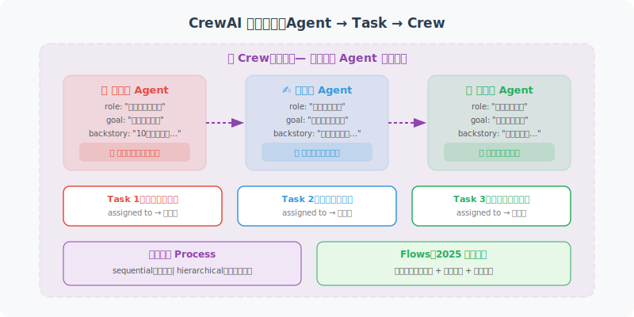

# CrewAI：角色扮演型多 Agent 框架

CrewAI 是一个专为多 Agent 协作设计的框架，通过"角色扮演"让不同的 Agent 扮演不同的专业角色，共同完成复杂任务。自 2024 年推出以来，CrewAI 已发展为最受欢迎的多 Agent 框架之一，并在 2025 年引入了 **Flows** 等重要新特性。



## CrewAI 核心概念

CrewAI 围绕三个核心抽象构建：**Agent**（角色）、**Task**（任务）和 **Crew**（团队）。每个 Agent 都有明确的角色定位和目标，通过自然语言描述来定义其行为模式：

```python
# pip install crewai crewai-tools

from crewai import Agent, Task, Crew, Process

# ============================
# 1. 定义 Agent（角色）
# ============================
# CrewAI 内置 LLM 支持，默认使用 GPT-4o
# 也可通过 llm 参数指定其他模型

researcher = Agent(
    role="资深研究员",
    goal="深入研究指定主题，收集最新、最准确的信息",
    backstory="""你是一名拥有10年经验的研究员，擅长快速收集
    和整理信息。你注重数据准确性，引用可靠来源。""",
    verbose=True,
    allow_delegation=False  # 不允许转发任务给其他 Agent
)

writer = Agent(
    role="内容编辑",
    goal="将研究内容转化为易读、有吸引力的文章",
    backstory="""你是一名资深编辑，擅长将复杂的技术内容
    转化为普通读者易于理解的文章。你的文章逻辑清晰、
    语言生动。""",
    verbose=True,
    allow_delegation=True  # 可以将子任务转发给其他 Agent
)

reviewer = Agent(
    role="质量审查员",
    goal="确保内容的准确性、完整性和可读性",
    backstory="""你是一名严格的质量审查员，有着敏锐的
    洞察力。你会找出内容中的逻辑漏洞、事实错误和
    表达不清晰的地方。""",
    verbose=True
)

# ============================
# 2. 定义 Task（任务）
# ============================

research_task = Task(
    description="""
    研究以下主题：{topic}
    
    需要收集：
    1. 主题的基本定义和重要性
    2. 最新发展趋势（2025-2026年）
    3. 主要应用场景（至少3个）
    4. 面临的挑战
    5. 专家观点（至少引用2个来源）
    """,
    expected_output="一份详细的研究报告，包含所有要求的信息点",
    agent=researcher
)

writing_task = Task(
    description="""
    基于研究报告，撰写一篇面向技术开发者的文章。
    
    要求：
    - 字数：800-1200字
    - 结构：引言、正文（3-4个章节）、结论
    - 语言：专业但易读，避免过多专业术语
    - 包含具体的代码示例或实际案例
    """,
    expected_output="一篇完整的技术文章，Markdown 格式",
    agent=writer,
    context=[research_task]  # 依赖研究任务的输出
)

review_task = Task(
    description="""
    审查文章质量，检查：
    1. 内容准确性
    2. 逻辑结构
    3. 语言表达
    4. 代码示例的正确性
    
    给出评分（1-10）和修改建议。
    """,
    expected_output="质量评分报告和具体修改建议",
    agent=reviewer,
    context=[writing_task]
)

# ============================
# 3. 创建 Crew 并执行
# ============================

crew = Crew(
    agents=[researcher, writer, reviewer],
    tasks=[research_task, writing_task, review_task],
    process=Process.sequential,  # 顺序执行（也支持 hierarchical）
    verbose=True
)

# 执行任务
result = crew.kickoff(inputs={"topic": "LangGraph 在生产环境的应用"})
print(result)
```

## CrewAI 高级特性

### 分层流程与工具集成

CrewAI 支持两种执行流程：**顺序**（sequential）和**分层**（hierarchical）。分层模式引入管理者 Agent 来协调任务分配：

```python
# 分层流程（Hierarchical）：有管理者 Agent
from crewai import Agent, Task, Crew, Process

manager = Agent(
    role="项目经理",
    goal="协调团队，确保任务高质量完成",
    backstory="你是经验丰富的项目经理",
    allow_delegation=True
)

crew_hierarchical = Crew(
    agents=[researcher, writer],
    tasks=[research_task, writing_task],
    manager_agent=manager,  # 指定管理者
    process=Process.hierarchical,  # 分层执行
    verbose=True
)

# 工具集成
from crewai_tools import SerperDevTool, FileWriterTool

search_tool = SerperDevTool()  # 搜索工具
file_tool = FileWriterTool()   # 文件写入工具

researcher_with_tools = Agent(
    role="资深研究员",
    goal="研究和收集信息",
    backstory="你是研究员",
    tools=[search_tool]  # 赋予工具
)
```

### Flows：结构化工作流编排（新特性）

CrewAI Flows 是 2025 年引入的重要新特性，提供了**事件驱动**的工作流编排能力。与 Crew 的声明式任务分配不同，Flows 允许开发者用 Python 代码精确控制执行流程：

```python
from crewai.flow.flow import Flow, listen, start, router
from pydantic import BaseModel


class ArticleState(BaseModel):
    """Flow 状态管理"""
    topic: str = ""
    research: str = ""
    article: str = ""
    quality_score: int = 0


class ArticleFlow(Flow[ArticleState]):
    """文章创作工作流"""

    @start()  # 标记入口方法
    def choose_topic(self):
        self.state.topic = "Agent 开发最佳实践"
        return self.state.topic

    @listen(choose_topic)  # 监听上一步完成
    def research_topic(self, topic):
        """调用研究 Crew 进行调研"""
        # 可以在 Flow 中嵌入 Crew
        crew = Crew(
            agents=[researcher],
            tasks=[research_task],
            verbose=True
        )
        result = crew.kickoff(inputs={"topic": topic})
        self.state.research = str(result)
        return self.state.research

    @listen(research_topic)
    def write_article(self, research):
        """基于研究结果撰写文章"""
        crew = Crew(
            agents=[writer],
            tasks=[writing_task],
            verbose=True
        )
        result = crew.kickoff()
        self.state.article = str(result)
        return self.state.article

    @router(write_article)  # 路由：根据条件分支
    def check_quality(self, article):
        """质量检查路由"""
        if len(article) < 500:
            return "rewrite"  # 太短，重写
        return "publish"  # 质量合格，发布

    @listen("rewrite")
    def rewrite_article(self):
        """重写文章"""
        print("文章太短，重新撰写...")
        # 重新执行写作逻辑
        return self.write_article(self.state.research)

    @listen("publish")
    def publish_article(self):
        """发布文章"""
        print(f"文章发布成功！共 {len(self.state.article)} 字")
        return self.state.article


# 执行 Flow
flow = ArticleFlow()
result = flow.kickoff()
```

**Flows 的核心装饰器**：

| 装饰器 | 用途 | 说明 |
|--------|------|------|
| `@start()` | 入口方法 | Flow 的起始点，可以有多个 |
| `@listen(method)` | 事件监听 | 上一步完成时触发 |
| `@router(method)` | 条件路由 | 根据返回值分支到不同路径 |

**Crew vs Flow 选择**：
- **Crew**：适合任务分工明确、Agent 可自主协作的场景
- **Flow**：适合需要精确控制流程、有条件分支和循环的复杂工作流

## CrewAI vs LangGraph 对比

```
CrewAI 特点：
✅ 简单直观的角色扮演模型
✅ 声明式定义，代码量少
✅ 适合任务分工明确的场景
✅ Flows 支持事件驱动工作流（新）
❌ 复杂状态管理能力不如 LangGraph
❌ 调试工具相对有限

LangGraph 特点：
✅ 强大的状态管理和循环控制
✅ 细粒度控制每个步骤
✅ 支持 Human-in-the-Loop
✅ 可视化调试（LangSmith 集成）
❌ 代码量更多
❌ 学习曲线较陡

建议：
- 角色分工清晰的任务 → CrewAI（Crew 模式）
- 需要复杂控制流和状态管理 → LangGraph
- 需要流程编排 + 多 Agent → CrewAI（Flow 模式）
- 快速原型 → CrewAI
- 生产环境高可靠需求 → LangGraph
```

---

## 小结

CrewAI 通过角色（Agent）+ 任务（Task）+ 团队（Crew）的简洁抽象，让多 Agent 协作变得非常直观。2025 年引入的 **Flows** 特性进一步增强了工作流编排能力，使 CrewAI 能够处理更复杂的场景——从简单的顺序任务到带有条件分支和循环的完整工作流。

---

*下一节：[13.3 AutoGen：多 Agent 对话框架](./03_autogen.md)*
