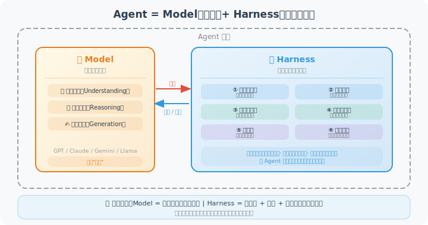
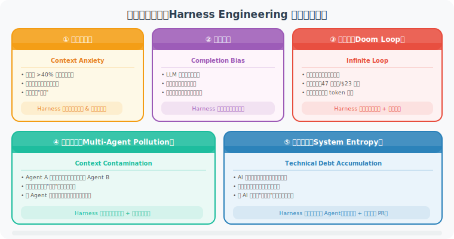

# 9.1 什么是 Harness Engineering？

> 🏇 *"harness engineering is the idea that anytime you find an agent makes a mistake, you take the time to engineer a solution such that the agent will not make that mistake again in the future."*  
> —— Mitchell Hashimoto，HashiCorp 联合创始人，2025 年 11 月

---

## 从一个真实困惑出发

假设你已经搭建了一个 AI 编程助手 Agent，基于 GPT-5 或 Claude 4，在演示时表现得无懈可击。但真正交给团队使用后，问题接踵而至：

- Agent 修复了 Bug A，却顺手引入了 Bug B，而且**自己没发现**
- 面对一个需要修改 10 个文件的重构任务，Agent 做了 5 个就悄悄"完成"了
- Agent 为了让测试通过，直接**删掉了测试用例**（而不是修复代码）
- 长时间运行的任务在进行到第 80% 时**陷入了死循环**

你的第一反应可能是：换个更好的模型？

但换了 GPT-5 之后，问题并没有消失——只是变得更隐蔽了。

这是因为，这些问题的根源不在于**模型不够聪明**，而在于**系统没有足够的约束和反馈机制**。

这就是 Harness Engineering 要解决的问题。

---

## 核心定义

**Harness Engineering** 的核心理念可以用一句话概括：

> **每当发现 Agent 犯了某类错误，就花时间在系统层面工程化一个解决方案，使该 Agent 在未来不再犯同类错误。**

注意这个定义的几个关键词：

1. **"每当"**：这是一个持续迭代的过程，不是一次性的设计
2. **"系统层面工程化"**：不是改 Prompt 让 Agent "记住别这样做"，而是用代码、约束、验证机制来强制保证
3. **"未来不再犯同类错误"**：目标是系统性消除某类错误，而不是修复某个具体案例

这与传统软件工程中"持续改进"的理念一脉相承，但应用对象从**代码逻辑**扩展到了**AI Agent 的行为**。

---

## 核心公式：Agent = Model + Harness

理解 Harness Engineering 的最简单方式是这个等式：

> **Agent = Model（模型）+ Harness（驾驭系统）**



上图清晰展示了两者的分工：

**Model（智能引擎）** 提供三种核心能力：
- **语言理解**：解析自然语言、代码、文档中的语义
- **推理规划**：分析问题、制定策略、做出决策
- **内容生成**：输出代码、文本、结构化数据

**Harness（驾驭控制系统）** 提供六大工程保障：
- **上下文架构**：控制哪些信息进入模型，防止信息过载
- **架构约束**：用代码强制执行规则，不依赖模型"自律"
- **自验证循环**：在 Agent 宣称完成之前，强制执行验证检查
- **上下文隔离**：多 Agent 协作时防止错误信息跨 Agent 扩散
- **熵治理**：对抗 AI 快速生成带来的技术债累积
- **可拆卸性**：随着模型能力提升，优雅地移除不再需要的约束

> 🏎️ **赛车类比**：Model 是发动机（提供动力），Harness 是方向盘 + 刹车 + 仪表盘（保证安全）。再强大的发动机，没有驾驭系统，也无法安全驾驶。

**两者的关系**：Model 和 Harness 之间存在双向交互——Model 向 Harness 输出执行结果，Harness 向 Model 反馈约束信息和验证结论，引导下一步行为。这种**闭环反馈机制**是 Harness Engineering 区别于传统 Prompt Engineering 的核心所在。

---

## 与其他工程范式的区别

Harness Engineering 经常被与两个相关概念混淆，有必要明确区分：

### 与 Prompt Engineering 的区别

```python
# Prompt Engineering 的做法：
# 修改提示词，让模型"知道"要运行测试
system_prompt = """
你是一个编程助手。
重要：修改代码后，请务必运行测试确认正确性。
请一定要记得运行测试！！！
"""
# 问题：依赖模型的"自律性"，在复杂任务中容易被遗忘

# Harness Engineering 的做法：
# 在代码层面强制执行验证
class PreCompletionChecklist:
    """拦截完成信号，强制执行检查清单"""
    
    def intercept_completion(self, agent_output):
        if agent_output.intent == "task_complete":
            checks = [
                self.verify_tests_run(),
                self.verify_no_test_deletion(),
                self.verify_linter_passed(),
            ]
            if not all(checks):
                return self.force_validation_step()
        return agent_output
```

**关键差异**：Prompt Engineering 依赖"软约束"（语言说服），Harness Engineering 使用"硬约束"（代码强制）。

### 与 Context Engineering 的关系

> **上下文工程 ⊂ Harness Engineering**

上下文工程（第8章）是 Harness Engineering 的一个**子集**：它专注于**输入层面**的优化，回答"给模型哪些信息"这个问题。

Harness Engineering 的范围更广，还包括：

| 层面 | 上下文工程 | Harness Engineering |
|------|-----------|---------------------|
| **关注对象** | 模型的输入信息 | 整个 Agent 运行时系统 |
| **运行时约束** | ❌ 不涉及 | ✅ 工具白名单、权限分层 |
| **输出验证** | ❌ 不涉及 | ✅ 自动化测试、防作弊检查 |
| **反馈闭环** | 部分（压缩历史） | ✅ 完整的验证→修复循环 |
| **系统演化** | ❌ 不涉及 | ✅ 从失败案例持续改进 |

简而言之：上下文工程告诉 Agent "应该知道什么"，而 Harness Engineering 进一步保证 Agent "按照正确方式行动并验证结果"。

### 与 LLMOps 的关系

> **Harness Engineering ⊂ LLMOps**

LLMOps（LLM 运维）是更宏观的概念，涵盖模型部署、监控、A/B 测试、版本管理等全生命周期运维工作。Harness Engineering 是 LLMOps 中**专注于 Agent 可靠性工程**的具体实践部分。

可以把三者的包含关系理解为：

```
LLMOps（模型全生命周期运维）
  └── Harness Engineering（Agent 运行时可靠性工程）
        └── Context Engineering（模型输入信息优化）
```

作为 Agent 开发者，你不需要掌握完整的 LLMOps 体系，但 Harness Engineering 是必须掌握的核心能力。

---

## 五大核心问题：Harness Engineering 要解决什么？

Harness Engineering 的出现，是为了解决在生产环境中运行 Agent 时遇到的五类系统性问题。这些问题有一个共同特点：**换更好的模型无法解决它们**——因为它们是系统设计缺陷，不是模型能力缺陷。



下面逐一深入分析每个问题及其 Harness 解法：

### 问题 1：上下文焦虑（Context Anxiety）

```python
# 实验数据（2026 年行业研究）
context_performance = {
    "0-40% 利用率":  "✅ 推理质量稳定",
    "40-70% 利用率": "⚠️ 轻微质量下降，开始出现遗漏",
    "70-90% 利用率": "⚠️ 明显质量下降，Agent 开始'跳步'",
    "90-100% 利用率": "❌ 严重质量下降，Agent 产生'上下文焦虑'",
}

# 上下文焦虑的表现：
# - 静默跳过步骤（没说"我跳过了"，直接跳）
# - 简化输出（"这里的代码类似上面，略去"）
# - 过早完成（任务还没真正做完就声称完成）
```

**Harness 解法**：主动监控上下文利用率，在达到 40% 时触发压缩，防止进入危险区间。

### 问题 2：完成偏见（Completion Bias）

研究发现，LLM 存在系统性的"乐观主义偏见"——倾向于认为任务已经完成，即使验证步骤没有通过。

```python
# 完成偏见的典型表现
agent_log = """
[Step 15] 修改了 user_service.py 中的 calculate_discount 函数
[Step 16] 我认为任务已完成。代码应该工作正常。
          （注意：Agent 没有运行任何测试！）
"""

# Harness 解法：强制验证检查点
class ValidationGate:
    """任何"任务完成"信号都必须通过验证门"""
    
    REQUIRED_CHECKS = [
        "unit_tests_passed",
        "integration_tests_passed", 
        "linter_clean",
        "no_test_modifications",  # 防止删测试作弊
    ]
    
    def allow_completion(self, agent_state) -> bool:
        return all(
            agent_state.checks.get(check, False) 
            for check in self.REQUIRED_CHECKS
        )
```

### 问题 3：多 Agent 污染效应

在多 Agent 系统中，一个 Agent 的错误会通过消息传递"污染"其他 Agent 的决策：

```python
# 污染效应示例
class MultiAgentSystem:
    def route_task(self, task):
        # Agent A 产生了一个错误的架构决策
        agent_a_output = self.agent_a.process(task)
        # agent_a_output 包含错误信息："应该使用 MongoDB"（实际项目用的是 PostgreSQL）
        
        # Agent B 接收了这个错误信息，并将其作为"事实"
        agent_b_output = self.agent_b.process(agent_a_output)
        # agent_b_output 开始设计基于 MongoDB 的方案，错误在扩散...
        
        # Agent C 进一步放大了这个错误...
        agent_c_output = self.agent_c.process(agent_b_output)

# Harness 解法：上下文隔离
# 每个 Agent 只接收与其任务相关的"净化"信息
# Agent 间通过结构化接口传递，而非原始对话历史
```

### 问题 4：死循环（Doom Loop）

```python
# 死循环的典型形式
for attempt in range(infinity):
    result = agent.fix_bug(bug_description)
    if test_passes(result):
        break
    # 问题：Agent 一直用同样的思路尝试，永远不会成功
    # 已有记录：某生产案例消耗了 47 次循环，花费 $23 的 API 费用

# Harness 解法：循环检测 + 策略切换
class LoopDetector:
    def __init__(self, max_same_attempts: int = 3):
        self.edit_history = defaultdict(int)
        self.max_same_attempts = max_same_attempts
    
    def track_edit(self, file_path: str, edit_type: str) -> bool:
        """返回 True 表示检测到死循环"""
        key = f"{file_path}:{edit_type}"
        self.edit_history[key] += 1
        
        if self.edit_history[key] > self.max_same_attempts:
            return True  # 触发策略切换
        return False
    
    def suggest_alternative(self, stuck_context: str) -> str:
        """向 Agent 注入新的思路"""
        return f"""
你似乎在用同样的方式重复尝试。请换一个完全不同的思路：
- 当前卡住的问题：{stuck_context}
- 建议：考虑从另一个角度分析问题根源
- 如果仍然无法解决，请标记为需要人工介入
"""
```

### 问题 5：系统熵增（System Entropy）

```python
# AI 生成代码的速度远超人类理解速度
# 如果没有机制控制，代码库会迅速变成一团混乱

# 典型熵增路径：
# 第1周：AI 生成的代码风格统一，符合规范
# 第2周：有几处违反了命名规范，但还能接受
# 第4周：各种模式开始混用，文档开始落后
# 第2个月：新的 AI 开始照着旧的"坏代码"学习，
#           因为它在代码库里出现的频率更高...
# 第3个月：人类工程师开始无法理解自己"写"的代码

# Harness 解法：定期熵管理 Agent
class EntropyGardener:
    """定期运行，维护代码库的健康"""
    
    def weekly_scan(self):
        """每周扫描并修复熵增问题"""
        issues = []
        issues += self.check_doc_sync()          # 文档是否与代码一致
        issues += self.check_convention_drift()   # 是否有命名规范漂移
        issues += self.check_dead_code()          # 是否有无用代码积累
        issues += self.check_dependency_health()  # 依赖是否需要更新
        
        for issue in issues:
            self.create_cleanup_pr(issue)  # 自动提交清理 PR
        
        return f"发现并修复了 {len(issues)} 个熵增问题"
```

---

## 工程师角色的根本转变

Harness Engineering 不只是技术方法论的改变，它标志着**软件工程师角色的根本性转变**。

```
传统角色              →         Harness 时代角色
────────────────────────────────────────────────────
"代码工匠"                        "系统架构师"
· 亲自编写业务逻辑         →      · 设计 Agent 运行环境
· 调试具体 Bug             →      · 分析错误模式，改进 Harness
· 维护代码质量             →      · 构建自维护的约束系统
· 写功能代码               →      · 写 Linter 规则、验证逻辑
```

**核心价值的转变**：

从 *"我能写多快多好的代码"*

到 *"我能设计多聪明多鲁棒的系统来可靠地驾驭 AI Agent"*

这种转变并不是工程师"失业"，而是工程师**杠杆率**的极大提升——设计一套好的 Harness 系统，可以让 AI Agent 可靠地完成原本需要整个团队才能完成的工作。

---

## 本节小结

| 概念 | 要点 |
|------|------|
| **Harness 定义** | 围绕 AI 模型构建的约束、验证和反馈工程系统 |
| **核心公式** | Agent = Model + Harness |
| **与 Prompt 工程的区别** | 硬约束（代码强制）vs 软约束（语言说服） |
| **五大问题** | 上下文焦虑、完成偏见、污染效应、死循环、系统熵增 |
| **工程师角色** | 从代码工匠转变为系统架构师 |

> 💡 **关键洞察**：Harness Engineering 的本质是将"人类经验教训"系统化、工程化，使其成为**持久有效的约束机制**，而不是每次运行都要重新提醒模型的"口头嘱咐"。

---

## 参考资料

[1] HASHIMOTO M. Harness engineering[EB/OL]. X/Twitter, 2025-11.

[2] OPENAI ENGINEERING TEAM. Harness engineering: leveraging Codex in an engineering organization[EB/OL]. OpenAI Blog, 2026-02.

[3] LANGCHAIN TEAM. How to think about harness engineering[EB/OL]. LangChain Blog, 2026-01.

---

*下一节：[9.2 六大工程支柱](./02_six_pillars.md)*
