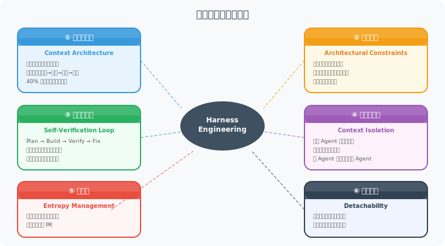
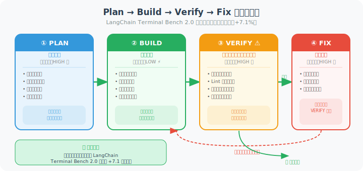

# 9.2 六大工程支柱

> 🏛️ *"限制才能解放——明确的边界让 Agent 更高效、更可靠。"*

---

Harness Engineering 的完整实践体系由**六大工程支柱**构成。每个支柱解决一类具体的可靠性问题，六者相互配合，共同构成一个能持续稳定运行的 Agent 系统。



如上图所示，六大支柱以 Harness Engineering 为核心，各自指向不同的可靠性维度：

| 支柱 | 解决的核心问题 | 优先级 |
|------|-------------|--------|
| ① 上下文架构 | Agent 在长任务中因上下文过载而"焦虑"、跳步 | ⭐⭐⭐⭐⭐ |
| ② 架构约束 | Prompt 软约束不可靠，依赖模型"自律"不稳定 | ⭐⭐⭐⭐⭐ |
| ③ 自验证循环 | Agent 未验证就声称完成，或作弊删掉测试 | ⭐⭐⭐⭐⭐ |
| ④ 上下文隔离 | 多 Agent 系统中错误信息跨 Agent 传播扩散 | ⭐⭐⭐⭐ |
| ⑤ 熵治理 | AI 快速生成代码导致代码库质量螺旋下降 | ⭐⭐⭐ |
| ⑥ 可拆卸性 | Harness 随时间堆积，掩盖模型真实能力 | ⭐⭐⭐ |

> 💡 **实施建议**：不要尝试一次性实现所有六大支柱。前三个（上下文架构 + 架构约束 + 自验证循环）已经能解决 80% 的生产可靠性问题，建议优先实施。

---

## 支柱一：上下文架构（Context Architecture）

**核心理念**：精准设计进入模型上下文的信息，主动管理"注意力预算"。

这与第8章讨论的上下文工程一脉相承，但 Harness Engineering 进一步强调**主动监控和动态调整**。

### 上下文生命周期管理

```python
class ContextLifecycleManager:
    """
    上下文生命周期管理器
    
    生命周期四阶段：
    注入（Inject）→ 监控（Monitor）→ 压缩（Compress）→ 归档（Archive）
    """
    
    COMPRESSION_THRESHOLD = 0.40  # 利用率超过 40% 时触发压缩
    ARCHIVE_THRESHOLD = 0.70      # 利用率超过 70% 时触发归档
    
    def __init__(self, model, max_tokens: int):
        self.model = model
        self.max_tokens = max_tokens
        self.messages = []
        self.archived_summary = None
    
    # === 阶段一：注入 ===
    def inject(self, message: dict) -> None:
        """智能注入：优先级排队，而非无脑追加"""
        priority = self._assess_priority(message)
        if priority == "CRITICAL":
            self.messages.insert(1, message)   # 系统消息之后立即插入
        elif priority == "HIGH":
            self.messages.append(message)       # 正常追加
        elif priority == "LOW":
            # 低优先级消息只在有空间时才追加
            if self.utilization() < 0.3:
                self.messages.append(message)
    
    # === 阶段二：监控 ===
    def utilization(self) -> float:
        """实时监控上下文利用率"""
        current_tokens = sum(count_tokens(m) for m in self.messages)
        return current_tokens / self.max_tokens
    
    def health_check(self) -> dict:
        """上下文健康报告"""
        util = self.utilization()
        return {
            "utilization": f"{util:.1%}",
            "status": "🟢 健康" if util < 0.4 else 
                      "🟡 警告" if util < 0.7 else "🔴 危险",
            "token_count": int(util * self.max_tokens),
            "recommendation": self._get_recommendation(util),
        }
    
    def _get_recommendation(self, util: float) -> str:
        if util < 0.4:
            return "正常，无需操作"
        elif util < 0.7:
            return "建议清理旧工具输出"
        else:
            return "⚠️ 立即执行完整压缩"
    
    # === 阶段三：压缩 ===
    def compress(self) -> None:
        """渐进式压缩：从轻量到完整"""
        util = self.utilization()
        
        if util >= self.COMPRESSION_THRESHOLD:
            # 第一步：轻量压缩——清除旧工具结果（最安全）
            self._clear_old_tool_results()
        
        if self.utilization() >= self.COMPRESSION_THRESHOLD:
            # 第二步：完整压缩——生成结构化摘要
            self._full_compress()
    
    def _clear_old_tool_results(self) -> None:
        """清除较旧的工具执行结果（Anthropic 推荐的轻量级压缩）"""
        cutoff_index = len(self.messages) - 8  # 保留最近 4 轮交互
        for i, msg in enumerate(self.messages[:cutoff_index]):
            if msg.get("role") == "tool":
                self.messages[i] = {
                    "role": "tool",
                    "tool_call_id": msg.get("tool_call_id"),
                    "content": f"[已执行：{msg.get('name', 'tool')} → 结果已归档以节省空间]"
                }
    
    def _full_compress(self) -> None:
        """完整压缩：用结构化摘要替代中间历史"""
        system_msgs = [m for m in self.messages if m["role"] == "system"]
        recent_msgs = self.messages[-6:]   # 保留最近 3 轮
        middle_msgs = self.messages[len(system_msgs):-6]
        
        if not middle_msgs:
            return
        
        summary_prompt = """
请将以下对话历史压缩为结构化摘要。

必须保留：
1. 用户的核心目标和当前状态
2. 已完成的关键操作（含具体文件路径、函数名、数值）
3. 已发现的问题和对应的解决决策
4. 当前的待办事项

可以丢弃：
- 重复的尝试记录
- 冗长的工具输出原文
- 探索性但无结论的讨论

格式：使用层次化列表，确保关键细节不丢失。
"""
        compressed = self.model.summarize(
            prompt=summary_prompt,
            content=format_as_text(middle_msgs)
        )
        
        self.messages = system_msgs + [
            {"role": "system", "content": f"【对话历史摘要】\n{compressed}"}
        ] + recent_msgs
    
    # === 阶段四：归档 ===
    def archive_session(self) -> None:
        """任务完成后归档关键决策，供未来参考"""
        self.archived_summary = self.model.summarize(
            prompt="请提取本次任务的关键决策、学到的教训和值得复用的模式。",
            content=format_as_text(self.messages)
        )
```

### 渐进式披露（Progressive Disclosure）

这是 OpenAI 百万行代码实验中的关键模式：**不要把所有信息一次性塞给 Agent，而是按需逐步披露**。

```python
class ProgressiveDisclosure:
    """
    渐进式披露策略
    
    错误示范：把 2000 行的 AGENTS.md 全部放入上下文
    正确做法：只提供目录，Agent 按需获取具体章节
    """
    
    def __init__(self, docs_dir: str):
        # 构建文档索引（轻量级）
        self.doc_index = self._build_index(docs_dir)
    
    def _build_index(self, docs_dir: str) -> dict:
        """构建文档索引——只记录文档名称和一句话摘要"""
        index = {}
        for doc_path in Path(docs_dir).rglob("*.md"):
            with open(doc_path) as f:
                content = f.read()
                # 提取文档标题和第一段摘要
                lines = content.strip().split('\n')
                title = lines[0].lstrip('#').strip()
                summary = next((l for l in lines[2:] if l.strip()), "")[:100]
                index[str(doc_path)] = {
                    "title": title,
                    "summary": summary,
                    "size_tokens": count_tokens(content),
                }
        return index
    
    def get_initial_context(self) -> str:
        """返回文档目录（而非文档全文）"""
        lines = ["可用文档列表：\n"]
        for path, meta in self.doc_index.items():
            lines.append(f"- [{meta['title']}]({path}): {meta['summary']}")
        lines.append("\n请使用 read_doc 工具获取具体文档内容。")
        return '\n'.join(lines)
    
    def read_doc(self, doc_path: str) -> str:
        """Agent 按需调用，获取具体文档"""
        with open(doc_path) as f:
            return f.read()
```

---

## 支柱二：架构约束（Architectural Constraints）

**核心理念**：用工具和代码强制执行规则，而非依赖 Prompt 的"软约束"。

**关键原则**：*为了获得更高的 AI 自主性，运行时必须受到更严格的约束。*（就像高速公路护栏让你敢开快车。）

### 工具白名单与权限分层

```python
from enum import Enum
from typing import Callable

class PermissionLevel(Enum):
    READ_ONLY = 1      # 只能读，不能写
    WRITE_SAFE = 2     # 可以写，但有撤销机制
    WRITE_DESTRUCTIVE = 3  # 会删除/修改重要数据，需要确认
    SYSTEM = 4         # 系统级操作，严格限制

class ToolRegistry:
    """
    工具注册表：实现权限分层
    
    设计原则：最小权限暴露
    - 不是所有工具对所有 Agent 都可见
    - 危险操作需要额外的确认步骤
    """
    
    def __init__(self, agent_role: str):
        self.agent_role = agent_role
        self.tools = {}
        self._load_permitted_tools()
    
    def _load_permitted_tools(self):
        """根据 Agent 角色加载允许的工具集"""
        role_permissions = {
            "code_reviewer": [PermissionLevel.READ_ONLY],
            "code_writer": [PermissionLevel.READ_ONLY, PermissionLevel.WRITE_SAFE],
            "devops": [PermissionLevel.READ_ONLY, PermissionLevel.WRITE_SAFE, 
                       PermissionLevel.WRITE_DESTRUCTIVE],
        }
        allowed_levels = role_permissions.get(self.agent_role, [PermissionLevel.READ_ONLY])
        
        # 只注册该角色允许的工具
        for name, tool in ALL_TOOLS.items():
            if tool.permission_level in allowed_levels:
                self.tools[name] = tool
    
    def register_tool(
        self, 
        name: str, 
        func: Callable,
        permission: PermissionLevel,
        description: str,
        idempotent: bool = False  # 是否幂等（重复执行是否安全）
    ):
        """注册一个工具，必须声明其权限级别和幂等性"""
        if permission == PermissionLevel.WRITE_DESTRUCTIVE:
            # 危险操作：包装一层确认逻辑
            func = self._wrap_with_confirmation(func, name)
        
        if not idempotent and permission >= PermissionLevel.WRITE_SAFE:
            # 非幂等的写操作：添加操作记录，支持撤销
            func = self._wrap_with_audit_log(func, name)
        
        self.tools[name] = {
            "function": func,
            "permission": permission,
            "description": description,
            "idempotent": idempotent,
        }
    
    def _wrap_with_confirmation(self, func: Callable, tool_name: str) -> Callable:
        """为危险操作添加确认步骤"""
        def confirmed_func(*args, **kwargs):
            print(f"⚠️  即将执行危险操作: {tool_name}")
            print(f"   参数: {args}, {kwargs}")
            confirm = input("确认执行? (yes/no): ")
            if confirm.lower() != "yes":
                return {"status": "cancelled", "reason": "用户取消"}
            return func(*args, **kwargs)
        return confirmed_func

# 实战示例：为编程 Agent 设置合理的工具集
def create_coding_agent_tools() -> ToolRegistry:
    registry = ToolRegistry(agent_role="code_writer")
    
    # ✅ 安全：读取文件（幂等，只读）
    registry.register_tool(
        name="read_file",
        func=lambda path: open(path).read(),
        permission=PermissionLevel.READ_ONLY,
        description="读取文件内容。参数：file_path（字符串）",
        idempotent=True,
    )
    
    # ✅ 安全：写文件（非幂等，但有审计日志）
    registry.register_tool(
        name="write_file",
        func=lambda path, content: write_with_backup(path, content),
        permission=PermissionLevel.WRITE_SAFE,
        description="写入文件内容。参数：file_path, content",
        idempotent=False,
    )
    
    # ❌ 不暴露给 Agent：删除文件（太危险）
    # registry.register_tool("delete_file", ...)
    
    # ✅ 受限：运行测试（只读形式的副作用操作）
    registry.register_tool(
        name="run_tests",
        func=lambda test_pattern="": run_pytest(test_pattern),
        permission=PermissionLevel.WRITE_SAFE,
        description="运行测试套件。参数：test_pattern（可选，默认运行全部）",
        idempotent=True,
    )
    
    return registry
```

### 强类型参数约束

```python
from pydantic import BaseModel, validator, Field

class FileWriteParams(BaseModel):
    """
    工具参数的强类型定义
    
    不要接受 dict，要接受有验证的 Pydantic 模型
    这样可以在工具执行前发现参数错误，而不是让错误
    在执行过程中悄悄发生
    """
    file_path: str = Field(
        description="要写入的文件路径",
        example="src/utils/helper.py"
    )
    content: str = Field(
        description="要写入的文件内容",
    )
    mode: str = Field(
        default="overwrite",
        description="写入模式：overwrite（覆盖）或 append（追加）",
    )
    
    @validator('file_path')
    def validate_path(cls, v):
        # 防止路径遍历攻击
        if '..' in v:
            raise ValueError("禁止使用 .. 进行路径遍历")
        # 防止写入系统目录
        forbidden_prefixes = ['/etc/', '/usr/', '/bin/', '/sys/']
        for prefix in forbidden_prefixes:
            if v.startswith(prefix):
                raise ValueError(f"禁止写入系统目录: {prefix}")
        return v
    
    @validator('mode')
    def validate_mode(cls, v):
        allowed_modes = {'overwrite', 'append'}
        if v not in allowed_modes:
            raise ValueError(f"mode 必须是 {allowed_modes} 之一")
        return v
```

---

## 支柱三：自验证循环（Self-Verification Loop）

**核心理念**：在 Agent 执行流程中内置验证检查点，**让 Agent 在声称完成任务之前必须先证明任务真正完成了**。

这是六大支柱中**对成功率影响最大**的单项改进。根据 LangChain 的实验数据，仅仅是强制执行验证步骤，就使基准测试提升了 +7.1 个百分点——超过了其他所有改进的总和。

### Plan-Build-Verify-Fix 四阶段工作流



如上图所示，四个阶段有着不同的推理预算策略：
- **Plan（规划）**：使用高推理预算，深入思考所有边缘情况
- **Build（构建）**：使用低推理预算，按计划高效执行，无需反复深思
- **Verify（验证）**：使用高推理预算，仔细核查每项要求
- **Fix（修复）**：使用高推理预算，深入分析失败根因

注意其中的**循环结构**：验证失败后回到修复阶段，修复后再次验证，直到全部通过。这个闭环是保证任务质量的关键机制。

受 GAN（生成对抗网络）启发，将生成者（Generator Agent）与评估者（Critic Agent）分离：

```python
class PlanBuildVerifyFix:
    """
    四阶段工作流：Plan → Build → Verify → Fix
    
    这是 LangChain Terminal Bench 2.0 中证明最有效的 Harness 模式
    仅凭此模式，得分从 52.8% 提升至 66.5%（+13.7%）
    """
    
    def __init__(self, agent, tools):
        self.agent = agent
        self.tools = tools
        self.loop_detector = LoopDetector(max_same_attempts=3)
    
    def execute(self, task: str) -> dict:
        """执行完整的四阶段工作流"""
        
        # ===== 阶段一：规划（高推理预算）=====
        print("📋 阶段 1: 规划...")
        plan = self.agent.plan(
            task=task,
            reasoning_budget="high",  # 规划阶段充分思考
            prompt_addition="""
请制定详细的执行计划，包含：
1. 需要修改哪些文件
2. 每个文件需要做什么更改
3. 验证步骤（测试命令）
4. 完成标准（如何判断任务真正完成）
"""
        )
        
        # ===== 阶段二：构建（中等推理预算）=====
        print("🔨 阶段 2: 构建...")
        build_result = self.agent.build(
            plan=plan,
            reasoning_budget="medium",  # 按计划执行，无需深度思考
            tools=self.tools,
            loop_detector=self.loop_detector,  # 注入循环检测
        )
        
        # ===== 阶段三：验证（高推理预算）=====
        print("✅ 阶段 3: 验证...")
        verification = self.verify(task, plan, build_result)
        
        if verification.passed:
            return {
                "status": "success",
                "result": build_result,
                "verification": verification,
            }
        
        # ===== 阶段四：修复（高推理预算）=====
        print("🔧 阶段 4: 修复...")
        fix_result = self.agent.fix(
            original_task=task,
            plan=plan,
            build_result=build_result,
            verification_failures=verification.failures,
            reasoning_budget="high",
            prompt_addition=f"""
验证失败，请修复以下问题：
{verification.failure_report}

注意：
- 不要删除或修改测试用例来使测试通过
- 要修复实际的代码问题
- 修复后重新运行所有测试
"""
        )
        
        # 再次验证（防止无限修复循环）
        final_verification = self.verify(task, plan, fix_result)
        return {
            "status": "success" if final_verification.passed else "partial",
            "result": fix_result,
            "verification": final_verification,
        }
    
    def verify(self, task: str, plan: dict, build_result: dict) -> 'VerificationResult':
        """
        验证阶段：不只是运行测试，还要检查"作弊"行为
        """
        failures = []
        
        # 检查 1：单元测试
        test_result = self.tools.run_tests()
        if not test_result.passed:
            failures.append(f"单元测试失败：{test_result.failure_summary}")
        
        # 检查 2：防作弊检查——确保没有删除测试
        test_deletions = self._check_test_deletions(build_result.file_changes)
        if test_deletions:
            failures.append(f"⚠️ 检测到测试文件被修改/删除：{test_deletions}")
        
        # 检查 3：Linter
        lint_result = self.tools.run_linter()
        if lint_result.error_count > 0:
            failures.append(f"Lint 错误：{lint_result.error_count} 处")
        
        # 检查 4：验证计划中声明的所有文件都被修改了
        planned_files = set(plan.get("files_to_modify", []))
        modified_files = set(build_result.file_changes.keys())
        missing = planned_files - modified_files
        if missing:
            failures.append(f"计划中的文件未被修改：{missing}")
        
        return VerificationResult(
            passed=len(failures) == 0,
            failures=failures,
            failure_report='\n'.join(failures),
        )
    
    def _check_test_deletions(self, file_changes: dict) -> list:
        """检测是否有测试被删除（常见的 AI 作弊模式）"""
        suspicious = []
        for file_path, change in file_changes.items():
            if 'test' in file_path.lower():
                if change.lines_deleted > change.lines_added * 2:
                    suspicious.append(f"{file_path}: 删除了 {change.lines_deleted} 行，仅新增 {change.lines_added} 行")
        return suspicious
```

### 前置条件验证

```python
class PreConditionValidator:
    """
    前置条件验证：在 Agent 开始执行之前确认环境就绪
    
    类比：外科手术前的核查清单（WHO 外科安全核查表）
    研究表明，这类核查表可将错误率降低 50%+
    """
    
    def validate_before_task(self, task: dict) -> list:
        """返回所有未通过的前置条件"""
        violations = []
        
        # 检查依赖文件存在
        for required_file in task.get("requires_files", []):
            if not Path(required_file).exists():
                violations.append(f"前置文件不存在：{required_file}")
        
        # 检查测试套件基础状态（任务开始前测试应当通过）
        if task.get("type") == "code_modification":
            baseline = run_tests()
            if not baseline.all_passed:
                violations.append(
                    f"任务开始前测试已有失败：{baseline.failure_count} 个。"
                    "建议先修复现有失败，再继续此任务。"
                )
        
        # 检查工作目录干净
        git_status = run_git_status()
        if git_status.has_unstaged_changes:
            violations.append(
                "工作目录有未提交的更改。建议先提交或暂存。"
            )
        
        return violations
```

---

## 支柱四：上下文隔离（Context Isolation）

**核心理念**：在多 Agent 系统中，每个 Agent 的上下文应当**彼此隔离**，通过结构化接口传递信息，而非共享完整的对话历史。

```python
class IsolatedAgentContext:
    """
    隔离的 Agent 上下文管理
    
    每个 Agent 有：
    - 独立的对话历史
    - 独立的工具集（最小权限原则）
    - 只通过"接口"与其他 Agent 交互
    
    避免：
    - 直接传递完整的上下文历史给子 Agent
    - 子 Agent 的错误传播到主 Agent
    """
    
    def spawn_sub_agent(
        self,
        role: str,
        task: str,
        context_summary: str,      # 只传递必要的摘要，不传完整历史
        allowed_tools: list[str],  # 只暴露完成该任务所需的工具
    ) -> 'SubAgentResult':
        """
        派生子 Agent：严格控制其上下文和工具权限
        
        正确示范：
        主 Agent 持有架构全景，子 Agent 只获取完成其子任务所需的片段
        """
        sub_agent = Agent(
            role=role,
            system_prompt=self._build_sub_agent_prompt(role, task),
            tools=self._filter_tools(allowed_tools),
            initial_context=context_summary,  # 只有摘要，不是完整历史
        )
        
        try:
            result = sub_agent.execute(task)
            # 验证子 Agent 的输出格式
            return self._validate_and_package(result, role)
        except Exception as e:
            # 子 Agent 的错误被隔离，不污染主 Agent
            return SubAgentResult(
                success=False,
                error=str(e),
                fallback_needed=True,
            )
    
    def _build_sub_agent_prompt(self, role: str, task: str) -> str:
        """为子 Agent 构建专注、简洁的系统提示"""
        return f"""
你是一个专注于单一任务的 {role}。

你的任务：{task}

重要约束：
- 只完成上述任务，不要做额外的事情
- 如果遇到超出任务范围的问题，返回错误而不是自行处理
- 完成后以结构化 JSON 格式返回结果
"""


class MessageBus:
    """
    Agent 间消息总线
    
    所有 Agent 间的通信都通过这个总线，
    实现：
    1. 消息格式验证（防止格式错误传播）
    2. 消息过滤（防止敏感信息泄露）
    3. 审计日志（可追溯）
    """
    
    def publish(self, sender: str, recipient: str, message: dict) -> bool:
        """发布消息：格式验证 + 审计"""
        # 1. 验证消息格式
        if not self._validate_message_schema(message):
            self._log_error(f"消息格式错误: {sender} -> {recipient}")
            return False
        
        # 2. 过滤敏感信息
        sanitized = self._sanitize(message)
        
        # 3. 路由到目标 Agent
        self._route(recipient, sanitized)
        
        # 4. 审计日志
        self._audit_log(sender, recipient, sanitized)
        return True
    
    def _sanitize(self, message: dict) -> dict:
        """清理消息中的敏感内容"""
        # 移除可能包含凭证的字段
        sensitive_keys = ['api_key', 'password', 'token', 'secret']
        return {
            k: v for k, v in message.items() 
            if k.lower() not in sensitive_keys
        }
```

---

## 支柱五：熵治理（Entropy Management）

**核心理念**：AI 生成代码的速度极快，如果没有主动维护机制，代码库会迅速累积"技术债"，进而影响后续 AI 工作的质量。

```python
class EntropyGardener:
    """
    熵治理 Agent：定期运行，维护系统健康
    
    类比：代码库的"免疫系统"
    主动发现和清除正在积累的问题，防止它们扩散
    """
    
    def __init__(self, repo_path: str):
        self.repo = Repository(repo_path)
    
    def weekly_health_check(self) -> HealthReport:
        """每周运行一次的全面健康检查"""
        issues = []
        
        # 检查 1：文档同步性
        issues += self._check_doc_sync()
        
        # 检查 2：约束违规
        issues += self._check_convention_violations()
        
        # 检查 3：死代码
        issues += self._check_dead_code()
        
        # 检查 4：依赖健康
        issues += self._check_dependency_health()
        
        # 检查 5：测试覆盖率下降
        issues += self._check_coverage_regression()
        
        # 自动创建 PR 修复可以自动修复的问题
        auto_fixed = []
        for issue in issues:
            if issue.auto_fixable:
                pr = self.repo.create_pr(
                    title=f"[Entropy Garden] {issue.title}",
                    changes=issue.fix(),
                    description=issue.description,
                )
                auto_fixed.append(pr)
        
        return HealthReport(
            issues_found=len(issues),
            auto_fixed=len(auto_fixed),
            manual_review_needed=[i for i in issues if not i.auto_fixable],
        )
    
    def _check_doc_sync(self) -> list:
        """检查文档是否与代码保持同步"""
        violations = []
        
        for func_path, func_info in self.repo.get_all_functions().items():
            doc_path = func_info.get('doc_reference')
            if not doc_path:
                continue
            
            # 检查文档中描述的接口是否与实际代码一致
            documented_params = parse_doc_params(doc_path)
            actual_params = func_info['parameters']
            
            if documented_params != actual_params:
                violations.append(Issue(
                    title=f"文档-代码不同步: {func_path}",
                    description=f"文档记录参数: {documented_params}\n实际参数: {actual_params}",
                    auto_fixable=True,
                    fix=lambda: update_doc(doc_path, actual_params),
                ))
        
        return violations
    
    def _check_convention_violations(self) -> list:
        """检查命名规范、代码风格漂移"""
        # 运行 Linter 并分析趋势（不只是当前状态）
        current_violations = run_linter(self.repo.path)
        historical = self.repo.get_linter_history(days=7)
        
        violations = []
        for rule, count in current_violations.items():
            if count > historical.get(rule, 0) * 1.5:  # 违规数增长超 50%
                violations.append(Issue(
                    title=f"规范漂移: {rule} 违规数增加 {count - historical.get(rule, 0)}",
                    auto_fixable=rule in AUTO_FIXABLE_RULES,
                ))
        
        return violations
    
    def context_distillation(self, full_context: str) -> str:
        """
        上下文蒸馏：保留结论，丢弃推理过程
        
        这是防止上下文"腐化"的关键技术
        随着迭代进行，越来越多的"为什么"变得无关紧要，
        只有"结论"和"规则"需要保留
        """
        distillation_prompt = """
对以下上下文进行蒸馏：

规则：
- 保留：最终的决策结论、确立的规范、已验证的事实
- 丢弃：讨论过程、被否决的方案、探索性的尝试记录
- 保留格式：简洁的列表或表格，不要叙述性文字

输出格式：
## 已确立的规范
...

## 关键决策
...

## 已知约束
...
"""
        return model.summarize(distillation_prompt, content=full_context)
```

---

## 支柱六：可拆卸性（Detachability）

**核心理念**：随着模型能力不断提升，今天需要的 Harness 组件，明天可能就不再需要了。**好的 Harness 设计应当能够优雅地随模型迭代而调整。**

这个支柱解决了一个常见的陷阱：**过度工程化**——为已经不存在的问题保留了大量约束机制，反而掩盖了模型的真实能力，增加了维护负担。

```python
class DetachableHarness:
    """
    可拆卸的 Harness 设计
    
    架构三层：
    - 应用层（业务逻辑，稳定）
    - Harness 核心层（模型无关的通用约束）
    - 模型适配层（针对特定模型的特定约束）
    
    当模型更新时，只需更新适配层，甚至可以移除不再需要的约束
    """
    
    def __init__(self):
        self.components = {}
        self.component_metadata = {}
    
    def register_component(
        self,
        name: str,
        component,
        rationale: str,              # 这个组件解决什么问题
        added_for_model: str,        # 是为了应对哪个模型的哪个缺陷添加的
        review_trigger: str = "model_update",  # 什么时候应该重新评估
    ):
        """注册一个 Harness 组件，必须说明原因"""
        self.components[name] = component
        self.component_metadata[name] = {
            "rationale": rationale,
            "added_for_model": added_for_model,
            "added_date": datetime.now().isoformat(),
            "review_trigger": review_trigger,
        }
    
    def review_components(self, current_model: str) -> list:
        """
        模型更新时，审查哪些 Harness 组件可能不再需要
        
        返回值：可能可以移除的组件列表
        """
        candidates_for_removal = []
        
        for name, meta in self.component_metadata.items():
            if meta["added_for_model"] != current_model:
                # 这个组件是为旧模型的缺陷添加的
                candidates_for_removal.append({
                    "component": name,
                    "original_rationale": meta["rationale"],
                    "recommendation": f"请测试在 {current_model} 上是否仍然需要此组件",
                })
        
        return candidates_for_removal
    
    def get_health_report(self) -> dict:
        """Harness 系统健康报告"""
        return {
            "total_components": len(self.components),
            "components": [
                {
                    "name": name,
                    "rationale": meta["rationale"],
                    "age_days": (datetime.now() - datetime.fromisoformat(meta["added_date"])).days,
                    "review_status": "需要审查" if meta.get("needs_review") else "正常",
                }
                for name, meta in self.component_metadata.items()
            ]
        }


# 实战：建立 Harness 组件注册表
harness = DetachableHarness()

harness.register_component(
    name="loop_detector",
    component=LoopDetector(max_same_attempts=3),
    rationale="GPT-4o 在复杂 bug 修复时容易陷入相同思路的死循环",
    added_for_model="gpt-4o",
    review_trigger="model_update",
)

harness.register_component(
    name="test_deletion_checker",
    component=TestDeletionChecker(),
    rationale="早期模型存在删除测试用例来让测试通过的作弊行为",
    added_for_model="claude-3.5-sonnet",
    review_trigger="model_update",
)

harness.register_component(
    name="context_compressor",
    component=ContextLifecycleManager(model, max_tokens=200000),
    rationale="长任务上下文管理，防止上下文超限",
    added_for_model="all",           # 所有模型都需要
    review_trigger="never",         # 这个永远都需要
)
```

### 渐进实施路线图

建议按以下顺序实施六大支柱，每一步都能带来可观测的改进：

```
Level 1（入门）：
  └── 上下文管理（支柱一基础版）
      + AGENTS.md 文件（支柱二基础版）
      + 基础测试验证（支柱三基础版）

Level 2（进阶）：
  └── Level 1 全部
      + 循环检测中间件（支柱三进阶）
      + 工具权限分层（支柱二进阶）
      + 上下文隔离（支柱四）

Level 3（生产）：
  └── Level 2 全部
      + 熵治理 Agent（支柱五）
      + 可观测性仪表盘（支柱一+三综合）
      + 组件健康审查（支柱六）
```

---

## 六大支柱总览

| 支柱 | 解决的问题 | 核心机制 | 实施优先级 |
|------|-----------|---------|-----------|
| **上下文架构** | 上下文焦虑、信息过载 | 生命周期管理、渐进式披露 | ⭐⭐⭐⭐⭐ |
| **架构约束** | Prompt 软约束不可靠 | 工具白名单、强类型参数、权限分层 | ⭐⭐⭐⭐⭐ |
| **自验证循环** | 完成偏见、静默失败 | Plan-Build-Verify-Fix、防作弊检查 | ⭐⭐⭐⭐⭐ |
| **上下文隔离** | 多 Agent 污染效应 | 独立上下文、消息总线、接口化 | ⭐⭐⭐⭐ |
| **熵治理** | 代码库质量退化 | 定期扫描、自动修复 PR、上下文蒸馏 | ⭐⭐⭐ |
| **可拆卸性** | Harness 过度工程化 | 组件元数据、定期审查、模块化设计 | ⭐⭐⭐ |

> 💡 **实施建议**：不要尝试一次性实现所有六大支柱。从最高优先级（上下文架构 + 架构约束 + 自验证循环）开始，这三者已经能解决 80% 的生产可靠性问题。

---

*下一节：[9.3 AGENTS.md / CLAUDE.md：Agent 宪法写作指南](./03_agents_md.md)*
