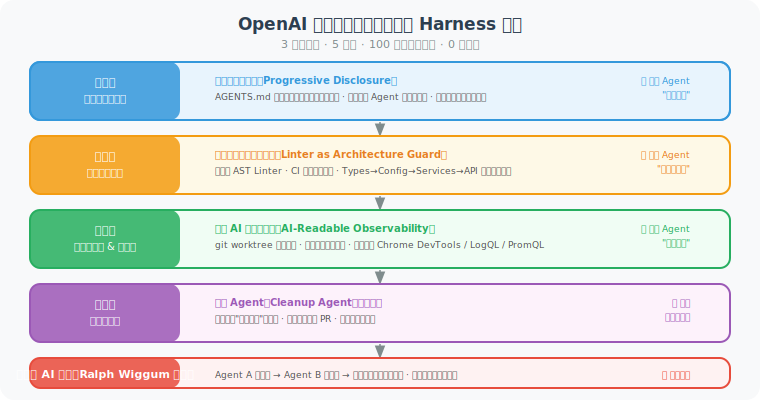
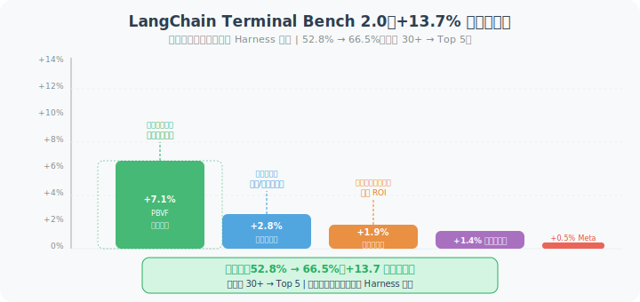

# 9.4 生产级案例：OpenAI、LangChain、Stripe

> 📊 *"理论解释不了实践。让我们看看那些真实交付了百万行代码、成百上千个 PR 的工程团队是怎么做的。"*

---

本节深入分析三个已在生产环境中验证的 Harness Engineering 案例。这三个案例覆盖了不同的应用场景：

- **OpenAI**：从零搭建完整 Harness 架构，5 个月交付 100 万行代码
- **LangChain**：纯 Harness 优化，不换模型，基准测试提升 +13.7%
- **Stripe**：大规模自动化技术债清理，每周合并 1000+ PR

---

## 案例一：OpenAI 百万行代码实验

### 背景与成果

**团队规模**：3 名工程师（+ AI Agent）  
**时间周期**：5 个月  
**产出代码**：约 100 万行生产代码  
**手写代码**：0 行（人类工程师零手写代码）  
**实现速度**：约为传统开发方式的 1/10 成本  

这不是一个 POC（概念验证），而是真实的、已部署到生产环境的代码。

### 核心架构：五层 Harness 系统

OpenAI 团队构建了一套精密的五层 Harness 架构，每一层都明确回答了一个工程问题：



五层架构形成了一个**从上而下的约束体系**：
- **第一层**（知识体系）解决"Agent 不了解项目"的问题
- **第二层**（架构约束）解决"Agent 破坏既有架构"的问题
- **第三层**（运行时验证）解决"Agent 无法自我诊断"的问题
- **第四层**（自修复闭环）解决"技术债快速积累"的问题
- **第五层**（AI 互审）解决"人工审查成本过高"的问题

> 💡 **关键洞察**：这五层的顺序很重要——上层约束越清晰，Agent 在下层的自主性就越高。正如 OpenAI 团队总结的："为了获得更高的 AI 自主性，运行时必须受到更严格的约束。"

#### 第一层：渐进式知识体系

关键创新是**"文档目录而非文档全文"**：

```markdown
# AGENTS.md（OpenAI 内部实践风格）

## 项目架构
→ 见 docs/architecture-overview.md（约 200 行，架构全景）
→ 见 docs/domain-model.md（核心领域概念）
→ 见 docs/api-contracts.md（服务间接口规范）

## 模块指南
→ 见 src/payments/AGENTS.md（支付模块）
→ 见 src/users/AGENTS.md（用户模块）
→ 见 src/notifications/AGENTS.md（通知模块）

## 开发工作流
运行 `make dev-guide` 查看完整的开发流程指南
```

同时，他们引入了 **"文档园丁 Agent"**（Doc Gardener）：

```python
class DocGardenerAgent:
    """
    自动维护文档与代码的一致性
    
    每次 PR 合并后运行，检查：
    1. 新增/修改的函数是否有对应文档
    2. 文档中的接口描述是否与代码一致
    3. AGENTS.md 中的文件引用是否仍然有效
    """
    
    def post_merge_check(self, pr_diff: dict) -> list:
        issues = []
        
        for file_change in pr_diff['changed_files']:
            # 检查新增的公共函数是否有文档
            new_public_funcs = extract_new_public_functions(file_change)
            for func in new_public_funcs:
                if not has_docstring(func) or not has_doc_reference(func):
                    issues.append(DocIssue(
                        type="missing_doc",
                        location=func.location,
                        suggestion=f"函数 {func.name} 缺少文档字符串"
                    ))
        
        # 自动创建修复 PR
        if issues:
            self.create_doc_fix_pr(issues)
        
        return issues
```

#### 第二层：架构约束体系

OpenAI 将架构规则编码为 **Linter 规则**，这样无论是人还是 AI 写的代码，都必须遵守：

```python
# 自定义 Linter 规则示例（基于 AST 分析）
import ast
from typing import Generator

class LayerDependencyChecker(ast.NodeVisitor):
    """
    检查模块依赖是否符合分层架构规则
    
    规则：api/ 不能直接导入 models/，必须通过 services/
    """
    
    LAYER_ORDER = {
        "models": 0,
        "repositories": 1,
        "services": 2,
        "api": 3,
    }
    
    def __init__(self, current_file_layer: str):
        self.current_layer = self.LAYER_ORDER.get(current_file_layer, -1)
        self.violations = []
    
    def visit_Import(self, node: ast.Import) -> None:
        for alias in node.names:
            self._check_import(alias.name, node.lineno)
    
    def visit_ImportFrom(self, node: ast.ImportFrom) -> None:
        if node.module:
            self._check_import(node.module, node.lineno)
    
    def _check_import(self, module_name: str, lineno: int) -> None:
        """检查导入是否跨层"""
        for layer_name, layer_order in self.LAYER_ORDER.items():
            if f".{layer_name}." in module_name or module_name.startswith(f"{layer_name}."):
                if layer_order < self.current_layer - 1:
                    self.violations.append(
                        f"Line {lineno}: {self.current_layer_name} 不能直接导入 {layer_name}/"
                    )


def run_architecture_check(project_dir: str) -> list:
    """在 CI 中运行架构检查"""
    violations = []
    
    for py_file in Path(project_dir).rglob("*.py"):
        # 确定当前文件所在的层
        layer = identify_layer(py_file)
        if not layer:
            continue
        
        with open(py_file) as f:
            tree = ast.parse(f.read())
        
        checker = LayerDependencyChecker(layer)
        checker.visit(tree)
        violations.extend(checker.violations)
    
    return violations
```

#### 第三层：运行时可观测性

OpenAI 团队的关键洞察：**可观测性不只是"给人看"，更是"给 AI 看"。**

```python
class AgentObservabilityLayer:
    """
    为 Agent 提供机器可读的运行时信息
    
    传统日志：给人类调试用，格式冗长
    Agent 日志：格式化、结构化，Agent 可以直接解析和推理
    """
    
    def get_runtime_context(self) -> str:
        """
        返回 Agent 可以直接理解的运行时状态
        
        这会被注入到 Agent 的初始上下文中
        """
        return f"""
## 当前运行环境

**工作目录**：{self.get_cwd()}
**Git 状态**：{self.get_git_status()}
**可用工具**：{', '.join(self.get_available_tools())}
**环境变量**：{self.get_safe_env_vars()}
**超时时间**：{self.timeout_seconds} 秒

## 快速诊断命令
- 运行测试：`pytest tests/ -v --tb=short`
- 查看日志：`tail -100 logs/app.log | grep ERROR`
- 检查服务状态：`curl http://localhost:8000/health`
"""
    
    def get_git_status(self) -> str:
        """返回简洁的 git 状态"""
        result = subprocess.run(['git', 'status', '--short'], capture_output=True, text=True)
        lines = result.stdout.strip().split('\n')
        if not lines or lines == ['']:
            return "干净（无未提交更改）"
        return f"{len(lines)} 个文件已修改"
```

#### 第四层：自修复闭环

```python
class CleanupAgent:
    """
    清洁 Agent：后台持续运行，对抗技术债累积
    
    OpenAI 实践：这个 Agent 每天自动提交多个"清洁 PR"，
    保持代码库的"黄金标准"状态
    """
    
    def daily_cleanup(self) -> list:
        """每天运行的清洁任务"""
        cleanup_tasks = []
        
        # 扫描偏离"黄金标准"的代码
        deviations = self.scan_deviations()
        
        for deviation in deviations:
            if deviation.auto_fixable and deviation.risk_level == "low":
                # 自动修复并提交 PR
                fix = self.generate_fix(deviation)
                pr = self.create_pr(
                    title=f"[Cleanup] {deviation.description}",
                    changes=fix,
                    description=f"""
## 自动清洁 PR

**问题**：{deviation.description}
**位置**：{deviation.location}
**修复方式**：{deviation.fix_description}
**风险评级**：低风险（自动清洁）

此 PR 由 CleanupAgent 自动生成。如有疑问请 @cleanup-agent-team。
""",
                )
                cleanup_tasks.append(pr)
        
        return cleanup_tasks
    
    def scan_deviations(self) -> list:
        """扫描与黄金标准的偏差"""
        deviations = []
        
        # 检查命名不规范的函数
        for func in self.repo.get_all_functions():
            if not is_snake_case(func.name):
                deviations.append(Deviation(
                    type="naming",
                    description=f"函数名不符合 snake_case: {func.name}",
                    location=func.location,
                    auto_fixable=True,
                    risk_level="low",
                ))
        
        # 检查缺少类型注解的公共函数
        for func in self.repo.get_public_functions():
            if not func.has_type_hints:
                deviations.append(Deviation(
                    type="type_hints",
                    description=f"公共函数缺少类型注解: {func.name}",
                    location=func.location,
                    auto_fixable=False,  # 需要人工判断类型
                    risk_level="medium",
                ))
        
        return deviations
```

#### 第五层："Ralph Wiggum 循环"——AI 互审

```python
class RalphWiggumLoop:
    """
    AI 互审循环（OpenAI 内部称为 "Ralph Wiggum 循环"）
    
    Agent A（写代码）→ Agent B（审代码）→ 人类（架构级决策）
    
    效果：日常代码审查完全自动化，人类只介入高层设计决策
    """
    
    def __init__(self, writer_agent, reviewer_agent):
        self.writer = writer_agent
        self.reviewer = reviewer_agent
    
    def execute_with_review(self, task: str) -> dict:
        # Step 1: 写代码
        code_output = self.writer.execute(task)
        
        # Step 2: AI 自动审查
        review = self.reviewer.review(
            code=code_output.changes,
            task_description=task,
            review_checklist=[
                "是否符合架构分层规则？",
                "是否有适当的错误处理？",
                "是否有足够的测试覆盖？",
                "是否有硬编码的值（应该是常量或配置）？",
                "是否有明显的性能问题？",
            ]
        )
        
        if review.has_blocking_issues:
            # 让写代码的 Agent 修复审查发现的问题
            fixed_output = self.writer.fix(
                original=code_output,
                review_comments=review.blocking_issues,
            )
            return self.execute_with_review.__wrapped__(task, fixed_output)
        
        return {
            "code": code_output,
            "review": review,
            "ready_for_merge": not review.has_blocking_issues,
        }
```

### 关键经验总结

```
OpenAI 百万行代码实验的核心经验（来自官方复盘）：

1. "遇到问题，修改系统，而不是修改代码"
   → 每次 Agent 犯错，首先问：是 Harness 的哪个部分失效了？

2. "代码库就是 Agent 宪法"  
   → 所有规则必须以代码（Linter、测试）而非文字存在

3. "可观测性必须面向 AI"
   → 日志、错误信息的格式要让 Agent 能直接理解和推理

4. "约束越严，自主性越高"
   → 护栏越清晰，Agent 越敢于在边界内大胆行动
```

---

## 案例二：LangChain Terminal Bench 2.0 优化

### 背景与成果

**目标**：在不更换模型、不微调的前提下，纯通过 Harness 改进提升基准测试成绩。  
**基准测试**：Terminal Bench 2.0（评估 Agent 自主完成软件工程任务的能力）  
**起始成绩**：52.8%（排名 30 名之外）  
**最终成绩**：66.5%（排名前 5）  
**提升幅度**：+13.7 个百分点  

**所有提升均来自 Harness 改进，零模型切换，零微调。**

### 五项关键 Harness 改进

#### 改进 1：Plan-Build-Verify-Fix 强制循环（贡献：+7.1%）

```python
class TerminalBenchHarness:
    """
    LangChain Terminal Bench 2.0 优化的 Harness 实现
    """
    
    SYSTEM_PROMPT_ADDITION = """
【强制工作流程】你必须按以下步骤完成每项任务：

步骤 1【规划】：
  分析任务要求，列出需要修改的文件和具体修改内容
  
步骤 2【实现】：
  按计划逐项实现

步骤 3【验证】（这步是强制的，不可跳过！）：
  - 运行相关测试：`pytest [相关测试路径] -v`
  - 对照原始任务描述逐项核查
  - 检查是否有遗漏的边缘情况

步骤 4【修复】（如果步骤3发现问题）：
  - 修复发现的问题
  - 重新执行步骤3

只有当步骤3全部通过后，才能声明任务完成。
"""
```

> 📊 **数据洞察**：仅仅是强制执行验证步骤，就贡献了 +7.1 个百分点的提升。这证明了大量的 Agent 失败根本原因是：**声称完成但实际未完成验证**。

#### 改进 2：推理三明治策略（贡献：+2.8%）

```python
class ReasoningBudgetStrategy:
    """
    推理预算三明治：
    
    ┌─────────────────┐
    │   高推理预算     │  ← 规划阶段（需要深度分析）
    ├─────────────────┤
    │   中等推理预算   │  ← 实现阶段（按计划执行）
    ├─────────────────┤
    │   高推理预算     │  ← 验证修复阶段（需要深度分析）
    └─────────────────┘
    
    关键发现：全程使用高推理预算反而会降低性能！
    原因：规划阶段消耗了太多推理 token，
          导致实现阶段超时或质量下降。
    """
    
    def get_budget_for_phase(self, phase: str) -> str:
        budgets = {
            "planning": "high",       # 思考越深越好
            "implementation": "low",  # 按计划执行，无需深思
            "verification": "high",   # 需要仔细检查
            "bug_fixing": "high",     # 需要深度分析
        }
        return budgets.get(phase, "medium")
    
    def build_phase_prompt(self, phase: str, context: str) -> dict:
        """为不同阶段构建带有推理预算提示的消息"""
        budget = self.get_budget_for_phase(phase)
        
        budget_instructions = {
            "high": "请深入思考，考虑所有可能的边缘情况和潜在问题。",
            "medium": "请正常思考并执行。",
            "low": "请高效执行，不需要过多思考，按计划完成即可。",
        }
        
        return {
            "role": "user",
            "content": f"{budget_instructions[budget]}\n\n{context}"
        }
```

#### 改进 3：环境上下文注入（贡献：+1.9%）

```python
class EnvironmentContextInjector:
    """
    启动时注入环境上下文
    
    问题：Agent 在每次任务开始时都需要"搞清楚自己在哪"，
          这会浪费宝贵的上下文空间和推理时间。
    
    解决：一次性注入完整的环境信息，Agent 直接使用。
    """
    
    def build_startup_context(self, workspace: str) -> str:
        """构建 Agent 启动时需要的完整环境上下文"""
        
        # 项目结构概览（只到三级目录）
        structure = get_directory_tree(workspace, max_depth=3)
        
        # 可用工具清单
        tools = get_available_tools()
        
        # 任务超时时间
        timeout = get_task_timeout()
        
        return f"""
## 工作环境信息（请直接使用，无需重新探索）

**工作目录**：`{workspace}`

**项目结构**：
```
{structure}
```

**可用工具**：
{chr(10).join(f"- `{t.name}`: {t.description}" for t in tools)}

**任务时间限制**：{timeout} 秒（请合理安排时间）

**快速参考**：
- 运行测试：`pytest tests/ -v`
- 代码格式化：`ruff format .`
- 类型检查：`mypy src/`
"""
```

#### 改进 4：死循环检测中间件（贡献：+1.4%）

```python
class LoopDetectionMiddleware:
    """
    死循环检测：在 Agent 和工具调用之间插入的拦截层
    
    监控：同一文件的重复编辑次数
    触发：超过阈值后自动注入"换个思路"的提示
    """
    
    def __init__(self, threshold: int = 3):
        self.edit_counts = defaultdict(int)
        self.threshold = threshold
    
    def intercept_tool_call(self, tool_name: str, params: dict) -> dict:
        """拦截工具调用，检测潜在死循环"""
        
        if tool_name in ("write_file", "edit_file", "apply_patch"):
            file_path = params.get("path", "unknown")
            self.edit_counts[file_path] += 1
            
            if self.edit_counts[file_path] > self.threshold:
                # 注入"重新思考"提示，而不是直接拒绝执行
                params["_harness_injection"] = f"""
⚠️ 注意：你已经对 `{file_path}` 进行了 {self.edit_counts[file_path]} 次修改。
反复修改同一文件可能表明你陷入了循环。

请考虑：
1. 问题的根本原因是否在其他地方（而不是这个文件）？
2. 是否需要先阅读相关的测试文件，理解预期行为？
3. 是否有更简单的解决方案？

如果 3 次尝试都失败，请报告问题并请求人工协助，而不是继续尝试。
"""
        
        return params
```

#### 改进 5：Meta 层自动化（贡献：+0.5%，但复利效应显著）

```python
class TraceAnalyzer:
    """
    Trace 分析器：分析失败案例，自动提出 Harness 改进建议
    
    这是 Harness 系统的"自我进化"机制——
    每次 Agent 失败，都是一次改进 Harness 的机会。
    """
    
    def analyze_failure_batch(self, failed_traces: list) -> list:
        """分析一批失败案例，提取改进建议"""
        
        # 对失败案例进行模式分析
        patterns = self._cluster_failures(failed_traces)
        
        suggestions = []
        for pattern in patterns:
            if pattern.count >= 3:  # 同一类型失败 3 次以上才处理
                suggestion = self._generate_harness_fix(pattern)
                suggestions.append(suggestion)
        
        return suggestions
    
    def _generate_harness_fix(self, failure_pattern) -> dict:
        """为某类失败模式生成 Harness 修复建议"""
        
        prompt = f"""
以下是 {failure_pattern.count} 个相似的 Agent 失败案例：

失败模式摘要：{failure_pattern.summary}
典型失败步骤：{failure_pattern.common_failure_steps}

请分析：
1. 这类失败的根本原因是什么？
2. 应该在 Harness 的哪个层面（上下文架构/约束/验证循环）进行修复？
3. 具体的修复方案是什么（代码或配置层面）？
"""
        
        analysis = model.analyze(prompt)
        return {
            "pattern": failure_pattern.summary,
            "root_cause": analysis.root_cause,
            "harness_layer": analysis.harness_layer,
            "fix_proposal": analysis.fix_proposal,
        }
```

### LangChain 案例的核心启示



从上图可以清晰看出五项 Harness 改进的贡献量级：

- **最大单项贡献**：强制验证循环（Plan-Build-Verify-Fix）贡献了 +7.1%，超过了其他四项的总和。这说明**"让 Agent 真正验证自己的工作"**是最有价值的单项改进。
- **最高 ROI（投入回报比）**：环境上下文注入（+1.9%）改动最小（几十行代码），却带来了显著效果，是"低垂的果实"。
- **长期复利价值最高**：Meta 层自动化（+0.5%）看起来贡献最小，但它是持续改进的**引擎**——每次失败都自动提炼改进建议，使 Harness 系统随时间不断进化。

```
+13.7% 的提升分布：

验证强制循环（+7.1%）  ▓▓▓▓▓▓▓▓▓▓▓▓▓▓▓▓▓▓▓▓▓▓▓▓▓
推理预算策略（+2.8%）  ▓▓▓▓▓▓▓▓▓▓
环境上下文（+1.9%）    ▓▓▓▓▓▓▓
死循环检测（+1.4%）    ▓▓▓▓▓
Meta 自动化（+0.5%）   ▓▓
```

---

## 案例三：Stripe Minions——每周 1000+ PR

### 背景与成果

Stripe 构建了一个名为 **"Minions"** 的多 Agent 系统，专门处理大规模技术债清理：

- **每周自动合并 PR 数量**：1,000+
- **主要工作内容**：技术债清理、依赖版本更新、代码规范对齐
- **人工审查介入率**：<5%（95% 的 PR 自动合并）

### 系统架构

```python
class StripeMinionsSystem:
    """
    Stripe Minions 系统架构（基于公开信息复现）
    
    核心设计：高度结构化的任务分配 + 严格的审查流程
    """
    
    def __init__(self):
        self.task_queue = PriorityQueue()
        self.worker_pool = MinionPool(size=20)  # 并发运行的小 Agent
        self.reviewer = CodeReviewAgent()
        self.merger = AutoMergeBot()
    
    def process_tech_debt_backlog(self, repo: Repository) -> None:
        """处理技术债积压"""
        
        # Step 1: 识别和分类技术债
        tasks = self._identify_tasks(repo)
        
        for task in tasks:
            # Step 2: 分发给对应专长的 Minion
            minion = self.worker_pool.get_specialized_minion(task.type)
            
            # Step 3: 每个 Minion 的任务范围严格限定
            result = minion.execute(
                task=task,
                constraints={
                    "max_files_changed": 5,      # 每个 PR 最多改 5 个文件
                    "max_lines_changed": 100,    # 最多改 100 行
                    "forbidden_changes": [        # 禁止的变更类型
                        "breaking_api_changes",
                        "database_schema_changes",
                        "security_related_code",
                    ],
                }
            )
            
            # Step 4: 严格的审查清单
            review = self.reviewer.check(result, checklist=[
                "是否仅包含声明类型的变更？",
                "是否有完整的测试覆盖？",
                "是否通过了所有 CI 检查？",
                "变更范围是否超出了任务描述？",
                "是否有任何安全相关的改动？",
            ])
            
            if review.all_passed:
                self.merger.auto_merge(result.pr)
            else:
                # 发送给人工审查
                self.escalate_to_human(result.pr, review.failed_checks)
    
    def _identify_tasks(self, repo: Repository) -> list:
        """扫描仓库，生成结构化任务列表"""
        tasks = []
        
        # 任务类型 1：依赖版本更新
        outdated_deps = repo.get_outdated_dependencies()
        for dep in outdated_deps:
            tasks.append(MinionTask(
                type="dependency_update",
                description=f"更新 {dep.name} 从 {dep.current} 到 {dep.latest}",
                priority="low",
                estimated_complexity="simple",
            ))
        
        # 任务类型 2：Lint 规范对齐
        lint_violations = repo.get_lint_violations()
        # 按文件聚合，一个文件一个 PR
        for file_path, violations in group_by_file(lint_violations).items():
            tasks.append(MinionTask(
                type="lint_fix",
                description=f"修复 {file_path} 中的 {len(violations)} 个 Lint 问题",
                priority="medium",
                estimated_complexity="simple",
                target_file=file_path,
            ))
        
        return sorted(tasks, key=lambda t: t.priority)
```

### Stripe 案例的核心启示

```python
stripe_minions_learnings = {
    "任务原子化": """
        每个 Minion 只做一件非常具体的事（如"更新这一个文件的依赖版本"），
        而不是"清理整个项目的依赖"。
        
        原子化的好处：
        - 失败的范围被严格限制
        - 审查更容易（改动小，上下文清晰）
        - 并发性更高（互不干扰）
    """,
    
    "审查清单优先于人工判断": """
        人工审查者容易疲劳，容易遗漏。
        机器执行清单不会遗漏，但需要清单写得足够好。
        
        Stripe 的审查清单非常具体，每一条都能被机器验证。
    """,
    
    "高频小 PR 优于低频大 PR": """
        每周 1000 个只改 1-5 个文件的 PR，
        优于每月 100 个改 50+ 个文件的 PR。
        
        原因：
        - 小 PR 更容易审查和理解
        - 问题被快速发现和隔离
        - 减少合并冲突
    """,
    
    "自动合并需要极高的信心门槛": """
        Stripe 不是"尝试自动合并"，而是"除非有任何疑问否则自动合并"。
        这要求前置的验证体系必须非常完善。
    """,
}
```

---

## 三大案例横向对比

| 维度 | OpenAI | LangChain | Stripe |
|------|--------|-----------|--------|
| **核心目标** | 从零交付大量代码 | 提升基准测试成绩 | 大规模清理技术债 |
| **Harness 重点** | 完整五层架构 | 验证循环 + 推理预算 | 任务原子化 + 审查清单 |
| **规模** | 100 万行代码 / 5 个月 | 52.8% → 66.5% 提升 | 1000+ PR / 周 |
| **关键创新** | AI 互审、文档园丁 | 推理三明治、死循环检测 | 原子化任务分配 |
| **最大挑战** | 维护知识体系同步 | 完成偏见 | 审查清单的覆盖率 |
| **适用场景** | 大型产品开发 | 任务型 Agent 优化 | 维护型自动化 |

---

## 本节小结

这三个案例共同揭示了 Harness Engineering 的几个**普适规律**：

1. **验证比生成更重要**：Agent 花在"声称完成"上的时间，远多于花在"真正验证完成"上的时间。强制验证是投入最小、收益最大的 Harness 改进。

2. **系统思维 > 个例修复**：每次发现 Agent 犯错，先问"是系统的哪个部分失效了"，而不是"这个具体 Prompt 怎么改"。

3. **约束是自由的前提**：清晰的边界（架构约束、工具白名单、任务范围限制）让 Agent 在边界内更加自信和高效。

4. **持续迭代，永不止步**：最好的 Harness 不是一次性设计的，而是通过不断分析失败案例、持续改进而来的。

---

## 参考资料

[1] OPENAI ENGINEERING TEAM. Harness engineering: leveraging Codex in an engineering organization[EB/OL]. OpenAI Blog, 2026-02.

[2] LANGCHAIN TEAM. From 52.8% to 66.5% on Terminal Bench 2.0: a harness engineering case study[EB/OL]. LangChain Blog, 2026-01.

[3] STRIPE ENGINEERING. Minions: autonomous agents for technical debt reduction[EB/OL]. Stripe Engineering Blog, 2025-12.

---

*下一节：[9.5 实战：构建你的第一个 Harness 系统](./05_practice_harness_builder.md)*
