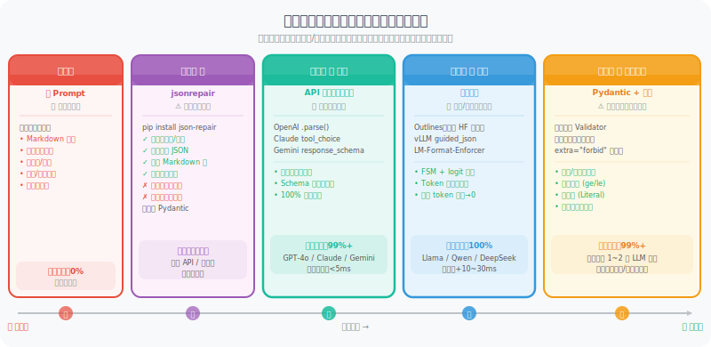

# 9.6 结构化输出：保障 JSON 可靠性的工程实践

> 🔩 *"Agent 输出一个无法解析的 JSON，下游整个流水线就崩了。这不是模型问题——这是你的 Harness 没做好。"*

---

## 为什么 JSON 可靠性是 Harness 问题？

在 Agent 系统中，JSON 是模块间通信的通用语言：工具调用的参数、结构化分析结果、多 Agent 消息传递……无处不在。

但模型并不"天然"保证输出合法 JSON。即便你在 Prompt 里写了 `请输出 JSON`，生产环境中仍会遇到：

```
# 模型实际输出的各种"意外"

✗ 有 Markdown 包裹：```json { "key": "value" } ```
✗ 末尾多余文字：{"key": "value"} 以上是分析结果
✗ 单引号代替双引号：{'key': 'value'}
✗ 注释（JSON 不支持）：{"key": "value" // 这是注释}
✗ 数值字段输出字符串：{"count": "3"} 而非 {"count": 3}
✗ 幻觉字段：模型加了 Schema 中不存在的字段
✗ 截断输出：上下文不足时输出被截断，JSON 未闭合
```

每一种情况都会让 `json.loads()` 抛出异常，进而触发下游连锁故障。

**从 Harness 视角看**，这是**支柱二（架构约束）**的核心应用场景：不能依赖"模型会自律地输出正确 JSON"，而要用工程机制**强制保证**输出格式。

---

## 五种方案的演进路径

```
软约束（不推荐）         后处理修复          硬约束（推荐）
──────────────────────────────────────────────────────────────────
Prompt 说"请输出JSON"  →  jsonrepair  →  API 结构化输出  →  约束解码
                          （容错兜底）      （服务端强制）    （Token级强制）
```

下图展示了五种方案的技术路线和适用场景：



---

## 方案一：纯 Prompt 约束（软约束，不推荐）

```python
# ❌ 反例：仅靠 Prompt 约束
system_prompt = """
你是一个数据提取助手。请将用户输入解析为以下 JSON 格式：
{
  "name": "姓名",
  "age": 年龄（数字）,
  "email": "邮箱"
}
请确保输出有效的 JSON，不要加任何其他内容。
"""

# 问题：
# 1. 模型可能在 JSON 外加说明文字
# 2. 复杂 Schema 下字段类型错误率高
# 3. 无法处理嵌套结构中的幻觉字段
# 4. 模型不同版本/温度下表现不一致

# 如果一定要用，至少加后处理：
import json, re

def extract_json_from_text(text: str) -> dict:
    """
    从模型输出中尽力提取 JSON（最后防线，不应依赖此法）
    按优先级尝试多种解析策略
    """
    # 策略1：直接解析
    try:
        return json.loads(text.strip())
    except json.JSONDecodeError:
        pass
    
    # 策略2：提取 ```json ... ``` 代码块
    md_match = re.search(r'```(?:json)?\s*(\{.*?\})\s*```', text, re.DOTALL)
    if md_match:
        try:
            return json.loads(md_match.group(1))
        except json.JSONDecodeError:
            pass
    
    # 策略3：提取第一个 { ... } 块
    brace_match = re.search(r'\{[^{}]*(?:\{[^{}]*\}[^{}]*)?\}', text, re.DOTALL)
    if brace_match:
        try:
            return json.loads(brace_match.group())
        except json.JSONDecodeError:
            pass
    
    raise ValueError(f"无法从输出中提取有效 JSON: {text[:200]}")
```

> ⚠️ **何时可以接受软约束**：简单的单字段输出、原型验证阶段。  
> **不可接受的场景**：生产环境、复杂 Schema、需要类型精确的下游处理。

---

## 方案 1.5：jsonrepair——专为 LLM 输出设计的 JSON 修复库

在无法使用硬约束（旧版 API、本地小模型、已有历史代码迁移成本高）时，`json-repair` 是比手写正则**健壮得多**的容错兜底方案。

### 它能修复什么？

`json-repair` 专门针对 LLM 的典型输出问题，能处理所有手写正则难以覆盖的场景：

| 问题类型 | 原始输出示例 | 修复后 |
|---------|------------|--------|
| Markdown 代码块 | `` ```json {"k": 1}``` `` | `{"k": 1}` |
| 末尾多余文字 | `{"k": 1} 这是结果` | `{"k": 1}` |
| 单引号键值 | `{'key': 'value'}` | `{"key": "value"}` |
| 行内注释 | `{"k": 1 // 注释}` | `{"k": 1}` |
| 截断 JSON | `{"name": "张三", "age":` | `{"name": "张三", "age": null}` |
| 缺少引号 | `{name: "张三"}` | `{"name": "张三"}` |
| 末尾逗号 | `{"k": 1,}` | `{"k": 1}` |
| 数组截断 | `["a", "b",` | `["a", "b"]` |
| 混合 Python 字面量 | `{"flag": True, "val": None}` | `{"flag": true, "val": null}` |

### 安装与基本使用

```python
# pip install json-repair
from json_repair import repair_json
import json

# ── 基本使用：直接替代 json.loads ──
broken_json = """```json
{
  "name": "张三",
  'age': 28,   // 年龄
  "email": "zhangsan@example.com",
"""

# repair_json 返回修复后的 JSON 字符串
fixed_str = repair_json(broken_json)
data = json.loads(fixed_str)
# {"name": "张三", "age": 28, "email": "zhangsan@example.com"}

# ── 或者直接返回 Python 对象 ──
data = repair_json(broken_json, return_objects=True)
print(type(data))  # <class 'dict'>
print(data["name"])  # "张三"
```

### 与 Pydantic 验证组合

`jsonrepair` 最佳用法是作为 `json.loads()` 和 Pydantic 验证之间的"修复层"：

```python
from json_repair import repair_json
from pydantic import BaseModel, ValidationError
import json

class OrderInfo(BaseModel):
    order_id: str
    amount: float
    status: str
    items: list[str]

def safe_parse(raw_text: str, model_class: type[BaseModel]) -> BaseModel:
    """
    带 jsonrepair 的健壮解析流程：
    
    原始文本
      ↓ repair_json（修复格式错误）
      ↓ json.loads（解析为 Python dict）
      ↓ Pydantic.model_validate（类型验证 + 业务规则）
      ↓ 结构化对象
    """
    # Step 1: jsonrepair 修复格式
    try:
        fixed = repair_json(raw_text)
    except Exception as e:
        raise ValueError(f"jsonrepair 无法处理此输入: {e}")
    
    # Step 2: 解析为 Python 对象
    try:
        data = json.loads(fixed)
    except json.JSONDecodeError as e:
        raise ValueError(f"修复后仍无法解析: {fixed[:100]}\n错误: {e}")
    
    # Step 3: Pydantic 类型验证（包含业务规则）
    try:
        return model_class.model_validate(data)
    except ValidationError as e:
        raise ValueError(
            f"结构验证失败（JSON 格式正确但字段不符合 Schema）:\n{e}"
        )

# 使用：处理模型输出的各种畸形 JSON
raw_outputs = [
    "```json\n{'order_id': 'ORD-001', 'amount': 99.9, 'status': '已支付', 'items': ['商品A']}\n```",
    '{"order_id": "ORD-002", "amount": 150, "status": "待发货", "items": ["商品B", "商品C"],}',
    '{"order_id": "ORD-003", "amount": 200.0, "status": "已发货", "items": ["商品D"]  // 快递单号已生成',
]

for raw in raw_outputs:
    order = safe_parse(raw, OrderInfo)
    print(f"✅ 解析成功: {order.order_id}, ¥{order.amount}")
```

### 处理截断输出（上下文溢出场景）

这是 `jsonrepair` 最大的优势之一——当模型因上下文限制输出被截断时，它会**智能补全缺失的结构**：

```python
from json_repair import repair_json

# 模拟：模型输出被截断（上下文 token 用尽）
truncated_outputs = [
    # 对象截断
    '{"name": "张三", "age": 28, "address": {"city": "北京", "district": "朝阳',
    # 数组截断
    '["苹果", "香蕉", "橙子", "葡萄',
    # 嵌套截断
    '{"users": [{"id": 1, "name": "张三"}, {"id": 2, "name": "李四"}, {"id": 3',
]

for truncated in truncated_outputs:
    repaired = repair_json(truncated, return_objects=True)
    print(f"原始（截断）: {truncated[:50]}...")
    print(f"修复结果:    {repaired}")
    print()

# 输出：
# 原始（截断）: {"name": "张三", "age": 28, "address": {"city": "北京", "district": "朝阳...
# 修复结果:    {'name': '张三', 'age': 28, 'address': {'city': '北京', 'district': '朝阳'}}
#
# 原始（截断）: ["苹果", "香蕉", "橙子", "葡萄...
# 修复结果:    ['苹果', '香蕉', '橙子', '葡萄']
#
# 原始（截断）: {"users": [{"id": 1, "name": "张三"}, {"id": 2, "name": "李四"}, {"id": 3...
# 修复结果:    {'users': [{'id': 1, 'name': '张三'}, {'id': 2, 'name': '李四'}, {'id': 3}]}
```

### jsonrepair 的局限性

`jsonrepair` **不是万能的**，了解它的边界很重要：

```python
from json_repair import repair_json

# ❌ jsonrepair 无法解决的问题：类型错误
wrong_types = '{"age": "二十八", "score": "优秀"}'  # 字符串而非数字
result = repair_json(wrong_types, return_objects=True)
# → {'age': '二十八', 'score': '优秀'}  ← 类型仍然错误，需要 Pydantic 验证

# ❌ jsonrepair 无法解决的问题：幻觉字段
hallucinated = '{"name": "张三", "age": 28, "非Schema字段": "幻觉值"}'
result = repair_json(hallucinated, return_objects=True)
# → 幻觉字段仍然存在，需要 extra="forbid" 拦截

# ❌ jsonrepair 无法解决的问题：语义错误
semantic_error = '{"status": "已完成未完成"}'  # 语义矛盾
# → jsonrepair 会保留，需要业务逻辑 validator 处理

# ✅ 正确姿势：jsonrepair + Pydantic 双层防守
from pydantic import BaseModel, ConfigDict

class StrictUser(BaseModel):
    model_config = ConfigDict(extra="forbid")  # 阻止幻觉字段
    name: str
    age: int       # Pydantic 会把 "二十八" 转换失败，触发错误

# jsonrepair 修复格式 → Pydantic 验证类型+业务规则 = 完整防线
```

> 💡 **jsonrepair 的定位**：它是**格式修复层**，不是**语义验证层**。正确的分工是：
> - `jsonrepair`：修复 JSON 语法错误（括号、引号、逗号、截断）
> - `Pydantic`：验证字段类型、值范围、业务规则
> - 两者缺一不可。

### 与其他方案的协作位置

```
┌─────────────────────────────────────────────────────────────┐
│           完整的 JSON 解析防线（推荐叠加顺序）               │
│                                                             │
│  模型输出原始文本                                            │
│       ↓                                                     │
│  ① jsonrepair.repair_json()   ← 修复格式错误、截断          │
│       ↓                                                     │
│  ② json.loads()               ← 转为 Python 对象            │
│       ↓                                                     │
│  ③ Pydantic.model_validate()  ← 类型验证 + 业务规则         │
│       ↓ （失败）                                            │
│  ④ 携带错误上下文重试          ← 最多 2~3 次                 │
│       ↓                                                     │
│  结构化对象（类型安全）                                       │
└─────────────────────────────────────────────────────────────┘
```

---

## 方案二：API 原生结构化输出（推荐，首选）

2024—2026 年，主流模型 API 都原生支持结构化输出，这是**最简单可靠的方案**。

### 原理：为什么 API 能保证 JSON 格式？

API 原生结构化输出的底层机制是**服务端约束解码**：在模型生成每个 token 时，API 服务器会根据你提供的 JSON Schema 构建一个**有限状态机（FSM）**，然后实时屏蔽不符合当前状态的 token。

举个直觉例子：当模型已经生成了 `{"age":` ，JSON Schema 要求 `age` 是整数，那么下一个 token 的候选范围只有 `0-9`、`-`（负号）和空格——所有字母、引号、布尔值的 token 概率被强制设为 0。这意味着**模型物理上不可能输出类型错误的值**。

与纯 Prompt 方式的本质区别在于：
- **Prompt 约束**是在输入端告诉模型"你应该做什么"——模型可以选择遵守，也可以不遵守
- **约束解码**是在输出端控制模型"你只能做什么"——模型连违反规则的选项都没有

三大厂商的实现方式略有不同：

| 厂商 | 机制 | 调用方式 | Schema 来源 | 发布时间 |
|------|------|---------|------------|---------|
| **OpenAI** | 原生约束解码 | `response_format=PydanticModel` | 自动从 Pydantic 转换 | 2024.08 |
| **Anthropic** | 工具调用语义等价 | `tool_choice` 强制工具 | Pydantic → JSON Schema → Tool | 2024.04 |
| **Google** | 原生约束解码 | `response_schema=PydanticModel` | 自动从 Pydantic 转换 | 2024.10 |

**选型建议**：
- 如果使用 OpenAI 或 Gemini，直接传 Pydantic 类最简洁
- 如果使用 Claude，通过"定义一个工具 + 强制调用该工具"来间接实现结构化输出
- 三者的保证强度相同（都能 100% 保证 JSON 格式合法），但 Claude 的方式额外消耗一次工具调用的 token

下面分别展示三大平台的代码。

### OpenAI Structured Outputs（2024.08+）

OpenAI 的实现最为直接——只需把 Pydantic 类传给 `response_format` 参数，返回值直接是 Pydantic 对象：

```python
from openai import OpenAI
from pydantic import BaseModel, Field
from typing import Optional, Literal

client = OpenAI()

# ── 用 Pydantic 定义 Schema ──
class PersonInfo(BaseModel):
    name: str = Field(description="姓名")
    age: int = Field(description="年龄，必须为正整数", ge=0, le=150)
    email: Optional[str] = Field(default=None, description="邮箱地址")
    gender: Literal["male", "female", "unknown"] = Field(
        default="unknown", description="性别"
    )

class ExtractionResult(BaseModel):
    persons: list[PersonInfo] = Field(description="提取到的所有人员信息")
    confidence: float = Field(description="提取置信度 0~1", ge=0, le=1)
    notes: Optional[str] = Field(default=None, description="备注")

# ── 调用 API，使用 parse() 方法直接得到 Pydantic 对象 ──
response = client.beta.chat.completions.parse(
    model="gpt-4o-2024-08-06",   # 支持 Structured Outputs 的版本
    messages=[
        {"role": "system", "content": "你是一个信息提取助手，从文本中提取人员信息。"},
        {"role": "user", "content": "张三，男，28岁，邮箱 zhangsan@example.com。李四，35岁。"},
    ],
    response_format=ExtractionResult,  # 直接传 Pydantic 类！
)

# 返回的直接是 Pydantic 对象，类型安全，无需手动解析
result: ExtractionResult = response.choices[0].message.parsed
print(result.persons[0].name)    # "张三"
print(result.confidence)         # 0.95（示例）
print(type(result.persons[0].age))  # <class 'int'>，类型已保证
```

> 💡 **OpenAI Structured Outputs 的底层保证**：  
> 使用约束解码（见方案三），从模型 logit 层强制屏蔽所有不符合 Schema 的 token。  
> 这意味着即使模型"想"输出非法格式，也会被拦截——**不是事后修复，而是永远不会生成非法输出**。

### Anthropic Claude 结构化输出

Claude 的实现思路不同于 OpenAI——它没有专门的 `response_format` 参数，而是复用了**工具调用（Tool Use）**机制。核心思路是：定义一个"假工具"，其输入 Schema 就是你想要的 JSON 格式，然后通过 `tool_choice` 强制模型调用该工具。

这种方式的好处是与 Claude 的 Agent 工具调用体系无缝集成；缺点是需要额外的工具定义，且返回结果嵌套在 `tool_use` 块中，需要一步提取：

```python
import anthropic
import json
from pydantic import BaseModel

client = anthropic.Anthropic()

class ProductReview(BaseModel):
    sentiment: str        # "positive" | "negative" | "neutral"
    score: int            # 1-5
    key_points: list[str]
    summary: str

def extract_with_claude(text: str) -> ProductReview:
    """使用 Claude 的工具调用实现结构化输出"""
    
    # 把 Pydantic Schema 转换为 Claude 工具定义
    tool_schema = ProductReview.model_json_schema()
    
    response = client.messages.create(
        model="claude-sonnet-4-6",
        max_tokens=1024,
        tools=[{
            "name": "extract_review",
            "description": "提取产品评论的结构化信息",
            "input_schema": tool_schema,
        }],
        tool_choice={"type": "tool", "name": "extract_review"},  # 强制使用工具
        messages=[
            {"role": "user", "content": f"分析以下评论：{text}"}
        ],
    )
    
    # 提取工具调用结果
    for block in response.content:
        if block.type == "tool_use":
            return ProductReview(**block.input)
    
    raise ValueError("Claude 未返回工具调用结果")

# 使用
review = extract_with_claude("这款手机电池续航极差，用了两天就没电了，非常失望。")
print(review.sentiment)    # "negative"
print(review.score)        # 1
print(review.key_points)   # ["电池续航差", "使用时间短"]
```

### Google Gemini 结构化输出

Gemini 的方式与 OpenAI 最相似——直接通过 `response_schema` 参数传入 Pydantic 类。但有一个关键区别：需要同时设置 `response_mime_type="application/json"`，告诉模型以 JSON 格式返回：
import google.generativeai as genai
from pydantic import BaseModel

genai.configure(api_key="YOUR_API_KEY")

class RecipeInfo(BaseModel):
    name: str
    ingredients: list[str]
    cook_time_minutes: int
    difficulty: str  # "easy" | "medium" | "hard"

model = genai.GenerativeModel("gemini-2.5-pro")

response = model.generate_content(
    "给我一个简单的番茄炒蛋食谱",
    generation_config=genai.GenerationConfig(
        response_mime_type="application/json",
        response_schema=RecipeInfo,  # 直接传 Pydantic 类
    ),
)

recipe = RecipeInfo.model_validate_json(response.text)
print(recipe.name)              # "番茄炒蛋"
print(recipe.cook_time_minutes) # 15
```

### API 原生结构化输出的局限性

虽然 API 原生方案是最推荐的，但需要了解其边界：

1. **Schema 复杂度有上限**：OpenAI 对嵌套深度和字段数有限制（通常不超过 5 层嵌套、不超过 100 个字段）。超大 Schema 应拆分为多次调用。

2. **不能约束语义正确性**：API 保证的是 *格式* 合法（JSON 解析不报错、类型匹配），但不保证 *值* 的业务合理性。例如 `"age": -5` 格式上是合法的整数，但业务上不合理——这需要 Pydantic 的 `validator` 来把关。

3. **首次调用有缓存延迟**：OpenAI 会对 Schema 进行预编译（构建 FSM），首次调用可能增加 ~100ms 延迟，后续调用则几乎无额外开销。

4. **不适用于流式输出**：大多数 Structured Outputs 实现不支持流式返回（因为需要完整生成后才能验证 JSON 完整性）。如果你需要流式显示中间结果，需要使用普通模式 + 后处理。

---

## 方案三：约束解码（Constrained Decoding）

对于**本地部署的开源模型**（Llama、Qwen、DeepSeek 等），无法使用云端 API 的原生结构化输出。这时需要**约束解码**技术。

### 原理：在 Token 生成层强制约束

要理解约束解码，先回顾 LLM 的生成过程（详见第 3 章）：模型每一步输出的是一个**词表大小的概率分布**（logits），然后通过采样策略（top-p、temperature 等）选出下一个 token。

约束解码的核心思想是：**在采样之前，先根据当前已生成的文本和 JSON Schema 规则，将所有不合法的 token 概率强制设为 −∞（即 softmax 后概率为 0）。** 模型仍然做正常的前向推理，但只有合法的 token 才能被采样到。

这个过程可以分为三步理解：

**第一步：将 JSON Schema 编译为有限状态机（FSM）**

JSON Schema 定义了合法 JSON 的所有可能形状。例如 `{"age": int, "name": str}` 可以展开为一系列状态：

```
状态 0：期待 "{"
状态 1：期待 key（"age" 或 "name"）
状态 2：期待 ":"
状态 3（age 值）：期待整数 token（0-9、负号）
状态 4（name 值）：期待字符串 token（引号开头）
状态 5：期待 "," 或 "}"
...
```

每个状态对应词表中的一个**合法 token 子集**。这个 FSM 在推理开始前就已经编译好，开销只是一次性的。

**第二步：每步生成时查询 FSM，构建 logit 掩码**

```
普通生成：
  模型 logits [vocab_size] → softmax → 采样 → 任意 token

约束生成：
  模型 logits [vocab_size]
       ↓
  logit_mask[i] = −∞  （如果 token i 不在 FSM 当前状态的合法集中）
       ↓
  softmax → 采样 → 保证合法的 token
```

**第三步：FSM 状态转移**

选出 token 后，FSM 根据该 token 转移到下一个状态，重复上述过程。

**关键特性**：约束解码**不改变模型的权重或推理逻辑**——它只是在采样前加了一层过滤器。模型仍然在合法 token 范围内选择概率最高的那个，所以输出质量不会降低，只是被限制在合法空间内。

下面用一个具体例子说明状态机如何工作：

```
目标 Schema: {"age": {"type": "integer"}}
当前已生成: {"age": 

FSM 当前状态：期待整数值
允许的下一个 token：0-9（开始数字）
屏蔽的 token：字母、引号、true/false/null 等

→ 模型只能生成数字，从物理上杜绝类型错误
```

> 💡 **约束解码 vs jsonrepair 的本质区别**：  
> jsonrepair 是**事后修复**——模型已经生成了错误的 JSON，再尝试修补。  
> 约束解码是**事前预防**——错误的 JSON 永远不会被生成。  
> 在可靠性上，约束解码 > jsonrepair，但约束解码需要控制推理引擎，只能用于本地部署模型。

### 使用 Outlines 库

[Outlines](https://github.com/dottxt-ai/outlines) 是最主流的约束解码库：

```python
import outlines
from pydantic import BaseModel
from typing import Optional

# ── 1. 加载本地模型 ──
model = outlines.models.transformers(
    "Qwen/Qwen2.5-7B-Instruct",
    device="cuda",
)

# ── 2. 定义 Schema ──
class CodeReview(BaseModel):
    has_bugs: bool
    bug_description: Optional[str] = None
    severity: str          # "low" | "medium" | "high" | "critical"
    suggested_fix: str
    estimated_fix_time_hours: float

# ── 3. 创建结构化生成器 ──
generator = outlines.generate.json(model, CodeReview)

# ── 4. 生成——保证 100% 符合 Schema ──
code_sample = """
def divide(a, b):
    return a / b   # 未处理除以零
"""

result: CodeReview = generator(
    f"Review this code:\n{code_sample}"
)

# result 直接是 Pydantic 对象，类型安全
print(result.has_bugs)                    # True
print(result.severity)                    # "high"
print(result.estimated_fix_time_hours)    # 0.5（示例）
```

### 使用 vLLM 的原生结构化输出（生产推荐）

如果你需要**高并发服务**（多用户同时请求），单独使用 Outlines 的 `transformers` 后端效率不够——它是同步逐条处理的。vLLM 是更好的选择：它在高性能推理引擎中内置了约束解码支持，可以在连续批处理（continuous batching）中同时服务多个结构化输出请求，每个请求可以有不同的 Schema。

vLLM 支持两种约束解码后端——`outlines`（默认）和 `lm-format-enforcer`，可以通过参数切换：

```python
from vllm import LLM, SamplingParams
from pydantic import BaseModel
import json

llm = LLM(model="Qwen/Qwen2.5-72B-Instruct", tensor_parallel_size=4)

class AnalysisResult(BaseModel):
    category: str
    subcategories: list[str]
    confidence: float
    reasoning: str

# 通过 guided_decoding_backend 指定约束解码
params = SamplingParams(
    max_tokens=512,
    guided_decoding_backend="outlines",   # 或 "lm-format-enforcer"
    guided_json=AnalysisResult.model_json_schema(),
)

outputs = llm.generate(
    ["对以下文本分类：'今天股市大涨，科技板块领涨'"],
    sampling_params=params,
)

result = AnalysisResult.model_validate_json(outputs[0].outputs[0].text)
print(result.category)      # "金融"
print(result.confidence)    # 0.92
```

---

## 方案四：Pydantic + 重试验证（防御兜底层）

### 为什么硬约束还不够？

即使使用了 API 原生结构化输出或约束解码，**JSON 格式合法**并不等于**值在业务上合理**。例如：

- 格式合法但值不合理：`{"age": -5, "email": "not-an-email"}`
- 格式合法但语义矛盾：`{"status": "已发货", "shipped_date": null}`
- 格式合法但值域超限：`{"score": 999}`（应为 0~100）
- 格式合法但字段冲突：`{"is_active": true, "deactivated_at": "2025-01-01"}`

这些问题都在 JSON Schema 的"管辖范围"之外，需要**业务逻辑层**的验证。Pydantic 的 `validator` 机制专门解决这类问题：它允许你用 Python 代码定义任意复杂的字段间约束和业务规则。

### 重试策略的设计思路

当验证失败时，简单地"再试一次"是不够的——模型大概率会犯同样的错误。有效的重试策略需要：

1. **携带错误上下文**：将上一次的输出和具体的验证错误信息反馈给模型，让它知道哪里出了问题
2. **指数退避**：每次重试间隔递增（0.5s → 1s → 2s），避免频繁调用被限速
3. **有限次数**：通常不超过 3 次——如果 3 次都不对，很可能是 Schema 设计有歧义或任务本身太模糊，继续重试只会浪费成本
4. **明确失败**：超过重试上限后，抛出包含完整上下文的错误，方便调试

下面是一个完整的重试验证实现：

```python
from pydantic import BaseModel, ValidationError, validator
from openai import OpenAI
from typing import Optional
import json
import time

client = OpenAI()

class UserProfile(BaseModel):
    username: str
    email: str
    age: int
    role: str  # "admin" | "user" | "guest"
    
    @validator("email")
    def email_must_be_valid(cls, v):
        if "@" not in v or "." not in v.split("@")[-1]:
            raise ValueError(f"邮箱格式无效：{v}")
        return v.lower()
    
    @validator("age")
    def age_must_be_positive(cls, v):
        if not (0 < v < 150):
            raise ValueError(f"年龄超出合理范围：{v}")
        return v
    
    @validator("role")
    def role_must_be_valid(cls, v):
        allowed = {"admin", "user", "guest"}
        if v not in allowed:
            raise ValueError(f"角色 '{v}' 不在允许列表 {allowed} 中")
        return v


def extract_with_retry(
    text: str,
    schema_class: type[BaseModel],
    max_retries: int = 3,
    model: str = "gpt-4o-mini",
) -> BaseModel:
    """
    带重试的结构化提取
    
    第一轮：普通提取
    后续轮：将上一轮的错误信息反馈给模型，引导修复
    """
    last_error = None
    last_output = None
    
    for attempt in range(max_retries):
        # 构建 Prompt
        if attempt == 0:
            user_content = f"提取以下文本中的用户信息：\n\n{text}"
        else:
            user_content = f"""
上一次提取的结果有误，请修正：

上一次输出：
{last_output}

验证错误：
{last_error}

原始文本：
{text}

请重新提取，确保所有字段类型和格式正确。
"""
        
        try:
            # 使用 OpenAI Structured Outputs
            response = client.beta.chat.completions.parse(
                model=model,
                messages=[
                    {"role": "system", "content": "你是一个用户信息提取助手，严格按照要求的格式输出。"},
                    {"role": "user", "content": user_content},
                ],
                response_format=schema_class,
            )
            
            parsed = response.choices[0].message.parsed
            
            # 即使 API 返回了结果，也做一遍 Pydantic 完整验证
            # （包含业务逻辑校验，如邮箱格式、年龄范围等）
            validated = schema_class.model_validate(parsed.model_dump())
            
            if attempt > 0:
                print(f"✅ 第 {attempt + 1} 次重试成功")
            
            return validated
        
        except ValidationError as e:
            last_error = str(e)
            last_output = str(parsed) if 'parsed' in locals() else "解析失败"
            print(f"⚠️ 第 {attempt + 1} 次验证失败：{last_error[:100]}")
            
            if attempt < max_retries - 1:
                time.sleep(0.5 * (attempt + 1))  # 指数退避
        
        except Exception as e:
            print(f"❌ API 调用失败：{e}")
            raise
    
    raise ValueError(f"经过 {max_retries} 次重试仍无法提取有效结果。最后错误：{last_error}")


# 使用示例
profile = extract_with_retry(
    text="用户：小明，邮件是 xiaoming@company.com，年龄30，普通用户",
    schema_class=UserProfile,
)
print(profile.model_dump())
# {'username': '小明', 'email': 'xiaoming@company.com', 'age': 30, 'role': 'user'}
```

---

## 生产级 JSON Harness：综合实现

前面四个方案各有侧重——方案二保证格式、方案三控制 token、方案四验证语义。在真实的生产系统中，它们不是"选一个用"，而是**逐层叠加**，形成纵深防线：

```
┌────────────────────────────────────────────────────┐
│  第一层：硬约束（API Structured Outputs / 约束解码） │
│  → 保证 JSON 格式 100% 合法，类型与 Schema 匹配      │
├────────────────────────────────────────────────────┤
│  第二层：业务验证（Pydantic Validator）               │
│  → 保证值域合理、字段间逻辑一致、无幻觉字段           │
├────────────────────────────────────────────────────┤
│  第三层：智能重试（带错误上下文）                      │
│  → 当业务验证失败时，让模型根据具体错误信息修正输出    │
└────────────────────────────────────────────────────┘
```

下面的 `StructuredOutputHarness` 类将这三层封装为一个泛型组件，支持多种后端（OpenAI / Claude / vLLM）切换。它的设计遵循 Harness Engineering 支柱二（架构约束）的三个核心原则：

- **不信任模型输出**：每次输出都经过完整的 Pydantic 验证，即使使用了原生结构化输出
- **错误不静默**：所有异常都有明确的日志和错误信息，方便调试
- **自动恢复**：验证失败时自动携带错误上下文重试，无需人工介入

```python
from __future__ import annotations
import json
import time
import logging
from enum import Enum
from typing import TypeVar, Generic, Type, Optional, Any
from pydantic import BaseModel, ValidationError

T = TypeVar("T", bound=BaseModel)
logger = logging.getLogger(__name__)


class OutputBackend(Enum):
    """支持的后端"""
    OPENAI = "openai"        # OpenAI API（原生 Structured Outputs）
    ANTHROPIC = "anthropic"  # Claude API（工具调用）
    VLLM = "vllm"           # 本地 vLLM（约束解码）
    FALLBACK = "fallback"    # 软约束 + 正则提取（兜底）


class StructuredOutputHarness(Generic[T]):
    """
    结构化输出 Harness
    
    设计原则（Harness Engineering 六大支柱中的"架构约束"）：
    - 用工程机制保证，而非依赖模型自律
    - 从硬约束（API）到软约束（重试），层层防守
    - 所有错误都有明确处理，不静默失败
    
    使用示例：
        harness = StructuredOutputHarness(MySchema, backend=OutputBackend.OPENAI)
        result = harness.extract("从这段文字中提取信息：...")
    """
    
    def __init__(
        self,
        schema_class: Type[T],
        backend: OutputBackend = OutputBackend.OPENAI,
        model: str = "gpt-4o",
        max_retries: int = 3,
        retry_delay: float = 0.5,
    ):
        self.schema_class = schema_class
        self.backend = backend
        self.model = model
        self.max_retries = max_retries
        self.retry_delay = retry_delay
        self._client = self._init_client()
    
    def _init_client(self):
        if self.backend == OutputBackend.OPENAI:
            from openai import OpenAI
            return OpenAI()
        elif self.backend == OutputBackend.ANTHROPIC:
            import anthropic
            return anthropic.Anthropic()
        return None  # vLLM 和 fallback 不需要 client
    
    def extract(self, prompt: str, system: str = "") -> T:
        """
        核心提取方法：层层防守
        
        执行顺序：
        1. 尝试硬约束提取（API 原生 / 约束解码）
        2. 若失败，带错误上下文重试（最多 max_retries 次）
        3. 每次结果都经过 Pydantic 完整验证（含业务逻辑）
        4. 全部重试失败后抛出明确错误
        """
        last_error: Optional[str] = None
        last_raw: Optional[str] = None
        
        for attempt in range(self.max_retries):
            try:
                # ── 构建 Prompt（重试时携带错误上下文）──
                full_prompt = self._build_prompt(prompt, last_error, last_raw, attempt)
                
                # ── 执行提取 ──
                raw_result = self._call_backend(full_prompt, system)
                last_raw = str(raw_result)
                
                # ── Pydantic 完整验证 ──
                if isinstance(raw_result, self.schema_class):
                    validated = raw_result  # 原生结构化输出，已经是 Pydantic 对象
                else:
                    validated = self.schema_class.model_validate(raw_result)
                
                logger.info(
                    "结构化输出成功",
                    extra={"attempt": attempt + 1, "schema": self.schema_class.__name__}
                )
                return validated
            
            except ValidationError as e:
                last_error = self._format_validation_error(e)
                logger.warning(f"第 {attempt + 1} 次验证失败: {last_error[:100]}")
            
            except json.JSONDecodeError as e:
                last_error = f"JSON 解析失败：{e}"
                logger.warning(f"第 {attempt + 1} 次 JSON 解析失败: {e}")
            
            if attempt < self.max_retries - 1:
                time.sleep(self.retry_delay * (2 ** attempt))  # 指数退避
        
        raise RuntimeError(
            f"结构化输出在 {self.max_retries} 次重试后仍然失败。\n"
            f"Schema: {self.schema_class.__name__}\n"
            f"最后错误: {last_error}"
        )
    
    def _build_prompt(
        self, original: str, last_error: Optional[str],
        last_raw: Optional[str], attempt: int
    ) -> str:
        if attempt == 0 or not last_error:
            return original
        return f"""
[重试 {attempt}/{self.max_retries - 1}] 上一次输出存在以下问题，请修正：

问题：{last_error}
上一次的输出：{last_raw}

原始请求：
{original}

请重新生成，确保完全符合要求的格式和类型约束。
"""
    
    def _call_backend(self, prompt: str, system: str) -> Any:
        """根据后端调用对应 API"""
        if self.backend == OutputBackend.OPENAI:
            return self._call_openai(prompt, system)
        elif self.backend == OutputBackend.ANTHROPIC:
            return self._call_anthropic(prompt, system)
        elif self.backend == OutputBackend.FALLBACK:
            return self._call_fallback(prompt, system)
        raise NotImplementedError(f"Backend {self.backend} not implemented")
    
    def _call_openai(self, prompt: str, system: str) -> T:
        system_msg = system or "你是一个严格按照指定格式输出结构化数据的助手。"
        response = self._client.beta.chat.completions.parse(
            model=self.model,
            messages=[
                {"role": "system", "content": system_msg},
                {"role": "user", "content": prompt},
            ],
            response_format=self.schema_class,
        )
        return response.choices[0].message.parsed
    
    def _call_anthropic(self, prompt: str, system: str) -> T:
        response = self._client.messages.create(
            model=self.model,
            max_tokens=2048,
            system=system or "你是一个严格按照指定格式输出结构化数据的助手。",
            tools=[{
                "name": "structured_output",
                "description": "输出结构化数据",
                "input_schema": self.schema_class.model_json_schema(),
            }],
            tool_choice={"type": "tool", "name": "structured_output"},
            messages=[{"role": "user", "content": prompt}],
        )
        for block in response.content:
            if block.type == "tool_use":
                return self.schema_class(**block.input)
        raise ValueError("Anthropic 未返回工具调用")
    
    def _call_fallback(self, prompt: str, system: str) -> dict:
        """兜底方案：软约束 + 正则提取"""
        import re
        # 这里用简化示例，实际应调用本地模型
        raise NotImplementedError("Fallback 模式需配置本地模型")
    
    def _format_validation_error(self, e: ValidationError) -> str:
        """将 Pydantic 验证错误格式化为可读信息"""
        errors = e.errors()
        lines = []
        for err in errors:
            field = " → ".join(str(loc) for loc in err["loc"])
            lines.append(f"字段 [{field}]: {err['msg']}（输入值: {err.get('input', '?')}）")
        return "\n".join(lines)


# ── 使用示例 ──

class SentimentAnalysis(BaseModel):
    """情感分析结果"""
    text_summary: str
    sentiment: str           # "positive" | "negative" | "neutral" | "mixed"
    confidence: float        # 0.0 ~ 1.0
    key_phrases: list[str]
    emotion_tags: list[str]  # 如 ["喜悦", "期待"]

# 一行初始化
harness = StructuredOutputHarness(
    SentimentAnalysis,
    backend=OutputBackend.OPENAI,
    model="gpt-4o-mini",
    max_retries=3,
)

result = harness.extract(
    prompt="分析以下评论的情感：'这家餐厅的菜真的太好吃了，服务态度也非常好，下次还会来！'"
)

print(result.sentiment)     # "positive"
print(result.confidence)    # 0.98
print(result.key_phrases)   # ["好吃", "服务态度好", "下次还会来"]
```

---

## 关键技术对比

| 方案 | 保证强度 | 适用场景 | 延迟影响 | 实现复杂度 |
|------|---------|---------|---------|-----------|
| **纯 Prompt** | ❌ 无保证 | 仅原型阶段 | 无 | 极低 |
| **jsonrepair** | ⚠️ 格式修复（非类型保证）| 旧版 API/本地小模型兜底 | 极小（纯 CPU）| 极低 |
| **OpenAI Structured Outputs** | ✅ Schema 强制 | GPT-4o/mini 生产环境 | 极小（<5ms）| 低 |
| **Claude 工具调用** | ✅ Schema 强制 | Claude 生产环境 | 极小 | 低 |
| **约束解码（Outlines）** | ✅ Token 级强制 | 本地开源模型 | 较小（+10~30ms）| 中 |
| **vLLM guided_json** | ✅ Token 级强制 | 高并发本地服务 | 较小 | 中 |
| **Pydantic + 重试** | ⚠️ 最终保证（多轮）| 所有场景的兜底验证层 | 可能增加 1~2 次调用 | 低 |

> 💡 **生产最佳实践**：
> 1. **首选**：API 原生结构化输出（OpenAI/Claude/Gemini）
> 2. **本地模型**：vLLM guided_json 或 Outlines
> 3. **旧版 API / 无法升级时**：`jsonrepair` + Pydantic 组合兜底
> 4. **始终叠加**：Pydantic 业务逻辑验证 + 有限重试（作为最后防线）
> 5. **永远不要**：裸 `json.loads()` 不加任何错误处理

---

## 常见陷阱与解决方案

以下三个陷阱是结构化输出中最常踩的坑，共同特点是：**JSON 格式合法，`json.loads()` 不报错，但下游逻辑却出了问题。** 这恰恰说明了为什么格式保证（方案二/三）必须配合语义验证（方案四）。

### 陷阱 1：嵌套 Schema 中的幻觉字段

**问题本质**：LLM 生成 JSON 时，可能在嵌套对象中"自作主张"地添加 Schema 未定义的字段——这在机器学习领域被称为"幻觉"（hallucination）。Pydantic 默认配置下**允许额外字段**（`extra="allow"`），这意味着幻觉字段会静默通过验证，潜伏到下游引发不可预料的行为。

例如：模型输出 `{"name": "张三", "address": {"street": "...", "city": "...", "country": "中国"}}`，但你的 `Address` Schema 中没有 `country` 字段。`json.loads()` 和默认的 Pydantic 验证都不会报错，但如果下游代码尝试序列化或比较这个对象，多出来的字段可能导致意外。

```python
class Address(BaseModel):
    street: str
    city: str
    # 注意：未定义 country 字段

class User(BaseModel):
    name: str
    address: Address

# 模型可能输出：{"name": "张三", "address": {"street": "...", "city": "...", "country": "中国"}}
# json.loads() 不会报错，但 Pydantic 默认会允许额外字段！

# 解决：使用 model_config 禁止额外字段
from pydantic import ConfigDict

class Address(BaseModel):
    model_config = ConfigDict(extra="forbid")  # 禁止幻觉字段！
    street: str
    city: str
```

### 陷阱 2：可选字段的空值混淆

**问题本质**：Python 中 `None` 和空字符串 `""` 是完全不同的值，但 LLM 经常混淆它们。当你定义 `Optional[str] = None` 时，期望"没有这个信息"时返回 `null`，但模型可能返回 `""`（空字符串）。这在下游逻辑中可能导致严重差异——例如 `if description:` 对 `None` 和 `""` 的判断结果不同，但语义上它们应该等价。

更隐蔽的变体还包括：返回 `"N/A"`、`"无"`、`"未知"` 等语义上等价于 null 的文字。

```python
from typing import Optional

class Item(BaseModel):
    name: str
    description: Optional[str] = None
    # 模型可能输出 "description": ""（空字符串）而非 null
    # 下游逻辑可能对 "" 和 None 的处理不同

# 解决：使用 validator 统一处理
from pydantic import validator

class Item(BaseModel):
    name: str
    description: Optional[str] = None
    
    @validator("description", pre=True)
    def empty_str_to_none(cls, v):
        if isinstance(v, str) and v.strip() == "":
            return None
        return v
```

### 陷阱 3：大 Schema 导致 token 消耗激增

**问题本质**：OpenAI Structured Outputs 的工作方式是将 JSON Schema 序列化后附加到模型的系统提示中。一个包含 50+ 字段、多层嵌套的复杂 Schema，序列化后可能占用 500~2000 token——这些 token 在**每次 API 调用中都会重复消费**，既增加延迟也增加成本。

更深层的影响是：Schema 本身消耗了大量的上下文注意力预算（参见第 8 章），可能导致模型对用户输入内容的关注度下降，反而降低提取质量。

**解决原则**：将大 Schema 拆分为多次小提取，每次只关注一个子集——类似于数据库查询中"先查主键，再 JOIN 详情"的思路：

```python
# ❌ 一次性定义超复杂 Schema（Schema 本身就几百 token）
class MegaSchema(BaseModel):
    field_1: str
    field_2: int
    field_3: list[SubSchema1]  # SubSchema1 又有 10 个字段
    field_4: dict[str, SubSchema2]
    # ... 50 个字段

# ✅ 分步提取，化繁为简
class BasicInfo(BaseModel):
    name: str
    category: str
    priority: int

class DetailInfo(BaseModel):  
    description: str
    tags: list[str]
    metadata: dict[str, str]

# 第一步：提取基础信息
basic = harness_basic.extract(text)
# 第二步：基于基础信息提取详情
detail = harness_detail.extract(f"{text}\n\n已确认类别：{basic.category}")
```

---

## 本节小结

| 技术 | 关键点 |
|------|--------|
| **纯 Prompt 约束** | 仅用于原型，生产不可靠 |
| **jsonrepair** | `pip install json-repair`；修复语法/格式错误和截断；不解决类型/语义问题 |
| **OpenAI Structured Outputs** | `client.beta.chat.completions.parse()` + Pydantic，首选 |
| **Claude 工具调用** | `tool_choice` 强制，效果等同原生结构化 |
| **约束解码（Outlines/vLLM）** | 本地模型的强保证，token 级硬约束 |
| **Pydantic 业务验证** | `extra="forbid"` 防幻觉，`@validator` 处理业务规则 |
| **重试机制** | 携带错误上下文重试，指数退避，不超过 3 次 |

**推荐的完整防线（从宽松到严格）**：

```
旧版/小模型：  jsonrepair  →  Pydantic 验证  →  重试
云端 API：     Structured Outputs  →  Pydantic 验证  →  重试
本地模型：     约束解码（Outlines/vLLM）  →  Pydantic 验证
```

> 💡 **Harness 视角总结**：  
> 保障 JSON 可靠性的本质是将"模型应该输出正确 JSON"这个**软约束**，升级为"模型无法输出错误 JSON"这个**硬约束**。这正是 Harness Engineering 支柱二（架构约束）的核心理念——用工程机制替代对模型"自律性"的信任。

---

*上一节：[9.5 实战：构建你的第一个 Harness 系统](./05_practice_harness_builder.md)*  
*下一章：[第10章 Skill System](../chapter_skill/README.md)*
