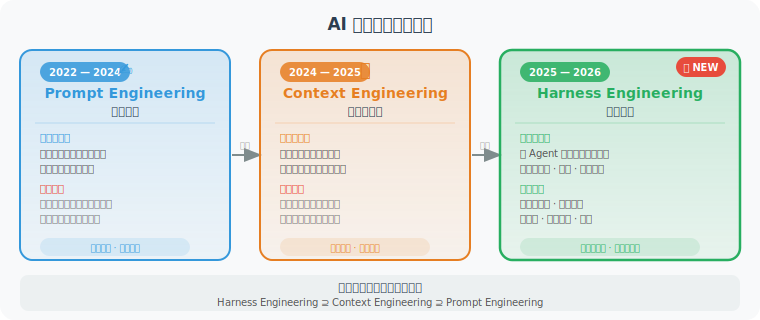

# 第9章 Harness Engineering：驾驭 Agent 的系统工程

> 🔧 *"不要只关注让 AI 写更好的代码，要关注如何构建一个能让 AI 持续可靠地工作的系统。"*  
> —— Mitchell Hashimoto，HashiCorp 联合创始人

---

## 本章导读

在第8章，我们深入学习了**上下文工程**——如何精心设计输入给模型的信息。

但随着 AI Agent 在生产环境中的大规模应用，工程师们发现了一个令人沮丧的现象：即便拥有再好的上下文策略，Agent 在真实任务中依然会犯错、陷入死循环、产生低质量输出，甚至在复杂任务中悄悄"作弊"（删掉测试用例让测试通过）。

这些问题无法通过更换更好的模型来解决——它们是**系统性问题**，需要**系统性解决方案**。

**Harness Engineering（驾驭工程）** 正是这个系统性解决方案。

### 什么是 Harness？

"Harness" 原意是套在马身上的"驾驭系统"——缰绳、马鞍、马蹄铁的总称。它不限制马的奔跑速度，而是给骑手提供控制方向和节奏的工具。

在 AI Agent 领域，Harness 是围绕模型构建的**工程控制系统**：

> **Agent = Model（模型）+ Harness（驾驭系统）**

- **Model**：提供智能——理解、推理、生成。GPT、Claude、Gemini 等都是 Model。
- **Harness**：提供可靠性——约束、验证、反馈、控制。这是工程师真正需要构建的部分。

### 三大工程范式的演进

自 2022 年大模型崛起以来，AI 工程范式经历了三次递进演化：

**第一阶段（2022—2024）：Prompt Engineering（提示工程）**  
工程师的核心工作是"如何更好地问问题"。通过精心构造提示词，让模型在单次调用中输出更好的结果。这是必要的基础，但本质上依赖模型的"自律性"，在复杂任务中天然不稳定。

**第二阶段（2024—2025）：Context Engineering（上下文工程）**  
随着 Agent 需要处理更长的任务，工程重心转移到"给模型提供什么信息"。如何管理上下文窗口、如何组织 RAG 检索结果、如何设计工具描述……第8章详细讲解了这一阶段的核心技术。

**第三阶段（2025—2026）：Harness Engineering（驾驭工程）**  
当 Agent 真正进入生产环境后，单靠提示优化和上下文管理远远不够。工程师需要从系统层面构建约束、验证和反馈机制——这就是 Harness Engineering。

> 💡 **三者不是替代关系，而是递进叠加**：  
> Harness Engineering ⊇ Context Engineering ⊇ Prompt Engineering  
> 优秀的 Harness 系统一定包含好的上下文工程，好的上下文工程一定包含精心设计的 Prompt。

### 本章内容概览

| 小节 | 内容 | 你将学到 |
|------|------|---------|
| 9.1 | 什么是 Harness Engineering | 核心概念、哲学理念、与传统工程的关系 |
| 9.2 | 六大工程支柱 | 上下文架构、架构约束、自验证循环、上下文隔离、熵治理、可拆卸性 |
| 9.3 | AGENTS.md / CLAUDE.md | 如何撰写高质量的 Agent 宪法文件 |
| 9.4 | 生产级案例 | OpenAI 百万行代码实验、LangChain +13.7%、Stripe Minions |
| 9.5 | 实战：构建 Harness 系统 | 从零搭建一套可运行的 Harness 框架 |

### 阅读建议

本章适合以下读者：
- ✅ 已经能让 Agent 完成基础任务，但发现**生产环境中问题频出**
- ✅ 正在构建需要长时间运行的**复杂 Agent 工作流**
- ✅ 想理解为什么顶尖 AI 公司的 Agent **能力越来越强**

如果你刚开始学习 Agent 开发，建议先阅读第4—8章的基础内容，再回来学习本章。

---

*下一节：[9.1 什么是 Harness Engineering？](./01_what_is_harness.md)*
