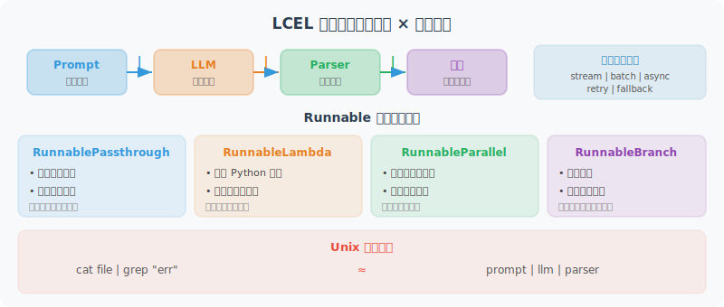

# LCEL：LangChain 表达式语言

LCEL（LangChain Expression Language）是 LangChain 的核心构建语言，用 `|` 符号将组件连接成处理管道，代码简洁且功能强大。



如果你用过 Unix 管道（`cat file.txt | grep "error" | wc -l`），LCEL 的思路完全相同：数据从左到右流过一系列处理组件，每个组件接收上一个的输出作为自己的输入。在 LLM 应用中，一个典型的管道是：`提示词模板 | LLM | 输出解析器`——模板填充变量生成完整提示，LLM 生成回复，解析器提取结构化结果。

LCEL 的核心抽象是 **Runnable 协议**——所有组件都实现了统一的接口（`invoke`、`stream`、`batch` 等），因此任何组件都可以与其他组件自由组合。这种设计的好处是：你写好一条链之后，自动获得了流式输出、异步调用和批处理能力，不需要额外编码。

## LCEL 核心概念

下面的代码展示了 LCEL 的核心组件和使用模式。建议你关注以下几个要点：

- **`|` 操作符**：这是 LCEL 的灵魂，它背后调用的是 Python 的 `__or__` 方法，将两个 Runnable 串联成一个新的 Runnable
- **`RunnablePassthrough`**：原样传递输入，常用于需要在处理的同时保留原始数据的场景
- **`RunnableLambda`**：将普通的 Python 函数包装为 Runnable，让你可以在管道中插入自定义逻辑
- **`RunnableParallel`**：并行执行多个 Runnable，将结果合并为字典——这在 RAG 中很常见（同时检索上下文和传递问题）

```python
from langchain_core.runnables import (
    RunnablePassthrough,
    RunnableParallel,
    RunnableLambda,
    RunnableBranch
)
from langchain_openai import ChatOpenAI
from langchain_core.prompts import ChatPromptTemplate
from langchain_core.output_parsers import StrOutputParser

llm = ChatOpenAI(model="gpt-4o-mini")

# ============================
# LCEL 的 Runnable 协议
# ============================

# 所有 LCEL 组件都实现了 Runnable 接口，支持：
# .invoke(input)         → 同步调用
# .ainvoke(input)        → 异步调用
# .stream(input)         → 流式输出
# .astream(input)        → 异步流式
# .batch(inputs)         → 批处理
# .abatch(inputs)        → 异步批处理

# 基础链
chain = (
    ChatPromptTemplate.from_messages([("human", "{question}")])
    | llm
    | StrOutputParser()
)

# 四种调用方式
result = chain.invoke({"question": "什么是Python？"})        # 同步
results = chain.batch([{"question": "Q1"}, {"question": "Q2"}])  # 批处理

# ============================
# RunnablePassthrough：传递输入
# ============================

# 场景：需要在处理的同时保留原始输入
from langchain_core.runnables import RunnablePassthrough

# 注意：RunnablePassthrough() 会传递整个输入字典，而不是提取单个字段。
# 如果输入是 {"question": "xxx"}，RunnablePassthrough() 的结果是 {"question": "xxx"}。
# 使用 itemgetter("question") 来提取特定字段。

from operator import itemgetter

rag_chain = (
    RunnableParallel({
        "context": lambda x: "文档内容..." + x["question"],  # 模拟检索
        "question": itemgetter("question")  # 正确：提取 question 字段的值
    })
    | ChatPromptTemplate.from_messages([
        ("system", "基于以下上下文回答：{context}"),
        ("human", "{question}")
    ])
    | llm
    | StrOutputParser()
)

# ============================
# RunnableLambda：包装普通函数
# ============================

import json

def extract_json(text: str) -> dict:
    """从文本中提取 JSON"""
    start = text.find("{")
    end = text.rfind("}") + 1
    if start != -1 and end > 0:
        return json.loads(text[start:end])
    return {}

json_chain = (
    ChatPromptTemplate.from_messages([
        ("system", "将用户描述转为JSON格式的任务，包含title和priority字段"),
        ("human", "{description}")
    ])
    | llm
    | StrOutputParser()
    | RunnableLambda(extract_json)  # 包装普通函数为 Runnable
)

result = json_chain.invoke({"description": "明天下午开会，很重要"})
print(result)  # {'title': '开会', 'priority': 'high'}

# ============================
# 使用 itemgetter 提取字段
# ============================

from operator import itemgetter

# 多输入链的字段路由
multi_input_chain = (
    {
        "language": itemgetter("language"),
        "code": itemgetter("code"),
        "task": itemgetter("task")
    }
    | ChatPromptTemplate.from_messages([
        ("system", "你是{language}代码专家，帮助用户{task}"),
        ("human", "代码：\n{code}")
    ])
    | llm
    | StrOutputParser()
)

result = multi_input_chain.invoke({
    "language": "Python",
    "code": "def add(a, b): return a + b",
    "task": "添加类型注解和注释"
})
print(result)

# ============================
# 链的组合与复用
# ============================

# 定义可复用的子链
summarize_chain = (
    ChatPromptTemplate.from_messages([
        ("system", "将文本压缩为50字以内的摘要"),
        ("human", "{text}")
    ])
    | llm
    | StrOutputParser()
)

translate_chain = (
    ChatPromptTemplate.from_messages([
        ("system", "将文本翻译成英文"),
        ("human", "{text}")
    ])
    | llm
    | StrOutputParser()
)

# 组合：先摘要再翻译
summarize_then_translate = (
    summarize_chain
    | RunnableLambda(lambda x: {"text": x})
    | translate_chain
)

result = summarize_then_translate.invoke({
    "text": "LangChain 是一个强大的框架，它提供了构建 LLM 应用所需的所有工具..."
})
print(result)
```

## 错误处理和重试

在生产环境中，LLM API 调用可能因为网络抖动、速率限制等原因偶尔失败。LCEL 内置了两种恢复机制：

- **`with_retry`**：自动重试失败的调用，支持指数退避（每次重试间隔递增），避免在 API 限流时雪崩
- **`with_fallbacks`**：当主链失败后，自动切换到备用链——比如主模型用 GPT-4o，备用模型用 GPT-3.5-turbo，保证服务可用性

```python
from langchain_core.runnables import RunnableRetry
from langchain_core.exceptions import OutputParserException

# 添加重试逻辑
resilient_chain = (
    ChatPromptTemplate.from_messages([("human", "{input}")])
    | llm.with_retry(
        stop_after_attempt=3,
        wait_exponential_jitter=True
    )
    | StrOutputParser()
)

# 添加 fallback（备用链）
fallback_chain = (
    ChatPromptTemplate.from_messages([("human", "{input}")])
    | ChatOpenAI(model="gpt-4o-mini")  # 备用模型
    | StrOutputParser()
)

chain_with_fallback = resilient_chain.with_fallbacks([fallback_chain])
```

---

## 小结

LCEL 的核心优势：
- **统一接口**：所有组件都是 Runnable，支持相同的调用方式
- **声明式**：代码即文档，清晰表达数据流向
- **内置支持**：自动支持流式、异步、批处理
- **可组合性**：子链可以自由组合复用

---

*下一节：[11.5 实战：多功能客服 Agent](./05_practice_customer_service.md)*
