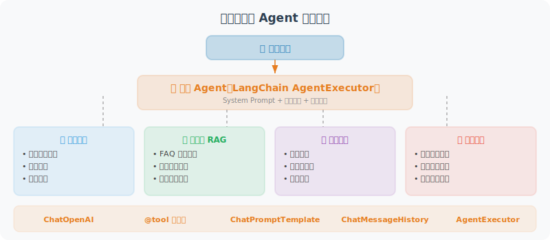

# 实战：多功能客服 Agent

综合 LangChain 所有特性，构建一个完整的多功能客服 Agent 系统。



## 完整实现

```python
# customer_service_agent.py
from langchain_openai import ChatOpenAI
from langchain_core.tools import tool
from langchain_core.prompts import ChatPromptTemplate, MessagesPlaceholder
from langchain.agents import AgentExecutor, create_openai_tools_agent  # legacy，新项目推荐 LangGraph
from langchain_core.messages import HumanMessage, AIMessage
from langchain_community.chat_message_histories import ChatMessageHistory
from langchain_core.runnables.history import RunnableWithMessageHistory
from rich.console import Console
from dotenv import load_dotenv
import json

load_dotenv()
console = Console()

# ============================
# 工具定义
# ============================

@tool
def search_faq(query: str) -> str:
    """搜索常见问题解答库。适合回答产品使用、政策、流程等问题。"""
    faq_data = {
        "退款": "退款政策：7天内无理由退款，需要原包装。申请退款请联系客服。",
        "发货": "一般1-3个工作日发货，节假日顺延。急需可选顺丰加急。",
        "保修": "正规渠道购买享有官方1年保修，屏幕损坏不在保修范围内。",
        "优惠": "新用户首单8折优惠，会员用户积分可抵扣货款。",
        "支付": "支持微信、支付宝、银行卡，不支持货到付款。",
    }
    
    for keyword, answer in faq_data.items():
        if keyword in query:
            return answer
    
    return "未找到相关FAQ，建议联系在线客服获取更多帮助。"

@tool
def check_order(order_id: str) -> str:
    """
    查询订单状态和物流信息。
    输入订单编号（如 ORD-12345678），返回订单详情。
    """
    orders = {
        "ORD-12345678": {
            "status": "已发货",
            "items": "Python编程书 × 1",
            "amount": 89.9,
            "shipping": "顺丰：SF1234567890，预计明天到达"
        },
        "ORD-87654321": {
            "status": "待发货",
            "items": "AI开发课程 × 1",
            "amount": 299.0,
            "shipping": "预计明天发货"
        }
    }
    
    order = orders.get(order_id)
    if order:
        return json.dumps(order, ensure_ascii=False)
    return f"订单 {order_id} 不存在，请确认订单号是否正确。"

@tool
def submit_complaint(
    order_id: str,
    complaint_type: str,
    description: str
) -> str:
    """
    提交售后投诉或申请。
    complaint_type: 退款申请/质量问题/物流问题/其他
    """
    import datetime
    ticket_id = f"TKT-{datetime.datetime.now().strftime('%Y%m%d%H%M%S')}"
    
    return (f"投诉已受理！工单编号：{ticket_id}\n"
            f"类型：{complaint_type}\n"
            f"相关订单：{order_id}\n"
            f"预计24小时内客服跟进处理。")

@tool
def recommend_products(user_need: str) -> str:
    """根据用户需求推荐适合的产品。"""
    catalog = [
        {"name": "Python入门到精通", "price": 89, "tag": "编程 Python 初学者"},
        {"name": "AI Agent实战课程", "price": 299, "tag": "AI 机器学习 Agent"},
        {"name": "LangChain实战教程", "price": 199, "tag": "LangChain Python AI"},
        {"name": "数据分析全攻略", "price": 159, "tag": "数据分析 pandas Excel"},
    ]
    
    # 简单的关键词匹配
    results = []
    for item in catalog:
        if any(keyword in user_need for keyword in item["tag"].split()):
            results.append(f"• {item['name']} - ¥{item['price']}")
    
    if results:
        return "根据您的需求，为您推荐：\n" + "\n".join(results)
    return "暂无完全匹配的推荐，请描述更多您的需求。"


# ============================
# Agent 构建
# ============================

tools = [search_faq, check_order, submit_complaint, recommend_products]

system_message = """你是"小慧"，一位热心、专业的客服助手。

## 你的职责
- 解答用户的产品和服务相关问题
- 查询订单状态和物流信息
- 处理售后申请和投诉
- 根据用户需求推荐合适的产品

## 服务准则
1. 始终保持热情、耐心、专业的态度
2. 先理解用户需求，再给出帮助
3. 使用工具前先思考哪个工具最合适
4. 如果无法解决，礼貌地转接人工客服（告知用户联系 400-123-4567）
5. 用友好的语气，避免生硬的机器人感

## 权限限制
- 不能修改订单金额
- 不能直接执行退款，只能提交申请
"""

prompt = ChatPromptTemplate.from_messages([
    ("system", system_message),
    MessagesPlaceholder(variable_name="chat_history"),
    ("human", "{input}"),
    MessagesPlaceholder(variable_name="agent_scratchpad"),
])

llm = ChatOpenAI(model="gpt-4o", temperature=0.3)
agent = create_openai_tools_agent(llm, tools, prompt)

agent_executor = AgentExecutor(
    agent=agent,
    tools=tools,
    verbose=False,
    max_iterations=5,
    handle_parsing_errors=True
)

# 会话历史管理
store = {}

def get_session_history(session_id: str) -> ChatMessageHistory:
    if session_id not in store:
        store[session_id] = ChatMessageHistory()
    return store[session_id]

agent_with_history = RunnableWithMessageHistory(
    agent_executor,
    get_session_history,
    input_messages_key="input",
    history_messages_key="chat_history"
)

# ============================
# 主程序
# ============================

def main():
    session_id = "customer_001"
    
    console.print("\n[bold cyan]小慧：[/bold cyan]您好！我是小慧，很高兴为您服务！"
                  "请问有什么可以帮助您的？😊")
    
    while True:
        user_input = input("\n[你]：").strip()
        
        if not user_input:
            continue
        if user_input.lower() in ["quit", "exit", "退出"]:
            console.print("[bold cyan]小慧：[/bold cyan]感谢您的光临，再见！👋")
            break
        
        result = agent_with_history.invoke(
            {"input": user_input},
            config={"configurable": {"session_id": session_id}}
        )
        
        console.print(f"\n[bold cyan]小慧：[/bold cyan]{result['output']}")


if __name__ == "__main__":
    main()
```

## 本章小结

本章通过构建一个多功能客服 Agent，综合运用了 LangChain 的核心能力。系统的设计思路是：**将客服场景拆解为独立的工具函数**（订单查询、退换货处理、常见问题解答），然后让 LLM Agent 根据用户意图自主选择合适的工具来响应。这种"工具驱动"的架构模式在实际项目中非常常见，也是 LangChain Agent 最典型的使用方式。

通过本章，我们掌握了 LangChain 的核心技能：

| 技能 | 要点 |
|------|------|
| 模型调用 | `ChatOpenAI` + 提示词模板 |
| 工具定义 | `@tool` 装饰器快速定义 |
| LCEL 链 | `\|` 管道语法，可读性强 |
| Agent | `create_openai_tools_agent` + `AgentExecutor` |
| 会话历史 | `RunnableWithMessageHistory` |

---

*下一章：[第12章 LangGraph：构建有状态的 Agent](../chapter_langgraph/README.md)*
