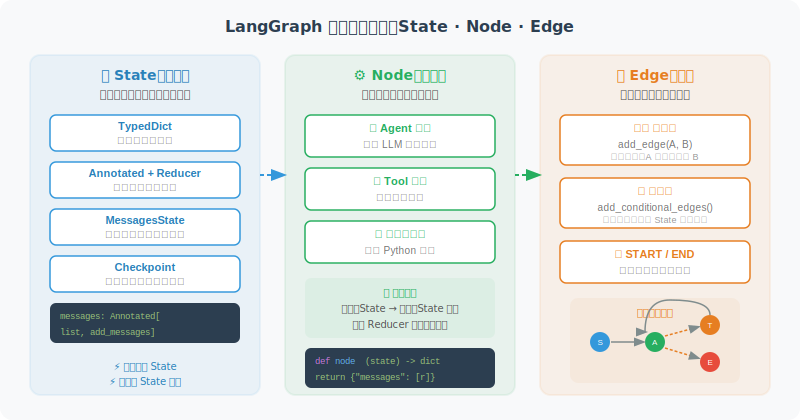

# LangGraph 核心概念：节点、边、状态



## 状态（State）

State 是 LangGraph 的数据中心，所有节点都从 State 读取数据并写入数据。

```python
from typing import TypedDict, Annotated, Optional
from langgraph.graph import MessagesState
import operator

# 方式1：使用内置的 MessagesState（推荐）
# 已内置 messages: Annotated[list, add_messages]
class MyState(MessagesState):
    # 在基础上添加额外字段
    user_name: Optional[str]
    task_complete: bool

# 方式2：完全自定义
from langchain_core.messages import BaseMessage

class CustomState(TypedDict):
    # 使用 Annotated + operator.add 表示"追加"语义
    messages: Annotated[list[BaseMessage], operator.add]
    
    # 普通字段（每次更新会覆盖）
    current_step: str
    error_count: int
    result: Optional[str]
```

### State Reducer 的高级用法

Reducer 是 LangGraph 中容易被忽视但极其强大的机制。当多个节点同时更新 State 的同一个字段时，Reducer 决定了**如何合并这些更新**。

```python
from typing import Annotated
import operator

# Reducer 示例 1：追加（最常用）
# messages 字段使用 operator.add 作为 Reducer
# 效果：新消息追加到列表末尾，而非替换整个列表
class ChatState(TypedDict):
    messages: Annotated[list, operator.add]  # 追加语义

# Reducer 示例 2：自定义 Reducer 函数
def merge_results(existing: dict, new: dict) -> dict:
    """自定义合并策略：深度合并两个字典"""
    merged = {**existing}
    for key, value in new.items():
        if key in merged and isinstance(merged[key], list):
            merged[key] = merged[key] + value  # 列表追加
        else:
            merged[key] = value  # 其他类型覆盖
    return merged

class AnalysisState(TypedDict):
    # 使用自定义 Reducer：多个分析节点的结果会被合并而非覆盖
    analysis_results: Annotated[dict, merge_results]
    step_count: int

# Reducer 示例 3：使用 add_messages（LangChain 内置）
from langgraph.graph import add_messages

class AgentState(TypedDict):
    # add_messages 比 operator.add 更智能：
    # - 自动处理消息去重（基于 message ID）
    # - 支持消息更新（同 ID 的新消息会替换旧消息）
    messages: Annotated[list, add_messages]
```

> ⚠️ **常见陷阱**：如果你忘记给列表类型的字段添加 Reducer，每次节点返回 `{"messages": [new_msg]}` 时会**替换**而非**追加**消息列表。这是新手最常遇到的 bug。

### Checkpoint 持久化

Checkpoint 是 LangGraph 实现「断点恢复」和「会话持久化」的核心机制。每次状态转换时，LangGraph 可以自动保存一个 Checkpoint（快照），后续可以从任意 Checkpoint 恢复执行。

```python
# 内存 Checkpoint（开发/测试用）
from langgraph.checkpoint.memory import MemorySaver

memory_checkpointer = MemorySaver()
app = graph.compile(checkpointer=memory_checkpointer)

# 使用 thread_id 标识一个独立的执行会话
config = {"configurable": {"thread_id": "user-session-001"}}

# 第一轮对话
result1 = app.invoke(
    {"messages": [HumanMessage(content="我叫张伟")]},
    config=config
)

# 第二轮对话——自动恢复之前的状态
result2 = app.invoke(
    {"messages": [HumanMessage(content="我叫什么名字？")]},
    config=config
)
# Agent 能记住"张伟"，因为状态通过 Checkpoint 持久化了

# SQLite Checkpoint（生产环境推荐）
from langgraph.checkpoint.sqlite import SqliteSaver

# 数据持久化到磁盘，重启后不丢失
db_checkpointer = SqliteSaver.from_conn_string("checkpoints.db")
app = graph.compile(checkpointer=db_checkpointer)

# PostgreSQL Checkpoint（分布式生产环境）
# pip install langgraph-checkpoint-postgres
# from langgraph.checkpoint.postgres import PostgresSaver
# pg_checkpointer = PostgresSaver.from_conn_string("postgresql://...")
```

**Checkpoint 的典型应用场景**：

| 场景 | 说明 |
|------|------|
| 多轮对话持久化 | 用户关闭浏览器后再回来，对话状态不丢失 |
| Human-in-the-Loop | 暂停执行等待人类审批，审批后从暂停点恢复 |
| 长时间任务 | 数据分析可能运行几分钟，中途可以断点续传 |
| 错误恢复 | 某个节点执行失败，修复后从失败点重试而非从头开始 |
| 时间旅行调试 | 回溯到之前的 Checkpoint，检查当时的 State 状态 |

---

## 节点（Node）

```python
from langchain_openai import ChatOpenAI
from langchain_core.messages import HumanMessage, AIMessage, SystemMessage
from langgraph.graph import StateGraph, END, START, MessagesState

llm = ChatOpenAI(model="gpt-4o")

# 节点就是普通的 Python 函数
def agent_node(state: MessagesState) -> dict:
    """
    Agent 节点：调用 LLM 处理消息
    
    接收：当前 State
    返回：State 的更新部分（字典）
    """
    messages = state["messages"]
    
    # 调用 LLM
    response = llm.invoke(messages)
    
    # 返回更新（只返回变化的部分）
    return {"messages": [response]}

def tool_node(state: MessagesState) -> dict:
    """工具节点：执行工具调用"""
    import json
    
    last_message = state["messages"][-1]
    tool_results = []
    
    for tool_call in last_message.tool_calls:
        # 执行工具（这里模拟）
        result = f"工具 {tool_call['name']} 的结果"
        
        from langchain_core.messages import ToolMessage
        tool_results.append(ToolMessage(
            content=result,
            tool_call_id=tool_call["id"]
        ))
    
    return {"messages": tool_results}
```

## 边（Edge）

```python
# 普通边：固定指向
graph.add_edge("node_a", "node_b")  # A 总是指向 B

# 条件边：动态决定
def route_after_agent(state: MessagesState) -> str:
    """根据 Agent 输出决定下一步"""
    last_message = state["messages"][-1]
    
    # 如果有工具调用 → 执行工具
    if hasattr(last_message, "tool_calls") and last_message.tool_calls:
        return "tool_node"
    
    # 否则 → 结束
    return END

graph.add_conditional_edges(
    "agent_node",
    route_after_agent,
    {
        "tool_node": "tool_node",
        END: END
    }
)
```

## 完整的 ReAct Graph

```python
from langchain_core.tools import tool
import math

@tool
def calculate(expression: str) -> str:
    """计算数学表达式"""
    try:
        result = eval(expression, {"__builtins__": {}}, 
                     {k: getattr(math, k) for k in dir(math)})
        return str(result)
    except Exception as e:
        return f"错误：{e}"

tools = [calculate]
llm_with_tools = llm.bind_tools(tools)

def agent_node(state: MessagesState) -> dict:
    response = llm_with_tools.invoke(state["messages"])
    return {"messages": [response]}

def tool_executor(state: MessagesState) -> dict:
    from langchain_core.messages import ToolMessage
    import json
    
    last_msg = state["messages"][-1]
    results = []
    
    for tool_call in last_msg.tool_calls:
        if tool_call["name"] == "calculate":
            result = calculate.invoke(tool_call["args"])
        else:
            result = "未知工具"
        
        results.append(ToolMessage(
            content=str(result),
            tool_call_id=tool_call["id"]
        ))
    
    return {"messages": results}

def should_use_tools(state: MessagesState) -> str:
    last_msg = state["messages"][-1]
    if hasattr(last_msg, "tool_calls") and last_msg.tool_calls:
        return "tools"
    return END

# 构建图
graph = StateGraph(MessagesState)
graph.add_node("agent", agent_node)
graph.add_node("tools", tool_executor)
graph.add_edge(START, "agent")
graph.add_conditional_edges("agent", should_use_tools)
graph.add_edge("tools", "agent")  # 工具执行后回到 agent

app = graph.compile()

# 运行
result = app.invoke({"messages": [HumanMessage(content="计算 sqrt(2) * pi")]})
print(result["messages"][-1].content)
```

---

## 错误处理与重试策略

生产环境中，Agent 的节点（特别是调用外部 API 的节点）随时可能失败。LangGraph 提供了多种错误处理模式：

```python
import time
from langchain_core.runnables import RunnableConfig

# 模式 1：节点内部 try-except（最灵活）
def resilient_tool_node(state: MessagesState) -> dict:
    """带错误处理的工具节点"""
    last_msg = state["messages"][-1]
    results = []
    
    for tool_call in last_msg.tool_calls:
        try:
            result = execute_tool(tool_call)
            results.append(ToolMessage(
                content=str(result),
                tool_call_id=tool_call["id"]
            ))
        except Exception as e:
            # 工具失败时，返回错误信息而非抛出异常
            # 让 Agent 有机会自我纠正
            results.append(ToolMessage(
                content=f"工具执行失败：{str(e)}。请尝试其他方法。",
                tool_call_id=tool_call["id"]
            ))
    
    return {"messages": results}

# 模式 2：带重试计数的条件路由
class RetryState(MessagesState):
    retry_count: int
    max_retries: int

def should_retry(state: RetryState) -> str:
    """重试决策：失败次数未超限则重试"""
    last_msg = state["messages"][-1]
    
    if "失败" in last_msg.content and state["retry_count"] < state["max_retries"]:
        return "retry"
    elif "失败" in last_msg.content:
        return "fallback"  # 超过重试次数，走降级路径
    else:
        return "success"

# 模式 3：超时控制
# LangGraph 支持通过 RunnableConfig 设置超时
config = RunnableConfig(
    recursion_limit=25,  # 最大递归次数（防止无限循环）
    # 其他配置...
)
result = app.invoke(input_data, config=config)
```

> 💡 **最佳实践**：在 Agent 的工具节点中，永远不要让异常直接抛出导致整个图崩溃。捕获异常后将错误信息作为 ToolMessage 返回给 Agent，让 LLM 根据错误信息自行决定下一步（重试、换方案、或告知用户）。这种「优雅降级」模式是生产级 Agent 的标志。

---

## 小结

LangGraph 三要素：
- **State**：共享数据容器，TypedDict 定义结构
- **Node**：处理函数，接收 State，返回部分更新
- **Edge**：连接关系，普通边或条件边

---

*下一节：[12.3 构建你的第一个 Graph Agent](./03_first_graph_agent.md)*
