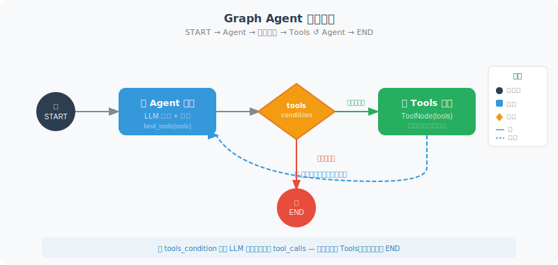

# 构建你的第一个 Graph Agent

本节手把手构建一个完整的 LangGraph Agent，包括工具调用和循环推理。

与前面使用 OpenAI 原生 API 或 LangChain AgentExecutor 不同，LangGraph 用**图**来描述 Agent 的行为。这种方式的优势在于：执行流程是**可视化、可控、可持久化**的——你可以清楚地看到 Agent 走了哪些步骤，可以在任意节点暂停和恢复，也可以通过添加边来精确控制流程走向。

构建一个 Graph Agent 分为四个步骤：
1. **定义工具**：和之前一样，用 `@tool` 装饰器定义工具函数
2. **创建节点**：每个节点是一个处理函数，接收 State 并返回更新
3. **构建图**：用 `add_node` 添加节点，用 `add_edge` 和 `add_conditional_edges` 连接它们
4. **编译运行**：调用 `compile()` 得到可执行的 Agent



下面的代码中，我们使用 LangGraph 内置的 `MessagesState`（消息列表状态）、`ToolNode`（自动执行工具）和 `tools_condition`（判断是否需要调用工具），这些是 LangGraph 为常见 Agent 模式提供的快捷组件。

```python
# first_graph_agent.py
from langgraph.graph import StateGraph, END, START, MessagesState
from langgraph.prebuilt import ToolNode, tools_condition
from langchain_openai import ChatOpenAI
from langchain_core.tools import tool
from langchain_core.messages import HumanMessage, SystemMessage
import math

# ============================
# 1. 定义工具
# ============================

@tool
def calculate(expression: str) -> str:
    """计算数学表达式，支持 sqrt, sin, cos, log, pi, e 等"""
    try:
        safe_env = {k: getattr(math, k) for k in dir(math) if not k.startswith('_')}
        # ⚠️ 安全警告：eval() 即使限制了 __builtins__ 仍可能被绕过
        # 生产环境请使用 simpleeval 或 numexpr 等安全的表达式解析库
        result = eval(expression, {"__builtins__": {}}, safe_env)
        if isinstance(result, float):
            return f"{result:.6g}"
        return str(result)
    except Exception as e:
        return f"计算错误：{e}"

@tool
def get_fact(topic: str) -> str:
    """获取关于某个主题的基本知识"""
    facts = {
        "python": "Python 由 Guido van Rossum 创建，1991年发布，是解释型高级语言",
        "langchain": "LangChain 是构建 LLM 应用的框架，支持 Agent、RAG、Chain 等",
        "光速": "光在真空中的速度约为 299,792,458 米/秒",
        "地球": "地球直径约 12,742 公里，距太阳约 1.5亿公里",
    }
    
    for key, fact in facts.items():
        if key.lower() in topic.lower():
            return fact
    
    return f"暂无关于 '{topic}' 的预置知识"

tools = [calculate, get_fact]

# ============================
# 2. 创建 Agent 节点
# ============================

llm = ChatOpenAI(model="gpt-4o", temperature=0)
llm_with_tools = llm.bind_tools(tools)

def agent_node(state: MessagesState) -> dict:
    """Agent 核心节点：调用 LLM 决定下一步"""
    # 添加系统提示
    messages = state["messages"]
    
    if not any(isinstance(m, SystemMessage) for m in messages):
        messages = [
            SystemMessage(content="你是一个智能助手，可以使用计算器和知识库工具。")
        ] + messages
    
    response = llm_with_tools.invoke(messages)
    return {"messages": [response]}

# ============================
# 3. 构建图
# ============================

# 图的构建分三步：添加节点、添加边、编译。
# - "agent" 节点：LLM 决策
# - "tools" 节点：使用内置的 ToolNode 自动执行工具
# - tools_condition：内置的条件函数，检查 LLM 返回是否包含工具调用
#   如果有工具调用 → 路由到 "tools"
#   如果没有（纯文本回复） → 路由到 END（结束）
# - "tools" → "agent"：工具执行完后，回到 Agent 继续推理（形成循环）

graph = StateGraph(MessagesState)

# 添加节点
graph.add_node("agent", agent_node)
graph.add_node("tools", ToolNode(tools))  # 内置工具节点

# 添加边
graph.add_edge(START, "agent")
graph.add_conditional_edges(
    "agent",
    tools_condition,  # 内置条件：有工具调用→"tools"，否则→END
)
graph.add_edge("tools", "agent")  # 工具执行后回到 Agent

# 编译
app = graph.compile()

# ============================
# 4. 可视化（如果安装了相关库）
# ============================

try:
    from IPython.display import Image, display
    display(Image(app.get_graph().draw_mermaid_png()))
except:
    print("图结构（Mermaid 格式）:")
    print(app.get_graph().draw_mermaid())

# ============================
# 5. 运行测试
# ============================

def chat(question: str):
    """与 Agent 对话"""
    result = app.invoke({
        "messages": [HumanMessage(content=question)]
    })
    
    # 最后一条消息是 AI 的回复
    final_msg = result["messages"][-1]
    return final_msg.content

# 测试
print(chat("Python 是什么时候发布的？"))
print(chat("光速是多少？绕地球一圈需要多少毫秒？"))
print(chat("计算 sqrt(2) 保留4位小数是多少？"))
```

理解上面代码的核心：图的结构形成了一个"循环"——`agent → tools → agent → tools → ... → END`。每次循环中，`agent` 节点调用 LLM 进行推理，`tools_condition` 检查 LLM 的返回是否包含工具调用请求。如果有，流程走向 `tools` 节点执行工具；如果没有（说明 LLM 认为可以直接回答了），流程走向 `END` 结束。这就是 Agent 的"推理-行动循环"在图结构中的体现。

## 追踪执行过程

调试 Agent 时，了解它的每一步推理过程至关重要。`app.stream()` 方法可以逐节点地流式输出执行状态，让你清楚地看到：Agent 在哪个节点做了什么决策、调用了什么工具、得到了什么结果。

```python
# 使用 stream 追踪每一步
for event in app.stream({"messages": [HumanMessage(content="地球直径是多少公里？转换成英里是多少？")]}):
    for node_name, state in event.items():
        if node_name != "__end__":
            print(f"\n[节点：{node_name}]")
            last_msg = state.get("messages", [])[-1] if state.get("messages") else None
            if last_msg:
                if hasattr(last_msg, 'content') and last_msg.content:
                    print(f"  消息：{last_msg.content[:200]}")
                if hasattr(last_msg, 'tool_calls') and last_msg.tool_calls:
                    for tc in last_msg.tool_calls:
                        print(f"  工具调用：{tc['name']}({tc['args']})")
```

## 与 LangChain AgentExecutor 的对比

如果你用过 LangChain 的 `AgentExecutor`（第11章），你可能会问：为什么要费劲用图来构建 Agent？让我们通过一个对比来理解两者的本质差异：

```python
# LangChain AgentExecutor 方式（黑盒）
from langchain.agents import create_openai_tools_agent, AgentExecutor

agent = create_openai_tools_agent(llm, tools, prompt)
executor = AgentExecutor(agent=agent, tools=tools)
result = executor.invoke({"input": "计算 sqrt(2)"})
# 内部循环对你是不透明的

# LangGraph 方式（白盒）
graph = StateGraph(MessagesState)
graph.add_node("agent", agent_node)
graph.add_node("tools", ToolNode(tools))
# 你完全控制图的结构、边的条件、何时终止
app = graph.compile()
```

| 维度 | AgentExecutor | LangGraph |
|------|--------------|-----------|
| 透明度 | 黑盒循环 | 每个节点和边都可见 |
| 控制力 | 有限配置项 | 完全自定义 |
| 持久化 | 不支持 | Checkpoint 原生支持 |
| 人机协作 | 需额外实现 | 内置 interrupt/resume |
| 适用场景 | 简单工具调用 | 复杂多步工作流 |

> 💡 **迁移建议**：如果你的 Agent 只需要简单的"LLM + 工具调用"循环，`AgentExecutor` 已经足够。当你需要条件分支、多阶段流程、人工审批节点、或中间状态持久化时，迁移到 LangGraph。

## 常见陷阱与最佳实践

在构建你的第一个 Graph Agent 时，有几个常见错误值得注意：

**陷阱 1：忘记处理空消息列表**

```python
# ❌ 错误：直接取最后一条消息，可能 IndexError
def agent_node(state: MessagesState):
    response = llm.invoke(state["messages"])
    return {"messages": [response]}

# ✅ 正确：确保消息列表不为空
def agent_node(state: MessagesState):
    messages = state.get("messages", [])
    if not messages:
        messages = [HumanMessage(content="你好")]
    response = llm_with_tools.invoke(messages)
    return {"messages": [response]}
```

**陷阱 2：工具函数抛出异常导致整个 Agent 崩溃**

```python
# ❌ 错误：异常直接上抛
@tool
def risky_tool(query: str) -> str:
    """可能出错的工具"""
    return requests.get(f"https://api.example.com/{query}").text

# ✅ 正确：工具内部捕获异常，返回友好错误信息
@tool
def safe_tool(query: str) -> str:
    """安全的工具实现"""
    try:
        response = requests.get(f"https://api.example.com/{query}", timeout=5)
        response.raise_for_status()
        return response.text
    except Exception as e:
        return f"工具调用失败：{type(e).__name__}: {e}"
```

**陷阱 3：无限循环没有安全退出**

LangGraph 默认的 `recursion_limit` 是 25 步，但在复杂场景下你可能需要显式设置：

```python
# 设置最大递归步数，防止无限循环
result = app.invoke(
    {"messages": [HumanMessage(content="做一个复杂分析")]},
    config={"recursion_limit": 15}  # 最多 15 步
)
```

---

## 小结

第一个 Graph Agent 展示了：
- `StateGraph` + `MessagesState` 快速构建
- `ToolNode` + `tools_condition` 内置工具处理
- `app.stream()` 追踪执行过程

---

*下一节：[12.4 条件路由与循环控制](./04_conditional_routing.md)*
