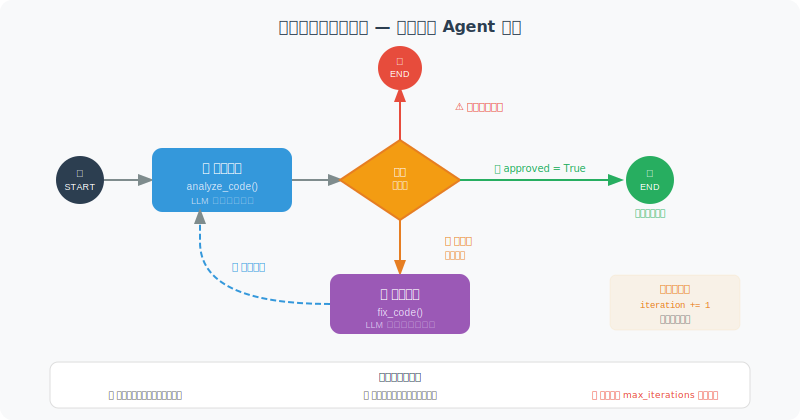

# 条件路由与循环控制

LangGraph 的强大之处在于灵活的条件路由和循环控制——这让它能够表达比简单的"调用工具"更复杂的工作流。

在上一节中，我们用 `tools_condition` 这个内置的条件函数来判断"是否需要工具"。但现实中的 Agent 往往需要更复杂的决策逻辑：根据代码审查的结果决定是通过还是打回修改、根据用户的意图路由到不同的处理流程、根据质量评分决定是否需要迭代优化……

这些都可以用**条件路由**来实现——你定义一个条件函数，它检查当前状态，返回一个字符串来标识应该走哪条路。然后用 `add_conditional_edges` 将这些字符串映射到不同的目标节点。

### 循环的力量与风险

条件路由最强大的用法是构造**循环**——让某个节点的输出可以回到之前的节点。比如"代码审查 → 修复 → 再审查 → 再修复"这样的迭代流程。但循环也带来了无限循环的风险：如果条件判断逻辑有 bug，Agent 可能永远在循环中出不来。因此，**设置最大迭代次数是必须的安全措施。**

下面我们用一个"代码审查 Agent"来演示条件路由和循环控制。这个 Agent 会分析代码、发现问题、修复代码，然后重新审查——直到代码通过审查或达到最大迭代次数。



```python
from langgraph.graph import StateGraph, END, START
from typing import TypedDict, Optional, Literal
from langchain_openai import ChatOpenAI
from langchain_core.messages import HumanMessage
import json

llm = ChatOpenAI(model="gpt-4o-mini")

# ============================
# 带循环的代码审查 Agent
# ============================

class CodeReviewState(TypedDict):
    code: str
    review_result: Optional[str]
    issues: list
    iteration: int
    max_iterations: int
    approved: bool

def analyze_code(state: CodeReviewState) -> CodeReviewState:
    """分析代码质量"""
    response = llm.invoke([
        HumanMessage(content=f"""审查以下代码，找出所有问题（JSON格式）：
```python
{state['code']}
```
返回：{{"issues": ["问题1", "问题2"], "severity": "high/medium/low"}}""")
    ])
    
    try:
        import re
        json_match = re.search(r'\{.*\}', response.content, re.DOTALL)
        if json_match:
            result = json.loads(json_match.group())
            issues = result.get("issues", [])
        else:
            issues = []
    except:
        issues = []
    
    return {
        "issues": issues,
        "review_result": response.content,
        "iteration": state.get("iteration", 0) + 1
    }

def fix_code(state: CodeReviewState) -> CodeReviewState:
    """修复代码问题"""
    issues_text = "\n".join([f"- {issue}" for issue in state["issues"]])
    
    response = llm.invoke([
        HumanMessage(content=f"""修复以下代码中的问题：

代码：
```python
{state['code']}
```

问题列表：
{issues_text}

只返回修复后的纯 Python 代码：""")
    ])
    
    fixed_code = response.content
    if "```python" in fixed_code:
        fixed_code = fixed_code.split("```python")[1].split("```")[0].strip()
    elif "```" in fixed_code:
        fixed_code = fixed_code.split("```")[1].split("```")[0].strip()
    
    return {"code": fixed_code}

def should_fix_or_approve(state: CodeReviewState) -> Literal["fix", "approve", "max_reached"]:
    """条件路由：决定继续修复还是通过
    
    这个函数是整个循环的核心控制逻辑：
    - 检查迭代次数上限（安全阀，防止无限循环）
    - 如果没有问题则直接通过
    - 只有存在严重问题（如 bug、安全漏洞）才触发修复循环
    """
    
    if state["iteration"] >= state["max_iterations"]:
        return "max_reached"
    
    if not state["issues"]:
        return "approve"
    
    # 只有严重问题才继续修复
    critical_keywords = ["bug", "错误", "安全漏洞", "性能问题", "语法错误"]
    has_critical = any(
        any(kw in issue.lower() for kw in critical_keywords)
        for issue in state["issues"]
    )
    
    return "fix" if has_critical else "approve"

def mark_approved(state: CodeReviewState) -> CodeReviewState:
    """标记代码已通过审查"""
    return {"approved": True}

# 构建图
graph = StateGraph(CodeReviewState)
graph.add_node("analyze", analyze_code)
graph.add_node("fix", fix_code)
graph.add_node("approve", mark_approved)

graph.add_edge(START, "analyze")
graph.add_conditional_edges(
    "analyze",
    should_fix_or_approve,
    {
        "fix": "fix",
        "approve": "approve",
        "max_reached": "approve"
    }
)
graph.add_edge("fix", "analyze")  # 修复后重新分析（循环！）
graph.add_edge("approve", END)

app = graph.compile()

# 测试
initial_code = """
def divide(a, b):
    return a / b

result = divide(10, 0)
print(result)
"""

result = app.invoke({
    "code": initial_code,
    "review_result": None,
    "issues": [],
    "iteration": 0,
    "max_iterations": 3,
    "approved": False
})

print(f"最终代码：\n{result['code']}")
print(f"通过审查：{result['approved']}")
print(f"迭代次数：{result['iteration']}")
```

## 高级路由模式

上面的代码审查示例展示了基本的条件路由。在真实的 Agent 系统中，你可能需要更复杂的路由逻辑：

**模式 1：多路分发（Fan-out）**

根据用户意图将请求路由到不同的专业处理流程：

```python
def intent_router(state: dict) -> str:
    """根据用户意图路由到不同处理节点"""
    intent = state.get("detected_intent", "unknown")
    
    routing_map = {
        "code_review": "code_analyzer",
        "bug_fix": "debugger",
        "feature_request": "planner",
        "documentation": "doc_writer",
    }
    
    return routing_map.get(intent, "general_handler")

graph.add_conditional_edges("intent_detector", intent_router, {
    "code_analyzer": "code_analyzer",
    "debugger": "debugger",
    "planner": "planner",
    "doc_writer": "doc_writer",
    "general_handler": "general_handler",
})
```

**模式 2：质量门控（Quality Gate）**

在 Agent 输出之前添加质量检查，不合格的回退重做：

```python
def quality_gate(state: dict) -> str:
    """检查输出质量，决定是通过还是重做"""
    score = state.get("quality_score", 0)
    retries = state.get("retry_count", 0)
    
    if score >= 0.8:
        return "publish"      # 质量合格，发布
    elif retries >= 3:
        return "manual_review" # 重试次数用尽，交给人工
    else:
        return "regenerate"    # 重新生成
```

**模式 3：并行汇聚（Map-Reduce）**

LangGraph 2.0 引入了 `Send()` API，支持动态创建并行分支：

```python
from langgraph.constants import Send

def route_to_parallel(state: dict) -> list[Send]:
    """将任务动态分发给多个并行节点"""
    subtasks = state.get("subtasks", [])
    
    # 每个子任务创建一个独立的 Send
    return [
        Send("worker", {"task": subtask, "task_id": i})
        for i, subtask in enumerate(subtasks)
    ]

graph.add_conditional_edges("planner", route_to_parallel)
```

## 调试条件路由

当条件路由的行为不符合预期时，最有效的调试方法是**追踪每一步的路由决策**：

```python
# 方法 1：在条件函数中添加日志
import logging
logger = logging.getLogger("agent.routing")

def route_with_logging(state: dict) -> str:
    """带日志的条件路由"""
    decision = state.get("review_result")
    iteration = state.get("iteration", 0)
    
    if decision == "pass":
        result = "approve"
    elif iteration >= state.get("max_iterations", 3):
        result = "approve"  # 超过最大次数，强制通过
    else:
        result = "fix"
    
    logger.info(f"路由决策: iteration={iteration}, decision={decision} → {result}")
    return result

# 方法 2：使用 stream 追踪完整执行路径
for event in app.stream(initial_state):
    for node_name, output in event.items():
        print(f"  节点 [{node_name}] → iteration={output.get('iteration', '?')}")
```

> 💡 **最佳实践**：复杂的条件路由函数应该**先用单元测试验证**，确保每种输入组合都能返回正确的路由目标，再集成到图中。

---

## 小结

条件路由的关键技巧：
- **条件函数**：返回字符串标识下一个节点
- **循环控制**：必须设置最大迭代次数，防止无限循环
- **状态跟踪**：在 State 中记录迭代次数和完成标志

---

*下一节：[12.5 Human-in-the-Loop：人机协作](./05_human_in_the_loop.md)*
