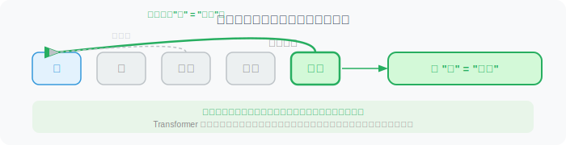
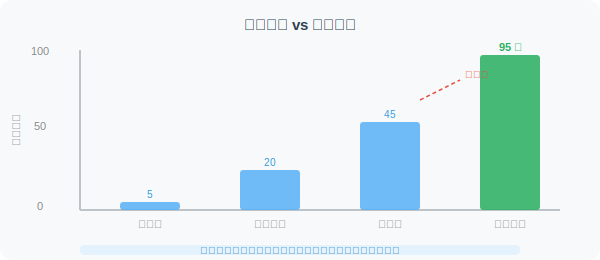
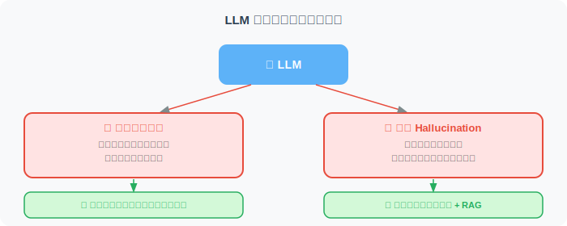

# LLM 是如何工作的？（直觉与底层逻辑的全面解构）

> 🧠 *"你不需要成为引擎工程师才能开好车——但理解引擎的每一个齿轮是如何咬合的，能让你在极端路况下完成完美的漂移。开发卓越的 AI Agent 亦是如此。"*

大语言模型（Large Language Model，简称 LLM）是当代 AI 技术的核心突破。很多开发者只是把 LLM 当作一个黑盒 API，输入 Prompt，接收回复。但在实际开发 Agent 时，你会遇到各种诡异的现象：模型为什么会产生幻觉？为什么同样的 Prompt 每次回答不同？为什么上下文一长它就“失忆”？

本节不会给你推导令人头秃的偏微分方程，而是通过直觉、类比和底层逻辑的剖析，带你真正理解 LLM 的工作机制——这是从“调包侠”进阶为顶级 Agent 架构师的必经之路。

## 1. 一个简单的起点：自回归的“下一个词”预测

揭开 LLM 智能面纱的第一步，是接受一个听起来有些反直觉的事实：**它根本没有在全局“思考”这句话该怎么回答，它只是在做极致的概率预测。**

传统的判别式算法（例如典型的 pCTR 或 pCVR 预估模型）通常输出的是 0 到 1 之间的单一连续概率，用于判断“点击”或“转化”的二分类或多分类。而 LLM 是一个**生成式模型**，它在每一步面对的，是一个包含数万甚至十万个 Token（词元）的超级多分类问题。

想象你在玩一场永无止境的文字接龙游戏：

```text
输入: "人工智能正在以惊人的速度___"

模型内部输出的概率分布 (Logits 经过 Softmax 后):
1. "发展" (85.2%)
2. "改变" (10.1%)
3. "崛起" (3.5%)
4. "毁灭" (0.8%)
...
(词表中的剩余 99,996 个词概率极小)
```

LLM 会根据这个概率分布采样出一个词（比如“发展”），然后**将这个新词拼接到原有的输入中，形成新的上下文，再次预测下一个词**。这种将自身的输出作为下一步输入的机制，被称为**自回归（Autoregressive）**。你看到的滔滔不绝的长篇大论，其实是模型几百上千次独立预测的累积结果。


> **💡 进阶直觉：温度（Temperature）与幻觉的硬币两面**
> 模型并不总是选择概率最高的那个词（这被称为贪婪解码 Greedy Decoding）。我们可以通过 `Temperature` 参数控制采样策略。
> * **T=0**：模型永远选最高概率的词，输出极度稳定，适合代码生成、JSON 格式化提取。
> * **T>0.7**：低概率词的权重被放大，模型变得极具跳跃性和创造力，适合文案生成，但也正是由于引入了低概率的“随机游走”，模型更容易产生“幻觉”（Hallucination）。

## 2. Transformer：注意力就是一切 (Attention Is All You Need)


现代 LLM 的基石是 2017 年提出的 **Transformer** 架构。在它之前，RNN/LSTM 模型像读书一样从左到右逐字阅读，遇到长句子就容易“边读边忘”。Transformer 彻底抛弃了顺序读取，它的核心灵魂是**自注意力机制（Self-Attention）**，让模型能**同时纵览全局**。

用一个比喻来理解注意力机制：
想象你在读这句话——*"她把苹果放进篮子，然后拿走了**它**。"*

"它"指的是什么？你的大脑会自动"关注"前文中的"篮子"（而不是"苹果"）。Transformer 在工程实现上，将其巧妙地转化为一个类似数据库查询的系统：
* **Query (查询 Q)**：当前正在处理的词（“它”）主动发出的寻呼信号。
* **Key (键 K)**：上文中所有词挂在自己身上的标签（“我是苹果”、“我是篮子”）。
* **Value (值 V)**：这些词真正的深层语义内容。

当前词的 Q 会去和上文所有词的 K 进行向量点积计算。匹配度越高，对应词的 V 就会以极大的比重融入到当前词的理解中。



为了捕捉全方位的联系，模型同时运行多套注意力机制（**多头注意力 Multi-Head Attention**），有的头负责找动宾搭配，有的头负责找代词还原。这种对上下文的极致榨取，构成了 Agent 理解复杂 Prompt 的底层基础。

## 3. 从预训练到对话：LLM 的“炼丹”三阶段

一个顶级的对话模型（如 GPT-4o、Claude 3.5 Sonnet）并不是一次性训练出来的。它的诞生是一场漫长的接力赛：


| 训练阶段 | 核心任务与比喻 | 数据与成本 | 产出物特征 |
| :--- | :--- | :--- | :--- |
| **1. 预训练 (Pre-training)** | **压缩世界知识**。就像让一个天才儿童读完人类所有的图书馆，只教他一件事：“猜下一个词”。 | 万亿级 Tokens (网页、代码、论文)；耗资上千万美元，数千张 GPU 跑数月。 | **基座模型 (Base Model)**：博学但桀骜不驯。你问它“如何炒菜”，它可能会续写“如何煮饭”。 |
| **2. 指令微调 (SFT)** | **行为规范化**。像新员工入职培训，教会它“问答”的范式，学会遵循人类指令。 | 数万到数十万条高质量的人工编写“问答对”。 | **指令模型 (Instruct Model)**：能够正常对话，按要求办事。 |
| **3. 人类反馈强化学习 (RLHF/DPO)** | **价值观对齐**。引入裁判模型，给回答打分，引导它变得安全、详尽、政治正确。 | 需要大量高薪人类专家进行偏好排序打分。 | **对话模型 (Chat Model)**：最终成品。情商高、有礼貌、拒绝回答有害问题。 |

> ⚠️ **Agent 开发者须知：对齐税 (Alignment Tax)**
> 经过 RLHF 的模型虽然“安全好用”，但也丧失了部分原始创造力，这被称为对齐税。对于某些极度垂直的 Agent 任务（如内部的自动化代码审计、非标准的数据清洗），直接微调第一阶段的基座模型，效果有时远好于使用高度对齐的商业对话 API。

## 4. 涌现能力：1+1 > 2 的神奇现象

当模型参数量和训练数据跨过某个临界点（通常认为是百亿参数量级）时，会突然像开挂一样，涌现出之前小模型完全不具备的高级能力。这被称为**涌现能力（Emergent Abilities）**。



小模型只是在学习语言的“统计规律”和“语法”，而大模型在海量数据的压缩过程中，被迫在内部构建了复杂的**世界模型（World Model）**和逻辑表征。典型的涌现能力包括：

- **少样本上下文学习 (Few-shot In-context Learning)**：Agent 开发的基石。无需改动模型代码，只需在 Prompt 里给几个例子，它就能现场学会全新任务。
- **思维链推理 (Chain of Thought, CoT)**：能够一步步推理解决复杂问题。
- **跨模态与跨语言迁移**：在 Python 上学到的逻辑抽象能力，能自然迁移到 C++ 或者伪代码中。

```python
# 涌现能力的一个典型例子：复杂推理与自我反思
prompt = """
Q: 如果所有的 Bloops 都是 Razzies，所有的 Razzies 都是 Lazzies，
   那么所有的 Bloops 都是 Lazzies 吗？
A: 让我一步步思考...
"""
# 几十亿参数的小模型会直接输出随机猜测（Yes/No）
# 千亿参数的大模型能够基于概念映射，输出严密的符号逻辑推导过程
```

## 5. Scaling Laws：越大越强的秘密

涌现能力并非玄学，背后有一条强大的经验法则——**Scaling Laws（缩放定律）**。

2020 年，OpenAI 发表论文揭示了一个惊人的规律：**模型性能（交叉熵 Loss 的下降）与三个因素成可预测的幂律关系**：

```
性能 ∝ f(模型参数量, 训练数据量, 计算量)
```

这意味着，只要无脑砸钱加算力、加数据，模型就会稳定变强。
随后 DeepMind 提出了 **Chinchilla 定律**（2022），进一步修正了这一法则：**在固定计算预算下，参数量和数据量应该等比例扩大。** 以前大家喜欢把参数做大（比如 175B），但数据喂得不够；现在的小模型（如 Llama 3 8B）用了惊人的 15T Token 训练，实现了对老牌大模型的全面超越。

> 💡 **对 Agent 开发的意义**：Scaling Laws 告诉我们，**选择更大/更新的模型几乎总是能直接提升 Agent 链路的成功率**。遇到 Agent 频繁失败时，第一步不是死磕 Prompt，而是换个更强的模型测试，判断是逻辑瓶颈还是模型能力瓶颈。

## 6. 推理模型的兴起：从"快思考"到"慢思考"

2024-2025 年，单纯依赖扩大参数量带来了极大的成本边际递减效应，一种新范式正在彻底重塑 Agent 的大脑——**推理模型（Reasoning Models）**。

传统 LLM 采用丹尼尔·卡尼曼所说的"System 1（快思考）"：看到输入，依靠直觉般的概率分布直接生成输出。
而推理模型（如 OpenAI o3、DeepSeek-R1）引入了"System 2（慢思考）"，它们在**推理时计算（Test-time Compute）**上发力：

```python
# 传统 LLM 的"快思考"
# 输入 → 直接输出最终答案（容易在复杂数学和规划问题上翻车）
response = "42"  

# 推理模型的"慢思考"
# 输入 → 触发后台 RL 强化的思维链 → 自我纠错 → 输出答案
thinking_process = """
[内部不可见思考过程]
让我分析这个问题...
首先分解子问题...尝试方案A...
等等，方案A在边界条件下会崩溃（自我反思）。
回溯，尝试方案B...
验证：结果是否合理？是的，推导成立。
"""
response = "42"  # 经过数万 Token 的深度推敲后给出
```

推理模型的核心特点：

| 维度 | 传统对话 LLM (GPT-4o) | 推理模型 (o3, R1) |
|------|---------|---------|
| **思考机制** | 概率分布的直接采样 | 基于强化学习搜索树 (MCTS等) 的探索 |
| **首字延迟** | 极低（毫秒~秒级） | 极高（十几秒~几分钟） |
| **复杂规划** | 较弱，容易产生幻觉 | 卓越，自带反思与试错能力 |
| **Agent 定位** | 交互路由、通用信息提取 | 复杂任务编排、多步代码 Debug、深度调研 |

> 💡 **架构启示：混合路由策略**：顶级 Agent 系统不会全盘使用推理模型（太慢且贵）。正确做法是：用极其便宜快速的基座模型做意图识别和工具分发；当遇到需要长路径规划和硬核推演的任务时，动态路由给慢思考的推理模型。

## 7. 上下文窗口：Agent 的"工作记忆"与 KV Cache 危机

LLM 有一个绝对的物理限制：**上下文窗口（Context Window）**。模型在每次生成时，只能"看到"有限数量的 Token。超出窗口的内容，模型会在底层计算中直接截断。

在底层工程上，模型为了加速生成，会将计算过的历史 Token 状态保存在显存中（称为 **KV Cache**）。几十万的超长上下文，意味着巨大的显存消耗和算力成本。


| 模型 | 上下文窗口 | 大致等效信息量 |
|------|---------------|---------------|
| GPT-4o / DeepSeek V3 | 128K Token | 一本 300 页的中篇小说 |
| Claude 3.5 Sonnet | 200K Token | 几份详实的研报或整个项目的核心代码库 |
| Gemini 1.5 Pro | 1M - 2M Token | 整个哈利波特系列，或数小时的高清视频库 |

此外，超长上下文还伴随着一个致命的工程陷阱——**迷失在中间 (Lost in the middle)**：模型对文档开头和结尾的信息记忆犹新，但极容易忽略塞在长文本中间的细节。

这就是为什么 Agent 开发者不能无脑把所有东西塞进 Prompt。你必须构建**记忆管理机制**（总结压缩短期记忆）和 **RAG（检索增强生成）系统**（利用向量数据库进行精准的按需召回）。

## 8. 核心局限：知识截止与幻觉的本质

设计健壮的 Agent 时，开发者必须把 LLM 的两个固有“缺陷”视为系统设计的出发点：



1. **知识截止日期 (Knowledge Cutoff)**：模型的神经网络权重在训练结束的那一刻就“冻结”了。它不知道今天的天气，也不知道刚刚发布的财报。
    * *Agent 应对：* 必须为其赋予 **Tool Calling（工具调用）** 能力，让其自主查询 API 和搜索引擎。
2. **幻觉 (Hallucination)**：请记住，LLM 不是数据库，它是概率预测机。所谓幻觉，本质上是模型在连续的隐空间（Latent Space）中进行的一种“插值平滑计算”。它在用合理的语法拼接出似是而非的事实。
    * *Agent 应对：* 幻觉不可消除，只能在工程链路上通过**外部知识源比对 (RAG)**、**多 Agent 辩论 (Debate)** 以及**代码沙盒执行验证**来防御。

## 9. 总结与对 Agent 开发的启示

理解了 LLM 的工作机制，我们为后续的 Agent 实战沉淀出以下心法：

1. **它是概率引擎，拥抱不确定性**：相同的输入未必产生相同输出。Agent 链路设计中，必须引入容错、重试和格式校验机制。
2. **上下文即算力，Prompt 即代码**：你给出的上下文质量决定了模型注意力的聚焦点。优化 Prompt 本质上是在优化注意力权重的分配。
3. **不要把它当全知全能的神**：把它当成一个智商 140 但被关在黑屋子里且患有轻度失忆症的天才。你需要为它提供外部记忆（Vector DB）和感知外界的手脚（Tools）。

| 核心概念 | 底层原理 | 对 Agent 开发的指导意义 |
|------|---------|-----------------------|
| **生成机制** | 自回归 Next-Token 预测 | 利用 Temperature 权衡稳定性与创造力 |
| **理解机制** | 多头自注意力 (Self-Attention) | 关键信息放在开头/结尾，避免 Lost in the middle |
| **模型演进** | Pre-train -> SFT -> RLHF | 根据任务需要（创造力 vs 依从性）选择合适的模型层级 |
| **慢思考** | 推理期计算 (Test-time compute) | 复杂规划和 Debug 任务路由给推理模型 (如 o3/R1) |
| **核心局限** | 权重冻结，概率插值导致幻觉 | 必须构建 Tools 体系与 RAG 检索体系 |

---

*参考文献与延伸阅读：*
* *Vaswani, A. et al. (2017). "Attention Is All You Need." (Transformer 奠基之作)*
* *Kaplan, J. et al. (2020). "Scaling Laws for Neural Language Models." (OpenAI 关于模型缩放定律的论述)*
* *Wei, J. et al. (2022). "Chain-of-Thought Prompting Elicits Reasoning in Large Language Models." (思维链揭秘)*

---

*下一节：[3.2 Prompt Engineering：与模型对话的艺术](./02_prompt_engineering.md)*