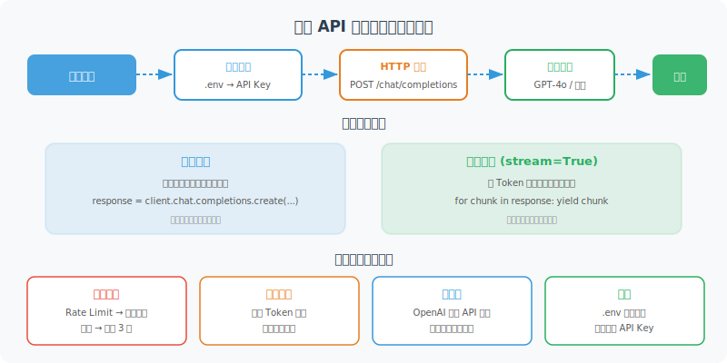

# 模型 API 调用入门（OpenAI / 开源模型）

理论学够了，动手写代码！本节将带你完成第一次真正的模型 API 调用，并掌握流式输出、错误处理等生产环境必备技能。



## 环境准备

```bash
# 安装必要的库
pip install openai python-dotenv

# 创建 .env 文件存储 API Key（不要硬编码在代码里！）
echo "OPENAI_API_KEY=your-api-key-here" > .env
```

```python
# config.py：统一的配置管理
import os
from dotenv import load_dotenv

load_dotenv()  # 从 .env 文件加载环境变量

OPENAI_API_KEY = os.getenv("OPENAI_API_KEY")
if not OPENAI_API_KEY:
    raise ValueError("请设置 OPENAI_API_KEY 环境变量")
```

## OpenAI SDK：最基础的调用

```python
from openai import OpenAI
import os

client = OpenAI(api_key=os.getenv("OPENAI_API_KEY"))

# 最简单的调用
def simple_chat(message: str) -> str:
    """最基本的单轮对话"""
    response = client.chat.completions.create(
        model="gpt-4o-mini",  # 便宜又快的入门模型
        messages=[
            {"role": "user", "content": message}
        ]
    )
    return response.choices[0].message.content

# 测试
answer = simple_chat("用一句话解释什么是 Python 的 GIL？")
print(answer)
```

## 多轮对话管理

在 Agent 开发中，维护对话历史是关键：

```python
class ChatSession:
    """管理多轮对话历史的简单封装"""
    
    def __init__(self, system_prompt: str = None, model: str = "gpt-4o-mini"):
        self.model = model
        self.messages = []
        
        if system_prompt:
            self.messages.append({
                "role": "system",
                "content": system_prompt
            })
    
    def chat(self, user_message: str) -> str:
        """发送消息并获取回复"""
        # 添加用户消息
        self.messages.append({
            "role": "user",
            "content": user_message
        })
        
        # 调用 API
        response = client.chat.completions.create(
            model=self.model,
            messages=self.messages
        )
        
        # 获取回复
        assistant_message = response.choices[0].message.content
        
        # 保存到历史
        self.messages.append({
            "role": "assistant",
            "content": assistant_message
        })
        
        return assistant_message
    
    def clear_history(self):
        """清除对话历史（保留 system prompt）"""
        system_msgs = [m for m in self.messages if m["role"] == "system"]
        self.messages = system_msgs
    
    def get_history(self) -> list:
        """获取对话历史"""
        return [m for m in self.messages if m["role"] != "system"]

# 使用示例
session = ChatSession(
    system_prompt="你是一位专业的 Python 编程导师，讲解要简洁易懂。"
)

# 多轮对话
questions = [
    "什么是装饰器？",
    "能给一个实际的使用例子吗？",
    "如何给装饰器传参数？"
]

for q in questions:
    print(f"\n用户：{q}")
    answer = session.chat(q)
    print(f"助手：{answer}")
```

## 流式输出：实时显示生成内容

流式输出让用户体验更好——不用等模型全部生成完再显示：

```python
def stream_chat(message: str, system: str = None) -> str:
    """流式输出，实时打印生成内容"""
    
    messages = []
    if system:
        messages.append({"role": "system", "content": system})
    messages.append({"role": "user", "content": message})
    
    # stream=True 开启流式模式
    stream = client.chat.completions.create(
        model="gpt-4o",
        messages=messages,
        stream=True
    )
    
    full_response = ""
    print("助手：", end="", flush=True)
    
    for chunk in stream:
        # 每个 chunk 包含一小段文本
        if chunk.choices[0].delta.content is not None:
            content = chunk.choices[0].delta.content
            print(content, end="", flush=True)
            full_response += content
    
    print()  # 换行
    return full_response

# 测试流式输出
result = stream_chat("写一首关于 Python 的短诗")
print(f"\n完整内容（{len(result)} 字）")
```

```python
# 异步流式输出（生产环境推荐）
import asyncio
from openai import AsyncOpenAI

async_client = AsyncOpenAI()

async def async_stream_chat(message: str) -> str:
    """异步流式输出"""
    stream = await async_client.chat.completions.create(
        model="gpt-4o",
        messages=[{"role": "user", "content": message}],
        stream=True
    )
    
    full_response = ""
    async for chunk in stream:
        if chunk.choices[0].delta.content is not None:
            content = chunk.choices[0].delta.content
            print(content, end="", flush=True)
            full_response += content
    
    return full_response

# 运行异步函数
asyncio.run(async_stream_chat("解释一下什么是异步编程"))
```

## 错误处理：生产环境必备

```python
from openai import OpenAI, RateLimitError, APIError, APITimeoutError
import time
import logging

logger = logging.getLogger(__name__)

def robust_chat(
    message: str,
    max_retries: int = 3,
    retry_delay: float = 1.0
) -> str:
    """带重试机制的鲁棒调用"""
    
    for attempt in range(max_retries):
        try:
            response = client.chat.completions.create(
                model="gpt-4o-mini",
                messages=[{"role": "user", "content": message}],
                timeout=30  # 30秒超时
            )
            return response.choices[0].message.content
            
        except RateLimitError as e:
            # 触发速率限制，等待后重试
            wait_time = retry_delay * (2 ** attempt)  # 指数退避
            logger.warning(f"触发速率限制，{wait_time}秒后重试（第{attempt+1}次）")
            time.sleep(wait_time)
            
        except APITimeoutError:
            logger.warning(f"请求超时，重试中（第{attempt+1}次）")
            time.sleep(retry_delay)
            
        except APIError as e:
            if e.status_code >= 500:  # 服务器错误，可以重试
                logger.error(f"API 服务器错误 {e.status_code}，重试中")
                time.sleep(retry_delay)
            else:  # 客户端错误（400等），不重试
                raise
    
    raise RuntimeError(f"API 调用在 {max_retries} 次重试后仍然失败")

# 使用示例
try:
    result = robust_chat("你好，今天天气怎么样？")
    print(result)
except RuntimeError as e:
    print(f"调用失败：{e}")
```

## 调用开源模型：Ollama 本地部署

如果不想依赖付费 API，可以使用开源模型本地运行：

```bash
# 安装 Ollama（本地模型运行框架）
# macOS/Linux:
curl -fsSL https://ollama.ai/install.sh | sh

# 拉取并运行模型
ollama pull llama4
ollama run llama4
```

```python
# Ollama 兼容 OpenAI API 格式！
from openai import OpenAI

# 指向本地 Ollama 服务
ollama_client = OpenAI(
    base_url="http://localhost:11434/v1",
    api_key="ollama"  # Ollama 不需要真实 API Key
)

def chat_with_ollama(message: str, model: str = "llama4") -> str:
    """调用本地 Ollama 模型"""
    response = ollama_client.chat.completions.create(
        model=model,
        messages=[{"role": "user", "content": message}]
    )
    return response.choices[0].message.content

# 使用方式完全相同！
result = chat_with_ollama("你好，介绍一下自己")
print(result)
```

## 调用国内模型：以通义千问为例

```python
# 通义千问 / DashScope 兼容 OpenAI 格式
from openai import OpenAI

qwen_client = OpenAI(
    api_key=os.getenv("DASHSCOPE_API_KEY"),
    base_url="https://dashscope.aliyuncs.com/compatible-mode/v1"
)

def chat_with_qwen(message: str) -> str:
    response = qwen_client.chat.completions.create(
        model="qwen-plus",
        messages=[{"role": "user", "content": message}]
    )
    return response.choices[0].message.content

# 智谱 AI（GLM 系列）
zhipu_client = OpenAI(
    api_key=os.getenv("ZHIPU_API_KEY"),
    base_url="https://open.bigmodel.cn/api/paas/v4/"
)

# 百川 AI
baichuan_client = OpenAI(
    api_key=os.getenv("BAICHUAN_API_KEY"),
    base_url="https://api.baichuan-ai.com/v1"
)
```

## 完整的 LLM 调用封装

实际项目中，建议封装一个统一的 LLM 客户端：

```python
from enum import Enum
from dataclasses import dataclass
from typing import Optional, Generator
import os

class ModelProvider(Enum):
    OPENAI = "openai"
    OLLAMA = "ollama"
    QWEN = "qwen"
    DEEPSEEK = "deepseek"
    ZHIPU = "zhipu"

@dataclass
class LLMConfig:
    provider: ModelProvider
    model: str
    temperature: float = 0.7
    max_tokens: int = 2000
    timeout: int = 30

class UnifiedLLMClient:
    """统一的 LLM 调用客户端，支持多个提供商"""
    
    def __init__(self, config: LLMConfig):
        self.config = config
        self.client = self._create_client()
    
    def _create_client(self) -> OpenAI:
        """根据配置创建对应的客户端"""
        configs = {
            ModelProvider.OPENAI: {
                "api_key": os.getenv("OPENAI_API_KEY"),
                "base_url": None
            },
            ModelProvider.OLLAMA: {
                "api_key": "ollama",
                "base_url": "http://localhost:11434/v1"
            },
            ModelProvider.QWEN: {
                "api_key": os.getenv("DASHSCOPE_API_KEY"),
                "base_url": "https://dashscope.aliyuncs.com/compatible-mode/v1"
            },
            ModelProvider.DEEPSEEK: {
                "api_key": os.getenv("DEEPSEEK_API_KEY"),
                "base_url": "https://api.deepseek.com"
            },
            ModelProvider.ZHIPU: {
                "api_key": os.getenv("ZHIPU_API_KEY"),
                "base_url": "https://open.bigmodel.cn/api/paas/v4/"
            }
        }
        
        provider_config = configs[self.config.provider]
        return OpenAI(**{k: v for k, v in provider_config.items() if v is not None})
    
    def chat(self, messages: list, stream: bool = False):
        """统一的对话接口"""
        kwargs = {
            "model": self.config.model,
            "messages": messages,
            "temperature": self.config.temperature,
            "max_tokens": self.config.max_tokens,
            "stream": stream
        }
        
        return self.client.chat.completions.create(**kwargs)
    
    def simple_chat(self, message: str, system: str = None) -> str:
        """简单的单轮对话"""
        messages = []
        if system:
            messages.append({"role": "system", "content": system})
        messages.append({"role": "user", "content": message})
        
        response = self.chat(messages)
        return response.choices[0].message.content

# 使用示例
# 使用 OpenAI
openai_llm = UnifiedLLMClient(LLMConfig(
    provider=ModelProvider.OPENAI,
    model="gpt-4o-mini",
    temperature=0.7
))

# 使用本地 Ollama
local_llm = UnifiedLLMClient(LLMConfig(
    provider=ModelProvider.OLLAMA,
    model="llama4",
    temperature=0.5
))

# 无论哪个提供商，接口完全一致
result = openai_llm.simple_chat("Python 和 JavaScript 的主要区别是什么？")
print(result)
```

---

## 小结

本节掌握了 LLM API 调用的核心技能：

| 技能 | 要点 |
|------|------|
| 基础调用 | `client.chat.completions.create()` + messages 列表 |
| 多轮对话 | 维护 messages 历史，包含 assistant 消息 |
| 流式输出 | `stream=True`，迭代 chunks |
| 错误处理 | 重试机制 + 指数退避 |
| 多模型支持 | 大多数国产/开源模型兼容 OpenAI 格式 |

下一节，我们深入了解影响模型输出的关键参数。

---

*下一节：[3.5 Token、Temperature 与模型参数详解](./05_model_parameters.md)*
