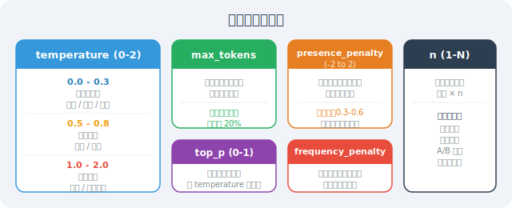

# Token、Temperature 与模型参数详解

模型参数是影响 LLM 输出质量、成本和稳定性的关键因素。在 2026 年模型能力极速迭代的今天（如 Claude 4.6、Gemini 3.1 Pro、DeepSeek-R1 等），理解这些底层参数，能让你更精准地控制 Agent 的行为与成本。

## Token：模型的"基本单位"

Token 不等于字符，不等于单词，而是模型处理文本的**最小单位**。

```python
import tiktoken  # Token 计数库（注：此处以 OpenAI 体系为例演示核心原理，2026 年不同厂商如 Qwen、Gemini 均有专属的 Tokenizer，但底层逻辑相通）

def count_tokens(text: str, model_encoding: str = "cl100k_base") -> int:
    """计算文本的 Token 数量"""
    encoding = tiktoken.get_encoding(model_encoding)
    tokens = encoding.encode(text)
    return len(tokens)

def visualize_tokens(text: str, model_encoding: str = "cl100k_base"):
    """可视化 Token 分割"""
    encoding = tiktoken.get_encoding(model_encoding)
    tokens = encoding.encode(text)
    
    print(f"文本：{text}")
    print(f"Token 数量：{len(tokens)}")
    print(f"Token 列表：{[encoding.decode([t]) for t in tokens]}")
    print()

# 英文分词示例
visualize_tokens("Hello, how are you today?")
# Token 列表：['Hello', ',', ' how', ' are', ' you', ' today', '?']
# Token 数量：7

# 中文分词示例（中文通常更多 Token，不同模型切词粒度差异较大）
visualize_tokens("你好，今天天气怎么样？")
# 中文每个字通常占 0.5 到 2 个 Token 不等

# 代码的 Token 计数
code = """
def fibonacci(n):
    if n <= 1:
        return n
    return fibonacci(n-1) + fibonacci(n-2)
"""
visualize_tokens(code)
```

**Token 与计费的关系：**

> ⏰ *注：以下价格数据基于 2026 年 3 月各厂商官网公开定价，模型价格调整频繁，请以最新官方文档为准。*

```python
# Token 成本计算器（价格单位：美元/百万 Token，2026-03 最新数据）
PRICE_PER_1M_TOKENS = {
    "claude-4.6-sonnet": {"input": 3.0, "output": 15.0},      # 逻辑最强，价格较高
    "gemini-3.1-pro-preview": {"input": 2.0, "output": 12.0}, # 超长上下文与多模态王者
    "qwen-3.5-max": {"input": 1.2, "output": 6.0},            # 业务主力，性价比高
    "kimi-2.5": {"input": 1.0, "output": 3.0},                # 适合超长文本检索提取
    "deepseek-r1": {"input": 0.55, "output": 2.19},           # 推理模型(Reasoning)性价比之王
}

def estimate_cost(
    input_text: str,
    expected_output_tokens: int,
    model: str = "qwen-3.5-max"
) -> dict:
    """估算 API 调用成本"""
    input_tokens = count_tokens(input_text)
    
    price = PRICE_PER_1M_TOKENS.get(model, {"input": 1.0, "output": 2.0})
    input_cost = (input_tokens / 1_000_000) * price["input"]
    output_cost = (expected_output_tokens / 1_000_000) * price["output"]
    
    return {
        "input_tokens": input_tokens,
        "expected_output_tokens": expected_output_tokens,
        "total_tokens": input_tokens + expected_output_tokens,
        "estimated_cost_usd": input_cost + output_cost,
        "estimated_cost_cny": (input_cost + output_cost) * 7.2  # 近似汇率
    }

# 估算成本
prompt = "请为我写一篇关于 Python 异步编程的500字文章"
cost = estimate_cost(prompt, 500, "qwen-3.5-max")
print(f"输入 Token：{cost['input_tokens']}")
print(f"预估总成本：¥{cost['estimated_cost_cny']:.4f}")
```

**Token 使用的关键规律：**
- 英文约 1 Token/词
- 中文约 0.5~1 Token/字 (视模型编码器而定，目前国产大模型切词效率极高)
- 代码约 1-2 Token/行
- 数字和标点各占约 1 Token

### 不同内容类型的 Token 消耗详解

直觉上你可能会以为"一个字 = 一个 Token"，但实际情况远比这复杂。下面我们用具体示例拆解不同内容类型的 Token 消耗：

```python
import tiktoken

encoding = tiktoken.get_encoding("cl100k_base")

# === 英文文本 ===
# 常见英文单词通常是 1 个 Token，短词/常见组合可能合并
samples_en = {
    "Hello":              encoding.encode("Hello"),           # 1 Token
    "artificial":         encoding.encode("artificial"),      # 1 Token（常见词）
    "superintelligence":  encoding.encode("superintelligence"),  # 2 Token（长/少见词）
    "Hello, world!":      encoding.encode("Hello, world!"),   # 4 Token
    "The quick brown fox jumps over the lazy dog.":
        encoding.encode("The quick brown fox jumps over the lazy dog."),  # 10 Token
}

for text, tokens in samples_en.items():
    decoded = [encoding.decode([t]) for t in tokens]
    print(f"'{text}' → {len(tokens)} Token，分割：{decoded}")

# 规律：
# - 常见英文单词约 1 Token/词，不常见或超长单词会被拆成 2-3 个 Token
# - 空格通常与后面的单词合并为 1 个 Token（如 ' how'）
# - 平均来看，英文文本约 1 Token ≈ 4 个字符（含空格）
```

```python
# === 中文文本 ===
samples_cn = {
    "你":       encoding.encode("你"),         # 1 Token
    "好":       encoding.encode("好"),         # 1 Token
    "你好":     encoding.encode("你好"),       # 1 Token（常见组合会合并）
    "今天天气怎么样":  encoding.encode("今天天气怎么样"),   # 约 4 Token
    "人工智能":  encoding.encode("人工智能"),    # 约 2 Token
    "深度强化学习": encoding.encode("深度强化学习"),  # 约 3 Token
}

for text, tokens in samples_cn.items():
    decoded = [encoding.decode([t]) for t in tokens]
    print(f"'{text}' → {len(tokens)} Token，分割：{decoded}")

# 规律：
# - 常见中文字 1 个字 ≈ 1 个 Token
# - 高频词组（如"你好""人工""智能"）可能被合并为 1 个 Token
# - 罕见汉字可能占 2-3 个 Token（因为需要多个字节编码）
# - 同样语义的内容，中文 Token 数通常是英文的 1.5～2 倍（但 2026 年的新模型如 Qwen 已经极大优化了中文压缩率）
```

```python
# === 标点符号 ===
samples_punct = {
    "，":   encoding.encode("，"),     # 中文逗号：1 Token
    "。":   encoding.encode("。"),     # 中文句号：1 Token
    ",":    encoding.encode(","),      # 英文逗号：1 Token
    ".":    encoding.encode("."),      # 英文句号：1 Token
    "！？": encoding.encode("！？"),   # 两个标点 → 通常 2 Token
    "...":  encoding.encode("..."),    # 英文省略号：可能 1 Token
    "——":   encoding.encode("——"),     # 中文破折号：2 Token
    "「」": encoding.encode("「」"),   # 中文引号：2 Token
}

for text, tokens in samples_punct.items():
    decoded = [encoding.decode([t]) for t in tokens]
    print(f"'{text}' → {len(tokens)} Token，分割：{decoded}")

# 规律：
# - 英文常见标点（, . ! ? : ;）通常 1 个 = 1 Token
# - 中文标点（，。！？）也通常 1 个 = 1 Token
# - 特殊/罕见标点可能消耗更多 Token
# - 标点经常和相邻的文字合并（如 'world!' 可能是 1 个 Token）
```

```python
# === 数字 ===
samples_num = {
    "42":       encoding.encode("42"),         # 1 Token
    "3.14":     encoding.encode("3.14"),       # 2 Token（小数点拆分）
    "2026":     encoding.encode("2026"),       # 1 Token
    "1000000":  encoding.encode("1000000"),    # 1-2 Token
    "3.141592653589793": encoding.encode("3.141592653589793"),  # 多个 Token
}

for text, tokens in samples_num.items():
    decoded = [encoding.decode([t]) for t in tokens]
    print(f"'{text}' → {len(tokens)} Token，分割：{decoded}")

# 规律：
# - 1-4 位整数通常为 1 Token
# - 较长数字会被拆分，每 3-4 位约占 1 Token
# - 小数点会导致额外的 Token 拆分
```

**图像的 Token 消耗（多模态模型）：**

2026 年是多模态 Agent 爆发的一年。像 Gemini 3.1 Pro 或 Claude 4.6 这样的模型处理图像时，计费不再按字符，而是基于“图像分块（Tiles）”：

```python
# 图像 Token 消耗通用规则估算（以主流分块逻辑为例）

def estimate_image_tokens(width: int, height: int, detail: str = "auto") -> int:
    """
    估算图像消耗的 Token 数量
    
    detail 模式：
    - "low"：固定基础消耗，不管图像多大（通常约 85 Token）
    - "high"：根据图像尺寸计算，切割为多个区块，可能消耗数百到数千 Token
    - "auto"：模型自动选择
    """
    if detail == "low":
        return 85  # 固定消耗
    
    # high detail 模式的计算规则（以典型 512x512 切割算法为例）：
    # 1. 限制最大边长并按比例缩放
    max_dim = max(width, height)
    if max_dim > 2048:
        scale = 2048 / max_dim
        width = int(width * scale)
        height = int(height * scale)
    
    # 2. 计算需要多少个 512x512 的块
    tiles_x = (width + 511) // 512   # 向上取整
    tiles_y = (height + 511) // 512
    num_tiles = tiles_x * tiles_y
    
    # 3. 每个块消耗特定 Token (如 170) + 基础 Token (如 85)
    total_tokens = num_tiles * 170 + 85
    return total_tokens

# 常见图像尺寸的 Token 消耗
print("=== 多模态图像 Token 消耗估算（high detail 模式）===")
image_sizes = [
    (256, 256,   "缩略图/图标"),
    (512, 512,   "小图"),
    (1024, 768,  "普通照片"),
    (1920, 1080, "全高清截图"),
    (4096, 2160, "4K 图像"),
]

for w, h, desc in image_sizes:
    tokens_low = estimate_image_tokens(w, h, "low")
    tokens_high = estimate_image_tokens(w, h, "high")
    print(f"  {desc} ({w}x{h})：low={tokens_low}, high={tokens_high} Token")

# 输出示例：
#   缩略图/图标 (256x256)：  low=85,  high=255 Token
#   小图 (512x512)：         low=85,  high=255 Token
#   普通照片 (1024x768)：    low=85,  high=765 Token
#   全高清截图 (1920x1080)： low=85,  high=1445 Token
#   4K 图像 (4096x2160)：    low=85,  high=1445 Token (缩放截断后)
```

> 💡 **实用提示：** 如果你的 Agent 需要频繁处理图像（如网页 UI 截图分析），先在本地代码里将图像压缩到 1080p 以下，或者在非 OCR 场景使用 `detail="low"`，可以为你省下极其可观的 API 费用！

下面是一张各类内容 Token 消耗的速查表：

| 内容类型 | 示例 | 约消耗 Token |
|---------|------|-------------|
| 英文单词 | "Hello" | 1 Token/词 |
| 英文长/罕见词 | "superintelligence" | 2-3 Token/词 |
| 中文常见字 | "你"、"好" | 0.5~1 Token/字 |
| 中文高频词组 | "人工智能" | 可能合并为 1-2 Token |
| 中文罕见字 | 生僻汉字 | 2-3 Token/字 |
| 英文标点 | `, . ! ?` | 1 Token/个 |
| 中文标点 | `，。！？` | 1 Token/个 |
| 数字(1-4位) | "42"、"2026" | 1 Token |
| 长数字 | "3.141592653589793" | 按 3-4 位拆分 |
| 代码 | Python/JS 等 | 约 1-2 Token/行 |
| 图像(low) | 任意尺寸 | 固定 85 Token |
| 图像(high) | 1920×1080 | ~1445 Token |

## Temperature：创造力旋钮

Temperature 控制输出的**随机性**，是最重要的参数之一：

```python
from openai import OpenAI
client = OpenAI() # 兼容主流大模型 API 格式

def test_temperature(prompt: str, temperatures: list, runs: int = 3):
    """对比不同 Temperature 的输出效果"""
    
    for temp in temperatures:
        print(f"\n{'='*50}")
        print(f"Temperature = {temp}")
        print('='*50)
        
        for i in range(runs):
            response = client.chat.completions.create(
                model="qwen-3.5-max",
                messages=[{"role": "user", "content": prompt}],
                temperature=temp,
                max_tokens=50
            )
            print(f"  运行 {i+1}：{response.choices[0].message.content}")

# 测试创意写作（高 Temperature 更好）
test_temperature(
    "用一句话描述春天",
    temperatures=[0.0, 0.7, 1.5],
    runs=3
)
# Temperature=0.0：每次输出完全相同（绝对确定性）
# Temperature=0.7：有一定变化，语言流畅自然
# Temperature=1.5：高度发散创意，但词汇可能跳跃或不连贯
```

**不同场景的 Temperature 推荐值：**

```python
TEMPERATURE_GUIDE = {
    "代码生成": 0.1,          # 要求精确，低随机性
    "数据提取/JSON格式化": 0.0, # 完全确定性，防崩溃
    "问答/事实查询": 0.3,      # 稍微稳定
    "文案/摘要": 0.7,         # 平衡创意和准确
    "头脑风暴/创意": 1.0,      # 鼓励多样性
    "诗歌/创意写作": 1.2,      # 高创意
    "Agent 逻辑路由": 0.1,    # 工具调用需要极度稳定
    "对话/闲聊": 0.8,         # 自然对话
}

def get_optimal_temperature(task_type: str) -> float:
    return TEMPERATURE_GUIDE.get(task_type, 0.7)
```

## Top-p：另一种控制随机性的方式

Top-p（也叫 Nucleus Sampling）从概率最高的词集合中动态截断并采样，集合大小由 p 决定：

```python
# Top-p 与 Temperature 的配合使用
response = client.chat.completions.create(
    model="qwen-3.5-max",
    messages=[{"role": "user", "content": "写一个关于 AI 觉醒的短故事开头"}],
    temperature=0.8,   # 控制随机程度
    top_p=0.9,         # 只从概率总和前 90% 的核心词汇中选择
    max_tokens=200
)
```

**Temperature vs Top-p 的区别：**

| 参数 | 机制 | 业界推荐做法 |
|------|------|---------|
| Temperature | 整体缩放全部词汇的概率分布 | **通常优先调节此参数** |
| Top-p | 直接“砍掉”低概率长尾词 | 两个参数**不要同时大幅调整** |

通常选择其中一个调整，另一个保持默认（`temperature=1.0` 或 `top_p=1.0`）。

## max_tokens：控制输出长度（⚠️ 推理模型的隐蔽陷阱）

```python
def chat_with_length_control(
    message: str,
    max_output_tokens: int = 500,
    model: str = "qwen-3.5-max"
) -> dict:
    """控制输出长度"""
    
    response = client.chat.completions.create(
        model=model,
        messages=[{"role": "user", "content": message}],
        max_tokens=max_output_tokens  # 限制生成长度
    )
    
    usage = response.usage
    content = response.choices[0].message.content
    finish_reason = response.choices[0].finish_reason
    
    return {
        "content": content,
        "total_tokens": usage.total_tokens,
        "finish_reason": finish_reason  # "stop"=正常结束, "length"=达到上限被截断
    }

# 常规模型测试
result = chat_with_length_control("写一篇500字的文章", max_output_tokens=100)
if result["finish_reason"] == "length":
    print("⚠️ 输出被 max_tokens 截断了！")
```

> **🔥 2026 年硬核预警：推理模型（如 DeepSeek-R1）的 CoT Token 陷阱**
> 如果你使用的是像 `DeepSeek-R1` 这样的“慢思考”推理模型，千万不要把 `max_tokens` 设得太小！
> 
> 推理模型在给出最终答案前，会输出大量的内部“思维链”（Chain of Thought）。这些思考过程**同样受限于 max_tokens 且会计费**。如果你为了省钱把 `max_tokens` 设为 500，模型很可能在思考阶段就把额度耗尽了，导致你连最终答案都拿不到。
> * **最佳实践：** 调用推理模型处理复杂规划时，将 `max_tokens` 放宽至 4000 甚至 8000。

## Presence Penalty & Frequency Penalty：控制重复

```python
# 这两个参数帮助避免模型像车轱辘话一样重复自己
response = client.chat.completions.create(
    model="qwen-3.5-max",
    messages=[{"role": "user", "content": "列举10种不同的创业方向"}],
    
    # presence_penalty：存在惩罚（只要出现过就惩罚，鼓励开启新话题）
    # 范围：-2.0 到 2.0，正值降低话题重复率
    presence_penalty=0.5,
    
    # frequency_penalty：频率惩罚（用的次数越多越不想用，鼓励词汇丰富度）
    # 范围：-2.0 到 2.0，正值降低高频词
    frequency_penalty=0.3,
)

# 适合用于：需要列举多样选项、生成长篇不重复研报的场景
```

## stop：自定义停止条件

```python
# 让模型在特定字符串处戛然而止，这招在数据提取时极其省钱
response = client.chat.completions.create(
    model="qwen-3.5-max",
    messages=[{
        "role": "user",
        "content": "请按格式输出：\n名称：\n价格：\n描述："
    }],
    stop=["描述："],  # 一旦生成到"描述："这个词，立即强行停止 API 生成
)

# 实用场景：结构化数据防废话提取
def extract_until_marker(text: str, stop_marker: str) -> str:
    """提取直到某个标记符的内容，防止大模型后面补充寒暄废话"""
    response = client.chat.completions.create(
        model="kimi-2.5",
        messages=[{"role": "user", "content": text}],
        stop=[stop_marker]
    )
    return response.choices[0].message.content
```

## n：生成多个候选结果

```python
def generate_multiple_options(prompt: str, n: int = 3) -> list:
    """一次 API 调用生成多个平行候选结果，供业务下游做选择或打分"""
    
    response = client.chat.completions.create(
        model="qwen-3.5-max",
        messages=[{"role": "user", "content": prompt}],
        n=n,             # 生成 n 个不同分支的回复
        temperature=0.9  # 必须调高 temperature 确保不同分支的多样性
    )
    
    return [choice.message.content for choice in response.choices]

# 适合：广告文案标题生成、A/B测试方案、多 Agent 辩论初稿
titles = generate_multiple_options(
    "为一篇关于 Agent 多智能体协同的技术博客生成3个吸引人的标题",
    n=3
)
for i, title in enumerate(titles, 1):
    print(f"候选 {i}：{title}")
```

## 完整参数参考与 Agent 实践建议

在实际的 Agent 架构设计中，我们通常会封装一个路由工厂，根据具体任务的属性动态切换底座模型和参数配置：

```python
def create_agent_call(
    messages: list,
    task_type: str = "general",
    **override_params
) -> dict:
    """
    Agent 调用的最佳实践封装工厂
    根据任务类型自动匹配最优的 2026 最新模型与参数
    """
    
    # 不同任务类型的动态路由预设
    task_presets = {
        "reasoning": {          # 复杂推理、逻辑 Bug 排查
            "model": "deepseek-r1", # 使用强大的推理模型
            "temperature": 0.6,     # 推理模型自带内部探索，通常不需要过低的温度
            "max_tokens": 8000,     # 必须预留大量 Token 供其生成思考链 (CoT)
        },
        "code": {               # 纯代码编写/重构
            "model": "claude-4.6-sonnet", # 编程天花板
            "temperature": 0.1,
            "max_tokens": 4000,
        },
        "extraction": {         # 信息提取、意图分类、JSON 生成
            "model": "kimi-2.5",    # 性价比极高，处理长文本块便宜
            "temperature": 0.0,     # 杜绝任何随机性导致 JSON 解析崩溃
            "max_tokens": 500,
        },
        "creative": {           # 创意文案、脑暴
            "model": "qwen-3.5-max",
            "temperature": 0.9,
            "max_tokens": 1000,
            "presence_penalty": 0.3,
        },
        "general": {            # 通用闲聊与常规指令
            "model": "qwen-3.5-max",
            "temperature": 0.7,
            "max_tokens": 1500,
        }
    }
    
    params = task_presets.get(task_type, task_presets["general"])
    params.update(override_params)  # 允许外部业务层覆盖默认参数
    params["messages"] = messages
    
    response = client.chat.completions.create(**params)
    
    return {
        "content": response.choices[0].message.content,
        "usage": {
            "input": response.usage.prompt_tokens,
            "output": response.usage.completion_tokens,
            "total": response.usage.total_tokens
        },
        "model": response.model,
        "finish_reason": response.choices[0].finish_reason
    }

# 使用示例：要求 Agent 根据文案生成提取结论
result = create_agent_call(
    messages=[{"role": "user", "content": "从这段文字中提取用户购买意向评级..."}],
    task_type="extraction"
)
print(f"路由选用模型：{result['model']}")
print(f"Token 总消耗：{result['usage']['total']}")
```

## 参数速查卡



---

## 本节小结

理解模型参数是 2026 年 Agent 架构师的必备基本功：

- **Token 是计费原石**：多模态图像计费尤其容易超标，预处理压缩是关键。
- **Temperature 决定稳定性**：提取工具传参时设为 `0.0`，脑暴发散时设为 `0.9` 以上。
- **注意推理模型的 max_tokens 陷阱**：像 `DeepSeek-R1` 这样的模型会吃掉大量的隐形思维 Token，切记要留够配额避免截断。
- **动态路由模型**：不同任务类型（提取 vs. 推理 vs. 创意）应映射不同的参数组合与最佳性价比模型。

掌握这些参数，你就能在质量、延迟和 API 账单之间取得完美的平衡，真正控制住 Agent 的行为。

### 🤔 思考练习

1. 一个 Agent 负责审核长篇广告投放文案（可能长达数万字）是否合规，你会为它搭配哪款性价比模型，并如何设置 `Temperature` 与 `max_tokens`？
2. 如果你发现 Agent 在写周报总结时，总是高频出现“总体而言”、“值得注意的是”这类词，应该调整哪个参数？为什么？
3. 计算一下：如果你使用 `DeepSeek-R1` 构建一个解题 Agent，每天处理 1000 次请求，每次平均输入 500 Token，但其思考链(CoT)和输出平均高达 3000 Token，月费用大约是多少？与使用普通模型相比有何优劣？

---

*下一章：[第4章 工具调用（Tool Use / Function Calling）](../chapter_tools/README.md)*