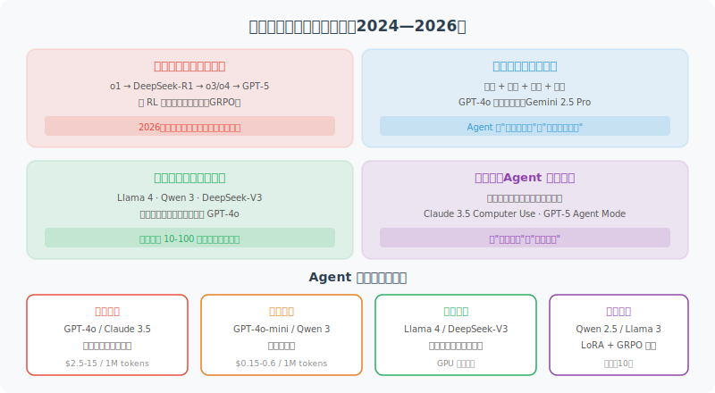

# 基座模型前沿进展与选型指南

> 🌍 *"模型在快速迭代，今天的 SOTA 可能是明天的基线——但理解演进趋势，能让你在变化中做出更好的选择。"*

前几节我们学习了 LLM 的基本原理、提示工程、API 调用和模型参数。这些知识是"不变"的底层能力。而本节要讨论的是"变化"的部分——**基座模型的技术前沿和产业格局**。

作为 Agent 开发者，你不需要训练自己的基座模型，但你必须了解模型的能力边界和发展趋势——因为**模型的选择直接决定了 Agent 的天花板**。



## 2024—2026：基座模型的四大趋势

### 趋势一：推理能力的跃迁

2024 年 9 月，OpenAI 的 o1 首次证明了"用更多推理时间换取更好结果"的可行性。2025 年 1 月，DeepSeek-R1 的开源发布引爆了推理模型的民主化——它首次展示了如何通过纯 RL 训练（GRPO）让模型自发涌现 Chain-of-Thought 能力。

2025 年 4 月，OpenAI 发布 o3 和 o4-mini，首次实现**多模态推理**（"看图思考"）和自主工具链调用。2025 年 8 月，**GPT-5** 正式发布，将推理能力内置为原生能力，不再需要独立的 o 系列模型。

到了 2026 年初，推理已成为所有主流模型的标配：

| 模型 | 发布时间 | 推理模式 | 关键突破 |
|------|---------|---------|---------| 
| **GPT-5** | 2025.08 | 内置思考能力 | 数学/科学/金融/法律领域专家级表现 |
| **GPT-5.3-Codex** | 2026.02 | Agent 编程推理 | 首个"自我开发"的编程模型，速度提升 25% |
| **Claude Opus 4.6** | 2026.02 | 自适应思考 | 1M 上下文 + Agent Teams + 自适应推理深度 |
| **Gemini 2.5 Pro** | 2025.03 | 原生多模态推理 | 2M 上下文 + 动态推理深度 |
| **DeepSeek-V3.2** | 2025.12 | 融合思考推理 | 开源 Agent 能力最强，稀疏注意力降本增效 |
| **Kimi K2** | 2025.07 | Agent 推理 | 1T 总参/32B 激活，MuonClip 优化器，开源 Agent SOTA |
| **Kimi K2.5** | 2026.03 | Agent 群组推理 | Kimi Linear + Attention Residuals，多 Agent 编排 |
| **Qwen3.5-Plus** | 2026.02 | 混合推理 | 397B 参数仅激活 17B（~4.3%），Gated DeltaNet 混合注意力 |
| **DeepSeek V4** | 2026.03 | 深度推理 | 671B MoE，Engram 内存架构，1M+ 上下文 |
| **MiniMax M2.5** | 2026.03 | 混合推理 | 229B MoE，Lightning Attention，Agent 实战 SOTA |

> 💡 **对 Agent 的影响**：推理模型让 Agent 在"规划"和"复杂决策"环节获得质的飞跃。实际工程中越来越多 Agent 采用"快慢双系统"——简单路由用快速模型，复杂规划用推理模型。GPT-5 和 Claude 4.6 的出现让这种切换变得更加无缝——推理能力已经内置在通用模型中。

### 趋势二：MoE 与效率革命

大模型越来越大，但**推理成本却在降低**——背后是**混合专家模型（Mixture of Experts, MoE）**的全面胜利。

MoE 的核心思想：模型总参数量可以很大（数千亿），但每次推理只激活其中一小部分。就像一家大公司有几百名员工，但每个项目只抽调最合适的十几个人。

```python
# MoE 模型的直觉理解（概念示意）
class MixtureOfExperts:
    """
    以 Qwen3.5-Plus 为例：
    总参数量：397B
    每次激活：17B（仅 ~4.3%）
    效果：接近甚至超越万亿参数密集模型，推理成本仅为零头
    """
    def __init__(self, num_experts=128, active_experts=8):
        self.num_experts = num_experts
        self.active_experts = active_experts
    
    def forward(self, input_tokens):
        # Router 决定激活哪些专家
        scores = self.router(input_tokens)
        top_k = scores.topk(self.active_experts)
        # 只有被选中的专家参与计算
        return sum(expert(input_tokens) * w for expert, w in top_k)
```

| 模型 | 总参数 | 激活参数 | 架构特点 |
|------|--------|---------|---------| 
| **Kimi K2** | 1T | 32B | MuonClip 优化器，万亿参数开源 MoE |
| **Kimi K2.5** | 48B | 3B | Kimi Linear 混合注意力 + Attention Residuals |
| **DeepSeek V4** | 671B | ~37B | Engram 内存 + mHC 超连接 + DSA 2.0 |
| **DeepSeek-V3.2** | 685B | ~37B | DSA 稀疏注意力，Agent 能力增强 |
| **Qwen3.5-Plus** | 397B | 17B | Gated DeltaNet 混合注意力，原生多模态 |
| **MiniMax M2.5** | 229B | ~? | Lightning Attention，200K~1M 上下文 |
| **Llama 4 Maverick** | 400B | 17B | 128 专家，原生多模态 MoE |
| **Llama 4 Scout** | 109B | 17B | 16 专家，10M token 上下文窗口 |
| **Qwen 3 MoE** | 235B | ~22B | 快慢思考混合推理 |

> 💡 **对 Agent 的影响**：MoE 让"大模型能力 + 小模型成本"成为现实。2026 年 Q1 最大的变化是 **Kimi K2 以万亿参数开源**，将 MoE 规模推向新高度；同时 Kimi K2.5 用仅 48B 总参/3B 激活的极致效率路线证明了"小而强"的可行性。DeepSeek V4 的 Engram 内存架构将静态知识卸载到 CPU，释放 GPU 用于推理计算。Qwen3.5-Plus 采用 Gated DeltaNet 线性注意力，推理延迟大幅降低。

### 趋势三：开源生态的全面崛起

2025—2026 年，开源模型已不仅是"追赶"闭源，而是在多个领域**形成分庭抗礼**甚至**局部超越**的态势：

**第一梯队（与 GPT-5 竞争）**：
- **Kimi K2**（Moonshot AI，2025.07）：1T 总参/32B 激活 MoE，MuonClip 优化器训练效率翻倍，开源 Agent 能力 SOTA
- **Qwen3.5-Plus**（阿里，2026.02）：397B MoE 原生多模态，Gated DeltaNet 混合注意力，Agent 能力、编程、推理全面领先
- **DeepSeek V4**（DeepSeek，2026.03）：671B MoE，Engram 内存架构，1M+ 上下文，编程能力超越 Claude Opus
- **DeepSeek-V3.2**（DeepSeek，2025.12）：融合推理，Agent 能力增强
- **Llama 4 Maverick**（Meta，2025.04）：400B MoE 多模态，在文本生成上超越 GPT-4o

**第二梯队（轻量高效）**：
- **Kimi K2.5**（Moonshot AI，2026.03）：48B 总参/3B 激活，Kimi Linear + Attention Residuals，极致效率
- **MiniMax M2.5**（MiniMax，2026.03）：229B MoE，Lightning Attention，Agent 实战表现强劲
- **Llama 4 Scout**（Meta，17B 激活/109B 总参）：10M 上下文窗口，单卡 H100 可运行
- **Phi-4**（微软，14B）：小尺寸模型的天花板，推理能力超越许多 70B 模型
- **Phi-4-multimodal**（微软，5.6B）：统一架构处理语音+视觉+文本
- **Gemma 3**（Google，1B~27B）：端侧部署的优选
- **Qwen 3 全系列**（阿里，0.6B~235B）：从手机到服务器全覆盖

**开源 vs 闭源的选择矩阵**：

| 维度 | 闭源模型 | 开源模型 |
|------|---------|---------|
| **最强能力** | 仍有优势（GPT-5, Claude Opus 4.6） | 快速追赶，Qwen3.5/DeepSeek 已局部超越 |
| **成本** | API 按量付费 | 自部署后边际成本极低 |
| **隐私** | 数据发送给第三方 | 数据完全私有 |
| **定制化** | 有限（Fine-tuning API） | 完全可控（LoRA/全参微调） |
| **延迟** | 受网络影响 | 本地部署可控 |
| **Agent 能力** | 工具调用成熟稳定 | DeepSeek-V3.2、Qwen3.5 已原生支持 Agent |
| **适合场景** | 快速原型、通用任务 | 生产部署、数据敏感场景 |

### 趋势四：Agent-Native 模型的兴起

2025—2026 年最显著的新趋势是：**模型开始专门为 Agent 场景优化**。

- **Kimi K2**：万亿参数开源 MoE，Agent 能力在多个基准上达到开源 SOTA，专注 Agent 场景的预训练和后训练
- **Kimi K2.5**：在 GTC 2026 上发布，引入"Agent 群组"模式，中央编排器管理多个专业子 Agent 并行执行
- **DeepSeek V4**：Engram 内存架构将静态知识卸载到 CPU，释放 GPU 用于推理，1M+ 上下文下 Agent 能力增强
- **DeepSeek-V3.2**：官方明确"Reasoning-first models built for agents"，强化工具调用和多步推理
- **GPT-5-Codex / GPT-5.3-Codex**：专为 Codex Agent 编程优化，通过 RL 训练生成符合人类 PR 风格的代码，可连续编程 7 小时以上
- **Claude Opus 4.6**：引入 Agent Teams 概念，多 Agent 协同工作，1M 上下文下性能稳定
- **Qwen3.5-Plus**：深度适配 Agent 框架（如 OpenClaw），工具调用精准度大幅提升
- **MiniMax M2.5**：在数百万真实环境中通过 RL 训练，Agent 工具调用和多步执行能力突出

这意味着 Agent 开发者不再需要"削足适履"——模型本身就是为 Agent 设计的。

## 多模态基座模型：不只是文本

2026 年的基座模型几乎都是**原生多模态**的——从架构层面就支持文本、图像、音频、视频的混合输入和输出。

```python
# 多模态 Agent 的典型调用方式
from openai import OpenAI
client = OpenAI()

response = client.chat.completions.create(
    model="gpt-5",  # GPT-5 原生支持多模态
    messages=[{
        "role": "user",
        "content": [
            {"type": "text", "text": "这张架构图有什么问题？请给出改进建议。"},
            {"type": "image_url", "image_url": {"url": "data:image/png;base64,..."}}
        ]
    }]
)

# GPT-5 不仅能"看懂"图片，还能生成图像、实时语音对话
```

**主流多模态模型对比**：

| 模型 | 发布时间 | 输入模态 | 输出模态 | 特色能力 |
|------|---------|---------|---------|---------| 
| **GPT-5** | 2025.08 | 文本+图像+音频 | 文本+图像+音频 | 实时语音对话，原生图像生成 |
| **Claude Opus 4.6** | 2026.02 | 文本+图像+PDF | 文本 | 1M 上下文，Agent Teams |
| **Gemini 2.5 Pro** | 2025.03 | 文本+图像+视频+音频 | 文本+图像 | 原生视频理解，2M 上下文 |
| **Qwen3.5-Plus** | 2026.02 | 文本+图像+视频 | 文本 | 原生多模态 MoE + Gated DeltaNet |
| **Kimi K2** | 2025.07 | 文本 | 文本 | 万亿参数 Agent SOTA，工具调用最强 |
| **DeepSeek V4** | 2026.03 | 文本+图像 | 文本 | Engram 内存，1M+ 上下文，编程 SOTA |
| **MiniMax M2.5** | 2026.03 | 文本+图像+音频 | 文本+语音 | Lightning Attention，200K~1M 上下文 |
| **Llama 4 Maverick** | 2025.04 | 文本+图像 | 文本 | 开源多模态 MoE，400B 总参 |
| **Phi-4-multimodal** | 2025.02 | 文本+图像+语音 | 文本 | 仅 5.6B 参数，统一多模态架构 |

## 小模型的崛起：SLM 与端侧部署

**小语言模型（Small Language Models, SLM）**的进步速度令人瞩目——2025 年的 14B 参数模型已全面超越 2023 年的 GPT-4。

```python
# 小模型的惊人表现（2025—2026 年基准测试数据）
slm_benchmarks = {
    "Phi-4 (14B)":             {"MMLU": 84.8, "HumanEval": 82.6, "GSM8K": 94.5},
    "Phi-4-reasoning (14B)":   {"MMLU": 86.2, "HumanEval": 85.1, "GSM8K": 95.8},
    "Qwen 3 (8B)":            {"MMLU": 81.2, "HumanEval": 79.8, "GSM8K": 91.3},
    "Llama 4 Scout (17B act)": {"MMLU": 83.5, "HumanEval": 80.1, "GSM8K": 92.1},
    "Phi-4-mini (3.8B)":      {"MMLU": 72.1, "HumanEval": 68.5, "GSM8K": 84.2},
    # 对比：2023 年的 GPT-4 (~1.7T 参数估算)
    "GPT-4 (2023)":           {"MMLU": 86.4, "HumanEval": 67.0, "GSM8K": 92.0},
}

# Phi-4-reasoning (14B) 在编程和数学上已全面超越 2023 年的 GPT-4！
# Phi-4-mini (3.8B) 甚至可以在手机上运行，还能做函数调用
# 这意味着：Agent 不一定需要最大的模型
```

> 💡 **对 Agent 的影响**：SLM 让 Agent 可以在**手机、笔记本、边缘设备**上本地运行，实现零延迟、完全隐私的交互。苹果的 Apple Intelligence、Google 的 Gemini Nano、微软的 Phi-4-mini 都是这一趋势的产物。Phi-4-multimodal 更是以 5.6B 参数同时处理语音、视觉和文本，为端侧多模态 Agent 开辟了道路。

## Agent 开发者的模型选型指南

面对如此多的模型选择，如何为你的 Agent 挑选合适的基座模型？

```python
def select_model(requirements: dict) -> str:
    """Agent 模型选型决策函数（2026 年 3 月版）"""
    
    budget = requirements.get("monthly_budget_usd", 100)
    task_type = requirements.get("task_type", "general")
    privacy = requirements.get("privacy_required", False)
    latency_ms = requirements.get("max_latency_ms", 5000)
    reasoning = requirements.get("complex_reasoning", False)
    agent_native = requirements.get("agent_native", False)
    
    # 决策树
    if privacy:
        if reasoning:
            return "DeepSeek-V3.2 (自部署)"  # 开源 + 推理 + Agent
        elif latency_ms < 500:
            return "Phi-4 / Qwen 3-8B (本地部署)"  # 端侧 SLM
        else:
            return "Qwen3.5-Plus / Llama 4 Maverick (自部署)"  # 开源通用
    
    if agent_native:
        if budget > 500:
            return "Claude Opus 4.6 / GPT-5"  # 顶级 Agent 体验
        else:
            return "DeepSeek-V3.2 API / Qwen3.5-Plus API"  # 性价比 Agent
    
    if reasoning:
        if budget > 500:
            return "Claude Opus 4.6 / GPT-5"  # 顶级推理
        else:
            return "DeepSeek-V3.2 API / o4-mini"  # 性价比推理
    
    if budget < 50:
        return "DeepSeek-V3.2 API / GPT-4o-mini"  # 极致性价比
    
    return "GPT-5 / Claude Sonnet 4.6"  # 通用均衡之选
```

**按场景的推荐选型**：

| Agent 场景 | 推荐模型 | 理由 |
|-----------|---------|------|
| 编程助手 | Claude Opus 4.6 / GPT-5.3-Codex | 长时间编程稳定，Agent 编程能力最强 |
| 数据分析 | GPT-5 / Gemini 2.5 Pro | 多模态理解 + 函数调用稳定 |
| 客服对话 | GPT-4o-mini / Qwen 3-8B | 成本敏感，响应速度要求高 |
| 深度研究 | Claude Opus 4.6 / GPT-5 | 1M+ 上下文 + 深度推理 |
| 文档处理 | Gemini 2.5 Pro / Claude Opus 4.6 | 2M/1M 超长文档输入，PDF 布局理解 |
| 本地隐私 | Qwen3.5-Plus / DeepSeek-V3.2 (自部署) | 数据不出本地，Agent 能力完整 |
| 端侧部署 | Phi-4-mini (3.8B) / Qwen 3 (4B) | 手机/笔记本可运行 |
| 多模态 Agent | GPT-5 / Qwen3.5-Plus | 原生多模态，工具调用 + 视觉理解 |

## 2025—2026 关键模型发布时间线

```
2024.09  OpenAI o1 ──── 推理模型元年
2024.12  Phi-4 (14B) ── 微软发布最强小模型
2025.01  DeepSeek-R1 ── 开源推理模型引爆全球
2025.02  Phi-4-multimodal / Phi-4-mini ── 端侧多模态
2025.03  Gemini 2.5 Pro ── 2M 上下文 + 推理，屠榜
2025.04  Llama 4 Scout/Maverick ── Meta 首个 MoE 开源多模态
2025.04  o3 / o4-mini ── OpenAI 多模态推理
2025.04  Qwen 3 ── 阿里混合推理全系列（0.6B~235B）
2025.05  Claude 4 (Opus/Sonnet) ── 连续编程 7 小时，Agent 新标杆
2025.07  Kimi K2 ── 月之暗面万亿参数开源 MoE，MuonClip 优化器
2025.08  GPT-5 ── OpenAI"最智能"模型，内置推理
2025.09  GPT-5-Codex ── Agent 编程专用模型
2025.09  DeepSeek-V3.2-Exp ── DSA 稀疏注意力探索
2025.10  Kimi Linear ── 线性注意力架构，速度提升 6 倍
2025.12  DeepSeek-V3.2 正式版 ── Agent 能力增强，融合推理
2026.02  Claude Opus 4.6 / Sonnet 4.6 ── 1M 上下文正式版
2026.02  GPT-5.3-Codex ── "首个自我开发"的编程模型
2026.02  Qwen3.5-Plus (397B-A17B) ── Gated DeltaNet 混合注意力
2026.03  Kimi K2.5 (48B-A3B) ── Attention Residuals + Agent 群组
2026.03  DeepSeek V4 (671B MoE) ── Engram 内存架构，1M+ 上下文
2026.03  MiniMax M2.5 (229B MoE) ── Lightning Attention，Agent 实战 SOTA
```

## 展望：基座模型的下一步

几个值得关注的发展方向：

1. **混合注意力架构**：2026 年最重要的架构趋势——Gated DeltaNet（Qwen3.5）、Kimi Linear（Kimi K2.5）、Lightning Attention（MiniMax M2.5）等线性注意力变体与全注意力的混合，将推理延迟降低 5~6 倍，同时保持模型质量
2. **优化器革新**：Kimi K2 的 MuonClip 证明了 Adam/AdamW 不是唯一选择——训练效率翻倍，可能改变整个行业的训练经济学
3. **Agent-Native 架构**：模型从"被动回答"到"主动行动"——Kimi K2.5 的 Agent 群组编排、DeepSeek V4 的 Engram 内存架构，让模型原生支持复杂的多步 Agent 工作流
4. **效率至上**：MoE + 稀疏注意力（如 DeepSeek DSA）+ Attention Residuals 让部署成本持续下降
5. **知识与推理分离**：DeepSeek V4 的 Engram 内存将静态知识卸载到 CPU、GPU 专注推理，这一范式可能被更多模型采用
6. **World Models**：从语言模型到世界模型——理解物理规律、因果关系，而不只是文本模式
7. **持续学习与个性化**：模型从部署后的交互中持续学习，每个 Agent 拥有独特的"经验"
8. **模型协作（Agent Teams）**：多个专精模型组成"团队"，各司其职，Claude 4.6 的 Agent Teams 和 Kimi K2.5 的 Agent 群组已经是这一方向的先驱

---

## 本节小结

| 趋势 | 核心变化 | 对 Agent 开发的影响 |
|------|---------|-------------------|
| 推理能力跃迁 | GPT-5/Claude 4.6 内置推理，不再需要独立推理模型 | Agent 复杂规划能力质的飞跃，快慢系统融为一体 |
| MoE 效率革命 | Kimi K2 万亿参数开源，Qwen3.5 激活仅 4.3% | Agent 运营成本大幅降低，万亿级模型也可开源使用 |
| 混合注意力架构 | Gated DeltaNet / Kimi Linear / Lightning Attention | 推理延迟降低 5~6 倍，长上下文 Agent 变得经济可行 |
| 优化器革新 | MuonClip 替代 AdamW，训练效率翻倍 | 训练成本降低，更多团队有能力训练专用 Agent 模型 |
| 开源全面崛起 | Kimi K2/Qwen3.5/DeepSeek V4 形成完整生态 | 私有化 Agent 部署成熟，数据安全不再是瓶颈 |
| Agent-Native | 模型专门为 Agent 场景优化（工具调用/长期任务/Agent 群组） | 开发者不再需要"削足适履"，模型即 Agent 基座 |
| 多模态原生 | 文本→视觉+语音+视频全模态 | Agent 能"看"能"听"能"画"，交互方式更自然 |
| 小模型进步 | 3.8B 参数可在手机运行，14B 超越 GPT-4 | Agent 可在端侧运行，零延迟、完全隐私 |

> ⏰ *注：模型技术发展极快，本节数据截至 2026 年 3 月 24 日。DeepSeek V4 已正式发布，Kimi K2.5 在 GTC 2026 上亮相。行业格局仍在快速演变。建议定期关注各厂商的发布动态和权威基准评测（如 LMArena、Open LLM Leaderboard、Chatbot Arena）获取最新信息。*

---

*下一节：[3.7 基座模型架构详解](./07_model_architecture.md)*
