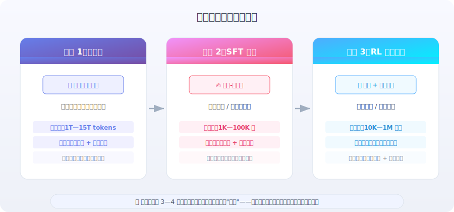

# SFT 与强化学习训练数据准备

> 📊 *"数据是模型训练中最被低估的杠杆。算法论文年年换，但高质量数据带来的提升却是跨算法的。"*

在前面的章节中，我们了解了大语言模型的工作原理和架构设计。但一个模型从"通用基座"变成"好用的 Agent"，中间隔着的不仅是算法，更是**数据**。无论是 SFT（监督微调）还是 RLHF/GRPO 等强化学习训练，数据的质量、数量、分布和格式都直接决定了训练效果的天花板。

本节系统讲解训练数据准备的核心原则和实践方法——从数据量的选择到质量把控，从 SFT 数据到 RL 奖励数据，帮助你建立**数据优先**的训练思维。

---

## 训练数据的全局观：三阶段数据流

大语言模型的训练通常分为三个阶段，每个阶段对数据的需求截然不同：



| 阶段 | 数据类型 | 典型规模 | 数据特点 | 核心目标 |
|------|---------|---------|---------|---------|
| **预训练** | 无标注文本（网页、书籍、代码） | 1T—15T tokens | 量大、质参差、覆盖面广 | 学习语言能力和世界知识 |
| **SFT（监督微调）** | 指令-回答对 / 多轮对话 | 1K—100K 条 | 量少但质极高、格式严格 | 学习行为格式和任务能力 |
| **RL（强化学习）** | 问题 + 奖励信号 | 10K—1M 条问题 | 需要可评估的奖励函数 | 超越模仿、涌现新策略 |

> 💡 **关键洞察**：三个阶段的数据量差了 3—4 个数量级，但每个阶段都有各自的"数据甜点"——不是越多越好，而是**在对的量级上做到最高质量**。

---

## SFT 数据准备

### "少而精"的核心原则

SFT 阶段最重要的发现来自 LIMA [1]（Less Is More for Alignment）论文：

> **仅用 1,000 条精心筛选的高质量数据，就能让 65B LLaMA 达到接近 GPT-4 的对话质量。**

这个结论在后续工作中被反复验证：

| 研究 | 数据规模 | 核心发现 |
|------|---------|---------|
| **LIMA** (2023) [1] | 1,000 条 | 质量 >> 数量，精选数据效果碾压 52K Alpaca |
| **Alpaca** (2023) [2] | 52,000 条 | GPT-3.5 生成的数据，质量参差，效果中等 |
| **WizardLM** (2023) [3] | 70,000 条 | 通过 Evol-Instruct 提升复杂度，效果显著优于 Alpaca |
| **DEITA** (2024) [4] | 6,000 条 | 用自动化方法从 300K 中筛选 6K，效果超越全量训练 |
| **Qwen2.5 技术报告** (2024) [5] | ~500K 条 | 工业级规模，但经过极其严格的多轮清洗和质量筛选 |

**为什么少量数据就够了？**

SFT 不是让模型学习"新知识"——预训练阶段已经具备了丰富的世界知识和语言能力。SFT 的本质是**教会模型正确的"行为格式"**：

```
预训练模型的状态：
  "我知道很多东西，但我不知道该怎么回答你的问题"

SFT 之后：
  "我知道很多东西，现在我还知道该用什么格式、什么风格来回答你"
```

这就是为什么 SFT 更像是"教礼仪"而非"教知识"——教一个博学的人如何得体地对话，不需要上万堂课。

### 数据量选择指南

根据实践经验和公开研究，不同场景的推荐数据量如下：

| 场景 | 推荐数据量 | 说明 |
|------|-----------|------|
| **概念验证 / 研究实验** | 500—1,000 条 | LIMA 规模，验证可行性足够 |
| **单一任务微调**（如数学、编码） | 1,000—5,000 条 | 覆盖任务的各种难度和边界情况 |
| **Agent 行为格式训练** | 500—2,000 条 | 教会模型 `<think>`/`<tool_call>` 格式 |
| **通用指令遵循** | 5,000—50,000 条 | 覆盖多种任务类型和对话风格 |
| **工业级产品对齐** | 50K—500K 条 | 多轮清洗、多维度质量控制 |

> ⚠️ **常见陷阱**：很多团队的第一反应是"数据越多越好"，于是花大量资源收集 10 万条低质量数据。实际上，**1,000 条经过人工验证的数据，效果几乎总是优于 10,000 条未经审核的数据**。这是 SFT 阶段最违反直觉但最重要的规律。

### 数据质量评估框架

高质量 SFT 数据需要在以下五个维度上达标：

| 质量维度 | 定义 | 检测方法 | 典型问题 |
|---------|------|---------|---------|
| **正确性** | 回答内容事实准确，逻辑无误 | 人工审核 + 自动事实核查 | 数学计算错误、过时信息 |
| **格式一致性** | 遵循统一的输出格式规范 | 正则表达式校验 | `<think>` 标签不配对、JSON 格式错误 |
| **完整性** | 回答完整地覆盖问题的所有方面 | 人工评分 | 只回答了问题的一半 |
| **难度分布** | 简单/中等/困难任务比例合理 | 自动分类 + 统计 | 全是简单问答，缺少复杂推理 |
| **多样性** | 覆盖不同领域、风格、长度 | 去重 + 聚类分析 | 大量重复或高度相似的样本 |

#### 自动化质量检测示例

```python
import re
import json
from collections import Counter

def validate_sft_sample(sample: dict) -> dict:
    """
    对单条 SFT 样本进行多维度质量检测
    
    Args:
        sample: 包含 conversations 字段的对话样本
        
    Returns:
        包含各维度检测结果的字典
    """
    issues = []
    conversations = sample.get("conversations", [])
    
    # 1. 基础结构检查
    roles = [msg["role"] for msg in conversations]
    if roles[0] != "system":
        issues.append("缺少 system 消息")
    if "assistant" not in roles:
        issues.append("缺少 assistant 回答")
    
    # 2. 格式一致性检查（Agent 场景）
    for msg in conversations:
        if msg["role"] == "assistant":
            content = msg["content"]
            
            # 检查 think 标签配对
            think_opens = len(re.findall(r"<think>", content))
            think_closes = len(re.findall(r"</think>", content))
            if think_opens != think_closes:
                issues.append(f"think 标签不配对: {think_opens} 开 vs {think_closes} 闭")
            
            # 检查 tool_call 标签配对
            tc_opens = len(re.findall(r"<tool_call>", content))
            tc_closes = len(re.findall(r"</tool_call>", content))
            if tc_opens != tc_closes:
                issues.append(f"tool_call 标签不配对: {tc_opens} 开 vs {tc_closes} 闭")
            
            # 检查工具调用格式
            tool_calls = re.findall(
                r"<tool_call>\n(.+?)\n</tool_call>", content, re.DOTALL
            )
            for tc in tool_calls:
                # 验证是否为合法的函数调用格式
                if not re.match(r"\w+\(.*\)", tc.strip()):
                    issues.append(f"工具调用格式异常: {tc[:50]}")
    
    # 3. 长度合理性检查
    total_tokens = sum(len(msg["content"]) for msg in conversations)
    if total_tokens < 50:
        issues.append("样本过短，可能缺乏信息量")
    if total_tokens > 20000:
        issues.append("样本过长，可能包含冗余内容")
    
    # 4. 回答非空检查
    assistant_msgs = [m for m in conversations if m["role"] == "assistant"]
    for i, msg in enumerate(assistant_msgs):
        if len(msg["content"].strip()) < 10:
            issues.append(f"第 {i+1} 个 assistant 回答过短")
    
    return {
        "valid": len(issues) == 0,
        "issues": issues,
        "num_turns": len(assistant_msgs),
        "total_chars": total_tokens
    }


def analyze_dataset_distribution(samples: list[dict]) -> dict:
    """
    分析数据集的整体分布特征
    """
    # 统计每条样本的对话轮数
    turn_counts = [
        len([m for m in s["conversations"] if m["role"] == "assistant"])
        for s in samples
    ]
    
    # 统计工具调用覆盖率
    tool_usage = Counter()
    for s in samples:
        for msg in s["conversations"]:
            if msg["role"] == "assistant":
                tools = re.findall(r"(\w+)\(", msg["content"])
                tool_usage.update(tools)
    
    # 统计长度分布
    lengths = [
        sum(len(m["content"]) for m in s["conversations"])
        for s in samples
    ]
    
    return {
        "total_samples": len(samples),
        "avg_turns": sum(turn_counts) / len(turn_counts),
        "max_turns": max(turn_counts),
        "tool_coverage": dict(tool_usage.most_common(20)),
        "avg_length": sum(lengths) / len(lengths),
        "length_p90": sorted(lengths)[int(len(lengths) * 0.9)],
    }
```

### SFT 数据的制作方法

高质量 SFT 数据有三种主要来源：

#### 方法一：人工标注（质量最高，成本最高）

由领域专家手动编写指令-回答对。这是质量天花板最高的方法，适用于关键任务场景。

**实践要点**：
- 制定详细的**标注指南**（annotation guidelines），明确格式、风格、长度要求
- 多个标注员独立标注同一批数据，计算**标注一致性**（inter-annotator agreement）
- 建立**审核机制**：标注 → 初审 → 终审 → 入库

```python
# 标注指南示例（简化版）
ANNOTATION_GUIDELINES = """
## 格式要求
1. 所有推理过程放在 <think>...</think> 中
2. 工具调用使用 <tool_call>...</tool_call> 包裹
3. 最终回答直接输出，不需要额外标签

## 质量标准
- 推理过程必须逻辑连贯，不能跳步
- 数学计算必须使用 calculator 工具，不要心算
- 回答必须直接、简洁、准确
- 如果问题有歧义，应明确说明假设

## 常见错误
❌ 在 think 中直接给出答案，不用工具
❌ 工具调用参数类型错误（字符串 vs 数字）
❌ 回答中包含 "作为一个 AI 助手" 等冗余表述
"""
```

#### 方法二：强模型蒸馏（质量较高，成本适中）

用 GPT-4 / Claude 等强模型生成回答，然后经人工筛选。这是目前最常用的方法。

**关键技巧**：

1. **Seed Tasks（种子任务）**：人工编写 50—200 条高质量种子样本，确保风格和格式一致
2. **Evol-Instruct（指令进化）** [3]：对简单指令进行多轮"进化"，生成更复杂、更具挑战性的变体

```python
# Evol-Instruct 的指令进化策略
EVOLUTION_STRATEGIES = {
    "增加约束": "在原始指令基础上，增加一个不常见的约束条件",
    "增加推理深度": "改写指令，使其需要多步推理才能解答",
    "具体化": "将抽象指令替换为具体的真实场景",
    "增加多轮": "将单轮问答改为需要多轮交互的任务",
    "组合任务": "将两个简单任务组合为一个复合任务",
}

# 示例：一条指令的进化过程
EVOLUTION_EXAMPLE = """
原始指令：
  "计算圆的面积"

→ 增加约束：
  "计算一个半径为 3.7 米的圆形花坛面积，结果保留两位小数，
   并告诉我如果每平方米需要 15 元的草皮，总费用是多少"

→ 增加推理深度：
  "一个环形跑道，内圈半径 50 米，外圈半径 55 米。
   如果铺设跑道每平方米需要 200 元，总预算 30 万元够不够？
   如果不够，内圈半径至少需要缩小到多少？"
"""
```

3. **质量过滤**：生成后必须经过自动化检测 + 人工抽样审核

#### 方法三：自动化数据筛选（适用于大规模数据）

从海量已有数据中，用自动化方法筛选出高质量子集。DEITA [4] 提出了一套有效的方法：

| 筛选维度 | 方法 | 直觉 |
|---------|------|------|
| **复杂度** (Complexity) | 用 LLM 对指令的复杂度打分 | 过滤掉过于简单的"你好"类问题 |
| **质量** (Quality) | 用 LLM 对回答质量打分 | 过滤掉回答不完整或有错误的样本 |
| **多样性** (Diversity) | 基于 Embedding 的去重和聚类 | 避免大量高度相似的样本 |

```python
from sentence_transformers import SentenceTransformer
from sklearn.cluster import KMeans
import numpy as np

def diversity_based_selection(
    samples: list[dict],
    target_size: int = 5000,
    n_clusters: int = 500,
) -> list[dict]:
    """
    基于多样性的数据筛选：
    1. 将所有样本编码为向量
    2. 聚类后从每个簇中选择最优样本
    3. 确保最终数据集覆盖尽可能多的"语义区域"
    """
    model = SentenceTransformer("all-MiniLM-L6-v2")
    
    # 提取每条样本的指令文本
    instructions = [
        next(m["content"] for m in s["conversations"] if m["role"] == "user")
        for s in samples
    ]
    
    # 编码为向量
    embeddings = model.encode(instructions, show_progress_bar=True)
    
    # K-Means 聚类
    kmeans = KMeans(n_clusters=n_clusters, random_state=42)
    labels = kmeans.fit_predict(embeddings)
    
    # 从每个簇中选择距离簇心最近的 top-k 样本
    per_cluster = target_size // n_clusters
    selected = []
    
    for cluster_id in range(n_clusters):
        cluster_indices = np.where(labels == cluster_id)[0]
        center = kmeans.cluster_centers_[cluster_id]
        
        # 按距离簇心从近到远排序
        distances = np.linalg.norm(
            embeddings[cluster_indices] - center, axis=1
        )
        sorted_idx = cluster_indices[np.argsort(distances)]
        
        # 选取 top-k
        selected.extend(sorted_idx[:per_cluster].tolist())
    
    return [samples[i] for i in selected[:target_size]]
```

---

## 强化学习训练数据准备

RL 阶段的数据需求与 SFT 截然不同——不需要"标准答案"，但需要**可评估的问题**和**有效的奖励信号**。

### RL 数据的核心要素

| 要素 | 说明 | 示例 |
|------|------|------|
| **问题/提示 (Prompt)** | 模型需要回答的问题 | "证明 $\sqrt{2}$ 是无理数" |
| **奖励函数 (Reward)** | 评估回答质量的函数 | 代码通过测试 → +1，不通过 → 0 |
| **参考答案（可选）** | 用于奖励计算的参考 | 标准证明过程 |

与 SFT 的关键区别：

```
SFT 数据：  问题 + 标准答案 → 模仿学习（"照着做"）
RL 数据：   问题 + 奖励函数 → 探索学习（"自己找最优解"）
```

> 💡 **为什么 RL 不需要标准答案？** 因为 RL 的目标是让模型**自己探索**出好的策略。标准答案反而会限制探索空间——就像教一个孩子下棋，SFT 是给他看大师棋谱让他模仿，RL 是让他自己下棋，赢了给奖励，输了给惩罚。后者可能发现出乎意料的新策略。

### 奖励函数设计

奖励函数是 RL 训练的核心。一个好的奖励函数需要满足：

1. **可自动评估**（不能依赖人工标注，否则无法在线训练）
2. **信号明确**（避免奖励稀疏——模型很难从"全0"的信号中学到东西）
3. **不可作弊**（防止模型找到不符合预期的"捷径"来获得高分）

常见的奖励函数类型：

| 奖励类型 | 适用场景 | 具体实现 | 优缺点 |
|---------|---------|---------|--------|
| **规则奖励** | 有明确标准答案的任务 | 数学题答案匹配、代码测试用例通过率 | ✅ 精确无噪声 ❌ 适用范围有限 |
| **模型奖励** | 开放式任务 | 训练一个奖励模型（Reward Model）打分 | ✅ 适用范围广 ❌ 有噪声、可能被"hack" |
| **混合奖励** | 复合任务 | 规则奖励 + 模型奖励加权组合 | ✅ 灵活 ❌ 权重需要仔细调参 |

#### 规则奖励设计示例

```python
import re
import subprocess
import tempfile
from typing import Optional

def math_reward(
    response: str, 
    ground_truth: str,
    format_required: bool = True,
) -> float:
    """
    数学题的规则奖励函数
    
    奖励组成：
    - 答案正确: +1.0
    - 答案格式正确（在 \\boxed{} 中）: +0.1
    - 有推理过程: +0.1
    
    总分范围: [0, 1.2]
    """
    reward = 0.0
    
    # 1. 提取答案（从 \boxed{} 中）
    boxed_match = re.search(r"\\boxed\{(.+?)\}", response)
    if boxed_match:
        predicted = boxed_match.group(1).strip()
        reward += 0.1  # 格式分
        
        # 2. 答案匹配（支持数值容差）
        try:
            if abs(float(predicted) - float(ground_truth)) < 1e-6:
                reward += 1.0
        except ValueError:
            # 非数值答案（如表达式），用字符串匹配
            if predicted.replace(" ", "") == ground_truth.replace(" ", ""):
                reward += 1.0
    else:
        # 没有 \boxed{}，尝试从最后一行提取
        last_line = response.strip().split("\n")[-1]
        numbers = re.findall(r"[-+]?\d*\.?\d+", last_line)
        if numbers:
            try:
                if abs(float(numbers[-1]) - float(ground_truth)) < 1e-6:
                    reward += 1.0
            except ValueError:
                pass
    
    # 3. 推理过程加分
    if "<think>" in response and "</think>" in response:
        think_content = re.search(
            r"<think>(.*?)</think>", response, re.DOTALL
        )
        if think_content and len(think_content.group(1).strip()) > 50:
            reward += 0.1
    
    return reward


def code_reward(
    response: str,
    test_cases: list[dict],
    timeout: int = 10,
) -> float:
    """
    编程题的规则奖励函数
    
    奖励 = 通过的测试用例比例
    """
    # 提取代码块
    code_match = re.search(r"```python\n(.*?)```", response, re.DOTALL)
    if not code_match:
        return 0.0
    
    code = code_match.group(1)
    passed = 0
    
    for tc in test_cases:
        test_code = f"""{code}\n\n# 测试\nassert {tc['assertion']}"""
        try:
            with tempfile.NamedTemporaryFile(
                suffix=".py", mode="w", delete=False
            ) as f:
                f.write(test_code)
                f.flush()
                result = subprocess.run(
                    ["python", f.name],
                    capture_output=True,
                    timeout=timeout,
                )
                if result.returncode == 0:
                    passed += 1
        except (subprocess.TimeoutExpired, Exception):
            pass
    
    return passed / len(test_cases) if test_cases else 0.0
```

### RL 训练数据量选择

RL 阶段的数据量选择逻辑与 SFT 完全不同：

| 因素 | 影响 | 建议 |
|------|------|------|
| **问题数量** | 更多问题 = 更多探索方向 | 10K—100K 条唯一问题 |
| **每问题采样数（G）** | GRPO 每个问题采样 G 个回答 | G = 8—64，根据资源调整 |
| **有效训练样本** | 问题数 × G = 总训练样本 | 100K—数百万条 |
| **训练轮数** | 通常 1—3 个 epoch | 过多会过拟合 |

**RL 数据的关键不是量，是"有效奖励区间"**：

```
无效数据：奖励恒为 0 或恒为 1
  → 模型无法区分好坏，学不到任何东西

有效数据：同一问题的 G 个回答中，有得分高的也有得分低的
  → 模型可以对比学习，"这样做得到 +1，那样做得到 0"
```

> ⚠️ **关键原则**：如果一个问题太简单（模型 100% 能答对）或太难（模型 0% 能答对），它在 RL 训练中**完全没有价值**。最有价值的数据是模型有 30%—70% 正确率的"刚好够难"的问题。

### RL 数据筛选：难度校准

```python
def calibrate_difficulty(
    questions: list[dict],
    model,
    tokenizer,
    n_samples: int = 16,
    target_pass_rate: tuple[float, float] = (0.2, 0.8),
) -> list[dict]:
    """
    难度校准：筛选出对当前模型来说"刚好够难"的问题
    
    流程：
    1. 对每个问题采样 n_samples 个回答
    2. 计算通过率
    3. 保留通过率在 target_pass_rate 范围内的问题
    
    Args:
        questions: 候选问题列表
        model: 当前策略模型
        n_samples: 每个问题的采样次数
        target_pass_rate: 目标通过率范围 (下界, 上界)
    """
    calibrated = []
    
    for q in questions:
        # 采样多个回答
        responses = []
        for _ in range(n_samples):
            response = model.generate(
                tokenizer.encode(q["prompt"], return_tensors="pt"),
                max_new_tokens=2048,
                temperature=0.7,
                do_sample=True,
            )
            responses.append(tokenizer.decode(response[0]))
        
        # 计算通过率
        rewards = [q["reward_fn"](r) for r in responses]
        pass_rate = sum(1 for r in rewards if r > 0.5) / len(rewards)
        
        # 筛选
        if target_pass_rate[0] <= pass_rate <= target_pass_rate[1]:
            calibrated.append({
                **q,
                "estimated_pass_rate": pass_rate,
                "estimated_difficulty": 1 - pass_rate,
            })
    
    print(f"校准完成：{len(questions)} → {len(calibrated)} 条"
          f"（保留率 {len(calibrated)/len(questions)*100:.1f}%）")
    
    return calibrated
```

### 课程学习：从易到难的训练节奏

在 RL 训练中，数据的**呈现顺序**也很重要。课程学习（Curriculum Learning）的核心思想是：

```
第 1 阶段（Warm-up）：先用简单问题建立基本能力
    → 通过率 60%—80% 的问题
    → 让模型建立"做对会得到奖励"的基本理解

第 2 阶段（Ramp-up）：逐步增加难度
    → 通过率 30%—60% 的问题  
    → 模型开始探索更复杂的策略

第 3 阶段（Challenge）：挑战高难度问题
    → 通过率 10%—30% 的问题
    → 涌现真正有创造性的解题策略
```

> 💡 **直觉类比**：就像学游泳——先在浅水区建立信心，再到深水区挑战。直接把不会游泳的人丢进深水区，大概率的结果不是学会游泳，而是溺水（训练崩溃）。

---

## SFT 数据 vs RL 数据：对比总结

| 维度 | SFT 数据 | RL 数据 |
|------|---------|---------|
| **核心需求** | 标准答案（示范） | 问题 + 奖励信号 |
| **数据量** | 少而精（1K—100K） | 适中（10K—1M 问题，×G 采样） |
| **质量要求** | 极高（每条都需要正确） | 问题质量重要，但不需要标准答案 |
| **成本结构** | 制作成本高，使用成本低 | 制作成本低，计算成本高（采样） |
| **失败模式** | 数据中的错误会被直接"学进去" | 奖励函数设计缺陷会导致"reward hacking" |
| **迭代方式** | 增量添加 + 质量筛选 | 随模型能力提升，动态调整难度 |

---

## 数据准备的常见陷阱

### 陷阱一：数据泄露（Data Contamination）

训练数据中包含了评测集的题目，导致评测分数虚高但实际能力没有提升。

```python
# 检测数据泄露的简单方法
def check_contamination(
    train_data: list[str], 
    eval_data: list[str],
    threshold: float = 0.9,
) -> list[tuple[int, int, float]]:
    """
    检测训练集与评测集之间的重叠
    """
    from difflib import SequenceMatcher
    
    contaminated = []
    for i, train_item in enumerate(train_data):
        for j, eval_item in enumerate(eval_data):
            similarity = SequenceMatcher(
                None, train_item, eval_item
            ).ratio()
            if similarity > threshold:
                contaminated.append((i, j, similarity))
    
    if contaminated:
        print(f"⚠️ 发现 {len(contaminated)} 对疑似泄露样本！")
    
    return contaminated
```

### 陷阱二：分布偏移（Distribution Shift）

SFT 数据的分布与实际使用场景不匹配。例如：
- 训练数据全是英文，但用户会用中文提问
- 训练数据全是短回答，但用户需要长篇分析
- 训练数据全是知识问答，但 Agent 需要做工具调用

**解决方法**：收集或模拟真实用户的使用模式，确保训练数据覆盖实际场景。

### 陷阱三：Reward Hacking（奖励攻击）

RL 训练中模型学到了"骗过"奖励函数的捷径，而非真正提升能力。

经典案例：
- 奖励函数只检查最终答案 → 模型学会直接猜答案，跳过推理
- 奖励函数检查回答长度 → 模型学会输出冗长废话来凑字数
- 奖励函数用 LLM 打分 → 模型学会使用"讨好"打分模型的措辞

**解决方法**：
1. 奖励函数要**多维度**（正确性 + 格式 + 推理质量）
2. 定期**人工抽查**训练输出，检查是否出现不正常模式
3. 使用 **KL 散度约束**限制策略偏移（PPO/GRPO 已内置）

### 陷阱四：灾难性遗忘

过度微调导致模型丧失了预训练阶段学到的通用能力。

**表现**：SFT 后模型在目标任务上表现很好，但通用对话能力、知识问答能力显著下降。

**解决方法**：
1. **混入通用数据**：在 SFT 数据中加入 10%—20% 的通用对话数据
2. **控制训练轮数**：SFT 通常只需 1—3 个 epoch
3. **使用 LoRA**：只更新少量参数，天然防止灾难性遗忘（详见 10.2 节）

---

## 实践 Checklist

在开始训练前，用以下清单检查你的数据准备工作：

**SFT 数据 Checklist**：

- [ ] 数据量是否合理？（不是越多越好）
- [ ] 每条数据是否经过质量检查？（正确性、格式一致性）
- [ ] 数据分布是否与实际使用场景匹配？
- [ ] 是否做了去重？相似度高于 90% 的样本是否已合并？
- [ ] 难度分布是否合理？简单/中等/困难是否都有覆盖？
- [ ] 是否检查了数据泄露？训练集与评测集是否有重叠？
- [ ] 是否混入了通用数据防止灾难性遗忘？

**RL 数据 Checklist**：

- [ ] 奖励函数是否可自动评估？
- [ ] 奖励信号是否有区分度？（不是全 0 或全 1）
- [ ] 问题难度是否经过校准？（30%—70% 通过率）
- [ ] 是否设计了多维度奖励？（防止 Reward Hacking）
- [ ] 是否有课程学习策略？（从易到难）
- [ ] 是否定期人工抽查训练输出？

---

## 面试高频题

### 基础理解类

**1. 为什么 SFT 阶段只需要很少的数据就能取得好效果？请从模型学习的角度解释。**

> **参考要点**：
> - SFT 不是教模型"新知识"，预训练阶段已经学到了丰富的世界知识和语言能力
> - SFT 的本质是**行为格式训练**——教模型"以什么方式回答"，而非"回答什么"
> - 类比：教一个博学的人得体的社交礼仪，不需要上万堂课
> - LIMA 论文的经验数据：1,000 条精选数据 ≈ 52,000 条随机数据的效果
> - 从概率角度：SFT 只需调整输出分布的"形状"（格式、风格），不需要改变分布的"核心内容"（知识）

**2. 如何判断你的 SFT 数据量是否足够？有哪些信号表明数据不足或过多？**

> **参考要点**：
>
> **数据不足的信号**：
> - 验证集 loss 持续下降但没有收敛
> - 模型在未见过的任务类型上格式错误率高
> - 模型行为不稳定——同类问题有时对有时错
>
> **数据过多（或质量不够）的信号**：
> - 验证集 loss 很早就不再下降
> - 模型开始复述训练数据的特定表述（过拟合）
> - 增加数据量后性能不再提升甚至下降
>
> **实践方法**：
> - 画 **scaling curve**：从 100 条开始，逐步增加到 500、1000、5000，观察性能拐点
> - 如果从 1000 到 5000 性能提升 < 2%，说明 1000 条可能已经足够

**3. 强化学习训练中，什么样的问题对训练最有价值？什么样的问题完全没有价值？**

> **参考要点**：
>
> **最有价值**：模型有 30%—70% 概率答对的问题
> - 这些问题处于模型的"学习区"（Zone of Proximal Development）
> - 采样 G 个回答后，有好有坏，形成有效对比
> - GRPO 的组内标准化可以产生有区分度的优势信号
>
> **完全没有价值**：
> - 太简单（100% 正确）：所有回答奖励都是 1，标准化后优势全为 0
> - 太难（0% 正确）：所有回答奖励都是 0，同样无法学习
>
> **类比**：考试出题——太简单的题全班满分，太难的题全班零分，这两种题都无法区分学生水平。最好的题目是"有区分度的中等难度题"

### 深度理解类

**4. SFT 数据和 RL 数据的"失败模式"有什么本质区别？分别应该如何防范？**

> **参考要点**：
>
> | 维度 | SFT 的失败模式 | RL 的失败模式 |
> |------|-------------|-------------|
> | **数据错误** | 错误答案被直接"学进去" | 奖励函数设计缺陷导致 Reward Hacking |
> | **分布问题** | 训练分布 ≠ 使用分布 → 泛化失败 | 问题难度分布不合理 → 学不到有用信号 |
> | **量的问题** | 过多低质量数据 → 稀释高质量信号 | 过少有效问题 → 探索不充分 |
> | **防范手段** | 人工审核 + 自动质检 | 多维奖励 + KL 约束 + 人工抽查 |
>
> **核心区别**：SFT 的错误是"学错了"（垃圾进垃圾出），RL 的错误是"学歪了"（找到了不符合预期的捷径）

**5. 在资源有限的情况下，你会如何分配数据准备的预算？如果只能投入 100 人天的标注资源，你会怎么分配？**

> **参考要点**：
>
> **推荐分配**（100 人天）：
> - **60% → SFT 数据标注**（60 人天）：标注 1,500—3,000 条高质量样本
>   - 制定标注指南：5 人天
>   - 核心标注：40 人天（每人天 50—80 条）
>   - 质量审核：15 人天
> - **20% → RL 问题收集**（20 人天）：收集和筛选 10K—50K 条问题
>   - 关键是收集问题，不需要写答案
>   - 重点是设计和验证奖励函数
> - **10% → 评测集构建**（10 人天）：500—1000 条高质量评测数据
> - **10% → 迭代优化**（10 人天）：根据第一轮训练结果补充短板数据
>
> **理由**：SFT 数据质量直接决定 RL 训练的起点——SFT 阶段的模型如果基础行为格式都没学好，RL 阶段的探索效率会大幅下降

---

## 本节小结

| 主题 | 关键要点 |
|------|---------|
| **SFT 数据量** | 少而精（1K—5K），质量 >> 数量（LIMA 定律） |
| **SFT 数据质量** | 五维评估：正确性、格式一致性、完整性、难度分布、多样性 |
| **SFT 数据来源** | 人工标注 > 强模型蒸馏 > 自动化筛选 |
| **RL 数据核心** | 不需要标准答案，需要好的问题 + 好的奖励函数 |
| **RL 难度校准** | 最有价值的问题通过率在 30%—70% |
| **课程学习** | 从易到难的训练节奏，避免"丢进深水区" |
| **常见陷阱** | 数据泄露、分布偏移、Reward Hacking、灾难性遗忘 |

> 📖 *训练数据的准备没有捷径——它不像算法创新那样有"灵光一现"的时刻，更像是需要耐心和细致的工程活。但正是这份沉闷的工作，往往决定了最终模型的上限。好的数据工程师，可能比好的算法工程师更稀缺。*

---

## 参考文献

1. Zhou et al. "LIMA: Less Is More for Alignment." NeurIPS 2023.
2. Taori et al. "Stanford Alpaca: An Instruction-following LLaMA model." 2023.
3. Xu et al. "WizardLM: Empowering Large Language Models to Follow Complex Instructions." 2023.
4. Liu et al. "What Makes Good Data for Alignment? A Comprehensive Study of Automatic Data Selection in Instruction Tuning (DEITA)." ICLR 2024.
5. Qwen Team. "Qwen2.5 Technical Report." 2024.

---

*上一节：[3.7 基座模型架构详解](./07_model_architecture.md)*
