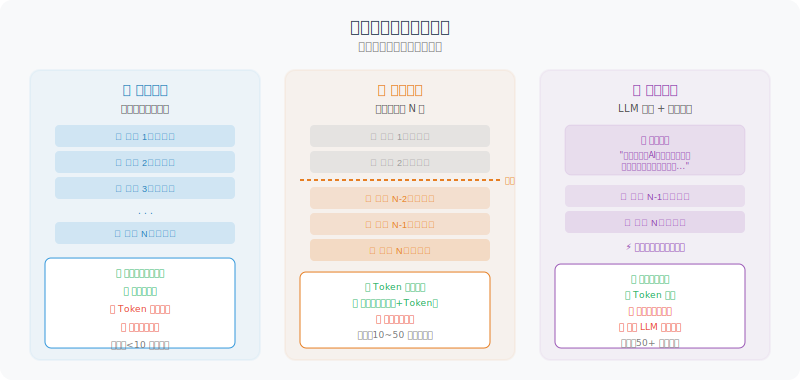

# 短期记忆：对话历史管理

短期记忆是最基础的记忆形式——维护对话历史，让 Agent 知道"刚才我们说了什么"。

为什么这很重要？LLM 本身是**无状态**的——每次调用都是一次全新的请求，模型并不"记得"上一次对话的内容。如果用户在第一轮说"我叫张伟"，第二轮问"我叫什么名字"，模型如果不回传之前的对话历史，就会一脸茫然。短期记忆解决的正是这个问题：**通过在每次请求中附带之前的对话记录，让模型"看起来"拥有了记忆。**

但这带来一个新问题：LLM 的上下文窗口是有限的（GPT-4o 约 128K Token）。随着对话越来越长，Token 消耗急剧增加，不仅费用高昂，还可能超出模型的处理上限。因此，我们需要**对话历史管理策略**来平衡"记忆完整性"和"资源效率"。

本节介绍三种策略：全量保留、滑动窗口、摘要压缩，它们适用于不同长度的对话场景。



## 基础对话历史管理

我们先从最简单的开始：完整保留所有对话历史。这个 `ConversationHistory` 类封装了消息的添加、Token 统计和 API 调用。注意它使用 `tiktoken` 来精确计算每条消息的 Token 数——这对后面的窗口截断策略至关重要。

```python
from openai import OpenAI
from dataclasses import dataclass, field
from typing import Optional
import tiktoken

client = OpenAI()

@dataclass
class Message:
    role: str  # "user", "assistant", "system", "tool"
    content: str
    token_count: int = 0

class ConversationHistory:
    """对话历史管理器"""
    
    def __init__(self, system_prompt: str = None, model: str = "gpt-4o"):
        self.model = model
        self.encoding = tiktoken.encoding_for_model(model)
        self.messages: list[Message] = []
        
        if system_prompt:
            self.add_message("system", system_prompt)
    
    def count_tokens(self, text: str) -> int:
        """计算文本的 Token 数"""
        return len(self.encoding.encode(text))
    
    def add_message(self, role: str, content: str):
        """添加一条消息"""
        token_count = self.count_tokens(content)
        msg = Message(role=role, content=content, token_count=token_count)
        self.messages.append(msg)
        return msg
    
    def total_tokens(self) -> int:
        """计算总 Token 数"""
        return sum(m.token_count for m in self.messages)
    
    def to_api_format(self) -> list[dict]:
        """转换为 OpenAI API 格式"""
        return [{"role": m.role, "content": m.content} for m in self.messages]
    
    def chat(self, user_message: str) -> str:
        """进行一轮对话"""
        self.add_message("user", user_message)
        
        response = client.chat.completions.create(
            model=self.model,
            messages=self.to_api_format()
        )
        
        reply = response.choices[0].message.content
        self.add_message("assistant", reply)
        
        return reply
    
    def get_stats(self) -> dict:
        """获取历史统计信息"""
        return {
            "消息数": len(self.messages),
            "总Token数": self.total_tokens(),
            "用户消息": sum(1 for m in self.messages if m.role == "user"),
            "助手消息": sum(1 for m in self.messages if m.role == "assistant"),
        }
```

## 滑动窗口：控制历史长度

全量保留方案的问题很明显：随着对话轮次增加，Token 消耗呈线性增长。当对话超过 50 轮时，光是对话历史就可能占用数万 Token。

**滑动窗口**是最直觉的解决方案——只保留最近 N 轮对话，丢弃更早的记录。这类似于人类的短期记忆容量限制（心理学中有名的"7±2"法则）。

下面的实现有两个截断维度：`max_turns`（最大轮数）和 `max_tokens`（最大 Token 数）。这种双重保障很重要——有时候一轮对话就包含很长的代码，仅凭轮数无法有效控制 Token 消耗。`_get_window_messages` 方法会先按轮数截取，再检查 Token 是否超限，如果超限则进一步移除最早的轮次。

注意 `system_prompt` 始终保留，不参与截断——这是因为系统提示定义了 Agent 的角色和行为，丢失它会导致 Agent "人格错乱"。

```python
class SlidingWindowMemory:
    """滑动窗口对话管理：只保留最近 N 轮对话"""
    
    def __init__(
        self,
        system_prompt: str = None,
        max_turns: int = 10,       # 最大保留轮数
        max_tokens: int = 8000,    # 最大 Token 数
        model: str = "gpt-4o-mini"
    ):
        self.model = model
        self.max_turns = max_turns
        self.max_tokens = max_tokens
        self.system_prompt = system_prompt
        self.all_messages: list[dict] = []  # 完整历史（不传给 LLM）
        
        self.encoding = tiktoken.encoding_for_model(model)
    
    def _count_tokens(self, messages: list[dict]) -> int:
        """计算消息列表的 Token 总数"""
        total = 0
        for msg in messages:
            total += len(self.encoding.encode(msg.get("content", "")))
        return total
    
    def _get_window_messages(self) -> list[dict]:
        """获取滑动窗口内的消息"""
        # System prompt 始终保留
        result = []
        if self.system_prompt:
            result.append({"role": "system", "content": self.system_prompt})
        
        # 只取最近 max_turns * 2 条（每轮包含 user + assistant）
        recent = self.all_messages[-(self.max_turns * 2):]
        
        # 如果 Token 超限，进一步截断
        while recent and self._count_tokens(result + recent) > self.max_tokens:
            recent = recent[2:]  # 每次移除最早的一轮（2条消息）
        
        return result + recent
    
    def chat(self, user_message: str) -> str:
        """对话（使用滑动窗口）"""
        self.all_messages.append({"role": "user", "content": user_message})
        
        # 使用窗口内的消息
        window_messages = self._get_window_messages()
        
        response = client.chat.completions.create(
            model=self.model,
            messages=window_messages
        )
        
        reply = response.choices[0].message.content
        self.all_messages.append({"role": "assistant", "content": reply})
        
        # 显示窗口信息
        print(f"[记忆] 总历史: {len(self.all_messages)} 条 | "
              f"窗口使用: {len(window_messages)} 条 | "
              f"窗口Token: {self._count_tokens(window_messages)}")
        
        return reply

# 测试
memory = SlidingWindowMemory(
    system_prompt="你是一个编程助手",
    max_turns=5
)

for i in range(8):  # 模拟长对话
    reply = memory.chat(f"这是第 {i+1} 个问题，请用一句话回答什么是Python")
    print(f"Q{i+1}: {reply[:50]}...")
```

## 摘要压缩：智能压缩历史

滑动窗口的缺点是"非此即彼"——窗口外的对话直接丢弃，无论其中是否包含重要信息。如果用户在对话开头介绍了自己的背景和需求，等窗口滑过去后 Agent 就完全忘了。

**摘要压缩**是一种更智能的方案：当对话历史超过阈值时，用 LLM 将旧对话压缩成一段简洁的摘要，然后只保留"摘要 + 最近的消息"。这样既控制了 Token 总量，又保留了早期对话中的关键信息（比如用户偏好、项目背景、已做的决策）。

这个方案的代价是：每次压缩需要额外调用一次 LLM（可以用 `gpt-4o-mini` 这样的轻量模型来降低成本），而且压缩过程中不可避免地会丢失一些细节。在实践中，摘要压缩特别适合那些对话很长但信息密度不均匀的场景——比如技术支持对话，前半段可能是大量的排查尝试，真正有价值的是结论和决策。

```python
class SummaryMemory:
    """
    摘要记忆管理器
    当对话历史超过阈值时，自动压缩旧对话为摘要
    """
    
    def __init__(
        self,
        system_prompt: str = None,
        max_tokens_before_summary: int = 3000,
        model: str = "gpt-4o-mini",
        summary_model: str = "gpt-4o-mini"
    ):
        self.model = model
        self.summary_model = summary_model
        self.system_prompt = system_prompt
        self.max_tokens = max_tokens_before_summary
        
        self.summary: str = ""  # 压缩后的历史摘要
        self.recent_messages: list[dict] = []  # 最近的消息（未压缩）
        
        self.encoding = tiktoken.encoding_for_model(model)
    
    def _count_tokens(self, text: str) -> int:
        return len(self.encoding.encode(text))
    
    def _should_summarize(self) -> bool:
        """判断是否需要压缩"""
        total = sum(self._count_tokens(m["content"]) 
                   for m in self.recent_messages)
        return total > self.max_tokens
    
    def _create_summary(self) -> str:
        """将当前对话历史压缩为摘要"""
        if not self.recent_messages:
            return self.summary
        
        # 构建压缩提示
        conversation_text = "\n".join([
            f"{m['role'].upper()}: {m['content']}"
            for m in self.recent_messages
        ])
        
        existing_summary = f"已有摘要：\n{self.summary}\n\n" if self.summary else ""
        
        summary_prompt = f"""{existing_summary}请将以下对话内容压缩为简洁摘要，保留关键信息、决策和用户偏好：

{conversation_text}

要求：
1. 保留用户的关键需求和偏好
2. 保留重要的决策和结论  
3. 忽略闲聊和重复内容
4. 使用第三人称描述，简洁客观
5. 不超过300字"""
        
        response = client.chat.completions.create(
            model=self.summary_model,
            messages=[{"role": "user", "content": summary_prompt}],
            max_tokens=400
        )
        
        return response.choices[0].message.content
    
    def _build_messages(self) -> list[dict]:
        """构建发送给 LLM 的消息列表"""
        messages = []
        
        # System prompt
        if self.system_prompt:
            messages.append({"role": "system", "content": self.system_prompt})
        
        # 历史摘要（如果有）
        if self.summary:
            messages.append({
                "role": "system",
                "content": f"【对话历史摘要】\n{self.summary}"
            })
        
        # 最近消息
        messages.extend(self.recent_messages)
        
        return messages
    
    def chat(self, user_message: str) -> str:
        """对话（自动摘要压缩）"""
        self.recent_messages.append({"role": "user", "content": user_message})
        
        # 检查是否需要压缩
        if self._should_summarize():
            print("[记忆] 对话历史过长，正在压缩...")
            self.summary = self._create_summary()
            # 清空近期消息，只保留最后一条用户消息
            self.recent_messages = [self.recent_messages[-1]]
            print(f"[记忆] 压缩完成，摘要：{self.summary[:100]}...")
        
        # 调用 LLM
        response = client.chat.completions.create(
            model=self.model,
            messages=self._build_messages()
        )
        
        reply = response.choices[0].message.content
        self.recent_messages.append({"role": "assistant", "content": reply})
        
        return reply

# 测试摘要记忆
summary_mem = SummaryMemory(
    system_prompt="你是一个 Python 编程助手",
    max_tokens_before_summary=500  # 设小一点便于测试
)

conversations = [
    "我叫张伟，是一名后端开发工程师，主要用 Python 和 Go",
    "我正在开发一个微服务项目，用到了 FastAPI 和 SQLAlchemy",
    "我比较偏好简洁的代码风格，不喜欢过度抽象",
    "帮我写一个 FastAPI 的用户认证接口",
    "这个接口需要支持 JWT Token",
]

for msg in conversations:
    print(f"\n用户：{msg}")
    reply = summary_mem.chat(msg)
    print(f"助手：{reply[:100]}...")
```

---

## 小结

短期记忆管理的三种策略：

| 策略 | 适用场景 | 优点 | 缺点 |
|------|---------|------|------|
| 全量历史 | 短对话 | 信息完整 | Token 消耗高 |
| 滑动窗口 | 一般对话 | 简单高效 | 可能丢失早期信息 |
| 摘要压缩 | 长对话 | 保留重要信息 | 需要额外 LLM 调用 |

---

*下一节：[5.3 长期记忆：向量数据库与检索](./03_long_term_memory.md)*
