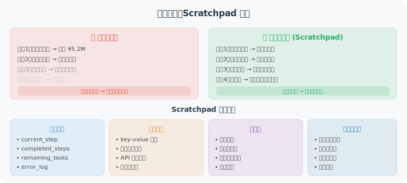

# 工作记忆：Scratchpad 模式

工作记忆是 Agent 在执行复杂任务时的"草稿纸"——记录推理步骤、中间结果，帮助 Agent 保持任务状态。



## 为什么需要工作记忆？

```python
# 没有工作记忆的 Agent 在处理复杂任务时会"忘记"中间步骤
user_task = """
分析我们公司Q1财务数据：
1. 计算总收入
2. 找出增长最快的产品线
3. 识别成本异常
4. 生成摘要报告
"""

# 问题：
# - 步骤1的结果，步骤3能用到吗？
# - 分析了20个产品线，如何记住哪个增长最快？
# - 发现了3个异常，每个异常的详情是什么？

# 解决方案：Scratchpad（草稿纸）
# 在推理过程中，将中间结果写入 Scratchpad
# 后续步骤可以读取并使用这些中间结果
```

## 基础 Scratchpad 实现

```python
import json
from datetime import datetime
from openai import OpenAI
from typing import Any

client = OpenAI()

class Scratchpad:
    """工作记忆/草稿纸"""
    
    def __init__(self):
        self._notes: dict[str, Any] = {}
        self._log: list[dict] = []
    
    def write(self, key: str, value: Any, description: str = ""):
        """写入一条笔记"""
        self._notes[key] = {
            "value": value,
            "description": description,
            "updated_at": datetime.now().isoformat()
        }
        self._log.append({
            "action": "write",
            "key": key,
            "description": description,
            "time": datetime.now().isoformat()
        })
    
    def read(self, key: str) -> Any:
        """读取一条笔记"""
        entry = self._notes.get(key)
        return entry["value"] if entry else None
    
    def list_keys(self) -> list[str]:
        """列出所有键"""
        return list(self._notes.keys())
    
    def to_prompt_text(self) -> str:
        """将 Scratchpad 内容格式化为 Prompt 文本"""
        if not self._notes:
            return "工作记忆：（空）"
        
        lines = ["【工作记忆 - 已知信息】"]
        for key, entry in self._notes.items():
            desc = f"（{entry['description']}）" if entry['description'] else ""
            lines.append(f"- {key}{desc}: {json.dumps(entry['value'], ensure_ascii=False)}")
        
        return "\n".join(lines)
    
    def clear(self):
        """清空（任务完成后调用）"""
        self._notes.clear()


class ScratchpadAgent:
    """使用 Scratchpad 的多步骤推理 Agent"""
    
    def __init__(self):
        self.scratchpad = Scratchpad()
    
    def _build_system_prompt(self) -> str:
        """构建包含当前 Scratchpad 内容的系统提示"""
        base_prompt = """你是一个能够解决复杂多步骤问题的 AI 助手。

在解决问题时，你需要：
1. 将问题分解为多个步骤
2. 逐步执行，每步完成后记录结果
3. 后续步骤可以引用前面步骤的结果

"""
        scratchpad_content = self.scratchpad.to_prompt_text()
        return base_prompt + "\n" + scratchpad_content
    
    def _tools_for_scratchpad(self) -> list[dict]:
        """定义 Scratchpad 相关工具"""
        return [
            {
                "type": "function",
                "function": {
                    "name": "save_to_scratchpad",
                    "description": "将中间计算结果或重要信息保存到工作记忆，以便后续步骤使用",
                    "parameters": {
                        "type": "object",
                        "properties": {
                            "key": {
                                "type": "string",
                                "description": "保存的键名，英文蛇形命名，如 total_revenue"
                            },
                            "value": {
                                "description": "要保存的值（可以是任何类型）"
                            },
                            "description": {
                                "type": "string",
                                "description": "这条信息的简短描述"
                            }
                        },
                        "required": ["key", "value"]
                    }
                }
            },
            {
                "type": "function",
                "function": {
                    "name": "read_from_scratchpad",
                    "description": "读取之前保存的中间结果",
                    "parameters": {
                        "type": "object",
                        "properties": {
                            "key": {
                                "type": "string",
                                "description": "要读取的键名"
                            }
                        },
                        "required": ["key"]
                    }
                }
            },
            {
                "type": "function",
                "function": {
                    "name": "list_scratchpad_keys",
                    "description": "列出工作记忆中的所有键名",
                    "parameters": {
                        "type": "object",
                        "properties": {}
                    }
                }
            }
        ]
    
    def _execute_tool(self, tool_name: str, tool_args: dict) -> str:
        """执行 Scratchpad 工具"""
        if tool_name == "save_to_scratchpad":
            self.scratchpad.write(
                tool_args["key"],
                tool_args["value"],
                tool_args.get("description", "")
            )
            return f"已保存：{tool_args['key']} = {tool_args['value']}"
        
        elif tool_name == "read_from_scratchpad":
            value = self.scratchpad.read(tool_args["key"])
            if value is not None:
                return f"{tool_args['key']} = {json.dumps(value, ensure_ascii=False)}"
            else:
                return f"未找到键：{tool_args['key']}，可用键：{self.scratchpad.list_keys()}"
        
        elif tool_name == "list_scratchpad_keys":
            keys = self.scratchpad.list_keys()
            return f"工作记忆中的键：{keys}"
        
        return "未知工具"
    
    def solve(self, problem: str) -> str:
        """解决一个复杂问题"""
        self.scratchpad.clear()
        
        print(f"\n{'='*50}")
        print(f"问题：{problem}")
        print('='*50)
        
        messages = [
            {
                "role": "system",
                "content": self._build_system_prompt()
            },
            {
                "role": "user",
                "content": f"{problem}\n\n请分步骤解决，每步完成后将中间结果保存到工作记忆。"
            }
        ]
        
        tools = self._tools_for_scratchpad()
        max_steps = 10
        step = 0
        
        while step < max_steps:
            step += 1
            
            # 每次调用都更新 system prompt（反映最新的 scratchpad 状态）
            messages[0]["content"] = self._build_system_prompt()
            
            response = client.chat.completions.create(
                model="gpt-4o",
                messages=messages,
                tools=tools,
                tool_choice="auto"
            )
            
            message = response.choices[0].message
            finish_reason = response.choices[0].finish_reason
            messages.append(message)
            
            if finish_reason == "stop":
                print(f"\n[最终答案]\n{message.content}")
                return message.content
            
            if finish_reason == "tool_calls" and message.tool_calls:
                for tc in message.tool_calls:
                    result = self._execute_tool(
                        tc.function.name,
                        json.loads(tc.function.arguments)
                    )
                    print(f"[工具] {tc.function.name}: {result[:100]}")
                    
                    messages.append({
                        "role": "tool",
                        "tool_call_id": tc.id,
                        "content": result
                    })
        
        return "超过最大步骤数"


# 测试：财务数据分析（使用模拟数据）
test_data = {
    "Q1营收": {"产品A": 120, "产品B": 85, "产品C": 200, "产品D": 60},
    "Q1成本": {"产品A": 45, "产品B": 80, "产品C": 60, "产品D": 55},
    "上季度营收": {"产品A": 100, "产品B": 70, "产品C": 190, "产品D": 50},
}

agent = ScratchpadAgent()
result = agent.solve(f"""
请分析以下Q1财务数据：
{json.dumps(test_data, ensure_ascii=False, indent=2)}

请完成：
1. 计算每个产品的利润率
2. 找出增长最快的产品
3. 识别利润率异常低的产品（低于20%）
4. 生成分析摘要
""")
```

## ReAct 中的工作记忆

ReAct 模式本身就是工作记忆的一种体现：

```python
react_with_scratchpad = """
任务：{task}

思考（Thought）：分析当前状态，决定下一步
行动（Action）：选择工具
观察（Observation）：工具返回的结果
[重复思考-行动-观察，直到任务完成]
最终答案（Final Answer）：...

当前工作记忆：
{scratchpad_content}
"""
```

---

## 小结

工作记忆（Scratchpad）的价值：
- 支持**复杂多步骤任务**，步骤间共享中间结果
- 避免重复计算和信息丢失
- 让 Agent 的推理过程更透明可追踪
- 任务完成后可清空，不污染长期记忆

---

*下一节：[5.5 实战：带记忆的个人助理 Agent](./05_practice_memory_agent.md)*
