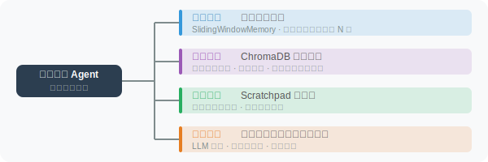

# 实战：带记忆的个人助理 Agent

综合前四节的知识，构建一个真正有"记忆"的个人助理——它能记住你的偏好、持续跨会话学习。

这个项目是本章知识的综合应用。我们将短期记忆（滑动窗口）和长期记忆（ChromaDB 向量检索）组合在一起，再加上自动记忆提取，构建一个真正"懂你"的个人助理。

### 核心设计思路

个人助理的记忆系统分三层协作：

1. **短期记忆**（滑动窗口）：保持当前会话的连贯性，让助理能追踪对话上下文
2. **长期记忆**（ChromaDB）：跨会话持久化，记住用户的身份、偏好、技能等长期信息
3. **自动提取**（LLM 分析）：每轮对话结束后，自动从对话中识别值得记忆的信息

这三层的协作方式是：每次用户发消息时，先从长期记忆中检索与当前话题相关的信息，连同短期记忆中的近期对话一起发给 LLM；LLM 回复后，自动提取器分析本轮对话是否产生了新的值得记忆的信息。整个过程对用户完全透明。

## 系统架构



## 完整实现

下面的 `PersonalAssistant` 类是整个系统的核心。注意代码中 `chat` 方法的处理流程——这正是上述三层记忆的工作顺序：检索长期记忆 → 构建消息（含短期记忆和相关的长期记忆）→ 调用 LLM → 更新短期记忆 → 自动提取新记忆。

```python
# personal_assistant.py
import json
import os
import datetime
import chromadb
import uuid
from openai import OpenAI
from dotenv import load_dotenv
from rich.console import Console
from rich.panel import Panel

load_dotenv()

client = OpenAI()
console = Console()


class PersonalAssistant:
    """
    带完整记忆系统的个人助理
    - 短期记忆：对话历史（最近10轮）
    - 长期记忆：ChromaDB 向量存储
    - 自动记忆提取和存储
    """
    
    def __init__(self, user_id: str, assistant_name: str = "小助"):
        self.user_id = user_id
        self.assistant_name = assistant_name
        
        # 初始化向量数据库
        self.chroma = chromadb.PersistentClient(path=f"./data/memory_{user_id}")
        self.memory_collection = self.chroma.get_or_create_collection(
            name="long_term_memory",
            metadata={"hnsw:space": "cosine"}
        )
        
        # 短期记忆：对话历史
        self.conversation_history: list[dict] = []
        self.max_history_turns = 10
        
        # 会话ID（用于追踪）
        self.session_id = str(uuid.uuid4())[:8]
        
        count = self.memory_collection.count()
        console.print(f"[dim]{assistant_name} 已加载，长期记忆库：{count} 条[/dim]")
    
    # =====================
    # 记忆操作
    # =====================
    
    def _embed(self, text: str) -> list[float]:
        """生成嵌入向量"""
        response = client.embeddings.create(
            input=text,
            model="text-embedding-3-small"
        )
        return response.data[0].embedding
    
    def save_memory(self, content: str, memory_type: str = "general", importance: int = 5):
        """保存一条长期记忆"""
        memory_id = str(uuid.uuid4())
        
        self.memory_collection.add(
            ids=[memory_id],
            embeddings=[self._embed(content)],
            documents=[content],
            metadatas=[{
                "type": memory_type,
                "importance": importance,
                "user_id": self.user_id,
                "session_id": self.session_id,
                "created_at": datetime.datetime.now().isoformat()
            }]
        )
    
    def recall_memories(self, query: str, n: int = 5) -> list[dict]:
        """检索相关记忆"""
        if self.memory_collection.count() == 0:
            return []
        
        results = self.memory_collection.query(
            query_embeddings=[self._embed(query)],
            n_results=min(n, self.memory_collection.count()),
            where={"user_id": self.user_id},
            include=["documents", "metadatas", "distances"]
        )
        
        memories = []
        if results["documents"] and results["documents"][0]:
            for doc, meta, dist in zip(
                results["documents"][0],
                results["metadatas"][0],
                results["distances"][0]
            ):
                relevance = 1 - dist
                if relevance > 0.4:  # 过滤低相关性记忆
                    memories.append({
                        "content": doc,
                        "type": meta.get("type", "general"),
                        "importance": meta.get("importance", 5),
                        "relevance": relevance
                    })
        
        return sorted(memories, key=lambda x: x["relevance"], reverse=True)
    
    def _auto_extract_memories(self, user_msg: str, assistant_reply: str):
        """自动从对话中提取值得记忆的信息"""
        
        prompt = f"""从以下对话中提取值得长期记忆的用户信息。

用户说：{user_msg}
助手回复：{assistant_reply[:200]}

提取规则：
✅ 要提取：用户的个人信息、偏好、工作、技能、正在做的项目、明确表达的需求
❌ 不提取：日常问候、临时查询、助手说的话、没有持久价值的内容

返回JSON数组（无值得提取的内容返回空数组[]）：
[{{"content": "简洁陈述", "type": "fact|preference|task|skill", "importance": 1-10}}]"""
        
        try:
            response = client.chat.completions.create(
                model="gpt-4o-mini",
                messages=[{"role": "user", "content": prompt}],
                response_format={"type": "json_object"},
                max_tokens=300
            )
            
            result = json.loads(response.choices[0].message.content)
            memories = result if isinstance(result, list) else result.get("memories", [])
            
            for m in memories:
                if isinstance(m, dict) and m.get("content"):
                    self.save_memory(
                        m["content"],
                        m.get("type", "general"),
                        m.get("importance", 5)
                    )
                    console.print(f"[dim]💾 记忆：{m['content'][:60]}[/dim]")
        
        except Exception as e:
            pass  # 记忆提取失败不影响主功能
    
    def _get_window_history(self) -> list[dict]:
        """获取滑动窗口内的对话历史"""
        return self.conversation_history[-(self.max_history_turns * 2):]
    
    # =====================
    # 对话
    # =====================
    
    def chat(self, user_message: str) -> str:
        """与助理对话"""
        
        # 1. 从长期记忆中检索相关信息
        relevant_memories = self.recall_memories(user_message, n=5)
        
        # 2. 构建消息
        system_content = f"""你是 {self.assistant_name}，用户 {self.user_id} 的专属个人助理。

你能帮用户处理各种任务：回答问题、写作、分析、编程等。
回答要个性化——根据你了解的用户信息提供有针对性的帮助。
"""
        
        if relevant_memories:
            memory_text = "\n".join([
                f"- [{m['type']}] {m['content']}"
                for m in relevant_memories[:3]  # 最多3条最相关的
            ])
            system_content += f"\n【关于用户的记忆】\n{memory_text}\n"
        
        messages = [
            {"role": "system", "content": system_content}
        ] + self._get_window_history() + [
            {"role": "user", "content": user_message}
        ]
        
        # 3. 调用 LLM
        response = client.chat.completions.create(
            model="gpt-4o",
            messages=messages,
            max_tokens=800
        )
        
        reply = response.choices[0].message.content
        
        # 4. 更新对话历史
        self.conversation_history.append({"role": "user", "content": user_message})
        self.conversation_history.append({"role": "assistant", "content": reply})
        
        # 5. 异步提取记忆（不阻塞响应）
        self._auto_extract_memories(user_message, reply)
        
        return reply
    
    def show_memories(self):
        """展示所有记忆"""
        if self.memory_collection.count() == 0:
            console.print("[dim]暂无长期记忆[/dim]")
            return
        
        results = self.memory_collection.get(
            where={"user_id": self.user_id},
            include=["documents", "metadatas"]
        )
        
        from rich.table import Table
        table = Table(title=f"📚 {self.user_id} 的长期记忆库")
        table.add_column("类型", style="cyan", width=10)
        table.add_column("重要性", style="yellow", width=6)
        table.add_column("内容", style="white")
        
        entries = list(zip(results["documents"], results["metadatas"]))
        entries.sort(key=lambda x: x[1].get("importance", 0), reverse=True)
        
        for doc, meta in entries[:20]:  # 只显示前20条
            importance = meta.get("importance", 5)
            table.add_row(
                meta.get("type", "general"),
                "★" * min(importance // 2, 5),
                doc[:80]
            )
        
        console.print(table)


# ============================
# 主程序
# ============================

def main():
    console.print(Panel(
        "[bold]🤖 个人助理 Agent[/bold]\n"
        "我会记住关于你的信息，提供个性化服务\n\n"
        "命令：\n"
        "  memory  → 查看我记住的关于你的信息\n"
        "  clear   → 清空对话历史\n"  
        "  quit    → 退出",
        title="启动",
        border_style="green"
    ))
    
    user_id = input("\n请输入您的用户名：").strip() or "default_user"
    
    assistant = PersonalAssistant(
        user_id=user_id,
        assistant_name="小智"
    )
    
    console.print(f"\n[bold green]小智：[/bold green]你好，{user_id}！有什么我可以帮你的吗？")
    
    while True:
        user_input = input(f"\n[{user_id}]：").strip()
        
        if not user_input:
            continue
        
        if user_input.lower() == "quit":
            console.print("[bold]再见！我会记住今天的对话 😊[/bold]")
            break
        
        if user_input.lower() == "memory":
            assistant.show_memories()
            continue
        
        if user_input.lower() == "clear":
            assistant.conversation_history.clear()
            console.print("[dim]对话历史已清空（长期记忆保留）[/dim]")
            continue
        
        reply = assistant.chat(user_input)
        console.print(f"\n[bold green]小智：[/bold green]{reply}")


if __name__ == "__main__":
    main()
```

## 关键实现细节

让我们深入理解代码中几个重要的设计决策：

**记忆检索的相关性过滤**：`recall_memories` 方法设置了 `relevance > 0.4` 的阈值。这是因为向量检索总是会返回"最相似"的结果，但这些结果不一定真的相关。比如用户问"今天吃什么"，即使记忆库里没有饮食相关的信息，ChromaDB 依然会返回某些结果（只是相似度很低）。设置阈值可以过滤掉这些噪音。

**记忆注入 System Prompt**：在 `chat` 方法中，检索到的相关记忆被注入到系统提示中（`【关于用户的记忆】`段落），而不是作为用户消息发送。这是因为系统提示中的信息会被模型视为"背景知识"，不会在回复中直接引用或暴露给用户，更加自然。

**静默的记忆提取**：`_auto_extract_memories` 方法使用 `try...except` 包裹，失败时不影响主对话流程。这是因为记忆提取是一个"锦上添花"的功能——即使偶尔提取失败，也不应该影响用户的正常对话体验。

## 演示效果

```
[张伟]：我叫张伟，是一名 Python 工程师，正在做一个 AI 项目
💾 记忆：用户名为张伟
💾 记忆：用户是 Python 工程师
💾 记忆：用户正在做 AI 项目

小智：你好，张伟！很高兴认识你。作为 Python 工程师做 AI 项目，
你是在做什么方向呢？是 Agent 开发、模型训练还是其他方向？

[张伟]：帮我写一个 Python 函数来计算斐波那契数列

小智：（基于"Python工程师"的记忆，给出专业级代码）
def fibonacci(n: int) -> list[int]:
    """返回前 n 个斐波那契数"""
    ...

-- 下次启动 --
[张伟]：昨天那个斐波那契函数能优化吗？

小智：（从记忆中知道张伟是Python工程师，给出针对性回答）
可以用生成器或记忆化来优化...
```

---

## 小结

本章构建了一个完整的记忆系统：

| 组件 | 技术 | 用途 |
|------|------|------|
| 短期记忆 | 滑动窗口 | 当前对话连贯性 |
| 长期记忆 | ChromaDB | 跨会话个性化 |
| 记忆提取 | LLM 分析 | 自动识别重要信息 |
| 语义检索 | 向量相似度 | 精准召回相关记忆 |

这个框架可以作为构建个性化 Agent 应用的基础。

---

*下一章：[第6章 规划与推理（Planning & Reasoning）](../chapter_planning/README.md)*
