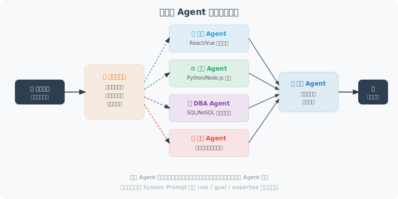

# 角色分工与任务分配

高效的多 Agent 系统需要合理的角色分工。好的角色设计让每个 Agent 都能发挥最大价值。



## 专业化 Agent 设计

```python
from openai import OpenAI
from typing import Optional

client = OpenAI()

class SpecializedAgent:
    """专业化 Agent 基类"""
    
    def __init__(self, name: str, role: str, expertise: str):
        self.name = name
        self.role = role
        self.expertise = expertise
        self.system_prompt = f"""你是 {name}，担任{role}角色。
        
你的专业领域：{expertise}

工作要求：
- 只处理与你专业领域直接相关的工作
- 如果任务超出你的专业范围，明确说明并请求其他 Agent 的帮助
- 给出专业、精准的输出
"""
    
    def process(self, task: str, context: str = "") -> str:
        """处理任务"""
        messages = [
            {"role": "system", "content": self.system_prompt}
        ]
        
        if context:
            messages.append({
                "role": "user",
                "content": f"背景信息：{context}\n\n任务：{task}"
            })
        else:
            messages.append({"role": "user", "content": task})
        
        response = client.chat.completions.create(
            model="gpt-4o",
            messages=messages,
            max_tokens=800
        )
        
        return response.choices[0].message.content


# ============================
# 软件开发团队示例
# ============================

class DevTeam:
    """多 Agent 软件开发团队"""
    
    def __init__(self):
        # 定义各角色 Agent
        self.product_manager = SpecializedAgent(
            name="Alice",
            role="产品经理",
            expertise="需求分析、功能规划、用户故事编写、优先级排序"
        )
        
        self.architect = SpecializedAgent(
            name="Bob",
            role="系统架构师",
            expertise="系统设计、技术选型、架构决策、数据库设计、API设计"
        )
        
        self.developer = SpecializedAgent(
            name="Charlie",
            role="全栈开发工程师",
            expertise="Python后端开发、FastAPI、Django、数据库操作、代码实现"
        )
        
        self.tester = SpecializedAgent(
            name="Diana",
            role="QA工程师",
            expertise="测试用例设计、pytest编写、边界条件测试、安全测试"
        )
        
        self.devops = SpecializedAgent(
            name="Eve",
            role="DevOps工程师",
            expertise="Docker、CI/CD、部署脚本、监控配置"
        )
    
    def develop_feature(self, requirement: str) -> dict:
        """完整的功能开发流程"""
        
        results = {}
        
        print(f"\n{'='*60}")
        print(f"开发需求：{requirement}")
        print('='*60)
        
        # 1. 产品经理：需求分析
        print("\n[Alice - 产品经理] 分析需求...")
        user_stories = self.product_manager.process(
            f"为以下需求编写用户故事和验收标准：{requirement}"
        )
        results["user_stories"] = user_stories
        
        # 2. 架构师：系统设计
        print("\n[Bob - 架构师] 设计系统...")
        architecture = self.architect.process(
            "设计实现方案，包括：技术栈选择、数据结构、API设计",
            context=f"需求文档：{user_stories}"
        )
        results["architecture"] = architecture
        
        # 3. 开发工程师：代码实现
        print("\n[Charlie - 开发] 编写代码...")
        code = self.developer.process(
            "根据设计方案编写 Python 实现代码，包含完整的函数和类",
            context=f"设计方案：{architecture}"
        )
        results["code"] = code
        
        # 4. QA工程师：编写测试
        print("\n[Diana - QA] 编写测试...")
        tests = self.tester.process(
            "为以下代码编写 pytest 测试用例，覆盖正常和边界情况",
            context=f"待测代码：{code[:500]}"
        )
        results["tests"] = tests
        
        # 5. DevOps：部署配置
        print("\n[Eve - DevOps] 准备部署...")
        deployment = self.devops.process(
            "创建 Dockerfile 和 docker-compose.yml",
            context=f"代码：{code[:300]}"
        )
        results["deployment"] = deployment
        
        return results


# 测试
team = DevTeam()
result = team.develop_feature("用户登录接口，支持邮箱+密码登录，返回JWT Token")

print("\n\n=== 开发成果摘要 ===")
for key, value in result.items():
    print(f"\n【{key}】")
    print(value[:200] + "..." if len(value) > 200 else value)
```

## 动态角色分配

```python
class DynamicTaskAllocator:
    """动态任务分配器：根据任务内容自动分配给合适的 Agent"""
    
    def __init__(self, agents: dict[str, SpecializedAgent]):
        self.agents = agents
    
    def allocate(self, task: str) -> str:
        """分析任务，选择最合适的 Agent"""
        agent_descriptions = "\n".join([
            f"- {name}: 专长 {agent.expertise}"
            for name, agent in self.agents.items()
        ])
        
        response = client.chat.completions.create(
            model="gpt-4o-mini",
            messages=[{
                "role": "user",
                "content": f"""根据任务描述，选择最合适的 Agent。

可用 Agent：
{agent_descriptions}

任务：{task}

只返回 Agent 名称（一个词）："""
            }],
            max_tokens=20
        )
        
        agent_name = response.choices[0].message.content.strip().lower()
        return agent_name
    
    def process(self, task: str) -> str:
        """自动分配并执行任务"""
        agent_name = self.allocate(task)
        agent = self.agents.get(agent_name)
        
        if agent:
            print(f"分配给：{agent.name}（{agent.role}）")
            return agent.process(task)
        else:
            # 找不到精确匹配，用第一个 Agent 处理
            agent = list(self.agents.values())[0]
            return agent.process(task)
```

---

## 小结

角色设计的关键原则：
- **专业化**：每个角色聚焦一个领域
- **明确边界**：角色之间的职责清晰不重叠
- **明确系统提示**：每个 Agent 都知道自己的能力边界
- **动态分配**：复杂系统考虑自动任务分配

---

*下一节：[14.4 Supervisor 模式 vs. 去中心化模式](./04_supervisor_vs_decentralized.md)*
