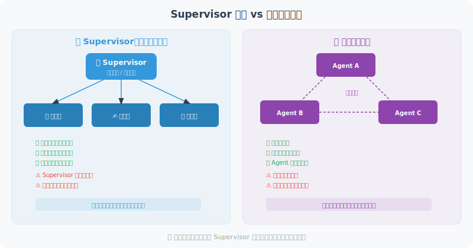

# Supervisor 模式 vs. 去中心化模式

多 Agent 系统有一个根本性的架构决策：**谁来协调？** 是设置一个"项目经理"统一调度所有 Agent（Supervisor 模式），还是让 Agent 之间自由协商（去中心化模式）？

这两种模式各有优劣，大多数实际项目会选择 Supervisor 模式，因为它更容易控制和调试。本节通过完整的代码示例对比两种方案。



## Supervisor（中心化）模式

Supervisor 模式的工作方式类似于项目管理：一个 Supervisor Agent 负责分析任务、分配子任务、监控进度、汇总结果。所有的决策都通过 Supervisor 来协调。

下面的示例构建了一个"内容创作团队"——Supervisor 协调研究员、写作员和审查员三个子 Agent：

```python
from langgraph.graph import StateGraph, END, START
from langgraph.prebuilt import create_react_agent
from langchain_openai import ChatOpenAI
from langchain_core.tools import tool
from typing import TypedDict, Annotated, Literal
import operator

llm = ChatOpenAI(model="gpt-4o")

# ============================
# 定义各子 Agent 的工具
# ============================

@tool
def do_research(topic: str) -> str:
    """研究专员：深度研究指定主题"""
    from openai import OpenAI
    client = OpenAI()
    response = client.chat.completions.create(
        model="gpt-4o-mini",
        messages=[{"role": "user", "content": f"研究{topic}，给出3个核心观点"}],
        max_tokens=200
    )
    return response.choices[0].message.content

@tool
def write_content(outline: str) -> str:
    """写作专员：根据大纲写内容"""
    from openai import OpenAI
    client = OpenAI()
    response = client.chat.completions.create(
        model="gpt-4o-mini",
        messages=[{"role": "user", "content": f"根据大纲写300字文章：{outline}"}],
        max_tokens=400
    )
    return response.choices[0].message.content

@tool
def review_content(content: str) -> str:
    """审查专员：检查内容质量"""
    from openai import OpenAI
    client = OpenAI()
    response = client.chat.completions.create(
        model="gpt-4o-mini",
        messages=[{"role": "user", "content": f"评审以下内容（评分+建议）：{content[:200]}"}],
        max_tokens=150
    )
    return response.choices[0].message.content

# Supervisor Agent 有所有工具的访问权
supervisor_tools = [do_research, write_content, review_content]
supervisor_agent = create_react_agent(llm, supervisor_tools)

# ============================
# Supervisor 决策逻辑
# ============================

class SupervisorState(TypedDict):
    messages: Annotated[list, operator.add]
    task: str
    research_done: bool
    content_written: bool
    review_done: bool

def supervisor(state: SupervisorState) -> dict:
    """Supervisor：统一协调所有子任务"""
    from langchain_core.messages import HumanMessage, SystemMessage
    
    context = f"""
你是任务协调者，管理一个内容创作团队。
可用工具：do_research, write_content, review_content

任务：{state['task']}
研究完成：{state.get('research_done', False)}
写作完成：{state.get('content_written', False)}
审查完成：{state.get('review_done', False)}

请分析当前进展，决定下一步：
1. 如果研究未完成 → 使用 do_research
2. 如果研究完成但写作未完成 → 使用 write_content
3. 如果写作完成但审查未完成 → 使用 review_content
4. 如果全部完成 → 总结并结束

当前消息历史（用于获取之前的输出）：
{[m.content if hasattr(m, 'content') else str(m) for m in state.get('messages', [])[-3:]]}
"""
    
    result = supervisor_agent.invoke({
        "messages": [HumanMessage(content=context)]
    })
    
    last_msg = result["messages"][-1]
    content = last_msg.content if hasattr(last_msg, 'content') else ""
    
    # 更新状态
    updates = {"messages": [last_msg]}
    if "research" in content.lower():
        updates["research_done"] = True
    if "write" in content.lower() or "文章" in content:
        updates["content_written"] = True
    if "review" in content.lower() or "评审" in content:
        updates["review_done"] = True
    
    return updates

def should_continue(state: SupervisorState) -> str:
    if state.get("review_done"):
        return "end"
    return "continue"

# 构建 Supervisor 图
graph = StateGraph(SupervisorState)
graph.add_node("supervisor", supervisor)
graph.add_edge(START, "supervisor")
graph.add_conditional_edges(
    "supervisor",
    should_continue,
    {"end": END, "continue": "supervisor"}
)

supervisor_app = graph.compile()

# 运行
result = supervisor_app.invoke({
    "messages": [],
    "task": "写一篇关于 Python 异步编程的技术文章",
    "research_done": False,
    "content_written": False,
    "review_done": False
})

print("最终状态：")
print(f"  研究完成: {result['research_done']}")
print(f"  写作完成: {result['content_written']}")
print(f"  审查完成: {result['review_done']}")
```

## 去中心化模式

与 Supervisor 模式不同，去中心化模式没有中央协调者。每个 Agent 都有自己的收件箱，通过广播或点对点消息直接与其他 Agent 通信。这种模式更像是一个自组织团队——成员之间自由讨论，自行决定谁来做什么。

优点是没有单点故障、灵活性高；缺点是协调成本大、容易出现冲突或死锁。

```python
# 去中心化：Agent 之间直接协商，没有中央协调者

class PeerToPeerNetwork:
    """点对点 Agent 网络"""
    
    def __init__(self):
        self.agents = {}
        self.message_board = {}  # 共享消息板
    
    def add_agent(self, name: str, specialization: str):
        self.agents[name] = {
            "name": name,
            "specialization": specialization,
            "inbox": [],
        }
    
    def broadcast(self, sender: str, message: str, target: str = "all"):
        """广播消息"""
        if target == "all":
            for name, agent in self.agents.items():
                if name != sender:
                    agent["inbox"].append({
                        "from": sender,
                        "message": message
                    })
        else:
            if target in self.agents:
                self.agents[target]["inbox"].append({
                    "from": sender,
                    "message": message
                })
    
    def process_inbox(self, agent_name: str) -> list[str]:
        """处理收件箱"""
        agent = self.agents[agent_name]
        messages = agent["inbox"].copy()
        agent["inbox"].clear()
        return [m["message"] for m in messages]

# 使用示例
network = PeerToPeerNetwork()
network.add_agent("research", "信息研究")
network.add_agent("writing", "内容写作")
network.add_agent("editing", "文章编辑")

# Agent 之间直接通信，自组织完成任务
# 这种模式更灵活，但也更难以控制
```

## 两种模式对比

```
Supervisor（中心化）：
✅ 易于协调和控制
✅ 全局视野，避免重复工作
✅ 易于调试和监控
❌ Supervisor 成为瓶颈
❌ Supervisor 失败则全体失败

去中心化：
✅ 无单点故障
✅ 高度灵活，自适应
✅ 更接近真实团队协作
❌ 协调成本高
❌ 可能产生冲突或死锁
❌ 调试困难

建议：
- 大多数生产场景 → Supervisor 模式
- 需要高容错性 → 去中心化
- 任务边界清晰 → Supervisor 更合适
```

## 小结

本节对比了多 Agent 系统的两大架构范式：

- **Supervisor（中心化）模式**：由一个协调者 Agent 统一调度所有子 Agent，具有全局视野，易于协调和监控。代码示例展示了如何用 LangGraph 构建 Supervisor 循环，通过状态标记追踪任务进度。适合任务边界清晰、需要严格控制流程的场景。
- **去中心化模式**：Agent 之间通过点对点网络直接通信，没有单点故障，灵活性高。但协调成本和调试难度也更大。

**实际建议**：大多数生产项目应优先选择 Supervisor 模式，其可控性和可调试性远优于去中心化方案。仅在需要高容错性或 Agent 数量极大时，才考虑去中心化架构。

---

*下一节：[14.5 实战：多 Agent 软件开发团队](./05_practice_dev_team.md)*
