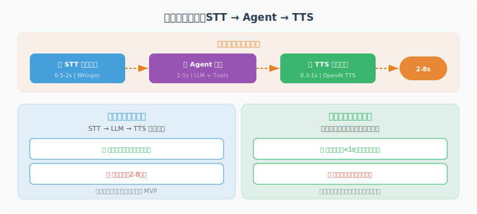

# 语音交互集成

> **本节目标**：为 Agent 集成语音识别（STT）和语音合成（TTS）能力，理解实时语音处理架构与多语言支持策略。



---

## 语音交互架构概览

语音 Agent 的核心挑战在于**延迟**。用户对语音交互的期望是"像与人对话一样自然"，这意味着从说完话到听到回复的延迟不能超过 1-2 秒。整个链路涉及三个延迟源：

| 环节 | 典型延迟 | 优化方向 |
|------|---------|---------|
| 语音识别（STT） | 0.5-2s | 流式识别、端点检测 |
| Agent 推理 | 1-5s | 流式输出、缓存 |
| 语音合成（TTS） | 0.3-1s | 流式合成、预生成 |
| **端到端总延迟** | **2-8s** | **全链路流式处理** |

### 两种架构模式

**模式一：分步处理（STT → LLM → TTS）**

音频录制完成后，依次进行语音识别、LLM 推理、语音合成。实现简单，延迟较高（3-8 秒），适合对实时性要求不高的场景。本节前半部分采用此模式。

**模式二：全链路流式（Streaming Pipeline）**

语音识别边听边转、LLM 边想边输出、TTS 边合成边播放，三个环节并行流水线执行。延迟可降至 1-2 秒，但实现复杂度高。OpenAI 的 Realtime API 采用此模式。

---

## 语音识别（Speech-to-Text）

使用 OpenAI 的 Whisper 模型将语音转为文字：

```python
from openai import OpenAI
from pathlib import Path

class SpeechToText:
    """语音转文字工具"""
    
    def __init__(self):
        self.client = OpenAI()
    
    def transcribe(
        self,
        audio_path: str,
        language: str = "zh"
    ) -> str:
        """将音频文件转为文字"""
        
        with open(audio_path, "rb") as audio_file:
            transcript = self.client.audio.transcriptions.create(
                model="whisper-1",
                file=audio_file,
                language=language,
                response_format="text"
            )
        
        return transcript
    
    def transcribe_with_timestamps(
        self,
        audio_path: str,
        language: str = "zh"
    ) -> dict:
        """转录并返回时间戳"""
        
        with open(audio_path, "rb") as audio_file:
            transcript = self.client.audio.transcriptions.create(
                model="whisper-1",
                file=audio_file,
                language=language,
                response_format="verbose_json",
                timestamp_granularities=["segment"]
            )
        
        return {
            "text": transcript.text,
            "segments": [
                {
                    "text": seg.text,
                    "start": seg.start,
                    "end": seg.end
                }
                for seg in (transcript.segments or [])
            ]
        }


# 使用示例
stt = SpeechToText()
text = stt.transcribe("user_voice.mp3")
print(f"用户说：{text}")
```

---

## 语音合成（Text-to-Speech）

将 Agent 的文字回复转为语音：

```python
class TextToSpeech:
    """文字转语音工具"""
    
    VOICES = ["alloy", "echo", "fable", "onyx", "nova", "shimmer"]
    
    def __init__(self, voice: str = "nova"):
        self.client = OpenAI()
        self.voice = voice
    
    def speak(
        self,
        text: str,
        output_path: str = "response.mp3",
        speed: float = 1.0
    ) -> str:
        """将文字转为语音文件"""
        
        response = self.client.audio.speech.create(
            model="tts-1",       # 或 "tts-1-hd" 高清版
            voice=self.voice,
            input=text,
            speed=speed          # 0.25 - 4.0
        )
        
        response.stream_to_file(output_path)
        return output_path
    
    def stream_speak(self, text: str):
        """流式语音合成（边生成边播放）"""
        
        response = self.client.audio.speech.create(
            model="tts-1",
            voice=self.voice,
            input=text
        )
        
        # 返回字节流，可以边接收边播放
        return response.content


# 使用示例
tts = TextToSpeech(voice="nova")
tts.speak("你好！我是你的AI助手，有什么可以帮你的吗？")
```

---

## 语音对话循环

```python
import asyncio

class VoiceConversation:
    """语音对话系统"""
    
    def __init__(self, agent_func):
        self.stt = SpeechToText()
        self.tts = TextToSpeech(voice="nova")
        self.agent = agent_func  # Agent 处理函数
    
    async def process_voice(self, audio_path: str) -> str:
        """处理一轮语音对话"""
        
        # 1. 语音 → 文字
        print("🎤 识别语音中...")
        user_text = self.stt.transcribe(audio_path)
        print(f"📝 识别结果: {user_text}")
        
        # 2. Agent 处理
        print("🤔 Agent 思考中...")
        response_text = await self.agent(user_text)
        print(f"💬 Agent 回复: {response_text}")
        
        # 3. 文字 → 语音
        print("🔊 生成语音...")
        audio_output = self.tts.speak(response_text)
        print(f"✅ 语音已保存: {audio_output}")
        
        return audio_output
```

---

## OpenAI Realtime API：低延迟语音交互

2024 年底，OpenAI 推出了 Realtime API <sup>[1]</sup>，支持音频直接输入/输出（Audio-in, Audio-out），跳过了传统的 STT → LLM → TTS 三段式流程，将端到端延迟降低到亚秒级。

### 核心特点

- **语音到语音（Speech-to-Speech）**：模型直接接收音频输入并生成音频输出，无需中间的文字转换步骤
- **WebSocket 长连接**：通过 WebSocket 建立持久连接，支持双向实时通信
- **函数调用（Function Calling）**：即使在语音模式下，Agent 也可以调用外部工具
- **语音活动检测（VAD）**：内置端点检测，自动判断用户是否说完

### 基础连接示例

```python
import asyncio
import websockets
import json
import base64

class RealtimeVoiceAgent:
    """基于 OpenAI Realtime API 的语音 Agent"""
    
    REALTIME_URL = "wss://api.openai.com/v1/realtime?model=gpt-4o-realtime-preview"
    
    def __init__(self, api_key: str, instructions: str = "你是一个友好的语音助手"):
        self.api_key = api_key
        self.instructions = instructions
    
    async def connect(self):
        """建立 WebSocket 连接"""
        headers = {
            "Authorization": f"Bearer {self.api_key}",
            "OpenAI-Beta": "realtime=v1"
        }
        
        async with websockets.connect(
            self.REALTIME_URL, 
            additional_headers=headers
        ) as ws:
            # 配置会话
            await ws.send(json.dumps({
                "type": "session.update",
                "session": {
                    "instructions": self.instructions,
                    "voice": "nova",
                    "input_audio_format": "pcm16",
                    "output_audio_format": "pcm16",
                    "turn_detection": {
                        "type": "server_vad",  # 服务端语音活动检测
                        "threshold": 0.5,
                        "silence_duration_ms": 500
                    }
                }
            }))
            
            # 事件处理循环
            async for message in ws:
                event = json.loads(message)
                await self._handle_event(event)
    
    async def _handle_event(self, event: dict):
        """处理服务端事件"""
        event_type = event.get("type", "")
        
        if event_type == "response.audio.delta":
            # 收到音频片段，可以立即播放
            audio_chunk = base64.b64decode(event["delta"])
            await self._play_audio(audio_chunk)
        
        elif event_type == "response.text.delta":
            # 收到文本片段（调试用）
            print(event["delta"], end="", flush=True)
        
        elif event_type == "response.function_call_arguments.done":
            # Agent 请求调用工具
            await self._handle_tool_call(event)
    
    async def _play_audio(self, chunk: bytes):
        """播放音频片段（需要集成音频播放库）"""
        # 实际实现中使用 pyaudio 或 sounddevice
        pass
    
    async def _handle_tool_call(self, event: dict):
        """处理工具调用"""
        # 与文本模式的 Function Calling 逻辑一致
        pass
```

> 💡 **选型建议**：如果你的 Agent 需要"像打电话一样"的实时语音交互（如客服机器人、语音助手），Realtime API 是目前体验最好的选择。如果只是偶尔需要语音输入/输出（如语音备忘录），传统的 STT + TTS 方案更简单可控。

---

## 多语言与方言支持

### Whisper 的语言能力

OpenAI Whisper 支持 99 种语言的语音识别，但不同语言的准确率差异显著：

| 语言类别 | 代表语言 | WER（词错误率） | 建议 |
|---------|---------|--------------|------|
| 高资源语言 | 英语、中文普通话 | < 5% | 直接使用，效果优秀 |
| 中资源语言 | 日语、韩语、德语 | 5-15% | 可用，建议指定 `language` 参数 |
| 低资源语言 | 粤语、藏语、方言 | 15-30% | 需要后处理修正 |

### 多语言 Agent 设计策略

```python
class MultilingualVoiceAgent:
    """多语言语音 Agent"""
    
    # 语言到 TTS 音色的映射
    VOICE_MAP = {
        "zh": "nova",      # 中文用 nova（自然感强）
        "en": "alloy",     # 英文用 alloy
        "ja": "shimmer",   # 日文用 shimmer
    }
    
    def __init__(self):
        self.stt = SpeechToText()
        self.client = OpenAI()
    
    async def detect_and_respond(self, audio_path: str) -> str:
        """自动检测语言并用同种语言回复"""
        
        # Whisper 自动检测语言
        with open(audio_path, "rb") as f:
            result = self.client.audio.transcriptions.create(
                model="whisper-1",
                file=f,
                response_format="verbose_json"
            )
        
        detected_lang = result.language  # 如 "chinese", "english"
        lang_code = {"chinese": "zh", "english": "en", "japanese": "ja"
                    }.get(detected_lang, "en")
        
        # 用检测到的语言回复
        voice = self.VOICE_MAP.get(lang_code, "nova")
        
        # Agent 处理（在 System Prompt 中指定回复语言）
        response = await self._process_with_language(result.text, lang_code)
        
        # 用对应语言的音色合成语音
        tts = TextToSpeech(voice=voice)
        return tts.speak(response)
```

---

## 语音情感分析

语音不仅传递文字信息，还包含情感线索（语气、语速、音调）。在客服、心理健康等场景中，识别用户情绪有重要价值：

```python
class VoiceSentimentAnalyzer:
    """基于语音的情感分析"""
    
    def __init__(self):
        self.client = OpenAI()
    
    async def analyze(self, audio_path: str) -> dict:
        """分析语音的文字内容和情感"""
        
        # 第一步：转录语音
        with open(audio_path, "rb") as f:
            transcript = self.client.audio.transcriptions.create(
                model="whisper-1", file=f, 
                response_format="verbose_json",
                timestamp_granularities=["segment"]
            )
        
        # 第二步：让 LLM 分析情感
        # 注意：这里只分析文本语义的情感，
        # 真正的声学情感分析需要专门模型（如 emotion2vec）
        analysis_prompt = f"""分析以下语音转录文本的情感，返回 JSON：
{{
  "text": "原文",
  "sentiment": "positive/neutral/negative",
  "emotion": "主要情绪（如：开心、焦虑、愤怒、平静）",
  "urgency": "high/medium/low",
  "confidence": 0.0-1.0
}}

转录文本：{transcript.text}"""
        
        response = self.client.chat.completions.create(
            model="gpt-4o",
            messages=[{"role": "user", "content": analysis_prompt}],
            response_format={"type": "json_object"}
        )
        
        return json.loads(response.choices[0].message.content)
```

---

## 语音 Agent 设计模式

在实践中，语音 Agent 有几种常见的设计模式：

### 模式一：语音前端 + 文本后端

最简单的模式。语音只是输入/输出的"皮肤"，Agent 核心仍然处理文本。适合绝大多数场景。

```
🎤 用户语音 → [STT] → 文本 → [Agent] → 文本 → [TTS] → 🔊 回复语音
```

### 模式二：语音感知 Agent

Agent 能感知语音特征（语速、停顿、情绪），据此调整回复策略。例如检测到用户语气焦急时，回复更简洁直接。

### 模式三：持续监听 Agent

Agent 持续监听环境音频，在检测到唤醒词或特定事件时激活。适合智能家居、车载场景。需要轻量级的本地 VAD（语音活动检测）模型。

### 各模式对比

| 模式 | 复杂度 | 延迟 | 适用场景 |
|------|--------|------|---------|
| 语音前端 + 文本后端 | ⭐ | 3-8s | 通用助手、客服 |
| 语音感知 Agent | ⭐⭐⭐ | 3-8s | 情感客服、心理咨询 |
| 持续监听 Agent | ⭐⭐⭐⭐ | 1-3s | 智能家居、车载 |
| Realtime API Agent | ⭐⭐ | 0.5-2s | 实时对话、电话 Agent |

---

## 参考文献

[1] OpenAI. "Realtime API." OpenAI Platform Documentation, 2024. https://platform.openai.com/docs/guides/realtime

---

## 小结

| 功能 | 模型 | 说明 |
|------|------|------|
| 语音识别 | Whisper | 支持 50+ 语言，准确率高 |
| 语音合成 | TTS-1 | 6 种音色可选 |
| 语音对话 | 组合使用 | STT → Agent → TTS 完整链路 |

---

[下一节：21.4 实战：多模态个人助理 →](./04_practice_multimodal_assistant.md)
