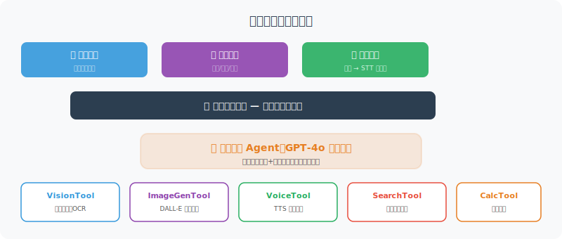

# 实战：多模态个人助理

> **本节目标**：构建一个能处理文本、图像和语音的多模态 Agent。



---

## 完整实现

```python
"""
多模态个人助理 —— 支持文本、图像、语音输入
"""
import asyncio
import os
from openai import OpenAI
from langchain_openai import ChatOpenAI

# 导入前面实现的组件
# 各组件的完整实现请参考对应章节：
# from vision_tool import VisionTool           # → 21.2 节
# from image_generator import ImageGenerator   # → 21.2 节
# from speech_to_text import SpeechToText      # → 21.3 节
# from text_to_speech import TextToSpeech      # → 21.3 节
# 提示：运行本节代码前，需先将 21.2-21.3 节的代码保存为独立模块


class MultimodalAssistant:
    """多模态个人助理"""
    
    def __init__(self):
        self.client = OpenAI()
        self.llm = ChatOpenAI(model="gpt-4o", temperature=0.7)
        self.vision = VisionTool()
        self.image_gen = ImageGenerator()
        self.stt = SpeechToText()
        self.tts = TextToSpeech(voice="nova")
        
        self.history = []  # 对话历史
    
    async def process(self, user_input: dict) -> dict:
        """处理多模态输入
        
        Args:
            user_input: {
                "text": "可选的文字",
                "image": "可选的图片路径",
                "audio": "可选的语音路径"
            }
        
        Returns:
            {
                "text": "文字回复",
                "image": "可选的图片路径",
                "audio": "可选的语音路径"
            }
        """
        
        # 1. 统一转为文本
        text_input = await self._unify_input(user_input)
        print(f"📝 理解为: {text_input}")
        
        # 2. 判断需要哪种输出
        output_type = await self._classify_output(text_input)
        
        # 3. 处理并生成回复
        result = {"text": "", "image": None, "audio": None}
        
        if output_type == "image_generation":
            # 需要生成图片
            urls = self.image_gen.generate(text_input)
            result["text"] = "已为您生成图片 ✨"
            result["image"] = urls[0] if urls else None
            
        elif output_type == "image_analysis":
            # 分析图片
            if user_input.get("image"):
                analysis = self.vision.analyze_local_image(
                    user_input["image"], text_input
                )
                result["text"] = analysis
            else:
                result["text"] = "请提供需要分析的图片。"
            
        else:
            # 普通文本对话
            self.history.append({"role": "user", "content": text_input})
            
            response = await self.llm.ainvoke(self.history)
            result["text"] = response.content
            
            self.history.append({
                "role": "assistant", "content": result["text"]
            })
        
        # 4. 如果是语音输入，也生成语音回复
        if user_input.get("audio"):
            audio_path = self.tts.speak(result["text"])
            result["audio"] = audio_path
        
        return result
    
    async def _unify_input(self, user_input: dict) -> str:
        """将多模态输入统一为文本"""
        parts = []
        
        if user_input.get("audio"):
            # 语音转文字
            text = self.stt.transcribe(user_input["audio"])
            parts.append(text)
        
        if user_input.get("text"):
            parts.append(user_input["text"])
        
        if user_input.get("image") and not parts:
            parts.append("请描述这张图片")
        
        return " ".join(parts)
    
    async def _classify_output(self, text: str) -> str:
        """判断应该输出什么类型"""
        
        # 简单的关键词判断
        if any(kw in text for kw in ["生成图片", "画一", "创建图像", "设计一"]):
            return "image_generation"
        elif any(kw in text for kw in ["分析图片", "看看这张", "图片里"]):
            return "image_analysis"
        else:
            return "text"


async def main():
    """交互式多模态助理"""
    
    print("🌟 多模态个人助理")
    print("=" * 40)
    print("命令说明：")
    print("  直接输入文字 → 文字对话")
    print("  img:<路径>    → 分析图片")
    print("  gen:<描述>    → 生成图片")
    print("  quit          → 退出")
    print()
    
    assistant = MultimodalAssistant()
    
    while True:
        raw_input = input("你: ").strip()
        
        if raw_input.lower() in ("quit", "exit", "q"):
            print("👋 再见！")
            break
        
        if not raw_input:
            continue
        
        # 解析输入类型
        user_input = {"text": None, "image": None, "audio": None}
        
        if raw_input.startswith("img:"):
            image_path = raw_input[4:].strip()
            user_input["image"] = image_path
            user_input["text"] = "请分析这张图片"
        elif raw_input.startswith("gen:"):
            user_input["text"] = "生成图片: " + raw_input[4:].strip()
        else:
            user_input["text"] = raw_input
        
        # 处理
        result = await assistant.process(user_input)
        
        # 展示结果
        print(f"\n🤖: {result['text']}")
        if result.get("image"):
            print(f"🖼️  图片: {result['image']}")
        if result.get("audio"):
            print(f"🔊 语音: {result['audio']}")
        print()


if __name__ == "__main__":
    asyncio.run(main())
```

---

## 使用效果

```
🌟 多模态个人助理
========================================

你: 你好，今天天气怎么样？
🤖: 你好！我无法获取实时天气数据，但我可以建议你查看天气预报应用。

你: img:receipt.jpg
📝 理解为: 请分析这张图片
🤖: 这是一张餐厅发票，包含以下信息：
    - 餐厅名：老北京涮肉
    - 消费金额：¥256.00
    - 日期：2026-03-10
    ...

你: gen:一只戴着太阳镜的柴犬坐在沙滩上
📝 理解为: 生成图片: 一只戴着太阳镜的柴犬坐在沙滩上
🤖: 已为您生成图片 ✨
🖼️  图片: https://...
```

---

## 小结

| 功能 | 实现方式 |
|------|---------|
| 文本对话 | GPT-4o + 对话历史 |
| 图像分析 | GPT-4o Vision API |
| 图像生成 | DALL-E 3 |
| 语音识别 | Whisper |
| 语音合成 | TTS-1 |
| 多模态融合 | 统一输入→分类→路由→输出 |

> 🎓 **本章总结**：多模态 Agent 让 AI 不再局限于文字交互。通过整合视觉理解、图像生成、语音识别和合成，我们构建了一个更自然、更强大的个人助理。

> 🎉 **全书总结**：从第1章的基本概念，到第21章的多模态实战，你已经走完了 Agent 开发的完整学习路径。你学会了工具调用、记忆系统、规划推理、RAG、多 Agent 协作、安全部署等核心技术。现在，去构建你自己的 Agent 应用吧！

---

[附录 A：常用 Prompt 模板大全 →](../appendix/prompt_templates.md)
