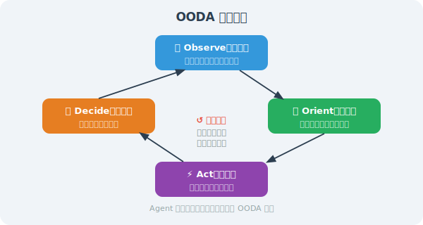
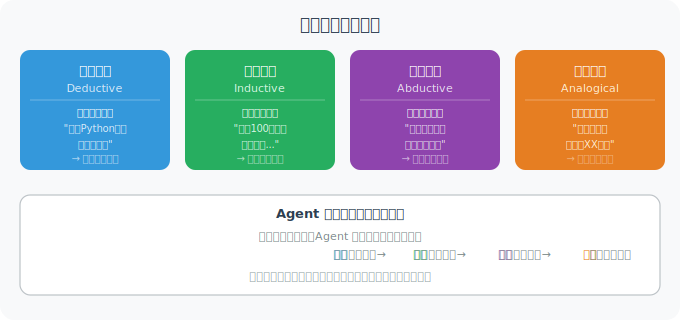

# Agent 如何"思考"？

Agent 的"思考"本质上是**在上下文中组织信息、推导结论、制定计划的过程**。理解这个过程，是设计高效 Agent 的前提。

## 思考的本质：上下文中的推理

LLM 没有独立的"思考空间"——它的所有推理都发生在 Context Window 中。通过精心设计 Prompt，我们可以引导模型产生更高质量的推理。

```python
from openai import OpenAI

client = OpenAI()

# 不引导推理：直接给答案（可能错误）
def direct_answer(question: str) -> str:
    response = client.chat.completions.create(
        model="gpt-4o",
        messages=[{"role": "user", "content": question}]
    )
    return response.choices[0].message.content

# 引导推理：分步思考（更准确）
def structured_thinking(question: str) -> str:
    system_prompt = """解决问题时，请严格按照以下框架：

【问题分析】
- 问题的核心是什么？
- 有哪些已知条件？
- 有哪些不确定因素？

【推理过程】
1. 第一步...
2. 第二步...
...

【结论】
最终答案是...

【验证】
验证答案是否合理...
"""
    
    response = client.chat.completions.create(
        model="gpt-4o",
        messages=[
            {"role": "system", "content": system_prompt},
            {"role": "user", "content": question}
        ]
    )
    return response.choices[0].message.content

# 对比测试
question = "一个水桶装满水重10公斤，装半桶水重6公斤，空桶重多少公斤？"
print("直接回答：", direct_answer(question))
print("\n结构化思考：", structured_thinking(question))
```

## 认知框架：OODA 循环

Agent 的决策可以用 OODA 循环来理解：



```python
class OODAAgent:
    """基于 OODA 循环的 Agent 框架"""
    
    def __init__(self):
        self.context = {}  # 当前情境理解
    
    def observe(self, input_data: str) -> str:
        """观察：收集和整理当前环境信息"""
        prompt = f"""
分析以下输入，提取关键信息：
{input_data}

请识别：
1. 用户的明确需求
2. 隐含的期望
3. 可能的障碍
"""
        response = client.chat.completions.create(
            model="gpt-4o",
            messages=[{"role": "user", "content": prompt}]
        )
        observation = response.choices[0].message.content
        self.context["observation"] = observation
        return observation
    
    def orient(self, observation: str) -> str:
        """定位：在已知知识框架中理解当前情况"""
        prompt = f"""
基于以下观察，进行情境评估：
{observation}

请分析：
1. 这个任务属于哪类问题？
2. 有哪些可用的方法和工具？
3. 主要的风险和挑战是什么？
"""
        response = client.chat.completions.create(
            model="gpt-4o",
            messages=[{"role": "user", "content": prompt}]
        )
        orientation = response.choices[0].message.content
        self.context["orientation"] = orientation
        return orientation
    
    def decide(self, orientation: str) -> str:
        """决策：制定行动计划"""
        prompt = f"""
基于情境评估，制定具体行动计划：
{orientation}

请给出：
1. 推荐的行动方案（第一选择）
2. 备选方案
3. 执行步骤（按优先级排序）
"""
        response = client.chat.completions.create(
            model="gpt-4o",
            messages=[{"role": "user", "content": prompt}]
        )
        decision = response.choices[0].message.content
        self.context["decision"] = decision
        return decision
    
    def act(self, plan: str, user_input: str) -> str:
        """行动：执行计划并生成最终响应"""
        response = client.chat.completions.create(
            model="gpt-4o",
            messages=[
                {
                    "role": "system",
                    "content": f"执行计划：\n{plan}\n\n用自然语言给用户一个清晰的回答。"
                },
                {"role": "user", "content": user_input}
            ]
        )
        return response.choices[0].message.content
    
    def process(self, user_input: str) -> str:
        """完整的 OODA 循环"""
        obs = self.observe(user_input)
        orientation = self.orient(obs)
        decision = self.decide(orientation)
        result = self.act(decision, user_input)
        return result
```

## 元认知：Agent 的自我意识

高级 Agent 具备元认知能力——能够思考自己的思考过程：

```python
def metacognitive_reasoning(problem: str) -> dict:
    """元认知推理：Agent 能评估自己的置信度和局限性"""
    
    response = client.chat.completions.create(
        model="gpt-4o",
        messages=[
            {
                "role": "system",
                "content": """回答时，始终进行元认知评估：
1. 我对这个问题的知识有多可靠？（置信度 0-10）
2. 哪些方面我可能存在盲区？
3. 是否需要额外工具或信息？
4. 我的回答基于哪些假设？"""
            },
            {"role": "user", "content": problem}
        ]
    )
    
    return {
        "answer": response.choices[0].message.content,
        "self_assessed_by_llm": True
    }

# 测试元认知
result = metacognitive_reasoning("量子计算机什么时候能超越传统计算机？")
print(result["answer"])
```

## 推理模式对比



---

## 小结

Agent 的"思考"依赖于：
- 结构化的推理框架（CoT、OODA 等）
- 元认知能力（知道自己不知道什么）
- 不同的推理模式（演绎、归纳、溯因、类比）

---

*下一节：[6.2 ReAct：推理 + 行动框架](./02_react_framework.md)*
