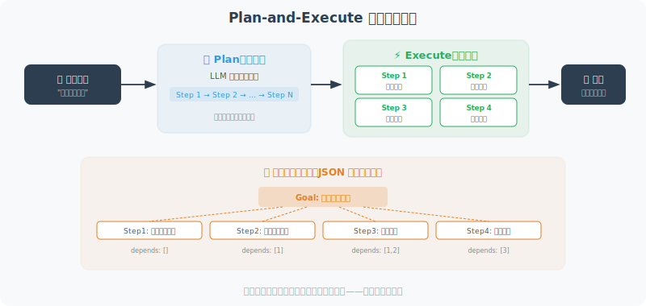

# 任务分解：将复杂问题拆解为子任务

复杂任务往往超出单个 LLM 调用的能力范围。任务分解是将大问题拆成可管理的小问题，然后逐步解决。

> 📄 **学术背景**：任务分解的思想在 AI 规划领域有悠久的历史（如层次任务网络 HTN），但将其与 LLM 结合是近年的研究热点。*"Plan-and-Solve Prompting: Improving Zero-Shot Chain-of-Thought Reasoning"*（Wang et al., 2023）是该方向的代表性工作，它提出让 LLM 先制定计划（"Let's first understand the problem and devise a plan"），再逐步执行每个子任务，在 GSM8K 等数学推理基准上比标准 Zero-shot CoT 提升了 5-6 个百分点。



## Plan-and-Execute 模式

```python
from openai import OpenAI
import json

client = OpenAI()

class PlanAndExecuteAgent:
    """
    规划-执行模式 Agent
    先制定完整计划，再逐步执行
    """
    
    def __init__(self, available_tools: dict):
        self.tools = available_tools
    
    def plan(self, goal: str) -> list[dict]:
        """
        将目标分解为有序的子任务列表
        
        Returns:
            [{"step": 1, "task": "...", "tool": "...", "depends_on": []}]
        """
        response = client.chat.completions.create(
            model="gpt-4o",
            messages=[
                {
                    "role": "system",
                    "content": f"""你是一个任务规划专家。将用户目标分解为可执行的子任务。

可用工具：{list(self.tools.keys())}

返回 JSON 格式的执行计划：
{{
  "goal": "总目标",
  "steps": [
    {{
      "step": 1,
      "task": "任务描述",
      "tool": "工具名（可选）",
      "expected_output": "预期产出",
      "depends_on": []
    }}
  ]
}}"""
                },
                {"role": "user", "content": f"请为以下目标制定执行计划：{goal}"}
            ],
            response_format={"type": "json_object"}
        )
        
        plan = json.loads(response.choices[0].message.content)
        return plan
    
    def execute_step(self, step: dict, context: dict) -> str:
        """执行单个步骤"""
        task = step["task"]
        tool_name = step.get("tool")
        
        print(f"\n[步骤 {step['step']}] {task}")
        
        if tool_name and tool_name in self.tools:
            # 让 LLM 决定工具参数
            param_response = client.chat.completions.create(
                model="gpt-4o-mini",
                messages=[
                    {
                        "role": "user",
                        "content": f"""
任务：{task}
已有信息：{json.dumps(context, ensure_ascii=False)}
请生成调用工具 "{tool_name}" 所需的参数（JSON格式，只返回参数值）："""
                    }
                ]
            )
            
            try:
                params = json.loads(param_response.choices[0].message.content)
                result = self.tools[tool_name](**params)
            except:
                result = self.tools[tool_name](task)
        else:
            # 直接用 LLM 处理
            response = client.chat.completions.create(
                model="gpt-4o",
                messages=[
                    {
                        "role": "system",
                        "content": f"你正在执行以下任务，已有的上下文信息：{json.dumps(context, ensure_ascii=False)}"
                    },
                    {"role": "user", "content": task}
                ]
            )
            result = response.choices[0].message.content
        
        print(f"  结果：{str(result)[:200]}")
        return str(result)
    
    def execute(self, goal: str) -> str:
        """执行完整目标"""
        # 1. 制定计划
        plan = self.plan(goal)
        print(f"\n📋 执行计划：{plan.get('goal', goal)}")
        for step in plan.get("steps", []):
            print(f"  步骤{step['step']}: {step['task']}")
        
        # 2. 逐步执行
        context = {}  # 各步骤结果的共享上下文
        
        for step in plan.get("steps", []):
            result = self.execute_step(step, context)
            context[f"step_{step['step']}_result"] = result
        
        # 3. 汇总结果
        summary_response = client.chat.completions.create(
            model="gpt-4o",
            messages=[
                {
                    "role": "user",
                    "content": f"""
目标：{goal}

各步骤执行结果：
{json.dumps(context, ensure_ascii=False, indent=2)}

请综合以上结果，给出最终回答："""
                }
            ]
        )
        
        final_answer = summary_response.choices[0].message.content
        print(f"\n✅ 最终结果：\n{final_answer}")
        return final_answer


# 测试工具
def mock_search(query: str) -> str:
    return f"搜索'{query}'的结果：[相关信息...]"

def mock_calculate(expression: str) -> str:
    import math
    try:
        result = eval(expression, {"__builtins__": {}, "math": math})
        return f"{expression} = {result}"
    except:
        return "计算失败"

def mock_write_file(filename: str, content: str) -> str:
    with open(filename, 'w', encoding='utf-8') as f:
        f.write(content)
    return f"文件 {filename} 已创建"

# 执行示例
agent = PlanAndExecuteAgent({
    "search": mock_search,
    "calculate": mock_calculate,
    "write_file": mock_write_file
})

result = agent.execute(
    "研究Python在AI开发中的主要应用场景，并写一份300字的总结报告"
)
```

## 层次化任务分解（HTN）

对于更复杂的任务，可以采用层次化分解：

```python
def hierarchical_decompose(task: str, depth: int = 2) -> dict:
    """
    层次化任务分解
    将任务递归分解，直到达到"原子操作"级别
    """
    
    response = client.chat.completions.create(
        model="gpt-4o",
        messages=[
            {
                "role": "system",
                "content": """你是任务分解专家。将复杂任务分解为子任务。
                
判断标准：
- 原子任务（leaf）：可以直接执行，不需要进一步分解
- 复合任务（composite）：需要分解为子任务

返回JSON格式：
{
  "task": "任务描述",
  "type": "leaf|composite",
  "subtasks": [],  // composite时填写
  "tool": "使用的工具（leaf时）",
  "estimated_minutes": 5
}"""
            },
            {
                "role": "user",
                "content": f"分解此任务（深度{depth}层）：{task}"
            }
        ],
        response_format={"type": "json_object"}
    )
    
    return json.loads(response.choices[0].message.content)

# 示例
task_tree = hierarchical_decompose(
    "开发一个天气预报 Python 应用"
)
print(json.dumps(task_tree, ensure_ascii=False, indent=2))
```

---

## 小结

任务分解的核心模式：
- **Plan-and-Execute**：先规划再执行，步骤共享上下文
- **层次化分解**：递归拆解直到原子任务
- **依赖管理**：并行执行无依赖的子任务

> 📖 **想深入了解任务规划的学术前沿？** 请阅读 [6.6 论文解读：规划与推理前沿研究](./06_paper_readings.md)，涵盖 Plan-and-Solve、HuggingGPT、LLM+P 等论文的深度解读。

---

## 参考文献

[1] WANG L, XU W, LAN Y, et al. Plan-and-solve prompting: Improving zero-shot chain-of-thought reasoning by large language models[C]//ACL. 2023.

[2] YAO S, YU D, ZHAO J, et al. Tree of thoughts: Deliberate problem solving with large language models[C]//NeurIPS. 2023.

[3] SHEN Y, SONG K, TAN X, et al. HuggingGPT: Solving AI tasks with ChatGPT and its friends in Hugging Face[C]//NeurIPS. 2023.

---

*下一节：[6.4 反思与自我纠错机制](./04_reflection.md)*
