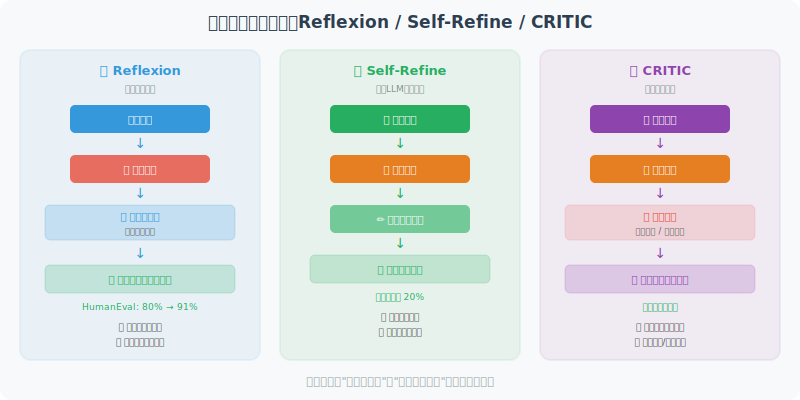

# 反思与自我纠错机制

优秀的 Agent 不仅能完成任务，还能评估自己的输出质量，发现问题并自我改进。这种能力来自**反思（Reflection）机制**。

> 📄 **学术背景**：反思机制是 Agent 研究中增长最快的方向之一。其核心问题是：**LLM 能否意识到自己的错误，并自我修正？** 以下三篇论文从不同角度给出了肯定的回答，并提出了不同的反思框架：
>
> - **Reflexion**（*Reflexion: Language Agents with Verbal Reinforcement Learning*，Shinn et al., 2023）：提出了"语言强化学习"——Agent 在任务失败后不更新模型权重，而是将失败经验写成自然语言"反思笔记"，存入长期记忆。下次遇到类似任务时，这些反思笔记会被检索出来指导行为。在 HumanEval 编程任务上，Reflexion Agent 的通过率从 80% 提升到了 91%。
>
> - **Self-Refine**（*Self-Refine: Iterative Refinement with Self-Feedback*，Madaan et al., CMU, 2023）：更简洁的方案——让同一个 LLM 扮演"生成者"和"批评者"两个角色。先生成初稿，然后自我批评，再根据批评修改，如此循环直到满意。在代码生成、数学推理、对话摘要等任务上平均提升了约 20%。
>
> - **CRITIC**（*CRITIC: Large Language Models Can Self-Correct with Tool-Interactive Critiquing*，Gou et al., 2023）：在自我批评的基础上引入**工具验证**——Agent 写完代码后运行单元测试，写完事实陈述后用搜索引擎核实。工具提供的客观反馈比纯自我批评更可靠。



## 基础反思循环

```python
from openai import OpenAI

client = OpenAI()

class ReflectiveAgent:
    """具备反思能力的 Agent"""
    
    def __init__(self, max_reflection_rounds: int = 3):
        self.max_rounds = max_reflection_rounds
    
    def generate(self, task: str, context: str = "") -> str:
        """生成初始答案"""
        response = client.chat.completions.create(
            model="gpt-4o",
            messages=[
                {"role": "system", "content": context or "你是一个专业助手"},
                {"role": "user", "content": task}
            ]
        )
        return response.choices[0].message.content
    
    def reflect(self, task: str, output: str, criteria: list[str]) -> dict:
        """
        反思评估：检查输出是否满足标准
        
        Returns:
            {"score": 0-10, "passed": bool, "feedback": str, "improvements": []}
        """
        criteria_text = "\n".join([f"- {c}" for c in criteria])
        
        response = client.chat.completions.create(
            model="gpt-4o",
            messages=[
                {
                    "role": "user",
                    "content": f"""请评估以下输出是否满足要求，并给出改进建议。

【原始任务】
{task}

【生成输出】
{output}

【评估标准】
{criteria_text}

请返回JSON格式的评估：
{{
  "score": 0-10的评分,
  "passed": true/false（是否通过所有标准）,
  "feedback": "整体反馈",
  "failed_criteria": ["未满足的标准1", "未满足的标准2"],
  "improvements": ["改进建议1", "改进建议2"]
}}"""
                }
            ],
            response_format={"type": "json_object"}
        )
        
        import json
        return json.loads(response.choices[0].message.content)
    
    def revise(self, task: str, output: str, feedback: dict) -> str:
        """基于反思反馈修改输出"""
        improvements = "\n".join([f"- {i}" for i in feedback.get("improvements", [])])
        failed = "\n".join([f"- {c}" for c in feedback.get("failed_criteria", [])])
        
        response = client.chat.completions.create(
            model="gpt-4o",
            messages=[
                {
                    "role": "user",
                    "content": f"""请改进以下输出，解决指出的问题。

【原始任务】
{task}

【当前输出】
{output}

【未满足的标准】
{failed}

【改进建议】
{improvements}

请给出改进后的版本："""
                }
            ]
        )
        return response.choices[0].message.content
    
    def run_with_reflection(self, task: str, criteria: list[str]) -> dict:
        """
        运行反思循环：生成 → 反思 → 改进 → 循环
        
        Returns:
            {"final_output": str, "rounds": int, "history": list}
        """
        history = []
        current_output = self.generate(task)
        
        print(f"\n任务：{task}")
        
        for round_num in range(self.max_rounds):
            print(f"\n=== 第 {round_num + 1} 轮反思 ===")
            
            # 评估
            evaluation = self.reflect(task, current_output, criteria)
            score = evaluation.get("score", 0)
            passed = evaluation.get("passed", False)
            
            print(f"评分：{score}/10 | 通过：{passed}")
            if evaluation.get("feedback"):
                print(f"反馈：{evaluation['feedback'][:100]}")
            
            history.append({
                "round": round_num + 1,
                "output": current_output,
                "score": score,
                "passed": passed
            })
            
            # 如果通过，停止
            if passed or score >= 8:
                print(f"✅ 输出质量满足要求，停止反思")
                break
            
            # 改进
            if round_num < self.max_rounds - 1:
                print("🔄 正在改进...")
                current_output = self.revise(task, current_output, evaluation)
        
        return {
            "final_output": current_output,
            "rounds": len(history),
            "history": history
        }


# 测试
agent = ReflectiveAgent(max_reflection_rounds=3)

result = agent.run_with_reflection(
    task="写一段Python代码，实现二分查找算法",
    criteria=[
        "代码能正确运行",
        "包含详细注释",
        "有类型注解",
        "有边界情况处理",
        "代码简洁易读"
    ]
)

print(f"\n最终输出（第{result['rounds']}轮）：")
print(result["final_output"])
```

## 自我纠错：发现并修复错误

```python
def self_correcting_code_generator(requirement: str) -> str:
    """
    自我纠错的代码生成器
    生成代码 → 自动测试 → 发现错误 → 修复 → 循环
    """
    import subprocess
    import tempfile
    import os
    
    max_attempts = 3
    
    for attempt in range(max_attempts):
        print(f"\n[尝试 {attempt + 1}]")
        
        # 生成代码
        response = client.chat.completions.create(
            model="gpt-4o",
            messages=[
                {
                    "role": "user",
                    "content": f"""
编写Python代码完成以下需求：
{requirement}

要求：
1. 代码必须能够直接运行（包含完整的测试用例）
2. 在文件末尾添加 if __name__ == '__main__': 测试代码
3. 只返回纯Python代码，不要Markdown格式
"""
                }
            ]
        )
        
        code = response.choices[0].message.content
        
        # 清理代码（移除可能的markdown标记）
        if "```python" in code:
            code = code.split("```python")[1].split("```")[0].strip()
        elif "```" in code:
            code = code.split("```")[1].split("```")[0].strip()
        
        # 测试代码
        with tempfile.NamedTemporaryFile(mode='w', suffix='.py', 
                                          delete=False, encoding='utf-8') as f:
            f.write(code)
            tmp_file = f.name
        
        try:
            result = subprocess.run(
                ["python", tmp_file],
                capture_output=True,
                text=True,
                timeout=10
            )
            
            if result.returncode == 0:
                print(f"✅ 代码运行成功！")
                os.unlink(tmp_file)
                return code
            else:
                error = result.stderr
                print(f"❌ 运行错误：{error[:200]}")
                
                # 修复错误
                fix_response = client.chat.completions.create(
                    model="gpt-4o",
                    messages=[
                        {
                            "role": "user",
                            "content": f"""以下代码有错误，请修复：

代码：
```python
{code}
```

错误信息：
{error}

请返回修复后的完整Python代码（不要Markdown格式）："""
                        }
                    ]
                )
                code = fix_response.choices[0].message.content
                if "```python" in code:
                    code = code.split("```python")[1].split("```")[0].strip()
        
        except subprocess.TimeoutExpired:
            print("❌ 代码执行超时")
        finally:
            try:
                os.unlink(tmp_file)
            except:
                pass
    
    return f"# 无法生成满足要求的代码（{max_attempts}次尝试后）\n" + code

# 测试
code = self_correcting_code_generator(
    "实现一个函数，计算列表中所有偶数的平均值，如果没有偶数返回0"
)
print(code)
```

---

## 小结

反思机制的价值：
- **质量保证**：多轮评估确保输出满足标准
- **自动纠错**：发现并修复错误，无需人工干预
- **持续改进**：每轮反思都让输出更接近目标
- **适用场景**：代码生成、内容写作、复杂分析

> 📖 **想深入了解反思与自我纠错的学术前沿？** 请阅读 [6.6 论文解读：规划与推理前沿研究](./06_paper_readings.md)，涵盖 Reflexion、Self-Refine、CRITIC 等论文的深度解读，以及自我纠错的边界与局限。
>
> 💡 **实践建议**：在实际 Agent 中实现反思时，**永远要设置最大迭代次数**（通常 2-3 轮就足够了），并优先使用有工具反馈的反思方式（如运行测试、查询数据库）。纯自我批评适合主观任务（如写作风格改进），而需要客观正确性的任务（如代码、数据分析）必须有外部验证。

---

*下一节：[6.5 实战：自动化研究助手 Agent](./05_practice_research_agent.md)*
