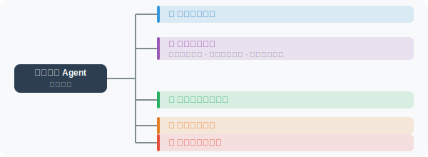

# 实战：自动化研究助手 Agent

综合本章所学的规划、推理和反思能力，构建一个能够自主进行研究的 Agent。

> **设计说明**：本项目采用"Plan-then-Execute"的多阶段 Pipeline 架构，而非纯 ReAct 循环。这是因为在研究任务中，各阶段（规划→搜索→分析→质量检查）有明确的先后顺序，Pipeline 模式更易于控制流程和调试。在 Pipeline 内部，每个阶段仍然运用了 ReAct 思想——Agent 根据当前阶段的输出"思考"下一步行动，并在质量检查阶段进行"反思"。这体现了第 6.1 节讨论的"将合适的推理框架应用到合适的场景"原则。

## 研究助手功能设计



## 完整实现

```python
import json
import datetime
from openai import OpenAI
import requests

client = OpenAI()

class ResearchAssistant:
    """自动化研究助手"""
    
    def __init__(self):
        self.research_notes = []
        self.sources = []
    
    def _search(self, query: str) -> str:
        """搜索工具（使用 DuckDuckGo）"""
        try:
            url = "https://api.duckduckgo.com/"
            params = {"q": query, "format": "json", "no_html": 1}
            response = requests.get(url, params=params, timeout=8)
            data = response.json()
            
            results = []
            if data.get("AbstractText"):
                results.append(data["AbstractText"])
                if data.get("AbstractURL"):
                    self.sources.append(data["AbstractURL"])
            
            for topic in data.get("RelatedTopics", [])[:3]:
                if isinstance(topic, dict) and topic.get("Text"):
                    results.append(topic["Text"][:300])
            
            return "\n".join(results) if results else "未找到相关结果"
        except Exception as e:
            return f"搜索失败：{e}"
    
    def _take_notes(self, content: str, source: str = ""):
        """记录研究笔记"""
        self.research_notes.append({
            "content": content,
            "source": source,
            "time": datetime.datetime.now().isoformat()
        })
    
    def research(self, topic: str, depth: str = "standard") -> str:
        """
        执行研究
        
        Args:
            topic: 研究主题
            depth: "quick"=快速概览, "standard"=标准研究, "deep"=深度研究
        """
        
        depth_config = {
            "quick": {"max_searches": 2, "sections": 3},
            "standard": {"max_searches": 4, "sections": 5},
            "deep": {"max_searches": 8, "sections": 7}
        }
        config = depth_config.get(depth, depth_config["standard"])
        
        print(f"\n🔬 开始研究：{topic}")
        print(f"研究深度：{depth}\n")
        
        # ===== 阶段1：规划研究 =====
        print("📋 阶段1：制定研究计划...")
        plan_response = client.chat.completions.create(
            model="gpt-4o",
            messages=[
                {
                    "role": "user",
                    "content": f"""你是一位研究分析师。为以下主题制定研究计划：

主题：{topic}
研究目标：全面理解该主题，生成{config['sections']}个核心章节的报告

请生成JSON格式的研究计划：
{{
  "research_questions": ["核心问题1", "核心问题2", ...],
  "search_queries": ["搜索词1", "搜索词2", ...（最多{config['max_searches']}个）],
  "report_outline": ["章节1标题", "章节2标题", ...]
}}"""
                }
            ],
            response_format={"type": "json_object"}
        )
        
        plan = json.loads(plan_response.choices[0].message.content)
        search_queries = plan.get("search_queries", [topic])[:config["max_searches"]]
        report_outline = plan.get("report_outline", [f"{topic}概述"])
        
        print(f"  搜索计划：{len(search_queries)} 个查询")
        print(f"  报告结构：{len(report_outline)} 个章节")
        
        # ===== 阶段2：搜索信息 =====
        print("\n🔍 阶段2：搜索信息...")
        all_findings = []
        
        for i, query in enumerate(search_queries, 1):
            print(f"  搜索 [{i}/{len(search_queries)}]：{query}")
            result = self._search(query)
            
            self._take_notes(result, source=f"搜索：{query}")
            all_findings.append(f"【查询：{query}】\n{result}")
        
        findings_text = "\n\n".join(all_findings)
        
        # ===== 阶段3：分析和综合 =====
        print("\n🧠 阶段3：分析综合...")
        
        analysis_response = client.chat.completions.create(
            model="gpt-4o",
            messages=[
                {
                    "role": "user",
                    "content": f"""基于以下研究资料，对主题"{topic}"进行深度分析。

研究资料：
{findings_text[:4000]}

报告大纲：{report_outline}

请按大纲生成完整的研究报告，要求：
1. 每个章节有实质性内容（200-400字）
2. 包含具体的数据、案例或观点
3. 在报告末尾给出结论和建议
4. 使用Markdown格式"""
                }
            ]
        )
        
        report = analysis_response.choices[0].message.content
        
        # ===== 阶段4：质量检查 =====
        print("\n✅ 阶段4：质量检查...")
        
        review_response = client.chat.completions.create(
            model="gpt-4o-mini",
            messages=[
                {
                    "role": "user",
                    "content": f"""简要评估以下研究报告的质量（JSON格式）：

主题：{topic}
报告（前1000字）：{report[:1000]}

评估：
{{
  "completeness_score": 1-10,
  "accuracy_indicators": "高/中/低",
  "missing_aspects": ["遗漏点1"],
  "overall_quality": "优秀/良好/一般"
}}"""
                }
            ],
            response_format={"type": "json_object"}
        )
        
        review = json.loads(review_response.choices[0].message.content)
        
        # 生成最终报告
        final_report = f"""# 研究报告：{topic}

> 生成时间：{datetime.datetime.now().strftime('%Y-%m-%d %H:%M')}
> 研究深度：{depth}
> 质量评分：{review.get('completeness_score', 'N/A')}/10
> 信息来源：{len(self.research_notes)} 条

---

{report}

---

## 研究说明

- 本报告基于 {len(search_queries)} 次网络搜索
- 信息截止日期：{datetime.datetime.now().strftime('%Y-%m-%d')}
- 建议结合最新资料进行验证
"""
        
        print(f"\n📄 报告生成完成！")
        print(f"质量：{review.get('overall_quality', 'N/A')} | "
              f"完整性：{review.get('completeness_score', 'N/A')}/10")
        
        return final_report


# 使用示例
assistant = ResearchAssistant()

report = assistant.research(
    topic="大语言模型在软件开发中的应用",
    depth="standard"
)

# 保存报告
filename = f"research_report_{datetime.datetime.now().strftime('%Y%m%d_%H%M')}.md"
with open(filename, 'w', encoding='utf-8') as f:
    f.write(report)

print(f"\n📁 报告已保存到：{filename}")
```

## 运行研究助手

```bash
pip install openai python-dotenv requests rich
python research_agent.py
```

示例输出：
```markdown
# 研究报告：大语言模型在软件开发中的应用

> 生成时间：2024-03-15 14:30
> 研究深度：standard
> 质量评分：8/10

## 1. 概述
...

## 2. 代码生成与补全
...

## 3. 代码审查与 Bug 检测
...
```

---

## 本章小结

本章学习了 Agent 规划与推理的核心技术：

| 技术 | 核心价值 |
|------|---------|
| OODA 循环 | 观察-定位-决策-行动的系统化思维框架 |
| ReAct 框架 | 推理过程透明化，提升可靠性 |
| 任务分解 | 将复杂问题分解为可管理的子任务 |
| 反思机制 | 自我评估和迭代改进 |

---

*下一章：[第7章 检索增强生成（RAG）](../chapter_rag/README.md)*
