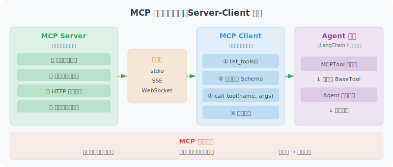

# 实战：基于 MCP 的完整工具集成

本节展示如何将自定义工具封装为 MCP 服务器，并在 LangChain Agent 中使用。



MCP 的核心价值在于**标准化和解耦**：工具的实现（MCP Server）和工具的使用（MCP Client / Agent）完全分离。这意味着你可以用任何语言编写工具服务器，任何支持 MCP 协议的 Agent 框架都能直接使用这些工具，不需要为每个框架单独适配。

下面的代码实现了三个关键组件：

1. **MCPTool 适配器**：将 MCP 工具包装为 LangChain 的 `BaseTool`，这是一个"桥梁"模式——让 LangChain Agent 能够无缝使用 MCP 工具，就像使用原生工具一样
2. **动态工具加载**：从 MCP Server 自动发现并加载所有可用的工具，无需手动注册
3. **Agent 集成**：将加载到的 MCP 工具注入到 LangChain Agent 中

### 关于 Session 生命周期

代码中有一个重要的设计考量：MCP 工具持有对 `ClientSession` 的引用，session 关闭后工具就无法使用了。在实际项目中，你需要确保 session 的生命周期覆盖工具的使用期——通常的做法是将 session 管理和 Agent 执行放在同一个 `async with` 上下文中。

```python
# mcp_langchain_integration.py
"""
将 MCP 工具集成到 LangChain Agent 的完整示例
"""

import asyncio
import json
from typing import Any
from langchain_core.tools import BaseTool
from langchain_openai import ChatOpenAI
from langchain.agents import AgentExecutor, create_openai_tools_agent  # legacy，新项目推荐 LangGraph
from langchain_core.prompts import ChatPromptTemplate, MessagesPlaceholder
from mcp import ClientSession, StdioServerParameters
from mcp.client.stdio import stdio_client

# ============================
# 1. MCP Tool 适配器
# ============================

class MCPTool(BaseTool):
    """将 MCP 工具包装为 LangChain Tool"""
    
    name: str
    description: str
    session: Any  # MCP ClientSession
    
    def _run(self, **kwargs) -> str:
        """同步执行（通过 asyncio 桥接）"""
        loop = asyncio.new_event_loop()
        try:
            result = loop.run_until_complete(
                self.session.call_tool(self.name, kwargs)
            )
            if result.content:
                return result.content[0].text
            return "工具无返回内容"
        finally:
            loop.close()
    
    async def _arun(self, **kwargs) -> str:
        """异步执行"""
        result = await self.session.call_tool(self.name, kwargs)
        if result.content:
            return result.content[0].text
        return "工具无返回内容"


# ============================
# 2. 从 MCP Server 动态加载工具
# ============================

async def load_mcp_tools(server_command: str, server_args: list) -> list[MCPTool]:
    """从 MCP Server 加载所有工具
    
    注意：此函数返回的 tools 需要在 MCP session 存活期间使用。
    在实际应用中，应该保持 session 的生命周期覆盖 tools 的使用期。
    下面的 build_mcp_agent() 函数展示了正确的使用方式。
    """
    
    server_params = StdioServerParameters(
        command=server_command,
        args=server_args
    )
    
    tools = []
    
    async with stdio_client(server_params) as (read, write):
        async with ClientSession(read, write) as session:
            await session.initialize()
            
            tools_result = await session.list_tools()
            
            for mcp_tool in tools_result.tools:
                lc_tool = MCPTool(
                    name=mcp_tool.name,
                    description=mcp_tool.description or f"使用 {mcp_tool.name} 工具",
                    session=session
                )
                tools.append(lc_tool)
            
            # ⚠️ 重要：tools 中持有 session 引用，
            # 离开此上下文后 session 会关闭，tools 将无法使用。
            # 生产环境中应该将 session 管理和 agent 执行
            # 放在同一个 async with 上下文中。
            return tools


# ============================
# 3. 构建使用 MCP 工具的 Agent
# ============================

async def build_mcp_agent():
    """构建集成 MCP 工具的 Agent"""
    
    # 加载 MCP 工具
    tools = await load_mcp_tools(
        server_command="python",
        server_args=["production_mcp_server.py"]
    )
    
    print(f"已加载 {len(tools)} 个 MCP 工具：{[t.name for t in tools]}")
    
    # 构建 Agent
    llm = ChatOpenAI(model="gpt-4o", temperature=0)
    
    prompt = ChatPromptTemplate.from_messages([
        ("system", """你是一个功能强大的 Agent，通过 MCP 协议使用标准化工具。

你有以下工具可用，请合理选择和使用：
- 文件读写操作
- 数据库查询
- HTTP 请求

遇到需要这些能力的任务时，主动使用相应工具。"""),
        MessagesPlaceholder(variable_name="chat_history"),
        ("human", "{input}"),
        MessagesPlaceholder(variable_name="agent_scratchpad"),
    ])
    
    agent = create_openai_tools_agent(llm, tools, prompt)
    executor = AgentExecutor(agent=agent, tools=tools, verbose=True)
    
    return executor


# ============================
# 4. 使用示例
# ============================

async def main():
    agent = await build_mcp_agent()
    
    # 测试文件操作
    result = agent.invoke({
        "input": "读取 README.md 文件，总结其主要内容",
        "chat_history": []
    })
    print(result["output"])
    
    # 测试复合操作
    result = agent.invoke({
        "input": "查询数据库 ./data/sales.db 中的最新10条销售记录",
        "chat_history": []
    })
    print(result["output"])

if __name__ == "__main__":
    asyncio.run(main())
```

## MCP 最佳实践总结

在将 MCP 工具部署到生产环境之前，安全性、错误处理和性能优化是三个必须认真考虑的维度。以下是一些关键的最佳实践：

**安全性**是首要考虑的问题，因为 MCP 工具通常涉及文件系统、数据库等敏感操作，而这些操作的参数是由 LLM 生成的——LLM 可能被 Prompt 注入攻击利用。

**错误处理**要确保任何工具调用失败都不会导致整个 Agent 崩溃，而是返回清晰的错误信息，让 LLM 能够理解并做出应对。

**性能优化**方面，对于只读的数据库查询等操作，使用缓存可以显著减少重复调用的开销。

```python
# 1. 工具安全性
security_checklist = [
    "✅ 文件操作：限制在工作目录内，防止路径遍历",
    "✅ 数据库：只允许 SELECT，不允许 DDL/DML",
    "✅ HTTP：白名单域名，设置超时",
    "✅ 代码执行：使用沙箱（Docker/subprocess）",
    "✅ 敏感数据：不返回完整的 API Key 等信息",
]

# 2. 错误处理
def safe_tool_call(func):
    """工具调用安全装饰器"""
    def wrapper(*args, **kwargs):
        try:
            return func(*args, **kwargs)
        except PermissionError as e:
            return {"error": "权限拒绝", "message": str(e)}
        except FileNotFoundError as e:
            return {"error": "文件不存在", "message": str(e)}
        except Exception as e:
            return {"error": "工具执行失败", "message": str(e)[:200]}
    return wrapper

# 3. 性能优化
# 使用 @lru_cache 缓存不变的查询结果
from functools import lru_cache

@lru_cache(maxsize=100)
def cached_database_query(db_path: str, sql: str) -> str:
    """带缓存的数据库查询（仅缓存只读查询）"""
    import sqlite3
    
    # 安全检查
    sql_upper = sql.strip().upper()
    if not sql_upper.startswith("SELECT"):
        raise PermissionError("只允许 SELECT 查询")
    
    conn = sqlite3.connect(db_path)
    cursor = conn.cursor()
    cursor.execute(sql)
    result = cursor.fetchall()
    conn.close()
    return json.dumps(result)
```

## 本章小结

本章构建了一个完整的 MCP 工具集成体系：
- ✅ MCP Server：标准化的工具服务器
- ✅ MCP Client：连接和调用工具
- ✅ LangChain 集成：MCPTool 适配器
- ✅ 安全最佳实践：权限控制和错误处理

---

*下一章：[第16章 Agent 的评估与优化](../chapter_evaluation/README.md)*
