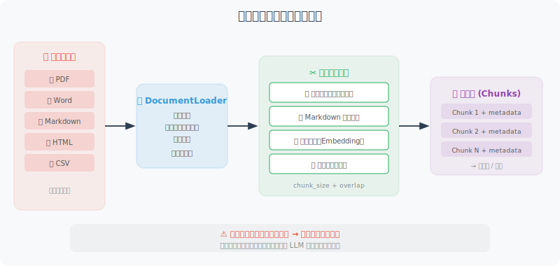

# 文档加载与文本分割

RAG 的第一步是将文档加载进来，并合理地分割成 Chunk。这一步看似简单，实际上是整个 RAG 管道中最容易被低估的环节——**文本分割的质量直接影响检索效果，进而决定最终回答的质量。**

一个直觉的理解：如果你把一本书按每 500 字机械地切成块，很可能会在句子中间、甚至在一个概念的解释中间切断。当用户提问时，检索到的可能是一段残缺不全的文字，LLM 自然也就无法给出好的回答。

本节首先介绍多种文档格式的加载方案，然后重点讲解智能分割策略。



## 文档加载

文档加载的核心挑战是**格式多样性**——PDF、Word、Markdown、网页，每种格式的内部结构完全不同。下面我们为每种常见格式实现一个加载函数，然后用一个统一的 `DocumentLoader` 类将它们整合起来。

这种"策略模式"的设计让系统具有良好的可扩展性——需要支持新格式时，只需添加一个新的加载函数并注册到 `LOADERS` 字典中。

```python
from pathlib import Path
import os

# ============================
# 纯文本文档加载
# ============================

def load_text_file(path: str) -> str:
    """加载纯文本文件"""
    with open(path, 'r', encoding='utf-8') as f:
        return f.read()

def load_markdown(path: str) -> str:
    """加载 Markdown 文件"""
    content = load_text_file(path)
    return content  # Markdown 本身就是纯文本

# ============================
# PDF 文档加载
# ============================

def load_pdf(path: str) -> str:
    """加载 PDF 文档"""
    # pip install pypdf
    try:
        from pypdf import PdfReader
        
        reader = PdfReader(path)
        text_parts = []
        
        for i, page in enumerate(reader.pages):
            text = page.extract_text()
            if text.strip():
                text_parts.append(f"[第{i+1}页]\n{text}")
        
        return "\n\n".join(text_parts)
    
    except ImportError:
        raise ImportError("请安装 pypdf：pip install pypdf")

# ============================
# Word 文档加载
# ============================

def load_word(path: str) -> str:
    """加载 Word 文档"""
    # pip install python-docx
    try:
        from docx import Document
        
        doc = Document(path)
        paragraphs = [p.text for p in doc.paragraphs if p.text.strip()]
        
        # 也提取表格内容
        tables_text = []
        for table in doc.tables:
            for row in table.rows:
                row_text = " | ".join([cell.text for cell in row.cells])
                tables_text.append(row_text)
        
        full_text = "\n\n".join(paragraphs)
        if tables_text:
            full_text += "\n\n【表格数据】\n" + "\n".join(tables_text)
        
        return full_text
    
    except ImportError:
        raise ImportError("请安装 python-docx：pip install python-docx")

# ============================
# 网页内容加载
# ============================

def load_webpage(url: str) -> str:
    """加载网页内容，提取纯文本"""
    # pip install requests beautifulsoup4
    import requests
    from bs4 import BeautifulSoup
    
    headers = {
        "User-Agent": "Mozilla/5.0 (compatible; RAGBot/1.0)"
    }
    
    response = requests.get(url, headers=headers, timeout=10)
    response.raise_for_status()
    
    soup = BeautifulSoup(response.text, 'html.parser')
    
    # 移除不需要的元素
    for tag in soup(["script", "style", "nav", "footer", "header", "aside"]):
        tag.decompose()
    
    # 提取主要内容
    main_content = soup.find("main") or soup.find("article") or soup.find("body")
    
    if main_content:
        text = main_content.get_text(separator="\n", strip=True)
    else:
        text = soup.get_text(separator="\n", strip=True)
    
    # 清理多余空行
    lines = [line.strip() for line in text.split("\n") if line.strip()]
    return "\n".join(lines)

# ============================
# 统一文档加载器
# ============================

class DocumentLoader:
    """统一的文档加载器"""
    
    LOADERS = {
        ".txt": load_text_file,
        ".md": load_markdown,
        ".pdf": load_pdf,
        ".docx": load_word,
    }
    
    @classmethod
    def load(cls, source: str) -> dict:
        """
        加载文档，自动识别格式
        
        Args:
            source: 文件路径或 URL
        
        Returns:
            {"content": str, "source": str, "type": str}
        """
        if source.startswith("http://") or source.startswith("https://"):
            content = load_webpage(source)
            doc_type = "webpage"
        else:
            path = Path(source)
            suffix = path.suffix.lower()
            
            loader = cls.LOADERS.get(suffix)
            if not loader:
                raise ValueError(f"不支持的文件格式：{suffix}")
            
            content = loader(str(path))
            doc_type = suffix[1:]  # 去掉点
        
        return {
            "content": content,
            "source": source,
            "type": doc_type,
            "char_count": len(content),
            "word_count": len(content.split())
        }
    
    @classmethod
    def load_directory(cls, dir_path: str, extensions: list = None) -> list[dict]:
        """加载目录下所有支持的文档"""
        extensions = extensions or list(cls.LOADERS.keys())
        documents = []
        
        for path in Path(dir_path).rglob("*"):
            if path.suffix.lower() in extensions:
                try:
                    doc = cls.load(str(path))
                    documents.append(doc)
                    print(f"✅ 加载：{path.name} ({doc['char_count']} 字符)")
                except Exception as e:
                    print(f"❌ 失败：{path.name} - {e}")
        
        return documents
```

## 文本分割策略

文本分割是 RAG 质量的关键。好的分割应该保持语义完整性——理想情况下，每个 Chunk 都应该是一个"自包含"的信息单元，单独阅读就能理解其含义。

下面的 `TextSplitter` 实现了三种分割策略：

1. **递归分隔符分割**（`split_by_separator`）：最常用的通用方案。它按照一个优先级列表尝试不同的分隔符——先试段落分隔（`\n\n`），再试换行（`\n`），再试句号等标点，最后才按空格切词。这样可以在最自然的断点处切割文本。

2. **按 Token 数分割**（`split_by_tokens`）：当你需要精确控制每个 Chunk 占用的 Token 数时使用。这在 Token 计费场景或嵌入模型有最大 Token 限制时特别有用。

3. **Markdown 结构分割**（`split_markdown`）：专门针对 Markdown 文档。它按照标题层级将文档分成语义段落，并为每个 Chunk 添加"面包屑路径"（如 `[Python入门 > 数据类型]`），这样即使 Chunk 被独立检索到，也能知道它属于文档的哪个部分。

注意 `chunk_overlap` 参数——它让相邻 Chunk 之间有一定的重叠。这是为了防止重要信息恰好在切割点被截断：如果一个关键句子跨越了两个 Chunk 的边界，重叠可以保证至少有一个 Chunk 包含完整的句子。

```python
class TextSplitter:
    """智能文本分割器"""
    
    def __init__(
        self,
        chunk_size: int = 500,     # 每个 Chunk 的最大字符数
        chunk_overlap: int = 50,    # 相邻 Chunk 的重叠字符数
    ):
        self.chunk_size = chunk_size
        self.chunk_overlap = chunk_overlap
    
    def split_by_separator(self, text: str, separators: list[str] = None) -> list[str]:
        """
        按分隔符递归分割
        优先在自然断点（段落、句子、词）处切割
        """
        if separators is None:
            separators = ["\n\n", "\n", "。", "！", "？", ".", "!", "?", " "]
        
        chunks = []
        
        def split_recursive(text: str, sep_idx: int = 0) -> list[str]:
            if len(text) <= self.chunk_size:
                return [text] if text.strip() else []
            
            if sep_idx >= len(separators):
                # 强制按大小切割
                result = []
                for i in range(0, len(text), self.chunk_size - self.chunk_overlap):
                    result.append(text[i:i + self.chunk_size])
                return result
            
            sep = separators[sep_idx]
            parts = text.split(sep)
            
            result = []
            current_chunk = ""
            
            for part in parts:
                part = part + sep if sep != " " else part + " "
                
                if len(current_chunk) + len(part) <= self.chunk_size:
                    current_chunk += part
                else:
                    if current_chunk:
                        if len(current_chunk) > self.chunk_size:
                            # 当前块还是太大，递归分割
                            result.extend(split_recursive(current_chunk, sep_idx + 1))
                        else:
                            result.append(current_chunk.strip())
                    current_chunk = part
            
            if current_chunk.strip():
                result.append(current_chunk.strip())
            
            return result
        
        return split_recursive(text)
    
    def split_by_tokens(self, text: str, model: str = "gpt-4o") -> list[str]:
        """按 Token 数量分割（更精确的控制）"""
        import tiktoken
        
        encoding = tiktoken.encoding_for_model(model)
        tokens = encoding.encode(text)
        
        max_tokens = self.chunk_size  # 这里 chunk_size 表示 token 数
        
        chunks = []
        start = 0
        
        while start < len(tokens):
            end = min(start + max_tokens, len(tokens))
            chunk_tokens = tokens[start:end]
            chunk_text = encoding.decode(chunk_tokens)
            chunks.append(chunk_text)
            
            # 添加重叠
            start = end - self.chunk_overlap
        
        return chunks
    
    def split_markdown(self, text: str) -> list[str]:
        """
        按 Markdown 结构分割
        将文章按标题层级分成有意义的段落
        """
        import re
        
        chunks = []
        current_section = []
        current_headers = []
        
        lines = text.split("\n")
        
        for line in lines:
            # 检测标题
            header_match = re.match(r'^(#{1,6})\s+(.+)$', line)
            
            if header_match:
                # 保存当前节
                if current_section:
                    content = "\n".join(current_section).strip()
                    if content:
                        # 添加面包屑路径
                        header_path = " > ".join(current_headers)
                        full_content = f"[{header_path}]\n{content}" if header_path else content
                        
                        # 如果太长，进一步分割
                        if len(full_content) > self.chunk_size * 2:
                            sub_chunks = self.split_by_separator(full_content)
                            chunks.extend(sub_chunks)
                        else:
                            chunks.append(full_content)
                
                # 更新标题栈
                level = len(header_match.group(1))
                title = header_match.group(2)
                current_headers = current_headers[:level-1] + [title]
                current_section = [line]
            else:
                current_section.append(line)
        
        # 处理最后一节
        if current_section:
            content = "\n".join(current_section).strip()
            if content:
                chunks.append(content)
        
        return [c for c in chunks if c.strip()]


# 使用示例
splitter = TextSplitter(chunk_size=500, chunk_overlap=50)

sample_text = """
# Python 入门指南

## 什么是 Python？

Python 是一种高级编程语言，由 Guido van Rossum 于1991年创建。
Python 设计的核心理念是代码的可读性和简洁性。

### Python 的特点

Python 具有以下主要特点：
1. 语法简洁清晰，适合初学者
2. 动态类型系统
3. 强大的标准库

## Python 的应用场景

Python 广泛应用于：
- 数据科学和机器学习
- Web 开发（Django, FastAPI）
- 自动化脚本
- AI Agent 开发
"""

# 按 Markdown 结构分割
md_chunks = splitter.split_markdown(sample_text)
print(f"Markdown 分割：{len(md_chunks)} 个 Chunk")
for i, chunk in enumerate(md_chunks):
    print(f"\nChunk {i+1} ({len(chunk)} 字符):\n{chunk[:150]}...")

# 按字符分割
char_chunks = splitter.split_by_separator(sample_text)
print(f"\n字符分割：{len(char_chunks)} 个 Chunk")
```

## Chunk 大小的选择

Chunk 大小是 RAG 系统中最重要的超参数之一，没有放之四海而皆准的最优值。选择的核心原则是：**Chunk 的大小应该与你期望检索到的信息粒度匹配。**

举个例子：如果用户倾向于问"Python 的 for 循环怎么写？"这样的具体问题，那么小 Chunk（300-500 字符）更合适，因为它包含的信息更集中、检索时噪音更少；但如果用户倾向于问"总结一下这份报告的主要发现"，那么大 Chunk（1000-2000 字符）更好，因为它包含更完整的上下文。

```
Chunk 大小权衡

小 Chunk（200-500字符）
优点：检索精准，相关性高
缺点：可能丢失上下文，需要更多 Chunk

大 Chunk（1000-2000字符）
优点：上下文完整
缺点：引入无关信息，检索噪音多

建议：
- 问答类：300-500 字符
- 摘要类：800-1500 字符
- 代码类：按函数/类分割
```

---

## 小结

文档处理的关键要点：
- 支持多种文档格式（PDF、Word、网页等）
- 选择合适的分割策略（按段落/标题/Token）
- 设置适当的重叠（保证上下文连续性）
- Chunk 大小根据任务类型调整

---

*下一节：[7.3 向量嵌入与向量数据库](./03_embeddings_vectordb.md)*
