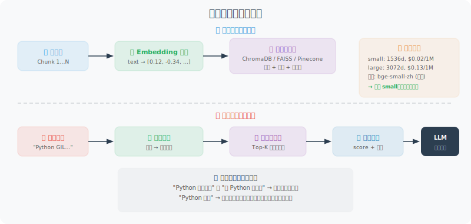

# 向量嵌入与向量数据库

向量嵌入（Embedding）和向量数据库是 RAG 系统的核心技术。本节深入讲解如何高效地存储和检索向量。



## 向量嵌入模型选择

选择嵌入模型时需要权衡三个因素：**性能**（嵌入质量）、**成本**（API 价格或本地计算资源）和**维度**（向量大小，影响存储和检索速度）。

OpenAI 目前提供三个嵌入模型。对于大多数场景，`text-embedding-3-small` 是性价比最优的选择——性能接近 `large` 模型，价格只有其 1/6。如果你的应用对隐私有严格要求，或者不想依赖外部 API，也可以使用本地开源模型，比如 `BAAI/bge-small-zh-v1.5`（针对中文优化），完全免费。

下面的代码展示了两种方案：OpenAI 云端 API 和本地 `sentence-transformers` 模型。

```python
from openai import OpenAI
import numpy as np
from typing import List

client = OpenAI()

# ============================
# OpenAI Embedding 模型
# ============================

# 可用模型对比
EMBEDDING_MODELS = {
    "text-embedding-3-small": {
        "dimensions": 1536,
        "price_per_1m": 0.02,  # 美元
        "performance": "good"
    },
    "text-embedding-3-large": {
        "dimensions": 3072,
        "price_per_1m": 0.13,
        "performance": "best"
    },
    "text-embedding-ada-002": {
        "dimensions": 1536,
        "price_per_1m": 0.10,
        "performance": "legacy"
    }
}

def get_embedding(text: str, model: str = "text-embedding-3-small") -> List[float]:
    """获取单个文本的嵌入向量"""
    # 清理文本
    text = text.replace("\n", " ").strip()
    if not text:
        raise ValueError("文本不能为空")
    
    response = client.embeddings.create(
        input=text,
        model=model
    )
    return response.data[0].embedding

def get_embeddings_batch(texts: List[str], model: str = "text-embedding-3-small",
                          batch_size: int = 100) -> List[List[float]]:
    """批量获取嵌入（减少 API 调用次数）"""
    all_embeddings = []
    
    for i in range(0, len(texts), batch_size):
        batch = texts[i:i + batch_size]
        # 清理文本
        batch = [t.replace("\n", " ").strip() for t in batch]
        
        response = client.embeddings.create(
            input=batch,
            model=model
        )
        
        embeddings = [item.embedding for item in response.data]
        all_embeddings.extend(embeddings)
        
        print(f"  批次 {i//batch_size + 1}: {len(batch)} 个文本已嵌入")
    
    return all_embeddings

# ============================
# 本地嵌入模型（免费！）
# ============================

def get_local_embedding(text: str) -> List[float]:
    """使用本地模型（sentence-transformers），无需 API Key"""
    # pip install sentence-transformers
    try:
        from sentence_transformers import SentenceTransformer
        
        # 这是个好用的中文嵌入模型
        model = SentenceTransformer('BAAI/bge-small-zh-v1.5')
        embedding = model.encode(text)
        return embedding.tolist()
    
    except ImportError:
        raise ImportError("请安装：pip install sentence-transformers")
```

## ChromaDB：本地向量数据库

有了嵌入模型，我们还需要一个地方来存储和检索这些向量。ChromaDB 是本地开发的首选——它是一个嵌入式的向量数据库，不需要单独部署服务器，数据持久化在本地文件中，使用体验类似 SQLite。

下面的 `VectorStore` 类封装了 ChromaDB 的核心操作。设计上有几个值得注意的地方：

- **HNSW 索引参数**：`construction_ef` 和 `M` 控制索引的精度和速度的权衡。更大的值意味着更高的检索精度，但索引构建更慢
- **批量处理**：`add_documents` 方法分批添加文档，避免一次传入过多文档导致内存溢出
- **最低相关性阈值**：`search` 方法的 `min_relevance` 参数过滤掉相似度过低的结果，减少噪音

```python
import chromadb
from chromadb.config import Settings
import json
import uuid

class VectorStore:
    """
    基于 ChromaDB 的向量存储
    支持添加、检索、删除文档
    """
    
    def __init__(self, collection_name: str, persist_dir: str = "./chroma_db"):
        # 持久化客户端（重启后数据不丢失）
        self.client = chromadb.PersistentClient(path=persist_dir)
        
        self.collection = self.client.get_or_create_collection(
            name=collection_name,
            metadata={
                "hnsw:space": "cosine",  # 使用余弦相似度
                "hnsw:construction_ef": 200,
                "hnsw:M": 16,
            }
        )
        
        print(f"向量库 '{collection_name}' 已加载，包含 {self.collection.count()} 个文档")
    
    def add_documents(
        self,
        documents: List[str],
        metadatas: List[dict] = None,
        ids: List[str] = None,
        batch_size: int = 50
    ) -> List[str]:
        """
        添加文档到向量库
        
        Args:
            documents: 文档列表
            metadatas: 元数据列表（可包含来源、章节等信息）
            ids: 文档ID列表（不提供则自动生成）
            batch_size: 批处理大小
        
        Returns:
            文档ID列表
        """
        if ids is None:
            ids = [str(uuid.uuid4()) for _ in documents]
        
        if metadatas is None:
            metadatas = [{}] * len(documents)
        
        # 批量生成嵌入
        print(f"正在嵌入 {len(documents)} 个文档...")
        embeddings = get_embeddings_batch(documents)
        
        # 批量添加到 ChromaDB
        for i in range(0, len(documents), batch_size):
            batch_end = min(i + batch_size, len(documents))
            
            self.collection.add(
                ids=ids[i:batch_end],
                documents=documents[i:batch_end],
                embeddings=embeddings[i:batch_end],
                metadatas=metadatas[i:batch_end]
            )
        
        print(f"✅ 成功添加 {len(documents)} 个文档")
        return ids
    
    def search(
        self,
        query: str,
        n_results: int = 5,
        where: dict = None,
        min_relevance: float = 0.3
    ) -> List[dict]:
        """
        语义搜索
        
        Returns:
            [{document, metadata, relevance_score}]
        """
        query_embedding = get_embedding(query)
        
        kwargs = {
            "query_embeddings": [query_embedding],
            "n_results": min(n_results, self.collection.count()),
            "include": ["documents", "metadatas", "distances"]
        }
        
        if where:
            kwargs["where"] = where
        
        if self.collection.count() == 0:
            return []
        
        results = self.collection.query(**kwargs)
        
        # 格式化结果
        formatted = []
        if results["documents"] and results["documents"][0]:
            for doc, meta, dist in zip(
                results["documents"][0],
                results["metadatas"][0],
                results["distances"][0]
            ):
                relevance = 1 - dist
                if relevance >= min_relevance:
                    formatted.append({
                        "document": doc,
                        "metadata": meta,
                        "relevance": round(relevance, 4)
                    })
        
        return sorted(formatted, key=lambda x: x["relevance"], reverse=True)
    
    def delete_by_source(self, source: str):
        """删除来自特定来源的所有文档"""
        self.collection.delete(where={"source": source})
        print(f"已删除来源为 '{source}' 的文档")
    
    def get_stats(self) -> dict:
        """获取统计信息"""
        return {
            "total_documents": self.collection.count(),
            "collection_name": self.collection.name
        }


# ============================
# 完整的文档索引流程
# ============================

def index_documents_to_vectorstore(
    documents: List[dict],  # [{"content": str, "source": str, ...}]
    collection_name: str,
    chunk_size: int = 500,
    chunk_overlap: int = 50
) -> VectorStore:
    """
    将文档处理后存入向量库的完整流程
    """
    from document_loading import TextSplitter  # 假设已在项目中定义
    
    splitter = TextSplitter(chunk_size=chunk_size, chunk_overlap=chunk_overlap)
    store = VectorStore(collection_name)
    
    all_chunks = []
    all_metadatas = []
    
    for doc in documents:
        content = doc["content"]
        source = doc.get("source", "unknown")
        
        # 分割文档
        chunks = splitter.split_by_separator(content)
        
        for i, chunk in enumerate(chunks):
            if chunk.strip():
                all_chunks.append(chunk)
                all_metadatas.append({
                    "source": source,
                    "chunk_index": i,
                    "total_chunks": len(chunks),
                    "char_count": len(chunk)
                })
    
    print(f"总计 {len(all_chunks)} 个 Chunk，开始索引...")
    store.add_documents(all_chunks, all_metadatas)
    
    return store


# ============================
# 快速使用示例
# ============================

# 1. 准备知识库内容
knowledge = [
    {"content": "Python 是由 Guido van Rossum 创建，1991年首次发布。Python 的名字来源于英国喜剧团体 Monty Python。", "source": "python_intro"},
    {"content": "FastAPI 是一个现代、高性能的 Python Web 框架，基于 Python 3.7+ 的类型注解。它由 Sebastián Ramírez 创建。", "source": "fastapi_intro"},
    {"content": "LangChain 是一个用于构建 LLM 应用的框架，提供了工具链、Agent、RAG 等组件。", "source": "langchain_intro"},
]

# 2. 创建向量库
store = VectorStore("knowledge_base")
for item in knowledge:
    # 直接添加（不分割）
    store.add_documents(
        [item["content"]],
        [{"source": item["source"]}]
    )

# 3. 搜索
query = "Python 是什么时候发布的？"
results = store.search(query, n_results=3)

print(f"\n查询：{query}")
for r in results:
    print(f"\n[{r['relevance']:.3f}] {r['document'][:100]}...")
    print(f"  来源：{r['metadata']['source']}")
```

---

## 小结

向量存储的核心技术：
- **嵌入模型**：`text-embedding-3-small`（推荐），或本地模型（免费）
- **ChromaDB**：本地开发首选，持久化存储
- **余弦相似度**：衡量语义相关性的标准度量
- **批量处理**：减少 API 调用，提升效率

---

*下一节：[7.4 检索策略与重排序](./04_retrieval_strategies.md)*
