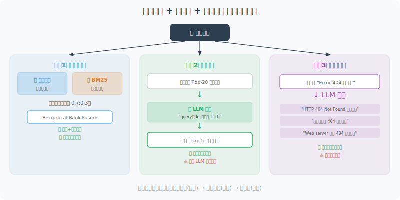

# 检索策略与重排序

基础的向量检索并不总是最优的。本节介绍多种高级检索策略，显著提升 RAG 系统的准确率。

纯向量检索有两个常见的问题：

1. **语义漂移**：向量检索擅长捕捉语义相似性，但对精确的关键词匹配不够敏感。比如用户问"Error 404 怎么解决"，向量检索可能返回关于"HTTP 错误"的通用介绍，而不是包含"404"这个具体关键词的文档。

2. **召回率不足**：用户的一个问题可能有多种表述方式，单一查询可能错过一些相关文档。

针对这些问题，业界发展出了三种主要的优化策略：**混合检索**（结合向量和关键词）、**重排序**（用 LLM 对初步结果二次排序）和**查询扩展**（将一个查询拓展为多个变体）。



## 混合检索：向量 + 关键词

混合检索的核心思想是"两条腿走路"：用向量检索捕捉语义相似性，用 BM25 关键词检索保证精确匹配，然后将两种检索的结果按权重融合。

BM25 是一个经典的信息检索算法，基于词频（TF）和逆文档频率（IDF）来评估文档与查询的相关性。它对精确关键词匹配非常有效，但不理解同义词和语义关系。

两种检索方式的优缺点恰好互补：向量检索能理解"Python 编程语言"和"用 Python 写代码"是同一个意思，但可能对专有名词不够敏感；BM25 能精确匹配"FastAPI"这样的专有名词，但不理解"高性能 Web 框架"和 "FastAPI" 的语义关系。

下面的 `HybridRetriever` 将两者融合，默认权重 0.7:0.3（向量:关键词），你可以根据实际场景调整：

```python
from openai import OpenAI
import chromadb
from rank_bm25 import BM25Okapi  # pip install rank-bm25
import jieba  # pip install jieba (中文分词)
import numpy as np
from typing import List

client = OpenAI()

class HybridRetriever:
    """混合检索：向量相似度 + BM25 关键词匹配"""
    
    def __init__(self, collection, documents: List[str]):
        self.collection = collection
        self.documents = documents
        
        # 初始化 BM25（基于词频的关键词检索）
        tokenized_docs = [list(jieba.cut(doc)) for doc in documents]
        self.bm25 = BM25Okapi(tokenized_docs)
    
    def _vector_search(self, query: str, n: int = 10) -> dict:
        """向量语义搜索"""
        from openai import OpenAI
        response = client.embeddings.create(
            input=query,
            model="text-embedding-3-small"
        )
        query_embedding = response.data[0].embedding
        
        results = self.collection.query(
            query_embeddings=[query_embedding],
            n_results=min(n, self.collection.count()),
            include=["documents", "distances", "ids"]
        )
        
        scores = {}
        if results["documents"] and results["documents"][0]:
            for doc_id, doc, dist in zip(
                results["ids"][0],
                results["documents"][0],
                results["distances"][0]
            ):
                scores[doc_id] = {
                    "document": doc,
                    "vector_score": 1 - dist
                }
        return scores
    
    def _keyword_search(self, query: str, n: int = 10) -> dict:
        """BM25 关键词搜索"""
        tokens = list(jieba.cut(query))
        scores = self.bm25.get_scores(tokens)
        
        # 标准化分数
        max_score = max(scores) if max(scores) > 0 else 1
        
        results = {}
        top_indices = np.argsort(scores)[::-1][:n]
        
        for idx in top_indices:
            if scores[idx] > 0:
                results[f"doc_{idx}"] = {
                    "document": self.documents[idx],
                    "keyword_score": scores[idx] / max_score,
                    "doc_idx": idx
                }
        
        return results
    
    def retrieve(self, query: str, n: int = 5,
                  vector_weight: float = 0.7, keyword_weight: float = 0.3) -> List[dict]:
        """
        混合检索，融合两种检索结果
        
        Args:
            vector_weight: 向量分数权重（0-1）
            keyword_weight: 关键词分数权重（0-1）
        """
        vector_results = self._vector_search(query, n=n*2)
        keyword_results = self._keyword_search(query, n=n*2)
        
        # 融合分数
        combined = {}
        
        for doc_id, data in vector_results.items():
            combined[doc_id] = {
                "document": data["document"],
                "vector_score": data["vector_score"],
                "keyword_score": 0,
                "combined_score": data["vector_score"] * vector_weight
            }
        
        for doc_id, data in keyword_results.items():
            if doc_id in combined:
                combined[doc_id]["keyword_score"] = data["keyword_score"]
                combined[doc_id]["combined_score"] += data["keyword_score"] * keyword_weight
            else:
                combined[doc_id] = {
                    "document": data["document"],
                    "vector_score": 0,
                    "keyword_score": data["keyword_score"],
                    "combined_score": data["keyword_score"] * keyword_weight
                }
        
        # 按综合分数排序
        sorted_results = sorted(
            combined.values(),
            key=lambda x: x["combined_score"],
            reverse=True
        )
        
        return sorted_results[:n]
```

## 重排序（Reranking）

初步检索（无论是向量检索还是混合检索）通常会返回一批"大致相关"的候选文档。但这些文档的排序可能并不准确——真正最相关的文档可能排在第 3 位或第 5 位。

重排序就是对初步检索结果进行"二次精排"。它的工作方式是：将查询和所有候选文档一起交给一个更强的模型（比如 GPT-4o-mini），让模型逐一评估每个文档与查询的相关性，然后按相关性重新排序。

这种"先粗筛再精排"的两阶段架构在搜索引擎领域是标准做法——第一阶段追求**召回率**（不遗漏相关文档），第二阶段追求**精准率**（将最相关的排在最前面）。

```python
class Reranker:
    """使用 LLM 对初步检索结果进行重排序"""
    
    def __init__(self, model: str = "gpt-4o-mini"):
        self.model = model
    
    def rerank(self, query: str, candidates: List[str], top_k: int = 3) -> List[dict]:
        """
        对候选文档进行重排序
        
        Args:
            query: 用户查询
            candidates: 候选文档列表
            top_k: 返回前 K 个
        
        Returns:
            重排序后的文档列表
        """
        if len(candidates) <= top_k:
            return [{"document": c, "rank": i+1, "relevant": True} for i, c in enumerate(candidates)]
        
        # 让 LLM 评估每个候选文档的相关性
        numbered_candidates = "\n\n".join([
            f"[{i+1}] {doc[:300]}" for i, doc in enumerate(candidates)
        ])
        
        response = client.chat.completions.create(
            model=self.model,
            messages=[
                {
                    "role": "user",
                    "content": f"""对以下候选文档按与查询的相关性进行排序。

查询：{query}

候选文档：
{numbered_candidates}

请按相关性从高到低排序，返回JSON格式：
{{
  "ranked_indices": [3, 1, 5, 2, 4],  // 按相关性排序的文档编号（1-indexed）
  "top_{top_k}_reason": "选择前{top_k}个的原因"
}}"""
                }
            ],
            response_format={"type": "json_object"}
        )
        
        import json
        result = json.loads(response.choices[0].message.content)
        ranked_indices = result.get("ranked_indices", list(range(1, len(candidates)+1)))
        
        reranked = []
        for i, idx in enumerate(ranked_indices[:top_k]):
            if 1 <= idx <= len(candidates):
                reranked.append({
                    "document": candidates[idx-1],
                    "rank": i + 1,
                    "original_rank": idx,
                    "relevant": True
                })
        
        return reranked


## 查询扩展

查询扩展解决的是"用户的表述方式可能很单一"的问题。

假设知识库中有一段文档："Python 装饰器是一种设计模式，使用 `@` 语法糖来修改函数行为。" 用户可能问"怎么用 `@` 符号"、"装饰器模式"或"函数修饰"——这些表述的语义都接近，但单一查询可能只匹配其中一种。

查询扩展的做法是：用 LLM 将用户的原始查询"改写"为多个变体，从不同角度表达相同的信息需求，然后用所有变体分别检索，合并去重后得到更全面的候选文档集。

class QueryExpander:
    """通过生成多个查询变体来提升召回率"""
    
    def expand(self, query: str, n_variations: int = 3) -> List[str]:
        """生成查询的多个变体"""
        response = client.chat.completions.create(
            model="gpt-4o-mini",
            messages=[
                {
                    "role": "user",
                    "content": f"""为以下查询生成 {n_variations} 个不同的变体，
以提高信息检索的召回率。变体应该从不同角度表达相同的信息需求。

原始查询：{query}

返回JSON格式：
{{"variations": ["变体1", "变体2", "变体3"]}}"""
                }
            ],
            response_format={"type": "json_object"}
        )
        
        import json
        result = json.loads(response.choices[0].message.content)
        variations = result.get("variations", [])
        
        # 原始查询 + 变体
        return [query] + variations[:n_variations]


# 使用示例
expander = QueryExpander()
expanded = expander.expand("Python 装饰器怎么用？")
print("查询扩展：")
for q in expanded:
    print(f"  - {q}")
```

## 完整高级检索管道

最后，我们将上述三种策略组合成一个完整的检索管道。它的处理流程是：**查询扩展 → 多查询检索 → 结果合并 → 重排序**。每一步都在为下一步打基础：扩展保证了召回率，多查询进一步扩大候选集，合并去除了重复，重排序保证了最终结果的精准性。

```python
class AdvancedRAGPipeline:
    """高级 RAG 检索管道"""
    
    def __init__(self, vector_store):
        self.store = vector_store
        self.reranker = Reranker()
        self.query_expander = QueryExpander()
    
    def retrieve(self, query: str, n_final: int = 3) -> List[dict]:
        """完整检索流程"""
        print(f"查询：{query}")
        
        # 步骤1：查询扩展
        expanded_queries = self.query_expander.expand(query, n_variations=2)
        
        # 步骤2：多查询检索（每个变体单独检索）
        all_candidates = {}
        for q in expanded_queries:
            results = self.store.search(q, n_results=5)
            for r in results:
                doc = r["document"]
                if doc not in all_candidates:
                    all_candidates[doc] = r["relevance"]
                else:
                    all_candidates[doc] = max(all_candidates[doc], r["relevance"])
        
        # 步骤3：重排序
        candidate_docs = list(all_candidates.keys())
        print(f"初步候选：{len(candidate_docs)} 个文档")
        
        reranked = self.reranker.rerank(query, candidate_docs, top_k=n_final)
        
        return reranked
```

---

## 小结

检索策略的进阶要点：
- **混合检索**：语义 + 关键词，互补提升召回率
- **重排序**：LLM 二次评估，提升精准率
- **查询扩展**：多角度检索，减少漏检

---

*下一节：[7.5 实战：智能文档问答 Agent](./05_practice_qa_agent.md)*
