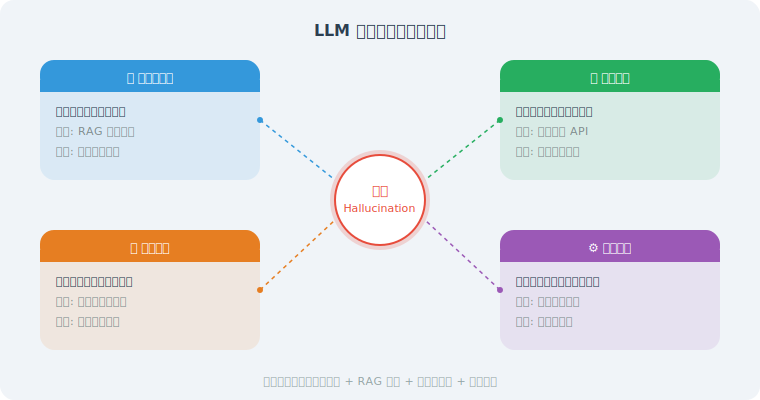

# 幻觉问题与事实性保障

> **本节目标**：理解 LLM 幻觉的成因，掌握减少幻觉、提高事实性的实用技术。

---

## 什么是幻觉（Hallucination）？



幻觉是指 LLM 生成的内容看起来流畅合理，但实际上是错误的或编造的。就像一个"知识渊博"的朋友，当他不知道答案时，不会说"我不知道"，而是自信满满地编一个听起来很对的答案。

### 幻觉的类型

| 类型 | 描述 | 示例 |
|------|------|------|
| 事实性幻觉 | 生成了与事实不符的信息 | "Python 是 1995 年发布的"（实际是 1991 年） |
| 引用幻觉 | 引用了不存在的论文或链接 | "根据 Smith et al. (2023) 的研究..."（论文不存在） |
| 逻辑幻觉 | 推理过程看似合理但实际有错 | 数学计算正确展示过程但结果错误 |
| 指令幻觉 | 声称执行了某操作但实际没有 | "我已经帮你发送了邮件"（实际没有发送功能） |

---

## 减少幻觉的策略

### 策略 1：要求引用来源

强制 Agent 标注信息来源，无来源则声明不确定：

```python
ANTI_HALLUCINATION_PROMPT = """
## 事实性要求（必须遵守）

1. **有依据才说**：只提供你确信正确的信息
2. **标注来源**：涉及具体事实、数据时，标注来源
3. **承认不知道**：不确定的内容，明确说"我不确定，建议您查证"
4. **区分事实与观点**：事实用陈述句，观点用"我认为"、"通常来说"

### 示例
✅ "Python 3.12 于 2023 年 10 月发布，引入了更好的错误提示。"
✅ "关于这个问题，我不太确定具体的数值，建议您参考官方文档。"
❌ "这个库的最新版本是 5.2.1。"（如果你不确定版本号）
"""
```

### 策略 2：RAG 事实核查

用检索到的文档来验证 Agent 的回答：

```python
class FactChecker:
    """基于 RAG 的事实核查器"""
    
    def __init__(self, retriever, llm):
        self.retriever = retriever
        self.llm = llm
    
    def check(self, claim: str) -> dict:
        """核查一个声明的事实性"""
        
        # 1. 检索相关文档
        docs = self.retriever.invoke(claim)
        
        if not docs:
            return {
                "verdict": "unverifiable",
                "confidence": 0.0,
                "explanation": "未找到相关文档来验证此声明"
            }
        
        # 2. 让 LLM 判断
        context = "\n\n".join(doc.page_content for doc in docs[:3])
        
        check_prompt = f"""基于以下参考文档，判断这个声明是否正确。

声明：{claim}

参考文档：
{context}

请回复 JSON 格式：
{{
    "verdict": "supported" 或 "contradicted" 或 "unverifiable",
    "confidence": 0.0-1.0,
    "explanation": "判断依据"
}}"""
        
        response = self.llm.invoke(check_prompt)
        import json
        return json.loads(response.content)
    
    def check_response(self, response: str) -> list[dict]:
        """核查整个回答中的关键声明"""
        
        # 先提取关键声明
        extract_prompt = f"""从以下回答中提取所有可验证的事实性声明。
每个声明一行，只提取客观事实，不要提取观点。

回答：
{response}

声明列表："""
        
        claims_response = self.llm.invoke(extract_prompt)
        claims = [
            c.strip().lstrip("- ·•")
            for c in claims_response.content.strip().split("\n")
            if c.strip()
        ]
        
        # 逐一核查
        results = []
        for claim in claims:
            result = self.check(claim)
            result["claim"] = claim
            results.append(result)
        
        return results
```

### 策略 3：自我一致性检查

让 Agent 多次回答同一个问题，如果答案不一致，说明可能存在幻觉：

```python
async def self_consistency_check(
    question: str,
    llm,
    num_samples: int = 3,
    temperature: float = 0.7
) -> dict:
    """自我一致性检查：多次生成并比较"""
    import asyncio
    
    # 生成多个回答
    tasks = []
    for _ in range(num_samples):
        tasks.append(llm.ainvoke(
            question,
            temperature=temperature
        ))
    
    responses = await asyncio.gather(*tasks)
    answers = [r.content for r in responses]
    
    # 让 LLM 判断一致性
    consistency_prompt = f"""以下是同一个问题的 {num_samples} 个回答。
请判断它们是否一致。

问题：{question}

""" + "\n\n".join(
        f"回答 {i+1}：{a}" for i, a in enumerate(answers)
    ) + """

请回复：
1. 一致性评分（0-1）
2. 最可靠的回答是哪个
3. 不一致的具体方面
"""
    
    analysis = await llm.ainvoke(consistency_prompt)
    
    return {
        "answers": answers,
        "analysis": analysis.content,
        "num_samples": num_samples
    }
```

### 策略 4：工具兜底

对于需要精确数据的场景，强制使用工具而非记忆：

```python
def create_grounded_agent(llm, tools):
    """创建一个'接地'的 Agent —— 优先使用工具获取事实"""
    
    system_prompt = """你是一个严谨的助手。

## 核心原则：工具优先
- 涉及具体数据（价格、日期、数量等），必须使用工具查询
- 涉及实时信息（天气、新闻、股价等），必须使用工具查询
- 只有在工具无法获取时，才使用你的知识回答
- 使用知识回答时，必须标注"根据我的知识"

## 禁止行为
- 不要编造具体的数字、日期、链接
- 不要假装执行了操作（如"已发送邮件"）
- 不要引用不确定的来源
"""
    
    # 使用 LangChain 构建 Agent
    from langchain.agents import create_openai_tools_agent, AgentExecutor  # legacy，新项目推荐 LangGraph
    from langchain_core.prompts import ChatPromptTemplate, MessagesPlaceholder
    
    prompt = ChatPromptTemplate.from_messages([
        ("system", system_prompt),
        MessagesPlaceholder("chat_history", optional=True),
        ("human", "{input}"),
        MessagesPlaceholder("agent_scratchpad"),
    ])
    
    agent = create_openai_tools_agent(llm, tools, prompt)
    return AgentExecutor(agent=agent, tools=tools, verbose=True)
```

---

## 前沿方法（2025—2026）

> 以下方法代表了截至 2026 年初幻觉缓解领域的最新进展，从模型能力、训练策略、系统架构三个层面提供更强的事实性保障。

### 策略 5：推理模型——"先想再说"

OpenAI o1/o3、DeepSeek-R1 等推理模型（Reasoning Models）通过内化的思维链（Chain-of-Thought）在生成答案前进行自我验证，显著降低了幻觉率。

```
传统模型：
  问题 → 直接生成答案 → 可能"自信地犯错"

推理模型：
  问题 → 内部推理链：
    "让我分析一下...这个信息我确定吗？"
    "我不太确定这个日期，让我从另一个角度验证..."
    "这可能是错的，让我重新考虑..."
  → 经过验证的答案 → 幻觉显著减少

实证数据（SimpleQA 基准）：
  GPT-4o：  38.2% 错误率
  o1：      16.0% 错误率（降低 58%）
  o3-mini： 12.8% 错误率（降低 66%）
```

在 Agent 中使用推理模型的最佳实践：

```python
def create_reasoning_agent(task_type: str):
    """根据任务类型选择合适的模型"""
    
    # 高风险任务使用推理模型，降低幻觉
    HIGH_RISK_TASKS = ["medical", "legal", "financial", "safety"]
    
    if task_type in HIGH_RISK_TASKS:
        # 推理模型：更高的事实性，但延迟和成本更高
        model = "o3-mini"  # 或 deepseek-reasoner
        system_note = "请在回答前仔细推理验证每个事实性声明。"
    else:
        # 常规模型：更快更便宜，适合低风险场景
        model = "gpt-4o"
        system_note = "请确保回答的准确性，不确定时请说明。"
    
    return {"model": model, "system_note": system_note}
```

> ⚠️ **推理模型并非万能**：在训练数据未覆盖的知识边界外，推理模型仍会产生幻觉。**推理模型 + RAG** 是当前最可靠的组合。

### 策略 6：校准训练——让模型学会说"我不知道"

传统 LLM 的一个核心问题是**过度自信**——即使不知道答案，也会生成一个看似合理的回答。校准训练（Calibration Training）通过训练让模型的"自信程度"与"实际正确率"对齐。

```python
CALIBRATED_PROMPT = """
## 置信度标注要求

对于你的每个事实性声明，请标注置信度等级：

- 🟢 **高置信度**：你非常确定这是正确的（如广为人知的事实）
- 🟡 **中置信度**：你认为大概率正确，但建议用户验证
- 🔴 **低置信度**：你不确定，明确告知用户需要查证
- ⚪ **无法判断**：超出你的知识范围，直接说"我不知道"

### 示例
✅ "Python 由 Guido van Rossum 创建 🟢，首次发布于 1991 年 🟢。"
✅ "这个库的最新版本可能是 3.2 🟡，建议您查看官方文档确认。"
✅ "关于这个公司的具体营收数据，我无法确认 ⚪，建议查阅其财报。"
"""


class CalibratedAgent:
    """带置信度校准的 Agent"""
    
    def __init__(self, llm, retriever=None):
        self.llm = llm
        self.retriever = retriever
    
    def answer(self, question: str) -> dict:
        """生成带置信度标注的回答"""
        
        # 第一步：生成初始回答（带置信度标注）
        response = self.llm.invoke(
            CALIBRATED_PROMPT + f"\n\n用户问题：{question}"
        )
        
        # 第二步：对低置信度内容尝试 RAG 补充
        if self.retriever and ("🟡" in response.content or "🔴" in response.content):
            docs = self.retriever.invoke(question)
            if docs:
                context = "\n".join(d.page_content for d in docs[:3])
                # 用检索到的文档重新回答低置信度部分
                refined = self.llm.invoke(
                    f"基于以下参考资料，重新回答问题中你不确定的部分：\n\n"
                    f"参考资料：\n{context}\n\n"
                    f"原始回答：\n{response.content}\n\n"
                    f"请只修正低置信度的部分，保留高置信度的内容。"
                )
                return {"answer": refined.content, "rag_enhanced": True}
        
        return {"answer": response.content, "rag_enhanced": False}
```

### 策略 7：验证链（Chain-of-Verification, CoVe）

CoVe 是 Meta 在 2023 年提出、2024-2025 年被广泛采用的方法。核心思想是：**生成回答后，自动生成验证问题，独立回答这些验证问题，再用验证结果修正原始回答。**

```python
class ChainOfVerification:
    """验证链：生成 → 验证 → 修正"""
    
    def __init__(self, llm):
        self.llm = llm
    
    async def generate_and_verify(self, question: str) -> dict:
        """完整的 CoVe 流程"""
        
        # 第一步：生成初始回答
        initial = await self.llm.ainvoke(
            f"请回答以下问题：\n{question}"
        )
        
        # 第二步：生成验证问题
        verification_qs = await self.llm.ainvoke(
            f"以下是一个回答，请针对其中的每个事实性声明生成一个验证问题。\n\n"
            f"回答：{initial.content}\n\n"
            f"请生成 3-5 个验证问题，每行一个："
        )
        questions = [
            q.strip().lstrip("0123456789.-) ")
            for q in verification_qs.content.strip().split("\n")
            if q.strip()
        ]
        
        # 第三步：独立回答验证问题（关键：不给模型看初始回答，避免确认偏误）
        import asyncio
        verify_tasks = [
            self.llm.ainvoke(f"请简洁回答：{q}")
            for q in questions
        ]
        verify_answers = await asyncio.gather(*verify_tasks)
        
        # 第四步：用验证结果修正初始回答
        verification_context = "\n".join(
            f"验证问题：{q}\n验证结果：{a.content}"
            for q, a in zip(questions, verify_answers)
        )
        
        final = await self.llm.ainvoke(
            f"原始问题：{question}\n\n"
            f"初始回答：{initial.content}\n\n"
            f"以下是对初始回答的事实验证结果：\n{verification_context}\n\n"
            f"请根据验证结果修正初始回答中的错误（如有），输出最终回答："
        )
        
        return {
            "initial_answer": initial.content,
            "verification_questions": questions,
            "final_answer": final.content
        }
```

### 策略 8：结构化输出约束

通过强制 LLM 输出结构化格式（JSON Schema、Pydantic 模型），可以从结构层面减少幻觉——模型必须为每个字段提供明确的值，而不是在自由文本中"含糊其辞"。

```python
from pydantic import BaseModel, Field
from enum import Enum


class ConfidenceLevel(str, Enum):
    HIGH = "high"        # 确信正确
    MEDIUM = "medium"    # 大概率正确
    LOW = "low"          # 不确定
    UNKNOWN = "unknown"  # 不知道


class FactClaim(BaseModel):
    """一个事实性声明"""
    statement: str = Field(description="事实性声明的内容")
    confidence: ConfidenceLevel = Field(description="置信度等级")
    source: str | None = Field(
        default=None,
        description="信息来源，如果没有明确来源则为 null"
    )


class StructuredAnswer(BaseModel):
    """结构化回答，强制标注来源和置信度"""
    summary: str = Field(description="回答摘要")
    facts: list[FactClaim] = Field(description="回答中包含的事实性声明列表")
    caveats: list[str] = Field(
        default_factory=list,
        description="注意事项和免责声明"
    )
    needs_verification: bool = Field(
        description="是否建议用户进一步验证"
    )


# 使用 OpenAI 的结构化输出功能
from openai import OpenAI

client = OpenAI()

def get_structured_answer(question: str) -> StructuredAnswer:
    """获取结构化的、带置信度标注的回答"""
    
    response = client.beta.chat.completions.parse(
        model="gpt-4o-2024-08-06",
        messages=[
            {"role": "system", "content": (
                "你是一个严谨的助手。对于每个事实性声明，"
                "必须标注置信度和来源。不确定的内容请标注为 low 或 unknown。"
            )},
            {"role": "user", "content": question}
        ],
        response_format=StructuredAnswer,
    )
    
    return response.choices[0].message.parsed
```

### 策略 9：多 Agent 交叉验证

借鉴学术界的"同行评审"机制，让多个 Agent 互相核查，显著提高事实性：

```python
class CrossVerificationSystem:
    """多 Agent 交叉验证系统"""
    
    def __init__(self, models: list[str]):
        """
        使用不同的模型作为不同的"评审专家"
        不同模型的知识偏差不同，交叉验证更有效
        """
        from openai import OpenAI
        self.client = OpenAI()
        self.models = models  # 如 ["gpt-4o", "claude-3-opus", "deepseek-chat"]
    
    async def cross_verify(self, question: str) -> dict:
        """多模型交叉验证"""
        import asyncio
        
        # 第一步：每个模型独立回答
        async def get_answer(model: str) -> str:
            response = self.client.chat.completions.create(
                model=model,
                messages=[
                    {"role": "system", "content": "请严谨地回答问题，不确定的内容请明确标注。"},
                    {"role": "user", "content": question}
                ]
            )
            return response.choices[0].message.content
        
        answers = await asyncio.gather(
            *[get_answer(m) for m in self.models]
        )
        
        # 第二步：让一个模型作为"仲裁者"，综合所有回答
        all_answers = "\n\n".join(
            f"【{model}的回答】：\n{answer}"
            for model, answer in zip(self.models, answers)
        )
        
        synthesis = self.client.chat.completions.create(
            model="gpt-4o",
            messages=[
                {"role": "system", "content": (
                    "你是一个事实核查仲裁者。以下是多个 AI 模型对同一问题的回答。\n"
                    "请：\n"
                    "1. 找出所有模型一致同意的事实（高可信度）\n"
                    "2. 找出模型之间矛盾的地方（需要验证）\n"
                    "3. 综合给出最可靠的回答"
                )},
                {"role": "user", "content": (
                    f"问题：{question}\n\n各模型回答：\n{all_answers}"
                )}
            ]
        )
        
        return {
            "individual_answers": dict(zip(self.models, answers)),
            "synthesized_answer": synthesis.choices[0].message.content
        }
```

### 策略 10：实时检索增强（Real-time RAG + Web Search）

传统 RAG 依赖离线构建的知识库，但对于时效性强的问题（新闻、股价、最新版本号等），需要结合实时网络搜索：

```python
class RealtimeFactAgent:
    """结合实时搜索的事实性 Agent"""
    
    def __init__(self, llm, search_tool, local_retriever=None):
        self.llm = llm
        self.search_tool = search_tool        # 网络搜索工具
        self.local_retriever = local_retriever  # 本地知识库（可选）
    
    def answer(self, question: str) -> dict:
        """先判断是否需要实时信息，再决定检索策略"""
        
        # 第一步：判断问题类型
        classification = self.llm.invoke(
            f"判断以下问题是否需要实时/最新信息（如当前日期、最新版本、"
            f"近期事件等）。只回复 'realtime' 或 'static'。\n\n问题：{question}"
        ).content.strip().lower()
        
        # 第二步：根据类型选择检索策略
        if "realtime" in classification:
            # 实时搜索
            search_results = self.search_tool.invoke(question)
            context_source = "实时网络搜索"
            context = search_results
        elif self.local_retriever:
            # 本地知识库检索
            docs = self.local_retriever.invoke(question)
            context_source = "本地知识库"
            context = "\n\n".join(d.page_content for d in docs[:3])
        else:
            context_source = "模型内部知识"
            context = ""
        
        # 第三步：基于检索结果生成回答
        if context:
            answer = self.llm.invoke(
                f"基于以下参考信息回答问题。如果参考信息不足以回答，请明确说明。\n\n"
                f"参考信息（来源：{context_source}）：\n{context}\n\n"
                f"问题：{question}"
            )
        else:
            answer = self.llm.invoke(
                f"请回答以下问题。如果不确定，请明确说明。\n\n问题：{question}"
            )
        
        return {
            "answer": answer.content,
            "source": context_source,
            "has_grounding": bool(context)
        }
```

---

## 策略组合：构建多层事实性防线

在生产环境中，单一策略往往不够。推荐根据场景组合使用：

```
                    ┌─────────────────────────────────┐
                    │         用户提问                  │
                    └──────────┬──────────────────────┘
                               │
                    ┌──────────▼──────────────────────┐
                    │  第一层：实时检索增强（策略 10）    │
                    │  判断是否需要实时信息 → 搜索/RAG   │
                    └──────────┬──────────────────────┘
                               │
                    ┌──────────▼──────────────────────┐
                    │  第二层：推理模型生成（策略 5）     │
                    │  使用推理模型 + 检索结果生成回答    │
                    └──────────┬──────────────────────┘
                               │
                    ┌──────────▼──────────────────────┐
                    │  第三层：结构化输出（策略 8）       │
                    │  强制标注置信度和来源              │
                    └──────────┬──────────────────────┘
                               │
                    ┌──────────▼──────────────────────┐
                    │  第四层：验证链修正（策略 7）       │
                    │  自动生成验证问题 → 修正错误       │
                    └──────────┬──────────────────────┘
                               │
                    ┌──────────▼──────────────────────┐
                    │  最终回答（带置信度标注）           │
                    └─────────────────────────────────┘
```

不同场景的推荐组合：

| 场景 | 推荐策略组合 | 说明 |
|------|-------------|------|
| 医疗/法律咨询 | 推理模型 + RAG + CoVe + 多Agent验证 | 最高可靠性，允许较高延迟 |
| 客服问答 | RAG + 结构化输出 + 工具兜底 | 平衡准确性和响应速度 |
| 数据分析 | 工具兜底 + 自我一致性 | 数据必须来自工具，不靠记忆 |
| 知识库问答 | RAG + 引用来源 + 校准提示 | 确保回答有据可查 |
| 实时信息查询 | 实时搜索 + 工具兜底 | 时效性优先 |

---

## 小结

| 策略 | 作用 | 适用场景 | 前沿程度 |
|------|------|---------|---------|
| 要求引用来源 | 迫使模型为信息找依据 | 知识问答 | 基础 |
| RAG 事实核查 | 用检索文档验证回答 | 文档问答 | 基础 |
| 自我一致性 | 通过多次生成检测不确定性 | 高风险决策 | 基础 |
| 工具兜底 | 用工具获取精确数据 | 数据查询 | 基础 |
| 推理模型 | "先想再说"，内化验证 | 高风险任务 | ⭐ 2024-2025 |
| 校准训练 | 让模型学会说"我不知道" | 通用场景 | ⭐ 2024-2025 |
| 验证链（CoVe） | 生成后自动验证修正 | 长文本生成 | ⭐ 2024-2025 |
| 结构化输出约束 | 强制标注来源和置信度 | 结构化问答 | ⭐ 2024-2025 |
| 多 Agent 交叉验证 | 多模型互相核查 | 关键决策 | ⭐ 2025-2026 |
| 实时检索增强 | 结合网络搜索获取最新信息 | 时效性问题 | ⭐ 2025-2026 |

> 📖 **想深入了解幻觉检测与缓解的学术前沿？** 请阅读 [17.6 论文解读：安全与可靠性前沿研究](./06_paper_readings.md)，涵盖 FActScore、SelfCheckGPT、Self-Consistency、CoVe 等核心论文的深度解读。

> **下一节预告**：Agent 不仅要"说得对"，还要"做得安全"——权限控制至关重要。

---

[下一节：17.3 权限控制与沙箱隔离 →](./03_permission_sandbox.md)
