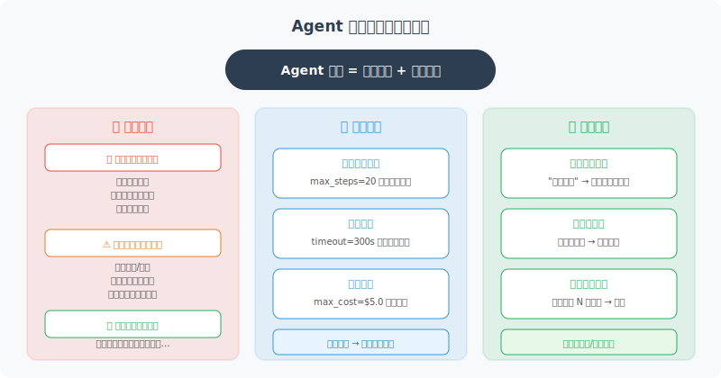

# Agent 行为的可控性与对齐

> **本节目标**：理解 Agent 对齐的重要性，学会设计行为边界和兜底机制。



---

## 什么是对齐（Alignment）？

对齐是指确保 Agent 的行为符合设计者和用户的意图与价值观。一个对齐良好的 Agent：

- ✅ 做用户真正需要的事，而不是字面要求的事
- ✅ 遇到不确定的情况时主动确认，而不是擅自行动
- ✅ 在可能造成不可逆后果时停下来等待批准
- ✅ 拒绝执行不道德或有害的请求

---

## 行为边界设计

```python
from enum import Enum
from dataclasses import dataclass

class ActionRisk(Enum):
    """操作风险等级"""
    LOW = "low"          # 只读操作，无副作用
    MEDIUM = "medium"    # 有副作用但可撤销
    HIGH = "high"        # 不可逆操作
    CRITICAL = "critical"  # 可能造成重大影响

@dataclass
class ActionBoundary:
    """行为边界定义"""
    action: str
    risk_level: ActionRisk
    requires_confirmation: bool
    max_daily_count: int = None
    description: str = ""

class BehaviorGuard:
    """行为守护器 —— 确保 Agent 在安全边界内行动"""
    
    def __init__(self):
        self.boundaries = {}
        self.action_counts = {}  # 操作计数
        
        # 注册默认行为边界
        self._register_defaults()
    
    def _register_defaults(self):
        """注册默认的行为边界"""
        defaults = [
            ActionBoundary("search", ActionRisk.LOW, False,
                          description="搜索信息"),
            ActionBoundary("read_file", ActionRisk.LOW, False,
                          description="读取文件"),
            ActionBoundary("write_file", ActionRisk.MEDIUM, False,
                          max_daily_count=100,
                          description="写入文件"),
            ActionBoundary("send_email", ActionRisk.HIGH, True,
                          max_daily_count=20,
                          description="发送邮件"),
            ActionBoundary("delete_data", ActionRisk.CRITICAL, True,
                          max_daily_count=5,
                          description="删除数据"),
            ActionBoundary("execute_code", ActionRisk.HIGH, True,
                          max_daily_count=50,
                          description="执行代码"),
        ]
        
        for boundary in defaults:
            self.boundaries[boundary.action] = boundary
    
    def check_action(self, action: str) -> dict:
        """检查操作是否允许"""
        boundary = self.boundaries.get(action)
        
        if boundary is None:
            return {
                "allowed": False,
                "reason": f"未注册的操作: {action}"
            }
        
        # 检查每日限额
        if boundary.max_daily_count:
            count = self.action_counts.get(action, 0)
            if count >= boundary.max_daily_count:
                return {
                    "allowed": False,
                    "reason": f"已达到每日限额 ({boundary.max_daily_count})"
                }
        
        # 需要人工确认的操作
        if boundary.requires_confirmation:
            return {
                "allowed": True,
                "needs_confirmation": True,
                "risk_level": boundary.risk_level.value,
                "message": f"操作'{boundary.description}'需要您的确认"
            }
        
        # 更新计数
        self.action_counts[action] = self.action_counts.get(action, 0) + 1
        
        return {
            "allowed": True,
            "needs_confirmation": False,
            "risk_level": boundary.risk_level.value
        }
```

---

## 拒绝策略

Agent 需要知道什么时候说"不"：

```python
REFUSAL_GUIDELINES = """
## 何时应该拒绝

### 必须拒绝
- 用户要求执行可能违法的操作
- 用户要求泄露其他用户的隐私信息
- 用户要求绕过安全检查

### 应该确认后再执行
- 不可逆的操作（删除数据、发送邮件）
- 涉及金钱的操作（下单、转账）
- 影响范围大的操作（群发消息、批量修改）

### 应该提醒但可以执行
- 用户的请求可能有更好的替代方案
- 操作结果可能不符合用户预期

## 拒绝的方式
- 礼貌但坚定
- 解释原因
- 如果可能，提供替代方案
"""

class RefusalHandler:
    """优雅拒绝处理器"""
    
    TEMPLATES = {
        "security": (
            "抱歉，出于安全考虑，我无法执行这个操作。"
            "{reason}。如果您有特殊需求，请联系管理员。"
        ),
        "scope": (
            "这个请求超出了我的能力范围。"
            "{reason}。建议您{suggestion}。"
        ),
        "confirmation": (
            "这个操作{description}。"
            "为了确保安全，需要您明确确认。要继续吗？(是/否)"
        ),
        "alternative": (
            "我理解您的需求，不过{reason}。"
            "作为替代，我可以{alternative}，您觉得如何？"
        )
    }
    
    @classmethod
    def refuse(
        cls,
        refusal_type: str,
        **kwargs
    ) -> str:
        """生成礼貌的拒绝消息"""
        template = cls.TEMPLATES.get(refusal_type, cls.TEMPLATES["security"])
        return template.format(**kwargs)
```

---

## 渐进式自主权

根据信任等级，逐步增加 Agent 的自主权：

```python
class TrustLevel(Enum):
    """信任等级"""
    NEW_USER = 1        # 新用户：所有操作都需要确认
    REGULAR = 2         # 常规用户：只有高风险操作需要确认
    TRUSTED = 3         # 受信任用户：只有关键操作需要确认
    ADMIN = 4           # 管理员：完全自主

class ProgressiveAutonomy:
    """渐进式自主权管理"""
    
    def __init__(self, initial_trust: TrustLevel = TrustLevel.NEW_USER):
        self.trust_level = initial_trust
        self.interaction_count = 0
        self.error_count = 0
    
    def needs_confirmation(self, action_risk: ActionRisk) -> bool:
        """根据信任等级判断是否需要确认"""
        confirmation_matrix = {
            TrustLevel.NEW_USER: {
                ActionRisk.LOW: False,
                ActionRisk.MEDIUM: True,
                ActionRisk.HIGH: True,
                ActionRisk.CRITICAL: True,
            },
            TrustLevel.REGULAR: {
                ActionRisk.LOW: False,
                ActionRisk.MEDIUM: False,
                ActionRisk.HIGH: True,
                ActionRisk.CRITICAL: True,
            },
            TrustLevel.TRUSTED: {
                ActionRisk.LOW: False,
                ActionRisk.MEDIUM: False,
                ActionRisk.HIGH: False,
                ActionRisk.CRITICAL: True,
            },
            TrustLevel.ADMIN: {
                ActionRisk.LOW: False,
                ActionRisk.MEDIUM: False,
                ActionRisk.HIGH: False,
                ActionRisk.CRITICAL: False,
            },
        }
        
        return confirmation_matrix[self.trust_level][action_risk]
    
    def update_trust(self, success: bool):
        """根据交互结果更新信任等级"""
        self.interaction_count += 1
        
        if not success:
            self.error_count += 1
        
        # 升级条件：成功交互足够多，错误率低
        error_rate = self.error_count / max(self.interaction_count, 1)
        
        if (self.interaction_count >= 50 
            and error_rate < 0.05 
            and self.trust_level.value < TrustLevel.TRUSTED.value):
            self.trust_level = TrustLevel(self.trust_level.value + 1)
            print(f"🆙 信任等级提升至: {self.trust_level.name}")
```

---

## 小结

| 概念 | 说明 |
|------|------|
| 对齐 | 确保 Agent 行为符合人类意图和价值观 |
| 行为边界 | 为每种操作定义风险等级和限制 |
| 拒绝策略 | 礼貌但坚定地拒绝不当请求 |
| 渐进式自主 | 根据信任等级逐步增加自主权 |

> 🎓 **本章总结**：安全与可靠性是 Agent 从"能用"到"敢用"的关键一步。Prompt 注入防御、幻觉控制、权限管理、数据保护和行为对齐，构成了 Agent 安全的五道防线。

---

[下一章：第18章 部署与生产化 →](../chapter_deployment/README.md)
