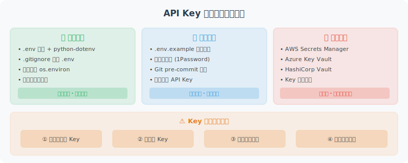

# API Key 管理与安全最佳实践

API Key 是访问 LLM 服务的凭证，一旦泄露可能导致严重的费用损失。本节讲解如何安全地管理 API Key。



## 绝对不要这样做

```python
# ❌ 永远不要这样做！
client = OpenAI(api_key="sk-proj-abc123xyz...")  # 硬编码在代码里

# ❌ 也不要提交到 Git
# 即使是私有仓库，也要养成好习惯
```

一旦 API Key 被提交到 GitHub，即使立刻删除，也可能已经被自动扫描工具发现。GitHub 本身也有 Secret Scanning 功能，会检测并通知 OpenAI 撤销泄露的 Key。

## 正确做法：使用 .env 文件

```bash
# 创建 .env 文件（不提交到版本控制）
cat > .env << EOF
# LLM API Keys
OPENAI_API_KEY=sk-proj-your-key-here
ANTHROPIC_API_KEY=your-anthropic-key
DASHSCOPE_API_KEY=your-qwen-key

# 其他配置
DEFAULT_MODEL=gpt-4o-mini
MAX_TOKENS=2000
EOF

# 确保 .gitignore 包含 .env
echo ".env" >> .gitignore
echo ".env.local" >> .gitignore
```

```python
# config.py：统一的配置管理
import os
from dotenv import load_dotenv
from pathlib import Path

# 加载 .env 文件
# 从当前目录向上查找 .env
load_dotenv()

class Config:
    """应用配置"""
    
    # LLM 配置
    OPENAI_API_KEY: str = os.getenv("OPENAI_API_KEY", "")
    ANTHROPIC_API_KEY: str = os.getenv("ANTHROPIC_API_KEY", "")
    
    # 模型配置
    DEFAULT_MODEL: str = os.getenv("DEFAULT_MODEL", "gpt-4o-mini")
    MAX_TOKENS: int = int(os.getenv("MAX_TOKENS", "2000"))
    TEMPERATURE: float = float(os.getenv("TEMPERATURE", "0.7"))
    
    @classmethod
    def validate(cls):
        """验证必要的配置是否存在"""
        required_keys = ["OPENAI_API_KEY"]
        missing = [k for k in required_keys if not getattr(cls, k)]
        
        if missing:
            raise ValueError(
                f"缺少必要的环境变量：{', '.join(missing)}\n"
                f"请检查 .env 文件或设置环境变量"
            )
        return True

# 在应用启动时验证
config = Config()
config.validate()
```

## 创建 .env.example 模板

把 `.env.example` 提交到 Git，让其他开发者知道需要哪些 Key：

```bash
# .env.example（提交到 Git，不含真实值）
# 复制此文件为 .env 并填入真实的 API Key

# OpenAI API Key
# 获取地址：https://platform.openai.com/api-keys
OPENAI_API_KEY=your-openai-api-key-here

# Anthropic API Key（可选）
# 获取地址：https://console.anthropic.com/
ANTHROPIC_API_KEY=your-anthropic-api-key-here

# 阿里云通义千问（可选）
DASHSCOPE_API_KEY=your-dashscope-api-key-here

# DeepSeek（可选，性价比极高）
# 获取地址：https://platform.deepseek.com/
DEEPSEEK_API_KEY=your-deepseek-api-key-here

# 默认模型配置
DEFAULT_MODEL=gpt-4o-mini
MAX_TOKENS=2000
```

## 多环境配置管理

```python
# settings.py：支持多环境的配置管理
from pydantic_settings import BaseSettings
from typing import Optional

class Settings(BaseSettings):
    """
    使用 pydantic-settings 管理配置
    自动从环境变量读取，支持类型验证
    """
    
    # API Keys
    openai_api_key: str
    anthropic_api_key: Optional[str] = None
    dashscope_api_key: Optional[str] = None
    
    # 模型配置
    default_model: str = "gpt-4o-mini"
    max_tokens: int = 2000
    temperature: float = 0.7
    
    # 应用配置
    debug: bool = False
    log_level: str = "INFO"
    
    class Config:
        env_file = ".env"
        env_file_encoding = "utf-8"
        case_sensitive = False  # OPENAI_API_KEY = openai_api_key

# 安装：pip install pydantic-settings
settings = Settings()
print(f"使用模型：{settings.default_model}")
```

## 实际开发中的 Key 管理最佳实践

### 1. 按用途申请不同的 Key

```
开发 Key   → 用于本地开发，设置较低的用量限制
测试 Key   → 用于 CI/CD 测试
生产 Key   → 最高权限，只有生产环境能访问
```

### 2. 设置用量告警

在 OpenAI 后台设置用量限制和告警：
- 每月硬限制（Hard Limit）：防止超支
- 告警阈值（Alert Threshold）：提前预警

### 3. Key 轮换

```python
# 支持多个 Key 轮换，避免单点故障
import itertools
import os

class APIKeyRotator:
    """API Key 轮换管理器"""
    
    def __init__(self):
        # 从环境变量读取多个 Key
        keys = []
        for i in range(1, 6):  # 最多5个 Key
            key = os.getenv(f"OPENAI_API_KEY_{i}")
            if key:
                keys.append(key)
        
        # 也接受单个 Key
        single_key = os.getenv("OPENAI_API_KEY")
        if single_key:
            keys.append(single_key)
        
        if not keys:
            raise ValueError("没有找到任何 API Key")
        
        self._key_cycle = itertools.cycle(keys)
        self._key_count = len(keys)
    
    def get_next_key(self) -> str:
        """获取下一个 Key（轮换）"""
        return next(self._key_cycle)
    
    @property
    def key_count(self) -> int:
        return self._key_count

# 使用
rotator = APIKeyRotator()
print(f"已加载 {rotator.key_count} 个 API Key")
```

### 4. 生产环境：使用密钥管理服务

```python
# 生产环境不应该用 .env 文件
# 而应该使用专业的密钥管理服务

# 方案1：AWS Secrets Manager
import boto3
import json

def get_secret_from_aws(secret_name: str, region: str = "us-east-1") -> dict:
    """从 AWS Secrets Manager 获取密钥"""
    client = boto3.client("secretsmanager", region_name=region)
    response = client.get_secret_value(SecretId=secret_name)
    return json.loads(response["SecretString"])

# 使用：
# secrets = get_secret_from_aws("prod/openai-keys")
# OPENAI_API_KEY = secrets["api_key"]

# 方案2：阿里云密钥管理 KMS
# 方案3：HashiCorp Vault
# 方案4：Kubernetes Secrets
```

## 检测 Key 是否有效

```python
# key_validator.py
from openai import OpenAI, AuthenticationError

def validate_openai_key(api_key: str) -> bool:
    """验证 OpenAI API Key 是否有效"""
    try:
        client = OpenAI(api_key=api_key)
        # 用最便宜的方式验证 Key
        client.models.list()
        return True
    except AuthenticationError:
        return False
    except Exception as e:
        print(f"验证时发生错误：{e}")
        return False

# 在应用启动时验证
import os
from dotenv import load_dotenv
load_dotenv()

key = os.getenv("OPENAI_API_KEY")
if validate_openai_key(key):
    print("✅ API Key 有效")
else:
    print("❌ API Key 无效，请检查")
```

## 日志中隐藏敏感信息

```python
import logging
import re

class SensitiveDataFilter(logging.Filter):
    """过滤日志中的敏感信息"""
    
    # 匹配 OpenAI Key 格式
    PATTERNS = [
        (r'sk-[a-zA-Z0-9]{20,}', 'sk-***REDACTED***'),
        (r'Bearer [a-zA-Z0-9\-._~+/]+=*', 'Bearer ***REDACTED***'),
    ]
    
    def filter(self, record: logging.LogRecord) -> bool:
        record.msg = self._redact(str(record.msg))
        return True
    
    def _redact(self, text: str) -> str:
        for pattern, replacement in self.PATTERNS:
            text = re.sub(pattern, replacement, text)
        return text

# 配置日志
logger = logging.getLogger(__name__)
logger.addFilter(SensitiveDataFilter())

# 测试：即使不小心打印了 Key，也会被过滤
logger.info("Using key: sk-proj-abc123xyz789...")
# 输出：Using key: sk-***REDACTED***
```

---

## 安全检查清单

在每次代码提交前，确认以下事项：

- [ ] `.env` 文件在 `.gitignore` 中
- [ ] 代码中没有硬编码的 API Key
- [ ] 已创建 `.env.example` 模板
- [ ] 已在 OpenAI 后台设置用量限制
- [ ] 日志不会输出完整的 API Key

---

*下一节：[2.4 第一个 Agent：Hello Agent！](./04_hello_agent.md)*
