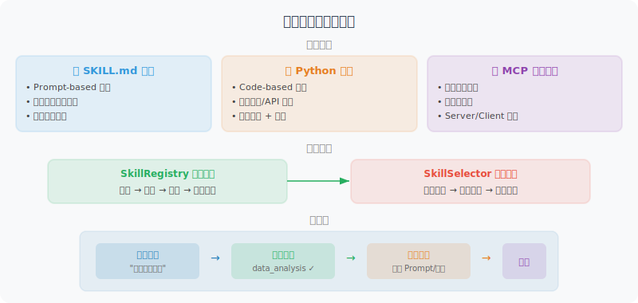

# 实战：构建可复用的技能系统

本节将前面学习的概念付诸实践——构建一个完整的 Agent 技能系统。这个系统支持技能的定义、加载、发现和调用。



## 项目目标

构建一个**技能驱动的 Agent 框架**，具备以下能力：

1. 用 SKILL.md 文件定义技能（Prompt-based）
2. 用 Python 代码实现技能（Code-based）
3. 按需加载和发现技能
4. 根据用户任务自动选择合适的技能

## 项目结构

```
skill_agent/
├── main.py                    # 主入口
├── skill_manager.py           # 技能管理器
├── agent.py                   # Agent 核心逻辑
├── skills/                    # 技能目录
│   ├── data_analyst/
│   │   ├── SKILL.md           # 数据分析技能定义
│   │   └── tools.py           # 关联的工具代码
│   ├── code_reviewer/
│   │   ├── SKILL.md           # 代码审查技能定义
│   │   └── tools.py
│   └── report_writer/
│       ├── SKILL.md           # 报告撰写技能定义
│       └── templates/
│           └── report.md      # 报告模板
└── requirements.txt
```

## 第一步：定义技能

### 数据分析师技能（SKILL.md）

```markdown
---
name: data-analyst
description: 专业数据分析：数据清洗、统计分析、可视化、报告生成
version: "1.0"
tags: [data, analysis, csv, statistics, visualization]
tools: [read_csv, compute_stats, create_chart]
---

# 数据分析师技能

## 角色定义
你是一名专业的数据分析师。当用户提供数据文件或提出分析需求时，
你将自动执行完整的分析流程。

## 工作流程

### 1. 数据理解（必须首先执行）
- 使用 read_csv 工具加载数据
- 报告：行数、列数、数据类型、缺失值比例
- 如果缺失值 > 30%，提醒用户数据质量问题

### 2. 数据清洗
- 数值列的缺失值：用中位数填充
- 文本列的缺失值：标记为 "未知"
- 异常值检测：IQR 方法（1.5 倍四分位距）
- 删除完全重复的行

### 3. 分析与洞察
- 描述统计：均值、中位数、标准差、四分位数
- 如果有时间列：趋势分析
- 如果有分类列：分组统计
- 如果有多个数值列：相关性分析

### 4. 可视化
使用 create_chart 工具，根据数据特征选择图表：
| 场景 | 图表类型 |
|------|---------|
| 时间趋势 | 折线图 |
| 分类比较 | 柱状图 |
| 分布 | 直方图 |
| 占比 | 饼图 |
| 关系 | 散点图 |

### 5. 报告
- 使用结构化的 Markdown 格式
- 每个发现都用数据支撑
- 在报告末尾给出 2-3 条可操作的建议
```

### 代码审查技能（SKILL.md）

```markdown
---
name: code-reviewer
description: 专业代码审查：代码质量、安全漏洞、性能优化建议
version: "1.0"
tags: [code, review, security, quality, optimization]
tools: [read_file, analyze_code]
---

# 代码审查技能

## 角色定义
你是一名资深代码审查者，具备安全意识和性能优化经验。

## 审查维度

### 1. 代码质量
- 命名规范（变量、函数、类）
- 函数长度（超过 50 行需要拆分）
- 嵌套深度（超过 3 层需要重构）
- 重复代码检测

### 2. 安全审查（高优先级）
- SQL 注入风险
- 硬编码的密钥或密码
- 未验证的用户输入
- 不安全的反序列化

### 3. 性能优化
- 不必要的循环或重复计算
- 内存泄漏风险
- 数据库查询优化
- 缓存建议

## 输出格式
使用以下格式输出审查结果：
- 🔴 严重：必须修复的安全或正确性问题
- 🟡 警告：建议改进的质量问题
- 🟢 建议：可选的优化建议
- ✅ 优点：值得肯定的良好实践
```

## 第二步：实现技能管理器

```python
# skill_manager.py
import os
import yaml
import hashlib
from pathlib import Path
from openai import OpenAI


class Skill:
    """技能数据类"""
    
    def __init__(self, name, description, content, 
                 version="1.0", tags=None, tools=None, path=None):
        self.name = name
        self.description = description
        self.content = content  # SKILL.md 的完整内容
        self.version = version
        self.tags = tags or []
        self.tools = tools or []
        self.path = path
    
    def __repr__(self):
        return f"Skill(name='{self.name}', version='{self.version}')"


class SkillManager:
    """技能管理器：加载、注册、发现、选择"""
    
    def __init__(self, skills_dir: str = "skills"):
        self.skills_dir = Path(skills_dir)
        self.skills: dict[str, Skill] = {}
        self._load_all_skills()
    
    def _load_all_skills(self):
        """扫描技能目录，加载所有技能"""
        if not self.skills_dir.exists():
            print(f"⚠️ 技能目录不存在: {self.skills_dir}")
            return
        
        for skill_dir in self.skills_dir.iterdir():
            if skill_dir.is_dir():
                skill_file = skill_dir / "SKILL.md"
                if skill_file.exists():
                    skill = self._parse_skill_file(skill_file)
                    self.skills[skill.name] = skill
                    print(f"  📦 已加载技能: {skill.name} (v{skill.version})")
    
    def _parse_skill_file(self, path: Path) -> Skill:
        """解析 SKILL.md 文件"""
        content = path.read_text(encoding="utf-8")
        
        # 解析 YAML frontmatter
        metadata = {}
        if content.startswith("---"):
            parts = content.split("---", 2)
            if len(parts) >= 3:
                metadata = yaml.safe_load(parts[1])
                body = parts[2].strip()
            else:
                body = content
        else:
            body = content
        
        return Skill(
            name=metadata.get("name", path.parent.name),
            description=metadata.get("description", ""),
            content=body,
            version=metadata.get("version", "1.0"),
            tags=metadata.get("tags", []),
            tools=metadata.get("tools", []),
            path=str(path)
        )
    
    def get_skill(self, name: str) -> Skill:
        """获取指定技能"""
        if name not in self.skills:
            raise ValueError(f"未找到技能: {name}。可用技能: {list(self.skills.keys())}")
        return self.skills[name]
    
    def list_skills(self) -> list[dict]:
        """列出所有技能的摘要"""
        return [
            {
                "name": skill.name,
                "description": skill.description,
                "version": skill.version,
                "tags": skill.tags
            }
            for skill in self.skills.values()
        ]
    
    def discover(self, task: str) -> list[Skill]:
        """根据任务描述发现相关技能（简单版：关键词匹配）"""
        task_lower = task.lower()
        scored_skills = []
        
        for skill in self.skills.values():
            score = 0
            # 检查描述匹配
            if any(word in skill.description.lower() 
                   for word in task_lower.split()):
                score += 2
            # 检查标签匹配
            for tag in skill.tags:
                if tag.lower() in task_lower:
                    score += 3
            # 检查技能名匹配
            if skill.name.replace("-", " ") in task_lower:
                score += 5
            
            if score > 0:
                scored_skills.append((skill, score))
        
        # 按分数降序排列
        scored_skills.sort(key=lambda x: x[1], reverse=True)
        return [skill for skill, _ in scored_skills]
    
    def get_skill_summaries_prompt(self) -> str:
        """生成技能摘要文本（用于 LLM 决策）"""
        lines = ["你具备以下技能，请根据用户的任务选择最合适的技能：\n"]
        for skill in self.skills.values():
            lines.append(f"- **{skill.name}**: {skill.description}")
            lines.append(f"  标签: {', '.join(skill.tags)}")
            lines.append("")
        return "\n".join(lines)
```

## 第三步：实现 Agent 核心逻辑

```python
# agent.py
from openai import OpenAI
from skill_manager import SkillManager


class SkillAgent:
    """技能驱动的 Agent"""
    
    def __init__(self, skill_manager: SkillManager, model: str = "gpt-4o"):
        self.skill_manager = skill_manager
        self.client = OpenAI()
        self.model = model
        self.conversation_history = []
    
    def chat(self, user_message: str) -> str:
        """处理用户消息"""
        
        # 1. 技能选择（让 LLM 决定使用哪个技能）
        selected_skill = self._select_skill(user_message)
        
        # 2. 构建系统提示（加载选中的技能）
        system_prompt = self._build_system_prompt(selected_skill)
        
        # 3. 调用 LLM
        self.conversation_history.append(
            {"role": "user", "content": user_message}
        )
        
        response = self.client.chat.completions.create(
            model=self.model,
            messages=[
                {"role": "system", "content": system_prompt},
                *self.conversation_history
            ]
        )
        
        assistant_message = response.choices[0].message.content
        self.conversation_history.append(
            {"role": "assistant", "content": assistant_message}
        )
        
        return assistant_message
    
    def _select_skill(self, task: str) -> str:
        """让 LLM 选择最合适的技能"""
        skill_summaries = self.skill_manager.get_skill_summaries_prompt()
        
        selection_prompt = f"""根据用户的任务，选择最合适的技能。
只需要返回技能名称，不需要其他内容。
如果没有合适的技能，返回 "none"。

{skill_summaries}

用户任务: {task}
选择的技能:"""

        response = self.client.chat.completions.create(
            model=self.model,
            messages=[{"role": "user", "content": selection_prompt}],
            max_tokens=50,
            temperature=0
        )
        
        skill_name = response.choices[0].message.content.strip().lower()
        
        if skill_name != "none" and skill_name in self.skill_manager.skills:
            print(f"  🎯 选择技能: {skill_name}")
            return skill_name
        
        # LLM 选择失败，尝试关键词匹配
        discovered = self.skill_manager.discover(task)
        if discovered:
            print(f"  🔍 发现技能: {discovered[0].name}")
            return discovered[0].name
        
        print("  ℹ️ 未匹配到特定技能，使用通用模式")
        return None
    
    def _build_system_prompt(self, skill_name: str = None) -> str:
        """构建系统提示"""
        base_prompt = "你是一个智能 Agent 助手。"
        
        if skill_name:
            skill = self.skill_manager.get_skill(skill_name)
            return f"""{base_prompt}

当前已激活技能：{skill.name} (v{skill.version})

{skill.content}

请严格按照上述技能指南来完成用户的任务。
"""
        
        return base_prompt
```

## 第四步：主程序

```python
# main.py
from skill_manager import SkillManager
from agent import SkillAgent


def main():
    print("=" * 60)
    print("  🤖 技能驱动的 Agent 系统")
    print("=" * 60)
    
    # 1. 初始化技能管理器
    print("\n📂 加载技能...")
    manager = SkillManager(skills_dir="skills")
    
    # 2. 显示可用技能
    print(f"\n✅ 已加载 {len(manager.skills)} 个技能:")
    for skill_info in manager.list_skills():
        print(f"  - {skill_info['name']}: {skill_info['description']}")
    
    # 3. 初始化 Agent
    agent = SkillAgent(manager)
    
    # 4. 交互循环
    print("\n" + "-" * 60)
    print("开始对话（输入 'quit' 退出，'skills' 查看技能列表）")
    print("-" * 60)
    
    while True:
        user_input = input("\n🧑 你: ").strip()
        
        if user_input.lower() == "quit":
            print("👋 再见！")
            break
        elif user_input.lower() == "skills":
            for skill_info in manager.list_skills():
                print(f"  📦 {skill_info['name']}: {skill_info['description']}")
            continue
        elif not user_input:
            continue
        
        response = agent.chat(user_input)
        print(f"\n🤖 Agent: {response}")


if __name__ == "__main__":
    main()
```

## 运行效果

```
============================================================
  🤖 技能驱动的 Agent 系统
============================================================

📂 加载技能...
  📦 已加载技能: data-analyst (v1.0)
  📦 已加载技能: code-reviewer (v1.0)
  📦 已加载技能: report-writer (v1.0)

✅ 已加载 3 个技能:
  - data-analyst: 专业数据分析：数据清洗、统计分析、可视化、报告生成
  - code-reviewer: 专业代码审查：代码质量、安全漏洞、性能优化建议
  - report-writer: 结构化报告撰写：技术报告、分析报告

------------------------------------------------------------
开始对话（输入 'quit' 退出，'skills' 查看技能列表）
------------------------------------------------------------

🧑 你: 帮我分析一下 sales_data.csv 的销售趋势
  🎯 选择技能: data-analyst

🤖 Agent: ## 数据分析报告

### 1. 数据概览
- 数据包含 1,245 条记录，8 个字段
- 时间范围：2024-01 至 2025-12
- 缺失值：3.2%（已用中位数填充）
...（根据技能指南自动执行完整分析流程）

🧑 你: 帮我审查一下这段 Python 代码
  🎯 选择技能: code-reviewer

🤖 Agent: ## 代码审查报告

🔴 **严重 (1)**
- 第 23 行：SQL 查询使用字符串拼接，存在 SQL 注入风险

🟡 **警告 (2)**  
- 第 45 行：函数超过 80 行，建议拆分
...（根据技能指南执行多维度审查）
```

## 扩展方向

这个基础框架可以进一步扩展：

| 扩展方向 | 实现思路 |
|---------|---------|
| **语义发现** | 用 embedding 模型替换关键词匹配 |
| **代码工具集成** | 每个技能目录下的 tools.py 自动注册为 Function Calling 工具 |
| **技能学习** | Agent 完成任务后，自动提取经验保存为新技能 |
| **多 Agent 协作** | 每个技能对应一个专家 Agent，协调 Agent 负责编排 |
| **技能市场** | 类似 npm，支持技能的发布、搜索和安装 |

## 本节小结

通过这个实战项目，我们构建了一个完整的技能驱动 Agent 系统：

1. **技能定义**：用 SKILL.md 文件定义技能的知识和行为指南
2. **技能管理**：自动扫描、解析和加载技能
3. **技能发现**：根据任务描述自动匹配最合适的技能
4. **技能注入**：将选中技能的内容注入到系统提示中

> 💡 **动手练习**：尝试创建你自己的技能！在 `skills/` 目录下新建一个文件夹，编写 `SKILL.md`，定义你擅长的某个领域的技能（如"Python 调试技能"、"API 设计技能"、"技术写作技能"等），然后测试 Agent 是否能正确识别和使用它。

---

*下一节：[9.6 论文解读：技能系统前沿研究](./06_paper_readings.md)*
