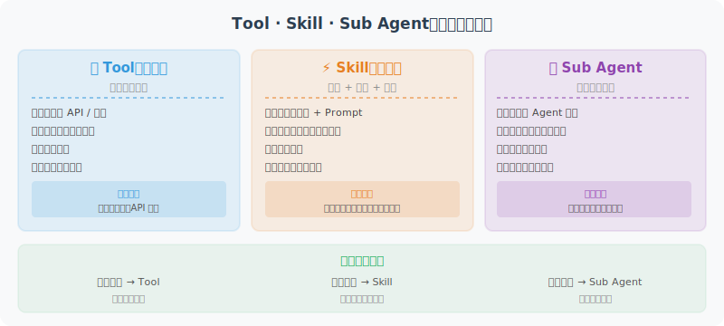

# Tool、Skill 与 Sub Agent：三层能力抽象

> 🎯 *"Tool 是手，Skill 是技能，Sub Agent 是团队成员——理解三者的关系，是设计好 Agent 架构的关键。"*

在前面的章节中，我们分别学习了工具调用（第4章）、技能系统（第9章）和多 Agent 协作（第14章）。本节将它们放在一起，做一次**统一的对比和梳理**——帮你在实际开发中做出正确的架构选择。



## 一个直觉类比

| 概念 | 餐厅类比 | 软件类比 |
|------|---------|---------|
| **Tool（工具）** | 菜刀、炒锅、烤箱 | 一个 API 调用、一个函数 |
| **Skill（技能）** | "川菜烹饪"、"法式甜点制作" | 一组工具 + 策略 + 知识的封装 |
| **Sub Agent（子智能体）** | 一位专业厨师 | 一个有自己推理循环的独立 Agent |

- **工具**是最小的执行单元——菜刀不会自己做菜
- **技能**是工具的组合使用方法——知道什么时候用什么工具、怎么用
- **子智能体**是拥有技能的独立决策者——厨师可以自主决定菜品的制作流程

## 三层能力模型

```python
# ──────────── Layer 1: Tool（工具）────────────
# 最小执行单元：输入 → 执行 → 输出，无状态，无决策
def search_web(query: str) -> list[str]:
    """搜索网页，返回结果列表"""
    return search_engine.search(query)

def read_file(path: str) -> str:
    """读取文件内容"""
    return open(path).read()

def execute_sql(query: str) -> list[dict]:
    """执行 SQL 查询"""
    return database.execute(query)


# ──────────── Layer 2: Skill（技能）────────────
# 工具的组合 + 策略 + 知识封装
class DataAnalysisSkill:
    """数据分析技能：封装了多个工具 + 分析策略 + 领域知识"""
    tools = [execute_sql, create_chart, calculate_statistics]
    
    system_prompt = """你是数据分析专家。分析数据时遵循以下策略：
    1. 先了解数据结构和数据质量
    2. 根据问题类型选择合适的分析方法
    3. 用可视化辅助解释结论"""
    
    def execute(self, task: str) -> str:
        """执行一次数据分析（通常是单次 LLM 调用 + 工具组合）"""
        return llm.chat(system=self.system_prompt, tools=self.tools,
                       messages=[{"role": "user", "content": task}])


# ──────────── Layer 3: Sub Agent（子智能体）────────────
# 独立的推理循环：有自己的记忆、规划、决策能力
class DataAnalystAgent:
    """数据分析师 Agent：拥有技能库 + 独立记忆 + 自主规划"""
    skills = [DataAnalysisSkill(), ReportWritingSkill(), DataCleaningSkill()]
    memory = WorkingMemory()
    
    def run(self, objective: str) -> str:
        """自主执行多步任务，有完整的推理循环"""
        plan = self.plan(objective)
        for step in plan:
            skill = self.select_skill(step)
            result = skill.execute(step)
            self.memory.store(step, result)
            if self.should_replan(result):
                plan = self.replan(objective, self.memory)
        return self.synthesize(self.memory)
```

## 核心区别：五个维度的对比

| 维度 | Tool（工具） | Skill（技能） | Sub Agent（子智能体） |
|------|-------------|--------------|---------------------|
| **抽象层次** | 最低——单一操作 | 中层——操作组合 | 最高——自主实体 |
| **决策能力** | ❌ 无决策，纯执行 | ⚠️ 有限决策（策略内） | ✅ 完全自主决策 |
| **状态管理** | 无状态 | 轻量状态 | 独立记忆 + 工作状态 |
| **推理循环** | 无 | 通常单次 | 多步循环（Plan-Act-Observe） |
| **可组合性** | 被技能和 Agent 调用 | 被 Agent 调用 | 被上级 Agent 编排 |

### 决策能力的递进

```
Tool:       input → output                （确定性映射）
Skill:      input → [策略选择] → output     （有限的条件分支）
Sub Agent:  objective → [规划→执行→反思→调整]* → output  （自主推理循环）
```

用一个实际例子来感受这种递进：

```python
# 任务：帮用户准备一份季度销售报告

# ── 如果只用 Tool ──
# Agent 需要自己做所有决策，逐一调用工具
result1 = execute_sql("SELECT * FROM sales WHERE quarter = 'Q4'")
result2 = calculate_statistics(result1)
result3 = create_chart(result2, chart_type="bar")
result4 = format_report(result2, result3)
# Agent 本身承担了所有"怎么做"的决策

# ── 如果用 Skill ──
# Agent 只需指定"做什么"，Skill 内部处理"怎么做"
report = data_analysis_skill.execute("生成 Q4 销售报告，包含趋势分析和图表")

# ── 如果用 Sub Agent ──
# 主 Agent 只需说"目标"，Sub Agent 自主完成一切
report = data_analyst_agent.run(
    "全面分析 Q4 销售数据，发现问题和机会，撰写管理层报告"
)
# Sub Agent 自己规划步骤、选择技能、处理异常、多次迭代
```

## 何时使用什么？决策框架

```python
def choose_abstraction(task_requirements: dict) -> str:
    """选择合适的能力抽象层次"""
    complexity = task_requirements.get("complexity")
    autonomy = task_requirements.get("autonomy_needed")
    steps = task_requirements.get("estimated_steps")
    
    if complexity == "simple" and steps <= 1:
        return "Tool"      # 搜索网页、读取文件、调用 API
    
    if complexity == "medium" or (steps <= 5 and autonomy == "medium"):
        return "Skill"     # 数据分析、代码审查、文档生成
    
    if complexity == "complex" or autonomy == "high" or steps > 5:
        return "Sub Agent"  # 自主研究、项目规划、跨系统协调
    
    return "Tool"
```

### 实际场景的选型指南

| 场景 | 推荐抽象 | 原因 |
|------|---------|------|
| 调用天气 API | **Tool** | 单一、确定性操作 |
| 查询数据库并返回结果 | **Tool** | 输入输出明确 |
| 分析一组数据并生成可视化 | **Skill** | 需要组合多个工具 + 分析策略 |
| 将文档翻译成 3 种语言 | **Skill** | 固定流程，工具 + 领域知识 |
| 自主完成代码审查并提 PR | **Sub Agent** | 需要理解代码、做判断、多步操作 |
| 管理整个数据分析项目 | **Sub Agent** | 需要编排多个子任务和子 Agent |

## 组合模式：层次化架构

在真实的 Agent 系统中，三层抽象通常**嵌套使用**：

```
Orchestrator Agent（编排者）
├── Research Sub Agent（研究子智能体）
│   ├── Web Search Skill（网络搜索技能）
│   │   ├── search_web()    [Tool]
│   │   ├── fetch_page()    [Tool]
│   │   └── extract_text()  [Tool]
│   └── Summary Skill（总结技能）
│       ├── chunk_text()    [Tool]
│       └── summarize()     [Tool]
│
├── Coding Sub Agent（编程子智能体）
│   ├── Code Analysis Skill（代码分析技能）
│   │   ├── read_file()     [Tool]
│   │   └── search_code()   [Tool]
│   └── Code Edit Skill（代码编辑技能）
│       ├── write_file()    [Tool]
│       └── run_tests()     [Tool]
│
└── Report Sub Agent（报告子智能体）
    └── Report Writing Skill
        ├── create_chart()  [Tool]
        └── render_pdf()    [Tool]
```

```python
class ProductionAgent:
    """层次化架构的代码实现"""
    def __init__(self):
        self.sub_agents = {
            "researcher": ResearchAgent(skills=[WebSearchSkill(), SummarySkill()]),
            "coder": CodingAgent(skills=[CodeAnalysisSkill(), CodeEditSkill()]),
            "reporter": ReportAgent(skills=[ReportWritingSkill()]),
        }
    
    def handle_task(self, task: str):
        plan = self.plan(task)
        for step in plan:
            agent_name = self.route(step)
            result = self.sub_agents[agent_name].run(step)
            self.collect_result(step, result)
        return self.synthesize_results()
```

## 常见误区与最佳实践

### ❌ 误区一：所有事情都用 Sub Agent

```python
# 反模式：为一个简单搜索创建完整 Sub Agent
class OverEngineeredSearchAgent:
    """不要这样做！搜索网页只需要一个 Tool"""
    def __init__(self):
        self.memory = WorkingMemory()   # 不需要
        self.planner = Planner()        # 不需要
    def run(self, query):
        plan = self.planner.plan(f"搜索: {query}")
        # 就为了调用一个 search() 函数？太重了！
```

### ❌ 误区二：把复杂逻辑硬塞进一个 Tool

```python
# 反模式：一个"工具"里包含了太多逻辑
def analyze_and_report(data_path, output_format, language, chart_type, ...):
    """这不是 Tool，应该是 Skill 或 Sub Agent！Tool 应该是单一职责的原子操作"""
    data = load(data_path)
    cleaned = clean_data(data)
    analyzed = run_analysis(cleaned)
    chart = create_chart(analyzed, chart_type)
    report = write_report(analyzed, chart, language)
    return export(report, output_format)
```

### ✅ 最佳实践：渐进式升级

```python
# 阶段 1：先用 Tool 快速验证
tools = [search_web, read_file, execute_sql]
agent = SimpleReActAgent(tools=tools)
# 当 Prompt 里充满"如果...就..."的条件逻辑时 → 升级到 Skill

# 阶段 2：将反复出现的模式封装为 Skill
data_skill = DataAnalysisSkill(tools=[execute_sql, calculate, create_chart])
code_skill = CodeReviewSkill(tools=[read_file, search_code, lint])
agent = SkillBasedAgent(skills=[data_skill, code_skill])
# 当单个 Agent 的 Prompt 超过 4K tokens 时 → 考虑拆分为 Sub Agent

# 阶段 3：将独立职能域拆分为 Sub Agent
analyst = DataAnalystAgent(skills=[data_skill])
reviewer = CodeReviewAgent(skills=[code_skill])
orchestrator = OrchestratorAgent(sub_agents=[analyst, reviewer])
```

## 与通信协议的关系

三层抽象与我们在第15章学习的通信协议紧密相关：

| 抽象层 | 典型通信协议 | 说明 |
|--------|------------|------|
| **Tool** | **MCP**（Model Context Protocol） | MCP 定义了 Agent 与工具之间的标准接口 |
| **Skill** | 框架内部接口 | Skill 通常在同一进程内，不需要跨进程协议 |
| **Sub Agent** | **A2A**（Agent-to-Agent） | Sub Agent 之间通过 A2A 协议通信和协调 |

```python
# MCP 连接工具 → A2A 连接 Agent 的完整图景
#
# [Orchestrator Agent]
#     │
#     ├── A2A ──→ [Research Agent]
#     │               ├── MCP ──→ [Web Search Server]
#     │               └── MCP ──→ [Database Server]
#     │
#     └── A2A ──→ [Coding Agent]
#                     ├── MCP ──→ [File System Server]
#                     └── MCP ──→ [Git Server]
```

---

## 本节小结

| 要点 | 说明 |
|------|------|
| **三层递进** | Tool（原子操作） → Skill（策略封装） → Sub Agent（自主实体） |
| **核心区别** | 决策能力和自主性程度不同 |
| **选型原则** | 从最简单的开始，按需升级——不要过度工程 |
| **组合模式** | 三层嵌套使用是生产级 Agent 的常见架构 |
| **渐进演进** | Tool 先行验证 → Skill 封装复用 → Sub Agent 拆分自治 |

> 📖 *理解这三层抽象的关系，是从"能写一个 Agent"到"能设计一个 Agent 系统"的关键跨越。*

---

*相关章节：[第4章 工具调用](../chapter_tools/README.md) · [第9章 技能系统](./README.md) · [第14章 多 Agent 协作](../chapter_multi_agent/README.md) · [第15章 Agent 通信协议](../chapter_protocol/README.md)*
