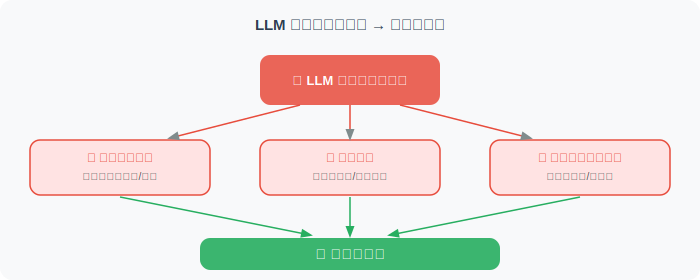
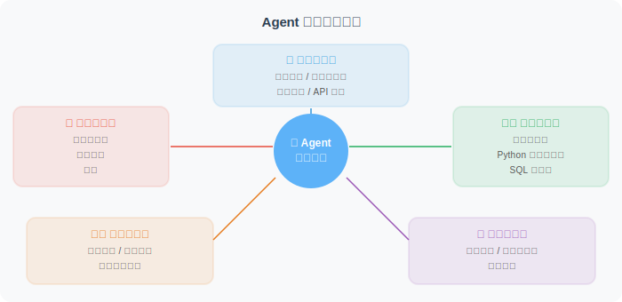

# 为什么 Agent 需要工具？

LLM 本身是强大的，但它有三个根本性的限制：**知识截止**、**无法行动**、**无法获取实时信息**。工具的出现，正是为了突破这三个限制。

## LLM 的局限性



```python
# 假设你直接问 LLM
response = "今天苹果公司股价是多少？"
# LLM 可能会说：
# "苹果公司（AAPL）的股价我无法实时查询，
#  根据我的训练数据，在 2024 年初大约在 150-190 美元之间..."

# 问题：
# 1. 数据不是实时的（可能已经过时很久）
# 2. 无法确认准确性
# 3. 不能执行任何操作
```

工具让 Agent 能够：

| 能力 | 工具类型 | 示例 |
|------|---------|------|
| 获取实时信息 | 搜索工具 | Tavily、Bing Search |
| 执行计算 | 计算工具 | Python executor |
| 操作文件 | 文件工具 | 读写、创建文件 |
| 访问数据库 | 数据库工具 | SQL 查询 |
| 调用外部服务 | API 工具 | 天气、地图、邮件 |
| 控制浏览器 | 浏览器工具 | Playwright |
| 执行代码 | 代码工具 | Python REPL |

## 工具分类体系



## 工具的本质：LLM 与现实世界的桥梁

```python
# 没有工具的 LLM：在文字世界里打转
def llm_without_tools(question: str) -> str:
    # 只能基于训练数据回答
    # 无法获取实时信息
    # 无法执行任何操作
    return "基于我的知识，我认为..."

# 有工具的 Agent：能够感知和影响现实世界
def agent_with_tools(question: str) -> str:
    # 分析问题需要什么工具
    if "天气" in question:
        weather_data = call_weather_api(location)  # 真实数据！
    if "计算" in question:
        result = execute_calculation(expression)   # 精确计算！
    if "最新" in question:
        news = search_internet(query)              # 实时信息！
    # 基于真实数据给出答案
    return generate_answer(question, tool_results)
```

## 一个工具如何影响 Agent 的能力边界

让我们用一个具体例子感受工具的威力：

```python
# 场景：分析竞争对手
# 没有工具的 LLM 能做什么？
# → 只能给出通用建议，无法获取实时数据

# 有了这些工具，Agent 能做什么？
tools = [
    "search",           # 搜索最新新闻和信息
    "web_scraper",      # 抓取网页内容
    "python_executor",  # 数据分析
    "chart_generator",  # 生成可视化图表
    "file_writer",      # 保存报告到文件
]

# Agent 可以：
# 1. 搜索竞争对手最新动态
# 2. 抓取竞争对手官网产品信息
# 3. 分析数据，计算市场份额
# 4. 生成对比图表
# 5. 输出完整分析报告到 PDF
```

## 工具安全性：能力越大，责任越大

工具赋予了 Agent 强大的能力，但也带来了风险：

```python
# ⚠️ 危险的工具（需要谨慎）
dangerous_tools = {
    "file_deleter": "可以删除任意文件",
    "email_sender": "可以以你的名义发邮件",
    "payment_api": "可以发起支付",
    "code_executor": "可以执行任意代码",
}

# 安全措施：
# 1. 沙箱隔离（代码执行在隔离环境中）
# 2. 权限最小化（只给必要权限）
# 3. 确认机制（危险操作需要用户确认）
# 4. 审计日志（记录所有工具调用）
```

---

## 小结

工具是 Agent 突破 LLM 局限的关键：
- LLM 有知识截止、无法行动的天然限制
- 工具让 Agent 能够获取实时信息、执行操作
- 工具分为：信息获取、计算执行、内容生成、交互操作、记忆存储五大类
- 强大的工具需要配套的安全机制

> 📖 **想深入了解工具学习的学术前沿？** 请阅读 [4.6 论文解读：工具学习前沿进展](./06_paper_readings.md)，涵盖 Toolformer、Gorilla、ToolLLM 三篇奠基性论文的深度解读。

---

*下一节：[4.2 Function Calling 机制详解](./02_function_calling.md)*
