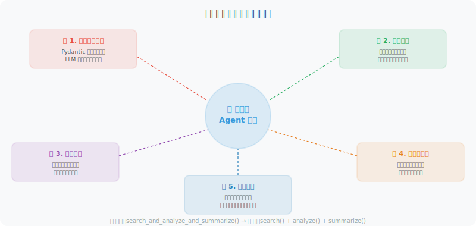

# 自定义工具的设计与实现

好的工具设计是 Agent 成功的关键。如果说 LLM 是 Agent 的"大脑"，那么工具就是它的"手脚"——大脑再聪明，手脚笨拙也做不好事情。

在实际开发中，很多 Agent 表现不佳的根本原因并非模型能力不足，而是工具设计存在问题：工具描述模糊导致模型选错工具、缺少输入验证导致工具崩溃、错误信息不清晰导致模型无法自我纠错。本节从实践角度，系统讲解如何设计出高质量、可靠的 Agent 工具。



## 工具设计原则

**单一职责**：每个工具只做一件事，做好这一件事。

这并不只是一个软件工程的教条——它对 Agent 的表现有直接影响。一个"大而全"的工具会让模型困惑："我到底应该传哪些参数？这个工具到底能做什么？" 而多个职责清晰的小工具，模型可以根据任务自由组合，灵活性反而更强。

```python
# ❌ 不好：一个工具做太多事情
def search_and_analyze_and_summarize(query, analyze=True, summarize=True):
    results = search(query)
    if analyze:
        analysis = analyze_data(results)
    if summarize:
        summary = summarize_text(results)
    return ...

# ✅ 好：分成独立的工具
def search_web(query: str) -> list:
    """只负责搜索"""
    ...

def analyze_data(data: list) -> dict:
    """只负责分析"""
    ...

def summarize_text(text: str) -> str:
    """只负责摘要"""
    ...
```

## 工具开发最佳实践

下面我们从五个维度来讲解工具开发的最佳实践。每个维度都配有完整的代码示例。

### 1. 完善的类型注解和文档

工具的类型注解和文档字符串（docstring）不仅是给人看的，更是给 LLM 看的。模型会根据工具的描述和参数说明来决定何时使用、如何传参。一个描述不清的工具，模型可能传入错误的参数格式，或者在该用的时候没有用。

以下示例展示了一个"合格"的工具函数应有的文档规范——参数说明、返回格式、使用示例一应俱全：

```python
from typing import Optional, List, Literal
from pydantic import BaseModel, Field
import datetime

def fetch_stock_price(
    symbol: str,
    start_date: str,
    end_date: Optional[str] = None,
    interval: Literal["1d", "1w", "1mo"] = "1d"
) -> dict:
    """
    获取股票历史价格数据。
    
    Args:
        symbol: 股票代码，如 'AAPL', '600036.SS'（A股加后缀）
        start_date: 开始日期，格式 'YYYY-MM-DD'
        end_date: 结束日期，格式 'YYYY-MM-DD'，默认为今天
        interval: 数据间隔：'1d'=日线，'1w'=周线，'1mo'=月线
    
    Returns:
        包含日期和价格的字典列表，格式：
        {
            "symbol": "AAPL",
            "data": [{"date": "2024-01-01", "close": 150.0, ...}],
            "currency": "USD"
        }
    
    Examples:
        fetch_stock_price("AAPL", "2024-01-01", "2024-03-01")
        fetch_stock_price("600036.SS", "2024-01-01", interval="1w")
    """
    if end_date is None:
        end_date = datetime.date.today().isoformat()
    
    # 实际实现（这里用模拟数据）
    return {
        "symbol": symbol,
        "start": start_date,
        "end": end_date,
        "interval": interval,
        "data": [
            {"date": start_date, "close": 150.0, "volume": 1000000}
        ],
        "currency": "USD" if "." not in symbol else "CNY"
    }
```

### 2. 健壮的错误处理

Agent 中的工具调用与普通函数调用有一个本质区别：**工具的错误信息会被 LLM 看到，LLM 可能基于此决定下一步行动。** 因此，工具不能简单地抛出异常让程序崩溃，而应该返回清晰的错误描述，让模型能够理解发生了什么，并做出合理的应对——比如换一个参数重试，或者告知用户。

下面的 `ToolResult` 数据类封装了一种统一的返回格式：无论成功还是失败，都返回一个结构化的结果对象，而不是让异常冒泡到调用层。

```python
from enum import Enum
from dataclasses import dataclass
from typing import Union

@dataclass
class ToolResult:
    """工具执行结果的统一格式"""
    success: bool
    data: Union[dict, list, str, None] = None
    error: Optional[str] = None
    
    def to_string(self) -> str:
        if self.success:
            import json
            return json.dumps(self.data, ensure_ascii=False, indent=2)
        else:
            return f"工具执行失败：{self.error}"

def safe_web_request(url: str, method: str = "GET", timeout: int = 10) -> ToolResult:
    """
    发送 HTTP 请求（带完善的错误处理）
    
    Args:
        url: 请求地址
        method: 请求方法（GET/POST）
        timeout: 超时秒数
    """
    import requests
    
    try:
        response = requests.request(
            method=method,
            url=url,
            timeout=timeout,
            headers={"User-Agent": "AgentBot/1.0"}
        )
        
        response.raise_for_status()
        
        return ToolResult(
            success=True,
            data={
                "status_code": response.status_code,
                "content": response.text[:2000],  # 限制长度
                "headers": dict(response.headers)
            }
        )
    
    except requests.exceptions.Timeout:
        return ToolResult(success=False, error=f"请求超时（{timeout}秒）")
    
    except requests.exceptions.ConnectionError:
        return ToolResult(success=False, error="网络连接失败")
    
    except requests.exceptions.HTTPError as e:
        return ToolResult(
            success=False, 
            error=f"HTTP 错误 {e.response.status_code}: {e.response.text[:200]}"
        )
    
    except Exception as e:
        return ToolResult(success=False, error=f"未知错误：{str(e)}")
```

### 3. 输入验证

LLM 生成的参数并不总是合法的。模型可能传入格式错误的邮箱地址、超长的文本、甚至类型不匹配的参数。如果我们不做验证就直接执行，轻则返回错误结果，重则导致程序崩溃或安全问题。

使用 Pydantic 做输入验证是一个优雅的方案——它既能自动类型转换，又能提供清晰的错误信息。当验证失败时，我们返回一个人类可读的错误描述，模型看到后通常会修正参数重新调用。

```python
from pydantic import BaseModel, field_validator, ValidationError
import re

class EmailInput(BaseModel):
    to: str
    subject: str
    body: str
    cc: Optional[List[str]] = None
    
    @field_validator("to")
    @classmethod
    def validate_email(cls, v: str) -> str:
        pattern = r'^[a-zA-Z0-9._%+-]+@[a-zA-Z0-9.-]+\.[a-zA-Z]{2,}$'
        if not re.match(pattern, v):
            raise ValueError(f"无效的邮箱地址：{v}")
        return v
    
    @field_validator("subject")
    @classmethod
    def validate_subject(cls, v: str) -> str:
        if len(v) > 200:
            raise ValueError("邮件主题不能超过200个字符")
        return v
    
    @field_validator("body")
    @classmethod
    def validate_body(cls, v: str) -> str:
        if len(v) > 50000:
            raise ValueError("邮件正文不能超过50000个字符")
        return v

def send_email_safe(to: str, subject: str, body: str, cc: Optional[List[str]] = None) -> str:
    """带输入验证的邮件发送工具"""
    try:
        # 验证输入
        email_input = EmailInput(to=to, subject=subject, body=body, cc=cc)
        
        # 执行发送（这里模拟）
        print(f"发送邮件到：{email_input.to}")
        
        return f"邮件已成功发送至 {to}"
    
    except ValidationError as e:
        errors = [f"{err['loc'][0]}: {err['msg']}" for err in e.errors()]
        return f"输入验证失败：{'; '.join(errors)}"
```

### 4. 工具装饰器：自动化工具注册

随着工具数量增多，手动为每个工具编写 JSON Schema 变得越来越繁琐。一个更好的做法是设计一个**工具注册中心**（Tool Registry）——通过装饰器自动从函数签名中提取参数信息，生成 OpenAI 所需的 Schema 格式。

这个模式的核心思想是：**工具的定义和注册应该是一体的**。你只需要写好函数，加上 `@registry.register()` 装饰器，系统就自动完成了 Schema 生成、函数映射和工具列表管理。

```python
from functools import wraps
from typing import Callable, get_type_hints
import inspect

class ToolRegistry:
    """工具注册中心"""
    
    def __init__(self):
        self._tools: dict[str, Callable] = {}
        self._schemas: list[dict] = []
    
    def register(self, description: str = None):
        """工具注册装饰器"""
        def decorator(func: Callable):
            # 从函数签名自动生成 JSON Schema
            schema = self._generate_schema(func, description)
            
            self._tools[func.__name__] = func
            self._schemas.append(schema)
            
            @wraps(func)
            def wrapper(*args, **kwargs):
                return func(*args, **kwargs)
            
            return wrapper
        return decorator
    
    def _generate_schema(self, func: Callable, description: str = None) -> dict:
        """从函数自动生成 OpenAI 工具 Schema"""
        sig = inspect.signature(func)
        hints = get_type_hints(func)
        docstring = inspect.getdoc(func) or ""
        
        properties = {}
        required = []
        
        for param_name, param in sig.parameters.items():
            if param_name == "self":
                continue
            
            param_type = hints.get(param_name, str)
            type_map = {
                str: "string",
                int: "integer",
                float: "number",
                bool: "boolean",
                list: "array",
                dict: "object",
            }
            
            properties[param_name] = {
                "type": type_map.get(param_type, "string"),
                "description": f"参数：{param_name}"
            }
            
            if param.default == inspect.Parameter.empty:
                required.append(param_name)
        
        return {
            "type": "function",
            "function": {
                "name": func.__name__,
                "description": description or docstring.split('\n')[0],
                "parameters": {
                    "type": "object",
                    "properties": properties,
                    "required": required
                }
            }
        }
    
    def execute(self, tool_name: str, **kwargs) -> str:
        """执行工具"""
        func = self._tools.get(tool_name)
        if not func:
            return f"错误：工具 '{tool_name}' 未注册"
        try:
            result = func(**kwargs)
            return str(result)
        except Exception as e:
            return f"工具执行错误：{str(e)}"
    
    @property
    def schemas(self) -> list:
        return self._schemas

# 使用示例
registry = ToolRegistry()

@registry.register("在互联网上搜索实时信息")
def search_web(query: str) -> str:
    """搜索互联网"""
    return f"搜索结果：关于'{query}'的最新信息..."

@registry.register("计算数学表达式")
def calculate(expression: str) -> str:
    """执行数学计算"""
    result = eval(expression, {"__builtins__": {}}, {"__import__": None})
    return f"{expression} = {result}"

@registry.register("获取当前日期和时间")
def get_time() -> str:
    """获取当前时间"""
    return datetime.datetime.now().strftime("%Y-%m-%d %H:%M:%S")

# 自动生成的 schemas 可以直接传给 OpenAI
print(f"已注册 {len(registry.schemas)} 个工具")
```

### 5. 带缓存的工具（提升性能，降低成本）

Agent 在推理过程中可能多次调用同一个工具获取相同的信息。例如，用户问"北京天气怎么样？适合户外活动吗？"，模型可能在分析和回答两个阶段分别查询一次天气。如果工具调用涉及付费 API 或网络请求，重复调用会浪费时间和金钱。

为工具添加缓存是一个常见的优化手段。下面的 `CachedTool` 包装器实现了基于文件的缓存机制，支持 TTL（缓存过期时间）——相同参数的调用在缓存有效期内直接返回缓存结果，不再实际执行工具函数。

```python
import hashlib
import pickle
import os
from datetime import datetime, timedelta

class CachedTool:
    """带缓存的工具包装器"""
    
    def __init__(self, tool_func: Callable, ttl_seconds: int = 3600):
        self.tool_func = tool_func
        self.ttl = ttl_seconds
        self.cache_dir = ".tool_cache"
        os.makedirs(self.cache_dir, exist_ok=True)
    
    def _get_cache_key(self, **kwargs) -> str:
        """生成缓存键"""
        content = f"{self.tool_func.__name__}:{sorted(kwargs.items())}"
        return hashlib.md5(content.encode()).hexdigest()
    
    def _get_cache_path(self, key: str) -> str:
        return os.path.join(self.cache_dir, f"{key}.pkl")
    
    def __call__(self, **kwargs) -> str:
        """执行工具（优先从缓存返回）"""
        key = self._get_cache_key(**kwargs)
        cache_path = self._get_cache_path(key)
        
        # 检查缓存
        if os.path.exists(cache_path):
            with open(cache_path, 'rb') as f:
                cached = pickle.load(f)
            
            if datetime.now() - cached['time'] < timedelta(seconds=self.ttl):
                print(f"[缓存命中] {self.tool_func.__name__}")
                return cached['result']
        
        # 执行工具
        result = self.tool_func(**kwargs)
        
        # 保存缓存
        with open(cache_path, 'wb') as f:
            pickle.dump({'result': result, 'time': datetime.now()}, f)
        
        return result

# 对耗时或收费的工具使用缓存
cached_search = CachedTool(search_web, ttl_seconds=3600)  # 缓存1小时
```

---

## 小结

高质量工具的特征：
- ✅ **单一职责**：一个工具只做一件事
- ✅ **类型注解**：清晰的输入输出类型
- ✅ **错误处理**：所有异常都被捕获并返回有意义的错误信息
- ✅ **输入验证**：防止无效输入导致崩溃
- ✅ **适当缓存**：对耗时/收费操作使用缓存

---

*下一节：[4.4 工具描述的编写技巧](./04_tool_description.md)*
