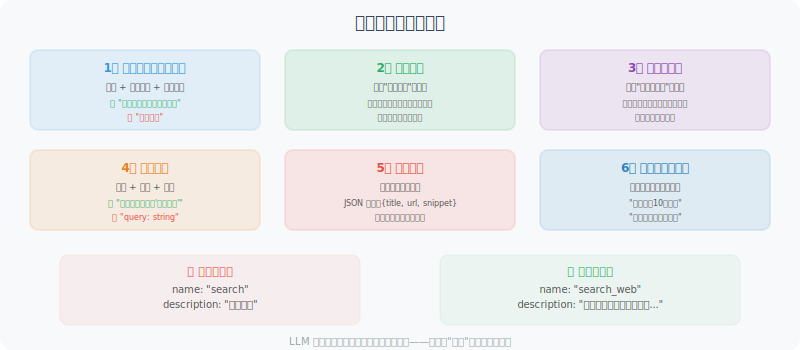

# 工具描述的编写技巧

工具描述（Tool Description）是告诉 LLM"这个工具是什么、什么时候用、怎么用"的关键信息。描述质量直接决定 LLM 能否正确地选择和调用工具。



## 为什么工具描述如此重要？

LLM 选择工具完全依赖工具描述，它无法"看到"工具的代码实现：

```python
# 糟糕的描述 → LLM 可能选错工具或传错参数
{
    "name": "search",
    "description": "搜索东西",  # 太模糊！
    "parameters": {
        "query": {"type": "string"}  # 没有说明期望的格式
    }
}

# 优质的描述 → LLM 能准确理解和使用
{
    "name": "search_web",
    "description": """在互联网上搜索实时信息。
    
    适合用于：
    - 查询最新新闻和时事
    - 获取产品价格和评价  
    - 查找特定网站的内容
    - 获取天气、股价等实时数据
    
    不适合用于：
    - 已知的历史知识（直接回答即可）
    - 需要深度分析的任务（搜索后再分析）""",
    
    "parameters": {
        "query": {
            "type": "string",
            "description": "搜索关键词，建议简洁明了。例如：'北京2024天气预报' 而非 '我想知道北京明天天气怎么样'"
        }
    }
}
```

## 描述编写的六要素

### 1. 清晰的功能描述（一句话版本）

第一句话最重要——这是 LLM 决定是否考虑此工具的依据：

```python
# 第一句话要包含：动词 + 操作对象 + 核心特征

# ❌ 模糊
"description": "处理文本"

# ✅ 清晰  
"description": "将任意语言的文本翻译成指定目标语言，保持原文格式和语气"
```

### 2. 适用场景（何时使用）

```python
good_description = """
查询指定公司或股票代码的实时财务数据。

适合用于：
- 获取股票实时价格和涨跌幅
- 查询公司市值、PE 等基本面数据
- 获取最近的财务报表数据（营收、利润等）
- 比较多支股票的关键指标

不适合用于：
- 预测股价走势（这需要你的分析，工具只提供数据）
- 获取历史超过5年的数据（请使用 get_historical_data 工具）
"""
```

### 3. 参数描述（精确说明每个参数）

```python
# 参数描述要包含：类型、含义、格式要求、示例值

parameters = {
    "type": "object",
    "properties": {
        "symbol": {
            "type": "string",
            "description": """股票代码。
            - 美股：如 'AAPL'（苹果）、'GOOGL'（谷歌）
            - A股：如 '600036.SS'（招行）、'000001.SZ'（平安银行）
            - 港股：如 '0700.HK'（腾讯）
            格式要求：大写字母，A股需要带交易所后缀（.SS/.SZ/.HK）"""
        },
        "metric": {
            "type": "string",
            "enum": ["price", "pe", "pb", "market_cap", "revenue"],
            "description": """要查询的指标类型：
            - price: 当前股价
            - pe: 市盈率
            - pb: 市净率  
            - market_cap: 市值（亿元）
            - revenue: 最近季度营收（亿元）"""
        }
    },
    "required": ["symbol", "metric"]
}
```

### 4. 返回值说明

```python
# 告诉 LLM 工具返回什么格式的数据，方便它解读结果
description = """
...

返回格式：
{
    "symbol": "AAPL",
    "name": "苹果公司",
    "price": 150.5,
    "currency": "USD",
    "change_percent": "+1.2%",
    "last_updated": "2024-01-15 15:30:00"
}

如果查询失败，返回：{"error": "错误原因"}
"""
```

### 5. 限制和注意事项

```python
description = """
在数据库中执行 SQL 查询。

⚠️ 重要限制：
- 只允许 SELECT 查询，不支持 INSERT/UPDATE/DELETE
- 每次查询最多返回1000条记录
- 查询超时限制：30秒
- 表名必须是已知的业务表，不要猜测

可用的表：users, orders, products, inventory, logs
如需了解表结构，先使用 get_table_schema 工具
"""
```

### 6. 使用示例

```python
description = """
发送企业微信消息给指定用户或群组。

示例用法：
- 发给个人：to="张三", message="会议在10点开始"
- 发给群组：to="@产品团队", message="新版本已发布"
- 发带@提醒：to="@全体", message="@李四 请查看最新文档"

注意：to 字段支持用户名（中文）或工号（如 empXXXX）
"""
```

## 工具描述模板

```python
def create_tool_schema(
    name: str,
    one_liner: str,
    when_to_use: list[str],
    when_not_to_use: list[str],
    parameters: dict,
    returns: str,
    notes: list[str] = None
) -> dict:
    """生成标准格式的工具 Schema"""
    
    description_parts = [one_liner, ""]
    
    if when_to_use:
        description_parts.append("适合用于：")
        for item in when_to_use:
            description_parts.append(f"- {item}")
        description_parts.append("")
    
    if when_not_to_use:
        description_parts.append("不适合用于：")
        for item in when_not_to_use:
            description_parts.append(f"- {item}")
        description_parts.append("")
    
    description_parts.append(f"返回：{returns}")
    
    if notes:
        description_parts.append("")
        description_parts.append("注意事项：")
        for note in notes:
            description_parts.append(f"⚠️ {note}")
    
    return {
        "type": "function",
        "function": {
            "name": name,
            "description": "\n".join(description_parts),
            "parameters": {
                "type": "object",
                "properties": parameters,
                "required": [k for k, v in parameters.items() 
                           if not v.get("default")]
            }
        }
    }

# 使用示例
email_tool = create_tool_schema(
    name="send_email",
    one_liner="向指定邮箱发送邮件，支持 HTML 格式和附件",
    when_to_use=[
        "用户要求发送通知或报告",
        "需要将分析结果以邮件形式传达",
        "定时提醒类任务"
    ],
    when_not_to_use=[
        "实时通知（改用消息推送）",
        "发送大量数据（改用文件传输）"
    ],
    parameters={
        "to": {
            "type": "string",
            "description": "收件人邮箱，多个用逗号分隔"
        },
        "subject": {
            "type": "string",
            "description": "邮件主题，建议简洁（50字以内）"
        },
        "body": {
            "type": "string",
            "description": "邮件正文，支持纯文本或 HTML"
        },
        "format": {
            "type": "string",
            "enum": ["plain", "html"],
            "description": "正文格式：plain=纯文本，html=HTML",
            "default": "plain"
        }
    },
    returns="发送成功返回消息ID，失败返回错误信息",
    notes=["每小时发送限额 100 封", "不支持超过 10MB 的附件"]
)
```

## 多工具场景下的描述策略

当工具很多时，要特别注意区分相似工具：

```python
# 搜索类工具的区分
search_tools = [
    {
        "name": "search_web",
        "description": """通用网络搜索，适合查找：新闻、百科知识、产品评测。
        搜索结果包含摘要，不包含完整页面内容。"""
    },
    {
        "name": "search_academic",
        "description": """学术论文搜索（Google Scholar/ArXiv），适合查找：
        学术研究、技术报告、学位论文。返回论文标题、作者、摘要。"""
    },
    {
        "name": "search_code",
        "description": """代码搜索（GitHub/Stack Overflow），适合查找：
        开源代码示例、编程解决方案、代码片段。"""
    },
    {
        "name": "browse_url",
        "description": """访问指定 URL 并返回完整页面内容。
        当你已有 URL 需要详细阅读时使用，而非搜索未知内容。"""
    }
]
```

## 测试工具描述质量

```python
def test_tool_description_quality(tool_schema: dict, test_cases: list) -> None:
    """
    测试工具描述质量
    通过给 LLM 一系列场景，看它是否能正确选择工具
    """
    from openai import OpenAI
    
    client = OpenAI()
    
    print(f"测试工具：{tool_schema['function']['name']}")
    print("=" * 50)
    
    for case in test_cases:
        response = client.chat.completions.create(
            model="gpt-4o-mini",
            messages=[{"role": "user", "content": case["input"]}],
            tools=[tool_schema],
            tool_choice="auto"
        )
        
        message = response.choices[0].message
        if message.tool_calls:
            tool_name = message.tool_calls[0].function.name
            tool_args = message.tool_calls[0].function.arguments
            result = "✅ 正确调用" if tool_name == tool_schema["function"]["name"] else "❌ 错误工具"
            print(f"{result} | 输入: {case['input'][:30]}...")
            if case.get("expected_args"):
                print(f"  预期参数: {case['expected_args']}")
                print(f"  实际参数: {tool_args}")
        else:
            expected_call = case.get("should_call", True)
            if not expected_call:
                print(f"✅ 正确跳过 | 输入: {case['input'][:30]}...")
            else:
                print(f"❌ 未调用工具 | 输入: {case['input'][:30]}...")

# 测试示例
test_tool_description_quality(
    tool_schema=email_tool,
    test_cases=[
        {"input": "发邮件给 boss@company.com 说会议推迟到3点", "should_call": True},
        {"input": "什么是 SMTP 协议？", "should_call": False},
        {"input": "请通知 team@xxx.com 项目已完成", "should_call": True},
    ]
)
```

---

## 小结

工具描述的关键要素：
1. **一句话功能说明**（LLM 第一判断依据）
2. **适用 / 不适用场景**（帮助 LLM 做出正确选择）
3. **精确的参数说明**（包含格式、示例、枚举值）
4. **返回值格式**（帮助 LLM 解读结果）
5. **限制和注意事项**（防止错误使用）

好的工具描述能显著提升 Agent 的可靠性。

---

*下一节：[4.5 实战：搜索引擎 + 计算器 Agent](./05_practice_search_calc.md)*
