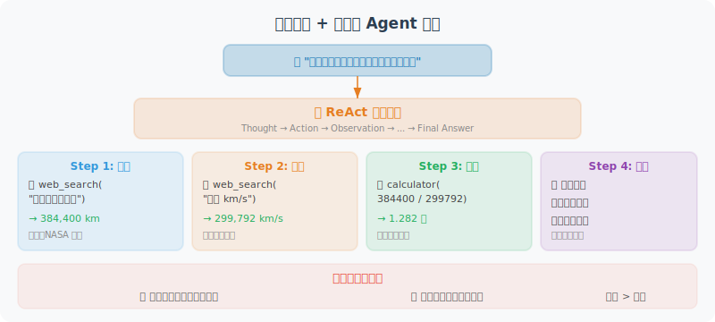

# 实战：搜索引擎 + 计算器 Agent

本节构建一个实用的搜索与计算 Agent，能够回答需要实时信息和数学推理的复杂问题。



## 项目目标

构建一个 Agent，能够：
- 🔍 搜索互联网获取实时信息
- 🧮 精确执行数学计算
- 🔗 组合多个工具完成复杂任务
- 📝 给出有来源依据的回答

## 设计思路

这个 Agent 的设计核心是**工具组合**：很多现实中的问题不是单一工具能解决的。比如"地球到月球多远？光飞一趟要多少秒？"——这需要先搜索距离数据，再用计算器做除法。我们的 Agent 需要具备以下能力：

1. **理解意图**：判断用户的问题需要哪些工具（或不需要工具）
2. **多步推理**：先获取信息，再基于信息做计算，最后综合回答
3. **错误恢复**：搜索失败时建议换关键词，计算出错时提示格式

我们设计三个互补的工具：`search_web` 获取实时信息、`calculate` 做精确计算、`unit_converter` 处理单位转换。Agent 的系统提示（System Prompt）会指导它在什么场景下使用哪个工具。

## 完整实现

```python
# search_calc_agent.py
import json
import math
import os
from typing import Optional
from openai import OpenAI
from dotenv import load_dotenv
import requests
from rich.console import Console
from rich.panel import Panel
from rich.markdown import Markdown

load_dotenv()

client = OpenAI()
console = Console()

# ============================
# 工具实现
# ============================

def search_web(query: str, num_results: int = 5) -> str:
    """
    使用 DuckDuckGo 搜索引擎搜索信息（免费，无需 API Key）
    
    Returns:
        搜索结果的摘要，包含标题、链接和摘要
    """
    try:
        # 使用 DuckDuckGo Instant Answer API
        url = "https://api.duckduckgo.com/"
        params = {
            "q": query,
            "format": "json",
            "no_html": 1,
            "skip_disambig": 1,
        }
        
        response = requests.get(url, params=params, timeout=10)
        data = response.json()
        
        results = []
        
        # 直接答案
        if data.get("AbstractText"):
            results.append(f"**即时答案**：{data['AbstractText']}")
            if data.get("AbstractURL"):
                results.append(f"来源：{data['AbstractURL']}")
        
        # 相关主题
        for topic in data.get("RelatedTopics", [])[:num_results]:
            if isinstance(topic, dict) and topic.get("Text"):
                results.append(f"• {topic['Text'][:200]}")
        
        if results:
            return "\n".join(results)
        else:
            return f"搜索 '{query}' 未找到直接结果。建议换用更具体的关键词重新搜索。"
            
    except Exception as e:
        return f"搜索失败：{str(e)}。请检查网络连接。"


def calculate(expression: str) -> str:
    """
    计算数学表达式，支持复杂计算和数学函数。
    
    支持的操作：
    - 基本运算：+ - * / ** （幂运算）
    - 数学函数：sqrt, sin, cos, tan, log, log10, exp, abs, round, ceil, floor
    - 常量：pi, e
    - 括号和优先级
    
    示例：
    - calculate("(1 + 2) * 3") → 9
    - calculate("sqrt(144)") → 12.0
    - calculate("log(e)") → 1.0
    """
    try:
        # 清理输入
        expression = expression.strip()
        
        # 安全的数学环境
        safe_dict = {
            "__builtins__": {},
            "sqrt": math.sqrt,
            "pow": math.pow,
            "sin": math.sin,
            "cos": math.cos,
            "tan": math.tan,
            "asin": math.asin,
            "acos": math.acos,
            "atan": math.atan,
            "log": math.log,
            "log10": math.log10,
            "log2": math.log2,
            "exp": math.exp,
            "abs": abs,
            "round": round,
            "ceil": math.ceil,
            "floor": math.floor,
            "factorial": math.factorial,
            "pi": math.pi,
            "e": math.e,
            "inf": math.inf,
        }
        
        result = eval(expression, safe_dict)
        
        # 格式化输出
        if isinstance(result, float):
            if result == int(result):
                return f"{expression} = {int(result)}"
            else:
                return f"{expression} = {result:.6g}"
        else:
            return f"{expression} = {result}"
            
    except ZeroDivisionError:
        return "计算错误：除以零"
    except OverflowError:
        return "计算错误：结果溢出（数值太大）"
    except Exception as e:
        return f"计算错误：{str(e)}。请确认表达式格式正确。"


def unit_converter(value: float, from_unit: str, to_unit: str) -> str:
    """
    单位换算工具，支持常见的单位转换。
    
    支持的类别：
    - 长度：m, km, cm, mm, inch, foot, mile, yard
    - 重量：kg, g, mg, pound, ounce, ton
    - 温度：celsius, fahrenheit, kelvin
    - 面积：m2, km2, cm2, acre, hectare
    """
    # 转换为基础单位（SI单位）的系数
    conversions = {
        # 长度（基础单位：米）
        "m": 1.0, "km": 1000.0, "cm": 0.01, "mm": 0.001,
        "inch": 0.0254, "foot": 0.3048, "mile": 1609.344, "yard": 0.9144,
        
        # 重量（基础单位：千克）
        "kg": 1.0, "g": 0.001, "mg": 0.000001,
        "pound": 0.453592, "ounce": 0.0283495, "ton": 1000.0,
        
        # 面积（基础单位：平方米）
        "m2": 1.0, "km2": 1000000.0, "cm2": 0.0001,
        "acre": 4046.86, "hectare": 10000.0,
    }
    
    from_unit = from_unit.lower()
    to_unit = to_unit.lower()
    
    # 温度特殊处理
    if from_unit in ["celsius", "fahrenheit", "kelvin"]:
        if from_unit == "celsius" and to_unit == "fahrenheit":
            result = value * 9/5 + 32
        elif from_unit == "fahrenheit" and to_unit == "celsius":
            result = (value - 32) * 5/9
        elif from_unit == "celsius" and to_unit == "kelvin":
            result = value + 273.15
        elif from_unit == "kelvin" and to_unit == "celsius":
            result = value - 273.15
        elif from_unit == "fahrenheit" and to_unit == "kelvin":
            result = (value - 32) * 5/9 + 273.15
        elif from_unit == "kelvin" and to_unit == "fahrenheit":
            result = (value - 273.15) * 9/5 + 32
        else:
            result = value
        return f"{value} {from_unit} = {result:.4g} {to_unit}"
    
    # 其他单位
    if from_unit not in conversions or to_unit not in conversions:
        return f"不支持的单位：{from_unit} 或 {to_unit}"
    
    # 检查是否同类单位（简单判断：使用同一比较基准）
    result = value * conversions[from_unit] / conversions[to_unit]
    return f"{value} {from_unit} = {result:.6g} {to_unit}"


# ============================
# 工具配置
# ============================

TOOLS = [
    {
        "type": "function",
        "function": {
            "name": "search_web",
            "description": """在互联网上搜索实时信息。
            
适合用于：
- 查询最新新闻、事件、价格等实时数据
- 获取人物、地点、事件的背景信息
- 查找技术文档和教程
- 核实和验证信息

不适合用于：
- 数学计算（使用 calculate 工具）
- 单位换算（使用 unit_converter 工具）
- 你已经知道答案的问题""",
            "parameters": {
                "type": "object",
                "properties": {
                    "query": {
                        "type": "string",
                        "description": "搜索关键词，建议简洁精准。例如：'Python 3.12 新特性' 而非 '我想知道Python最新版本有什么新功能'"
                    },
                    "num_results": {
                        "type": "integer",
                        "description": "返回结果数量，默认5，最大10",
                        "default": 5
                    }
                },
                "required": ["query"]
            }
        }
    },
    {
        "type": "function",
        "function": {
            "name": "calculate",
            "description": """精确计算数学表达式。
            
支持：基本运算(+,-,*,/,**)、数学函数(sqrt/sin/cos/log等)、常量(pi/e)

示例：
- "1234 * 5678" → 精确乘法
- "sqrt(2) * pi" → 数学常量计算  
- "log(100) / log(10)" → 对数计算""",
            "parameters": {
                "type": "object",
                "properties": {
                    "expression": {
                        "type": "string",
                        "description": "数学表达式，使用 Python 语法。乘方用 **，不用 ^"
                    }
                },
                "required": ["expression"]
            }
        }
    },
    {
        "type": "function",
        "function": {
            "name": "unit_converter",
            "description": "单位换算，支持长度、重量、温度、面积等常见单位转换",
            "parameters": {
                "type": "object",
                "properties": {
                    "value": {
                        "type": "number",
                        "description": "要换算的数值"
                    },
                    "from_unit": {
                        "type": "string",
                        "description": "原始单位，如：m, km, kg, celsius, pound"
                    },
                    "to_unit": {
                        "type": "string",
                        "description": "目标单位，如：foot, mile, pound, fahrenheit"
                    }
                },
                "required": ["value", "from_unit", "to_unit"]
            }
        }
    }
]

TOOL_FUNCTIONS = {
    "search_web": search_web,
    "calculate": calculate,
    "unit_converter": unit_converter,
}


# ============================
# Agent 类
# ============================

class SearchCalcAgent:
    """搜索 + 计算 Agent"""
    
    def __init__(self):
        self.messages = [
            {
                "role": "system",
                "content": """你是一个能够搜索和计算的智能助手。

你有三个工具：
1. search_web：搜索互联网获取实时信息
2. calculate：精确计算数学表达式
3. unit_converter：单位换算

使用策略：
- 遇到需要实时数据的问题（价格、新闻、天气等）→ 先搜索
- 遇到数学计算 → 直接使用计算器，不要手动计算
- 遇到单位转换 → 使用 unit_converter
- 复杂问题可以组合使用多个工具
- 给出答案时，说明信息来源

回答要求：
- 简洁准确，重点突出
- 数字计算结果要精确
- 如果搜索结果不足，诚实说明
"""
            }
        ]
        self.step_count = 0
    
    def _log_tool_call(self, tool_name: str, args: dict, result: str):
        """记录工具调用日志"""
        console.print(
            Panel(
                f"[bold]工具：[/bold][yellow]{tool_name}[/yellow]\n"
                f"[bold]参数：[/bold]{json.dumps(args, ensure_ascii=False)}\n"
                f"[bold]结果：[/bold]{result[:300]}{'...' if len(result) > 300 else ''}",
                title=f"🔧 工具调用 #{self.step_count}",
                border_style="yellow",
                expand=False
            )
        )
    
    def chat(self, user_message: str) -> str:
        """与 Agent 对话"""
        self.step_count = 0
        self.messages.append({"role": "user", "content": user_message})
        
        console.print(f"\n[bold blue]👤 用户：[/bold blue]{user_message}\n")
        
        MAX_STEPS = 8
        
        while self.step_count < MAX_STEPS:
            # 调用 LLM
            response = client.chat.completions.create(
                model="gpt-4o",
                messages=self.messages,
                tools=TOOLS,
                tool_choice="auto",
                parallel_tool_calls=True
            )
            
            message = response.choices[0].message
            finish_reason = response.choices[0].finish_reason
            self.messages.append(message)
            
            # 直接回答
            if finish_reason == "stop":
                console.print(f"\n[bold green]🤖 Agent：[/bold green]")
                console.print(Markdown(message.content))
                return message.content
            
            # 工具调用
            if finish_reason == "tool_calls" and message.tool_calls:
                for tool_call in message.tool_calls:
                    self.step_count += 1
                    
                    func_name = tool_call.function.name
                    func_args = json.loads(tool_call.function.arguments)
                    
                    # 执行工具
                    func = TOOL_FUNCTIONS.get(func_name)
                    if func:
                        result = func(**func_args)
                    else:
                        result = f"错误：未知工具 {func_name}"
                    
                    self._log_tool_call(func_name, func_args, str(result))
                    
                    # 添加工具结果
                    self.messages.append({
                        "role": "tool",
                        "tool_call_id": tool_call.id,
                        "content": str(result)
                    })
        
        return "已达到最大步骤数限制"
    
    def reset(self):
        """重置对话"""
        self.messages = self.messages[:1]


# ============================
# 主程序
# ============================

def demo():
    """演示 Agent 能力"""
    agent = SearchCalcAgent()
    
    test_questions = [
        "地球到月球的距离是多少公里？换算成英里是多少？",
        "如果我每月存2000元，年利率3%，存5年能有多少钱？",
        "Python 3.12 版本有哪些重要的新特性？",
        "1英里等于多少公里？北京到上海的高铁距离大约是多少英里？",
    ]
    
    for q in test_questions:
        agent.chat(q)
        agent.reset()
        print("\n" + "="*60 + "\n")


def interactive():
    """交互式模式"""
    console.print(Panel(
        "[bold]🔍 搜索 + 计算 Agent[/bold]\n"
        "我可以搜索互联网 + 精确计算 + 单位换算\n"
        "输入 'quit' 退出，'reset' 重置对话",
        title="Agent 启动",
        border_style="green"
    ))
    
    agent = SearchCalcAgent()
    
    while True:
        user_input = input("\n💬 你：").strip()
        if not user_input:
            continue
        if user_input.lower() == "quit":
            break
        if user_input.lower() == "reset":
            agent.reset()
            console.print("[dim]对话已重置[/dim]")
            continue
        
        agent.chat(user_input)


if __name__ == "__main__":
    import sys
    if "--demo" in sys.argv:
        demo()
    else:
        interactive()
```

## 关键代码解读

上面的代码虽然看起来很长，但核心架构非常清晰，可以分为三层理解：

**工具层**（三个独立函数）：每个工具都遵循"输入 → 处理 → 返回字符串"的模式。注意 `calculate` 函数使用了受限的 `eval` 环境——只暴露 `math` 模块中的函数，不暴露 `__builtins__`，这是安全性和功能性的权衡。`search_web` 使用 DuckDuckGo 免费 API，不需要 API Key，适合学习和原型开发。

**Schema 层**（TOOLS 列表）：工具描述是影响 Agent 表现的关键。注意 `search_web` 的描述中不仅写了"适合用于"什么，还特意写了"不适合用于"什么——这种"正反两面"的描述方式能有效降低模型误用工具的概率。

**Agent 层**（SearchCalcAgent 类）：`chat` 方法实现了标准的 Agent 循环，并设置了 `MAX_STEPS = 8` 的安全上限，防止模型陷入无限循环。`_log_tool_call` 方法使用 `rich` 库输出美观的日志，方便调试时观察 Agent 的推理过程。

## 运行测试

```bash
# 安装依赖
pip install openai python-dotenv requests rich

# 交互模式
python search_calc_agent.py

# 演示模式
python search_calc_agent.py --demo
```

## 示例对话

```
💬 你：地球和月球之间的距离是多少？如果用光速飞行需要多少秒？

🔧 工具调用 #1
工具：search_web
参数：{"query": "地球到月球距离公里"}
结果：地球到月球的平均距离约为384,400公里...

🔧 工具调用 #2  
工具：calculate
参数：{"expression": "384400 * 1000 / 299792458"}
结果：384400 * 1000 / 299792458 = 1.28222

🤖 Agent：
地球到月球的平均距离约为 **384,400 公里**。

光速为 299,792,458 米/秒（约30万公里/秒）。

计算：384,400 km × 1000 m/km ÷ 299,792,458 m/s ≈ **1.28 秒**

也就是说，光从地球到月球大约需要 **1.28 秒**。
（来源：搜索结果 + 精确数学计算）
```

---

## 小结

本章实战完成了一个功能完整的搜索+计算 Agent：
- ✅ 三个独立工具：搜索、计算、单位换算
- ✅ 工具并行调用
- ✅ 精确的错误处理
- ✅ 清晰的工具描述
- ✅ 美观的终端输出

这个 Agent 可以作为你后续开发的基础框架，通过添加更多工具不断扩展能力。

---

*下一节：[4.6 论文解读：工具学习前沿进展](./06_paper_readings.md)*
